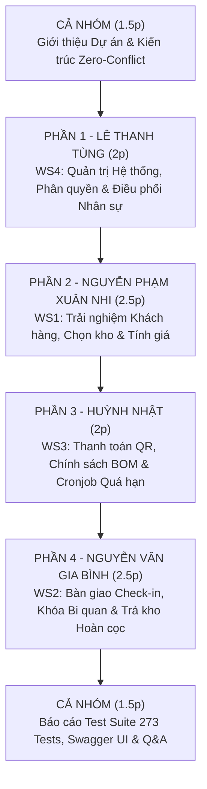

# KỊCH BẢN THUYẾT TRÌNH & HƯỚNG DẪN DEMO TOÀN DIỆN DỰ ÁN (TEAM DEMO MASTER)
> **Dự án:** Self-Storage Facility Rental and Management System (SWP391)  
> **Ngăn xếp công nghệ:** Spring Boot 3 (Java 17 LTS) · React 18 (TypeScript + Vite) · SQL Server 2022 · Flyway · JWT  
> **Đội ngũ phát triển (4 Trục công việc độc lập - Vertical Workstreams):**
> 1. **Lê Thanh Tùng** — WS4: Quản trị Hệ thống, Phân bổ Nhân sự & Xử lý Sự cố
> 2. **Nguyễn Phạm Xuân Nhi** — WS1: Cổng Khách hàng, Danh mục Kho & Đặt chỗ Trực tuyến
> 3. **Huỳnh Nhật** — WS3: Tài chính, Chính sách Giá BOM & Tự động hóa Cronjob
> 4. **Nguyễn Văn Gia Bình** — WS2: Quản lý Cơ sở, Bàn giao Check-in & Nghiệm thu Trả kho

---

## I. TỔNG QUAN CHUẨN BỊ & LỆNH KHỞI ĐỘNG HỆ THỐNG

### 1. Khởi động Backend (Spring Boot 3)
Mở cửa sổ **PowerShell** thứ nhất tại thư mục dự án:
```powershell
cd backend ; $env:JAVA_HOME = 'C:\Program Files\Java\jdk-17' ; mvn spring-boot:run
```
* **Backend API:** `http://localhost:8080/api/v1`
* **Tài liệu API tương tác (Swagger UI):** `http://localhost:8080/api/v1/swagger-ui.html`

### 2. Khởi động Frontend (React 18 + Vite)
Mở cửa sổ **PowerShell** thứ hai tại thư mục dự án:
```powershell
cd frontend ; npm.cmd run dev
```
*(Nếu gặp lỗi chính sách script PowerShell, gõ: `cmd.exe /c npm run dev`)*
* **Giao diện Web:** `http://localhost:5173/`
* **Trang Đăng nhập:** `http://localhost:5173/auth/login`

---

## II. BẢNG TÀI KHOẢN DEMO MẪU (SEED ACCOUNTS)

Mật khẩu chung cho tất cả tài khoản là: **`password123`**  
*(Tại trang đăng nhập `http://localhost:5173/auth/login`, chỉ cần **bấm vào các nút chọn nhanh** bên dưới form để tự động điền Email và Mật khẩu).*

| Nút chọn nhanh | Trục | Thành viên phụ trách | Email đăng nhập | Vai trò (Role) | Portal truy cập |
| :--- | :---: | :--- | :--- | :--- | :--- |
| **👑 Admin** | WS4 | Lê Thanh Tùng | `admin@smartstorage.vn` | `SYSTEM_ADMINISTRATOR` | `/admin` |
| **💼 BOM** | WS3 | Huỳnh Nhật | `bom@smartstorage.vn` | `BUSINESS_OPERATIONS_MANAGER` | `/bom` |
| **🏢 Quản lý cơ sở** | WS2/4 | Gia Bình / Tùng | `fm.q1@smartstorage.vn` | `FACILITY_MANAGER` | `/manager` |
| **👷 Nhân viên** | WS2 | Nguyễn Văn Gia Bình | `staff.q1@smartstorage.vn` | `FACILITY_STAFF` | `/staff` |
| **📦 Khách thuê** | WS1 | Nguyễn Phạm Xuân Nhi | `nhi.customer@gmail.com` | `STORAGE_CUSTOMER` | `/customer`, `/my-units` |

---

## III. MA TRẬN PHÂN VAI & CÂU CHUYỆN DEMO LIÊN HOÀN (SEAMLESS STORYLINE)

Kịch bản được xây dựng như một **câu chuyện nghiệp vụ khép kín (End-to-End User Journey)** kết nối chặt chẽ 4 thành viên từ lúc thiết lập hệ thống đến khi khách hàng hoàn tất thuê kho:



---

## IV. KỊCH BẢN THUYẾT TRÌNH CHI TIẾT TỪNG PHẦN (10 - 12 PHÚT)

---

### 🕒 MỞ ĐẦU: Giới thiệu Tổng quan Dự án (1.5 phút)
* **Người trình bày:** Nhóm trưởng (Gia Bình hoặc Tùng đại diện).
* **Nội dung & Lời thoại:**
  > *"Kính chào Thầy/Cô và Hội đồng. Nhóm chúng em gồm 4 thành viên: Lê Thanh Tùng, Nguyễn Phạm Xuân Nhi, Huỳnh Nhật và Nguyễn Văn Gia Bình. Dự án của nhóm là **SmartStorage — Hệ thống Cho thuê và Quản lý Kho lưu trữ tự phục vụ thông minh**.  
  > Để triệt tiêu xung đột mã nguồn và tối ưu hóa năng suất, nhóm đã áp dụng triệt để kiến trúc **4 Trục công việc độc lập (Vertical Bounded Contexts)**: mỗi thành viên làm chủ trọn vẹn từ Backend Entity, Service, Controller cho đến giao diện Frontend Portal riêng biệt. Sau đây, nhóm xin demo một luồng nghiệp vụ thực tế xuyên suốt qua 4 phân hệ của các thành viên."*

---

### 🕒 PHẦN 1: Quản trị Hệ thống, Phân bổ Nhân sự & Điều phối (2 phút)
* **Thành viên phụ trách:** **Lê Thanh Tùng (Workstream 4)**
* **Tài khoản demo:** Bấm nút **👑 Admin** (`admin@smartstorage.vn`)
* **Thao tác trên màn hình:**
  1. Đăng nhập vào **Admin Portal** (`/admin`).
  2. Mở mục **Quản lý Tài khoản (`SA-01`, `SA-02`)**:
     - Xem danh sách người dùng với đầy đủ 5 vai trò hệ thống (`ADMIN`, `BOM`, `MANAGER`, `STAFF`, `CUSTOMER`).
     - Demo tính năng thêm mới tài khoản nhân sự hoặc kích hoạt/khóa tài khoản (Soft delete cờ `ACTIVE`/`INACTIVE`).
  3. Mở mục **Phân bổ Nhân sự theo Cơ sở (`SA-03`)**:
     - Cho Hội đồng xem tính năng phân quyền chi nhánh: Nhân viên `staff.q1` được gán vào *Cơ sở Cầu Giấy (`FAC-CG`)*; Quản lý `fm.q1` được quản lý cả 2 cơ sở Hà Nội và TP.HCM.
  4. Mở **Bảng điều khiển Sự cố & Ticket (`FS-05`, `SC-06`)**:
     - Tiếp nhận phản ánh sự cố từ khách hàng hoặc hiện trường kho (hỏng khóa, ẩm mốc), điều phối nhân viên phụ trách xử lý.
* **Điểm nhấn kỹ thuật WS4 cần nói:**
  > *"Toàn bộ hệ thống xác thực được bảo vệ bằng JWT Stateless có Access Token (15 phút) và Refresh Token (7 ngày). Tầng bảo mật Spring Security áp dụng RBAC phân quyền chặt chẽ đến từng endpoint, đảm bảo nhân viên cơ sở này không thể can thiệp dữ liệu của cơ sở khác."*

---

### 🕒 PHẦN 2: Trải nghiệm Khách hàng, Chọn kho & Tính giá cước (2.5 phút)
* **Thành viên phụ trách:** **Nguyễn Phạm Xuân Nhi (Workstream 1)**
* **Tài khoản demo:** Mở tab thường hoặc ẩn danh, bấm nút **📦 Khách thuê** (`nhi.customer@gmail.com`) hoặc vào trực tiếp trang công khai.
* **Thao tác trên màn hình:**
  1. Truy cập **Danh mục Cơ sở lưu trữ (`SC-01`)** tại `http://localhost:5173/facilities`:
     - Khách hàng xem danh sách cơ sở có mặt bằng thực tế: *Cơ sở Cầu Giấy (Hà Nội)* và *Cơ sở Quận 7 (TP.HCM)*.
     - Bấm xem chi tiết cơ sở Cầu Giấy: vị trí, hình ảnh thực tế, tiện ích PCCC, camera giám sát 24/7.
  2. Mở **Sơ đồ Chọn kho trực quan (`SC-02`)** tại `/units`:
     - Khách hàng duyệt qua 4 loại kho: *Kho Nhỏ (1x1x1.5m), Kho Vừa (2x2x2.5m), Kho Lớn (3x3x3m) và Kho Điều hòa chuyên dụng*.
     - Xem trực quan các ô kho còn trống (`AVAILABLE`), ô đang có người thuê (`OCCUPIED`).
  3. Màn hình **Đặt chỗ & Tính cước tự động (`SC-03`)** tại `/booking`:
     - Chọn thời hạn thuê (ví dụ: 6 tháng hoặc 12 tháng).
     - **Minh họa quy tắc tính tiền nghiệp vụ (`BR-PRI-01` & `BR-DEP-01`):**
       * Hệ thống tự động tính chiết khấu: **giảm 5%** khi thuê 6 tháng, **giảm 10%** khi thuê từ 12 tháng.
       * Tự động tính tiền cọc cố định bằng đúng **1 tháng tiền thuê gốc**.
       * Làm tròn tổng tiền thanh toán đến **1.000 VNĐ** theo chuẩn thanh toán thực tế Việt Nam (`BR-GEN-04`).
* **Điểm nhấn kỹ thuật WS1 cần nói:**
  > *"Giao diện chọn kho được tối ưu hóa trải nghiệm người dùng với khả năng lọc tức thì theo kích thước và trạng thái. Phía backend, service kiểm tra sức chứa và giữ chỗ nguyên tử, ngăn chặn tình trạng hai khách hàng cùng bấm đặt một ô kho tại cùng một thời điểm."*

---

### 🕒 PHẦN 3: Cổng Thanh toán, Chính sách BOM & Tự động hóa Quá hạn (2 phút)
* **Thành viên phụ trách:** **Huỳnh Nhật (Workstream 3)**
* **Tài khoản demo:** Khách hàng thanh toán (`/payment`) $\rightarrow$ Đăng nhập **💼 BOM** (`bom@smartstorage.vn`) vào `/bom`.
* **Thao tác trên màn hình:**
  1. **Thanh toán Đặt cọc qua QR Code (`SC-03` / `payment`):**
     - Mở popup thanh toán QR VietQR thông minh hiển thị chính xác số tiền cọc và nội dung chuyển khoản mã hợp đồng.
     - Giả lập thanh toán thành công $\rightarrow$ Hệ thống ghi nhận giao dịch `payment_transaction` và hợp đồng chuyển sang trạng thái chờ bàn giao `PENDING_CHECK_IN`.
  2. Mở **BOM Portal (`/bom`) — Quản lý Chính sách Giá (`BM-02`)**:
     - Xem biểu đồ doanh thu hệ thống, tỉ lệ lấp đầy kho theo từng cơ sở (Occupancy Rate).
     - Xem bảng cấu hình đơn giá theo từng loại kho và danh mục loại phụ phí (`extra_fee_type`) như phí dọn vệ sinh, phí hư hại khóa.
  3. **Cơ chế Tự động hóa Quá hạn hằng đêm (`OverdueCronJob` - `BR-OVD-01`..`04`):**
     - Trình bày logic tự động của Service chạy ngầm lúc 00:00 hằng ngày:
       * **Ngày D+1 .. D+3:** Ân hạn (Grace period), nhắc nhở khách hàng chưa tính phạt.
       * **Ngày D+4 .. D+9:** Tự động tính phạt **10%/ngày** dựa trên giá thuê tháng, áp trần tối đa **70%**.
       * **Ngày D+10:** Cưỡng chế chấm dứt hợp đồng (`TERMINATED`), tịch thu tiền cọc và giải phóng ô kho.
* **Điểm nhấn kỹ thuật WS3 cần nói:**
  > *"Toàn bộ tiến trình phạt quá hạn được tự động hóa hoàn toàn bằng Spring `@Scheduled` cronjob với cơ chế ghi log hạch toán rõ ràng, giúp ban quản trị BOM nắm bắt tức thì dòng tiền và các hợp đồng có rủi ro nợ xấu."*

---

### 🕒 PHẦN 4: Vận hành Hiện trường — Check-in, Khóa Bi quan & Nghiệm thu Trả kho (2.5 phút)
* **Thành viên phụ trách:** **Nguyễn Văn Gia Bình (Workstream 2)**
* **Tài khoản demo:** Bấm nút **👷 Nhân viên** (`staff.q1@smartstorage.vn`)
* **Thao tác trên màn hình:**
  1. Đăng nhập vào **Staff Desk (`/staff`)**:
     - Màn hình hiển thị danh sách công việc trong ngày của cơ sở Cầu Giấy: số lượng ô kho đang trống, hợp đồng cần bàn giao và hợp đồng sắp trả.
  2. **Quy trình Bàn giao kho & Check-in (`FS-01`, `FS-02`)** tại `/staff/checkin`:
     - Nhân viên tra cứu mã hợp đồng `PENDING_CHECK_IN` của khách vừa thanh toán cọc ở Phần 3.
     - Kiểm tra CCCD của khách và bấm **"Xác nhận bàn giao kho"**:
       * Hệ thống sinh **mã PIN 6 số bảo mật ngẫu nhiên** cấp cho khách mở khóa điện tử.
       * Hợp đồng chuyển sang `ACTIVE`, ô kho chuyển sang `OCCUPIED`.
       * Tạo biên bản bàn giao điện tử (`handover_record`) lưu thời gian và người bàn giao.
     - **Điểm sáng kỹ thuật cốt lõi:** Giải thích cơ chế **Pessimistic Locking (`findByIdForUpdate`)** trên SQL Server ngăn chặn tuyệt đối Race Condition.
  3. **Quy trình Nghiệm thu trả kho & Quyết toán hoàn cọc (`FS-04`, `FM-04`)** tại `/staff/return`:
     - Khách trả kho, nhân viên kiểm tra thực tế: nhập phụ phí dọn rác bẩn hoặc bồi thường hư hại.
     - Màn hình hiển thị bản xem trước quyết toán cọc:  
       $$\text{Tiền cọc ban đầu} - \text{Phạt quá hạn} - \text{Hư hại/vệ sinh} = \text{Tiền hoàn thực nhận}$$
     - **Quy tắc chống trừ kép (`BR-RET-04`):** Nếu khách đã thanh toán tiền hư hại trực tiếp tại quầy, hệ thống không khấu trừ tiếp vào tiền cọc khi hoàn trả.
     - Bấm duyệt quyết toán $\rightarrow$ Hợp đồng hoàn tất (`COMPLETED`), ô kho vật lý lập tức tự động trở về `AVAILABLE`.
* **Điểm nhấn kỹ thuật WS2 cần nói:**
  > *"Workstream 2 quản lý toàn bộ vòng đời vật lý của kho và hợp đồng bằng State Machine chặt chẽ. Việc áp dụng khóa bi quan tại tầng CSDL đảm bảo tính toàn vẹn tuyệt đối cho dữ liệu đặt phòng và giải phóng mặt bằng."*

---

### 🕒 PHẦN 5: Đảm bảo Chất lượng Mã nguồn & Tổng kết (1.5 phút)
* **Người trình bày:** Cả nhóm cùng tham gia / Nhóm trưởng tổng kết.
* **Thao tác trên màn hình:** Mở trình duyệt vào Swagger UI `http://localhost:8080/api/v1/swagger-ui.html`.
* **Minh chứng kỹ thuật cốt lõi:**
  1. **Chuẩn hóa REST API:** Toàn bộ API đều trả về cấu trúc chuẩn `ApiResponse<T>` và `PageResponse<T>` theo đúng quy ước tài liệu đặc tả [API-SPEC.md](API-SPEC.md).
  2. **Độ bao phủ Kiểm thử Tự động:** Trình chiếu kết quả chạy `mvn test`:  
     👉 **273/273 Unit & Integration Tests đạt 100% PASS** (kiểm thử bảo mật JWT, tính toán chiết khấu, khóa tranh chấp, trạng thái hợp đồng).
  3. **Tính toàn vẹn CSDL:** Schema chuẩn hóa gồm 12 migration scripts Flyway chạy trên SQL Server 2022, có đầy đủ ràng buộc khóa ngoại và Check Constraints.
* **Lời kết:**
  > *"Nhóm đã hoàn thành toàn bộ các yêu cầu từ nghiệp vụ khách hàng, quản trị vận hành đến hạch toán tài chính theo đúng tiến độ kế hoạch. Chúng em xin chân thành cảm ơn Thầy/Cô và sẵn sàng trả lời các câu hỏi phản biện."*

---

## V. CÁC CÂU HỎI HỘI ĐỒNG THƯỜNG HỎI & CÁCH PHẢN BIỆN (Q&A CHEAT SHEET)

### ❓ Câu 1: "Làm sao đảm bảo 4 thành viên code không bị conflict khi merge?"
* **Trả lời (Tùng / Bình):**
  - Nhóm áp dụng mô hình **Vertical Bounded Contexts**: mỗi người làm chủ 1 package Backend riêng biệt (`facility`, `unit`, `contract`, `reservation`, `payment`, `policy`, `auth`, `user`) và các thư mục Frontend tương ứng trong `src/features/`.
  - Giữa các module chỉ giao tiếp lỏng lẻo thông qua `id` hoặc Common DTOs.
  - Cơ sở dữ liệu được phiên bản hóa hoàn toàn bằng **Flyway Migration** (`V1` đến `V11`), nghiêm cấm sửa file migration cũ đã áp dụng.

### ❓ Câu 2: "Các API backend này đã có xử lý dữ liệu thật chưa hay chỉ là mock?"
* **Trả lời (Bình / Nhật):**
  - Đã được triển khai 100% bằng logic xử lý dữ liệu thực tế: từ tính toán chiết khấu 5%/10%, cọc 1 tháng, làm tròn 1.000đ, sinh mã PIN ngẫu nhiên bảo mật, khóa bi quan Pessimistic Lock trên hàng CSDL, đến thuật toán chống khấu trừ kép và cronjob hằng đêm.
  - Minh chứng rõ nhất là hệ thống có **273 bài test tự động** kiểm thử trực tiếp logic trong tầng Service.

### ❓ Câu 3: "Nếu 2 người cùng bấm check-in hoặc đặt cùng 1 ô kho thì hệ thống xử lý thế nào?"
* **Trả lời (Bình / Nhi):**
  - Hệ thống sử dụng cơ chế **Pessimistic Locking** (`storageUnitRepository.findByIdForUpdate(unitId)`) với câu lệnh `SELECT ... WITH (UPDLOCK, ROWLOCK)` của SQL Server.
  - Transaction đầu tiên sẽ khóa ô kho; transaction thứ hai phải chờ và sẽ nhận ngoại lệ `CONFLICT` ngay khi trạng thái ô kho chuyển thành `OCCUPIED` hoặc `RESERVED`, triệt tiêu hoàn toàn lỗi Double-booking.
