# 📋 TÀI LIỆU BỐI CẢNH VẤN ĐỀ HỆ THỐNG & NHỮNG THAY ĐỔI BUỘC PHẢI THỰC HIỆN KHI CẬP NHẬT BR

> **Dự án:** Self-Storage Facility Rental and Management System  
> **Nguồn trích xuất gốc:** [Trang Notion "Chú ý" (Audit Feedback)](https://app.notion.com/p/Ch-3e9561bd42cd805b9543fbba886aaf75?source=copy_link) · Page ID: `3e9561bd-42cd-805b-9543-fbba886aaf75`  
> **Người thực hiện kiểm thử / Đánh giá:** Nguyễn Văn Gia Bình (Lead Developer / Product Owner)  
> **Mục tiêu của tài liệu:** Cung cấp bức tranh toàn cảnh, chi tiết và chính xác 100% về các lỗi thực tế phát hiện trong quá trình kiểm thử giao diện (kèm 32 ảnh bằng chứng thực tế đã được lưu trữ cục bộ), các lỗ hổng bảo mật/phân quyền, và **danh mục những thay đổi kỹ thuật bắt buộc (Backend, Frontend, Database, Jobs)** khi áp dụng bộ Business Rules (BR) mới đã được làm sạch tại [docs/BUSINESS-RULES.md](./BUSINESS-RULES.md).  
> **Đối tượng sử dụng:** Dành riêng cho các Tác nhân AI (AI Coding Agents) và Lập trình viên để nắm vững ngữ cảnh khi nhận nhiệm vụ sửa lỗi, tránh hallucination và đảm bảo tính toàn vẹn hệ thống.

---

## MỤC LỤC

1. [Bối Cảnh Tổng Quan & Nguồn Dữ Liệu](#1-bối-cảnh-tổng-quan--nguồn-dữ-liệu)
2. [Danh Sách Lỗi & Góp Ý Giao Diện (Kèm Hình Ảnh Minh Họa Thực Tế)](#2-danh-sách-lỗi--góp-ý-giao-diện-kèm-hình-ảnh-minh-họa-thực-tế)
   - [2.1. Giao diện Khách hàng (SC - Storage Customer)](#21-giao-diện-khách-hàng-sc---storage-customer)
   - [2.2. Giao diện Quản trị viên (Admin)](#22-giao-diện-quản-trị-viên-admin)
   - [2.3. Giao diện Ban Giám đốc (BOM - Board of Management)](#23-giao-diện-ban-giám-đốc-bom---board-of-management)
   - [2.4. Giao diện Quản lý Cơ sở (FM - Facility Manager)](#24-giao-diện-quản-lý-cơ-sở-fm---facility-manager)
   - [2.5. Giao diện Nhân viên Vận hành (Staff)](#25-giao-diện-nhân-viên-vận-hành-staff)
3. [Những Thay Đổi Hệ Thống Buộc Phải Thực Hiện Khi Có BR Mới](#3-những-thay-đổi-hệ-thống-buộc-phải-thực-hiện-khi-có-br-mới)
   - [3.1. Thay đổi tầng Cơ sở dữ liệu (Database Schema & Seed Data)](#31-thay-đổi-tầng-cơ-sở-dữ-liệu-database-schema--seed-data)
   - [3.2. Thay đổi tầng Backend (Spring Boot Services & Scheduled Jobs)](#32-thay-đổi-tầng-backend-spring-boot-services--scheduled-jobs)
   - [3.3. Thay đổi tầng Frontend (React Vite UI/UX & Flow Controls)](#33-thay-đổi-tầng-frontend-react-vite-uiux--flow-controls)
   - [3.4. Kế hoạch Kiểm thử & Đảm bảo Chất lượng (QA / TDD Matrix)](#34-kế-hoạch-kiểm-thử--đảm-bảo-chất-lượng-qa--tdd-matrix)

---

## 1. Bối Cảnh Tổng Quan & Nguồn Dữ Liệu

Trong quá trình chạy thử nghiệm toàn bộ hệ thống thực tế (End-to-End Walkthrough) trên môi trường phát triển, Lead Developer đã ghi nhận hàng loạt sai lệch nghiêm trọng giữa:
1. **Quy tắc nghiệp vụ thiết kế (Business Rules cũ)** vs **Nhu cầu vận hành thực tế**.
2. **Giao diện người dùng (UI/UX)** vs **Luồng xử lý dữ liệu Backend/Database**.
3. **Phân quyền vai trò (RBAC)**: Tình trạng rò rỉ quyền hạn giữa các cơ sở và các tài khoản người dùng khác nhau.

Toàn bộ ghi chú thô được lưu trữ trực tiếp tại trang Notion cá nhân của Lead Developer, bao gồm cả ảnh chụp lỗi màn hình thực tế và các nhận xét trực tiếp (`⇒ ...`). Tài liệu này chuẩn hóa lại toàn bộ các vấn đề trên thành tài liệu tham chiếu chuẩn.

---

## 2. Danh Sách Lỗi & Góp Ý Giao Diện (Kèm Hình Ảnh Minh Họa Thực Tế)

Dưới đây là tổng hợp **32 hình ảnh bằng chứng** và các vấn đề cụ thể phân bổ theo 5 giao diện trích xuất trực tiếp từ trang Notion kiểm thử:

### 2.1. Giao diện Khách hàng (SC - Storage Customer)

#### 1. [ĐÃ XONG] Bất đồng bộ sức chứa trên sơ đồ mặt bằng & Lỗi không phản ứng khi đổi thời hạn thuê ở trang xác nhận tiếp theo
- **Hình ảnh minh chứng:**  
  * 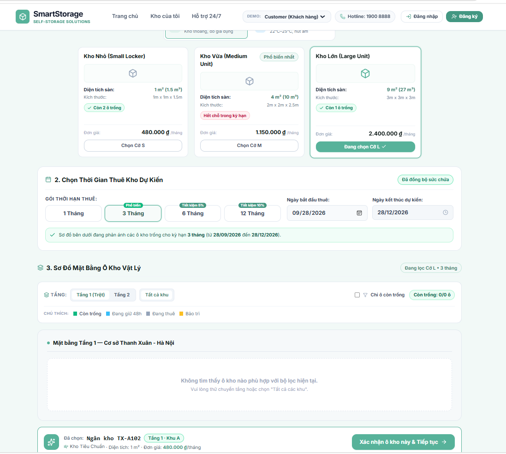 *(Giao diện Bước chọn ô kho trên sơ đồ mặt bằng)*  
  * 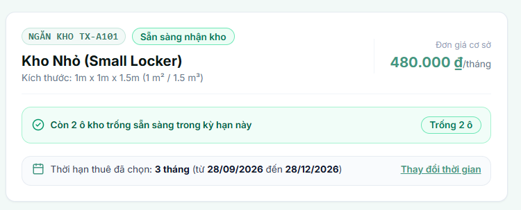 *(Giao diện Trang tiếp theo sau khi bấm Xác nhận ô kho & Tiếp tục)*
- **Ghi chú gốc từ Lead Dev:**  
  > *"Chưa fix lỗi trống 1 ô nhưng không hiện ô trống nào ? Và thông tin ô trống không được thay đổi khi tôi thay đổi thời gian thuê ? Thông tin ô kho trống là để làm gì ?"* — `[NHI ĐÃ FIX]`
- **Tóm tắt vấn đề & Kết quả đã giải quyết:**  
  * **Vấn đề:** Sơ đồ mặt bằng đa tầng bị kẹt hiển thị tầng không có ô kho trống dẫn đến báo 0/0 ô dù loại kho còn chỗ, thanh footer tự gán ô kho ảo cho phép tiếp tục; màn hình xác nhận Booking khi đổi thời hạn thuê không phản ứng cập nhật lại tình trạng sẵn sàng.
  * **Kết quả đã xử lý (commit `d238dff`):**  
    1. *Tự động chuyển tầng thông minh & Đồng bộ bộ lọc (`UnitGrid.tsx`):* Tự động phát hiện và nhảy tới tầng đầu tiên có ô kho khả dụng; hỗ trợ chuyển tầng linh hoạt; vô hiệu hóa nút xác nhận ở footer nếu chưa có ô kho nào được click chọn thực tế trên sơ đồ (`selectedUnit === null`).  
    2. *Phản ứng tức thì khi thay đổi lịch thuê (`BookingPage.tsx`, `UnitPickerPage.tsx`):* Khi khách hàng đổi thời hạn thuê (số tháng hoặc ngày bắt đầu), hệ thống cập nhật state/URL query ngay lập tức, tự động gọi lại API `checkUnitAvailability` để kiểm tra xung đột lịch giữ chỗ và tính lại đơn giá, chiết khấu và tiền cọc theo thời hạn mới.
  * **File liên quan đã hoàn thành:** `frontend/src/features/customer/components/UnitGrid.tsx`, `frontend/src/features/customer/pages/BookingPage.tsx`, `frontend/src/features/customer/pages/UnitPickerPage.tsx`.

#### 2. [ĐÃ XONG] Lỗ hổng xác thực & Phân quyền nghiêm trọng (Bỏ qua Authentication)
- **Hình ảnh minh chứng:**  
  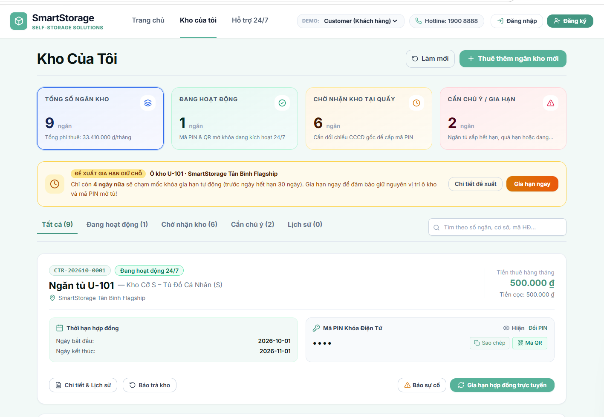
- **Ghi chú gốc từ Lead Dev:**  
  > *"Lỗi xác thực phân quyền, chưa đăng nhập cũng cho thanh toán + không đăng nhập thì thông tin kho này của ai vậy ?"* — `[NHI ĐÃ FIX]`  
  > *(Chưa đăng nhập → không có thông tin My Rentals & Support Tickets → đăng nhập vào để xem; khi thanh toán mà chưa đăng nhập → chuyển hướng trang đăng nhập)*
- **Tóm tắt vấn đề & Kết quả đã giải quyết:**  
  * **Vấn đề:** Người dùng ẩn danh chưa đăng nhập vẫn truy cập được vào màn hình quản lý kho cá nhân (`/my-rentals`), xem được hợp đồng mẫu và mã PIN mở cửa; tại bước đặt kho vẫn cho phép bấm thanh toán tạo hợp đồng vô chủ.
  * **Kết quả đã xử lý (commit `683c30d` & hoàn thiện Auth):**  
    1. *Xóa bỏ triệt để Demo Switcher & Mock Auth:* Loại bỏ hoàn toàn `DemoRoleSwitcher` và các bộ chọn demo user giả lập trên toàn bộ Header, Layout và trang Đăng nhập; không cho phép bypass đăng nhập.  
    2. *Bảo vệ định tuyến chặt chẽ (Auth Guard):* Trang `BookingPage`, `PaymentPage` kiểm tra token; nếu chưa đăng nhập lập tức chuyển hướng sang `/auth/login?redirect=...` lưu vết URL đặt phòng. Trang `MyUnitsPage` và `SupportPage` hiển thị thẻ yêu cầu đăng nhập thân thiện khi chưa có session, không fallback hiển thị hợp đồng mock cũ.  
    3. *Bảo mật Backend Spring Security:* Các API nghiệp vụ (`/customers/me/rentals`, `/reservations`, `/payments/**`) bắt buộc Bearer JWT token, trích xuất danh tính từ token ngăn chặn triệt để tạo hợp đồng vô chủ hoặc rò rỉ dữ liệu phiên giữa các tài khoản.
  * **File liên quan đã hoàn thành:** `frontend/src/layouts/CustomerLayout.tsx`, `frontend/src/features/auth/pages/LoginPage.tsx`, `frontend/src/features/customer/pages/BookingPage.tsx`, `frontend/src/features/customer/pages/MyUnitsPage.tsx`.

#### 3. [ĐÃ XONG] Dữ liệu mẫu (Seed Data) sai cơ sở thực tế & Sai lệch thuật ngữ nghiệp vụ: Dùng từ "Ngăn tủ / Tủ đồ" thay vì "Ô kho thực tế"
- **Hình ảnh minh chứng:** *(Cùng màn hình thanh toán trên - `image-03.png`)*
- **Ghi chú gốc từ Lead Dev:**  
  > *"Cũng trên màn hình này chữ hiển thị không đúng: Kho bãi, phòng chứ không phải ngăn tủ ? Thông tin hiển thị vị trí sai hết làm gì có tồn tại kho Tân Bình Flagship ???? ⇒ Nghi vấn sai dữ liệu seed phía dưới database"* — `[NHI ĐÃ FIX]`
- **Mô tả kỹ thuật chuẩn hóa:**  
  * **Tên vấn đề:** Dữ liệu mẫu (Seed Data) chứa cơ sở ảo không có trong danh mục ("SmartStorage Tân Bình Flagship"), đồng thời văn bản giao diện sử dụng sai nghiêm trọng thuật ngữ nghiệp vụ Self-Storage khi gọi các ô kho thực tế là "ngăn tủ", "ngăn kho", "tủ đồ cá nhân".
  * **Hiện trạng ghi nhận trên UI:**  
    1. *Sai lệch thuật ngữ nghiêm trọng (Hạ thấp quy mô mô hình kinh doanh):* Toàn bộ giao diện đang dùng từ ngữ của tủ locker công cộng: *"TỔNG SỐ NGĂN KHO: 9 ngăn"*, *"Ngăn tủ U-101 — Kho Cỡ S – Tủ Đồ Cá Nhân (S)"*, *"Ngăn tủ sắp hết hạn"*, *"Thuê thêm ngăn kho mới"*, *"Tìm theo số ngăn..."*. Thực tế, các đơn vị cho thuê ở đây là **CÁC Ô KHO LƯU TRỮ VẬT LÝ THỰC TẾ (Physical Storage Units)** có diện tích từ $1m^2$ đến hơn $9m^2$, có cửa và khóa riêng biệt, khách hàng có thể bước vào sắp xếp hàng hóa, đồ gia đình. Việc gọi là "ngăn tủ" hay "tủ đồ" là sai hoàn toàn bản chất mô hình Self-Storage. Ngoài ra, một số chỗ lại dùng từ *"Kho bãi"* (dành cho logistics cảng/bãi ngoài trời) hoặc *"Phòng"* (dành cho nhà ở/khách sạn), gây mất tính nhất quán thương hiệu.  
    2. *Sai lệch dữ liệu mẫu cơ sở:* Thông tin hiển thị vị trí: `SmartStorage Tân Bình Flagship` — cơ sở này hoàn toàn không có trong danh mục cơ sở chính thức của dự án (dự án chỉ vận hành các cơ sở như Cầu Giấy, Thanh Xuân, Quận 7...).
  * **Nguyên nhân gốc (Root Cause):** File seed dữ liệu (`V2__seed_data.sql`) và mock data client chèn dữ liệu cơ sở tùy ý lúc phát triển ban đầu. Đội ngũ Frontend tự đặt text hiển thị tùy tiện, không bám sát Từ điển thuật ngữ (Domain Glossary) chuẩn hóa tại `TOPIC.md § 7`.
  * **Hành vi kỳ vọng (Expected Behavior):**  
    - *Chuẩn hóa 100% thuật ngữ Domain trên toàn bộ hệ thống:* CẤM TUYỆT ĐỐI các từ: *"Ngăn tủ"*, *"Tủ đồ"*, *"Ngăn kho"*, *"Kho bãi"*, *"Phòng"*. BẮT BUỘC SỬ DỤNG:  
      + `Storage Unit` $\rightarrow$ **Ô kho** (ví dụ: *Ô kho U-101*, *Tổng số ô kho đang thuê: 9 ô*, *Thuê thêm ô kho mới*, *Tìm kiếm theo mã ô kho*).  
      + `Unit Type` $\rightarrow$ **Loại ô kho** (ví dụ: *Ô kho Cỡ S*, *Ô kho Cỡ M*, *Ô kho Cỡ L* — không gọi là "Tủ đồ cá nhân").  
      + `Facility` $\rightarrow$ **Cơ sở lưu trữ** / **Cơ sở kho**.  
    - *Làm sạch Dữ liệu Mẫu (Seed Data Cleanup):* Xóa bỏ triệt để cơ sở ảo "Tân Bình Flagship", chuẩn hóa danh mục cơ sở và ô kho theo đúng danh sách chính thức đã được ban hành trong tài liệu đặc tả.
  * **Hướng xử lý & File liên quan đã hoàn thành:**  
    - Database & Backend: Migration `V34__normalize_unit_type_names_and_seed_terms.sql` (chuẩn hóa tên loại kho UT-SMALL bỏ Locker, cập nhật text seed).  
    - Frontend: Chuẩn hóa toàn bộ từ khóa `ngăn tủ`, `ngăn kho`, `tủ đồ` thành `ô kho` trong `ContractDetailModal.tsx`, `RentedUnitCard.tsx`, `BookingPage.tsx`, `EarlyRenewalReminderModal.tsx`, `RenewalReceiptModal.tsx`, `HomePage.tsx`, `MyUnitsPage.tsx`, `staffAssignmentApi.ts`. Dọn dẹp mock `pricing.ts`, `customerApi.ts`, `mock-facilities.json`.
  * **Kết quả kiểm thử:** Đã bổ sung bộ test `TerminologyAudit.test.tsx`, `mockDataCleanup.test.ts` đảm bảo 100% không còn vi phạm.

#### 4. [ĐÃ XONG] Hiển thị sai thời hạn hoàn trả tiền cọc (Cam kết 24-48 giờ vs Thực tế 7 ngày làm việc)
- **Hình ảnh minh chứng:**  
  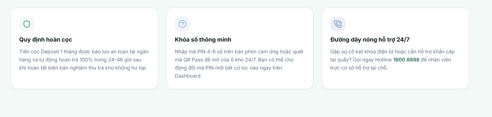
- **Ghi chú gốc từ Lead Dev:**  
  > *"Sai thông tin hoàn cọc, cọc hoàn trong 7 ngày; phiếu báo cáo cũng đang hiển thị sai thông tin này"*
- **Mô tả kỹ thuật chuẩn hóa:**  
  * **Tên vấn đề:** Sai lệch cam kết thời gian hoàn tiền cọc (Deposit Refund SLA) trên thẻ thông tin chính sách khách hàng và các mẫu phiếu báo cáo nghiệm thu thanh lý hợp đồng.
  * **Hiện trạng ghi nhận trên UI (`image-04.png`):** Tại thẻ *Quy định hoàn cọc*, hệ thống hiển thị cam kết: *"Tiền cọc Deposit 1 tháng được bảo lưu an toàn tại ngân hàng và **tự động hoàn trả 100% trong 24-48 giờ** sau khi hoàn tất biên bản nghiệm thu trả kho không hư hại."* Thông tin này mâu thuẫn hoàn toàn với quy định nghiệp vụ cốt lõi tại `BR-RET-07` / `BR-CAN-06` (tham số `return.refund_working_days = 7 ngày làm việc`). Đồng thời, trên các mẫu xuất phiếu nghiệm thu trả kho và điều khoản xác nhận thanh lý cũng đang in ra mốc 24-48 giờ, gây rủi ro khiếu nại tài chính khi ngân hàng/kế toán chưa thể giải ngân trong 2 ngày.
  * **Nguyên nhân gốc (Root Cause):** Nhóm Frontend hardcode chuỗi text quảng bá chưa qua đối chiếu với thông số hệ thống trong `docs/BUSINESS-RULES.md § 2`. Chưa có cơ chế đọc tham số chính sách hoàn cọc động từ bảng `system_policy` (`policy_key = 'return.refund_working_days'`).
  * **Hành vi kỳ vọng (Expected Behavior):** Thẻ thông tin và tất cả các mẫu phiếu in/báo cáo phải hiển thị đồng nhất: **Hoàn trả tiền cọc trong vòng 7 ngày làm việc** (kể từ ngày hoàn tất thủ tục bàn giao/nghiệm thu hiện trạng ô kho và xác nhận không có hư hại kết cấu). Text giao diện nên lấy trực tiếp từ config hệ thống hoặc resource bundle chuẩn thay vì hardcode số giờ.
  * **File liên quan đã hoàn thành:**  
    - Frontend: `frontend/src/features/customer/pages/MyUnitsPage.tsx`, `frontend/src/features/customer/components/ScheduleReturnModal.tsx` (chuẩn hóa hiển thị 7 ngày làm việc).  
    - Backend & Docs: Khớp chuẩn xác với `docs/BUSINESS-RULES.md` (`BR-RET-07` / `BR-RET-05` / `BR-CAN-06`).
  * **Kết quả kiểm thử:** Đã bổ sung bộ test `DepositSlaAudit.test.tsx` đảm bảo 100% không còn xuất hiện mốc 24-48 giờ trên các giao diện hoàn cọc.

#### 5. Cơ chế phân loại SLA xử lý sự cố chưa thực tế (Khách hàng tự tích khẩn cấp 2h cho mọi loại sự cố)
- **Hình ảnh minh chứng:**  
  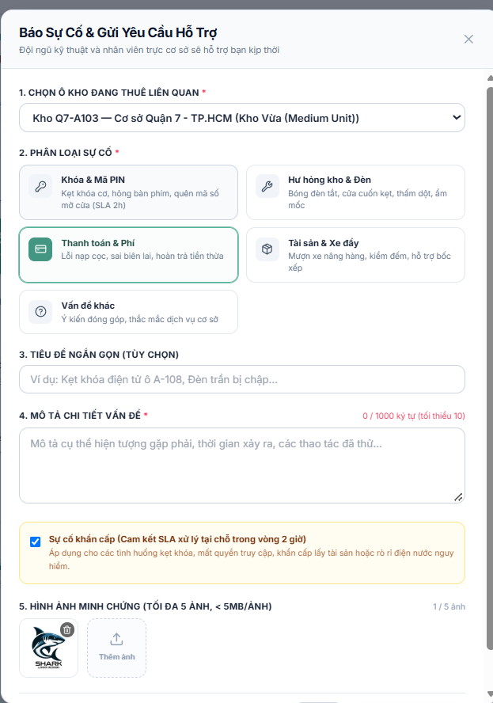
- **Ghi chú gốc từ Lead Dev:**  
  > *"Khách hàng không có được tự động quyết giải quyết trong vòng 2h mà phải để FM duyệt hoặc hệ thống tự duyệt tự động với các yêu cầu loại như mã pin …"*
- **Mô tả kỹ thuật chuẩn hóa:**  
  * **Tên vấn đề:** Luồng tiếp nhận sự cố (Support Ticket) cho phép khách hàng tự tiện áp đặt thời hạn SLA 2 giờ cho mọi tình huống; lẫn lộn giữa tác vụ kỹ thuật số (tự động cấp lại mã PIN) và sự cố vật lý tại chỗ cần nhân viên xử lý.
  * **Hiện trạng ghi nhận trên UI (`image-05.png`):** Form *Báo Sự Cố & Gửi Yêu Cầu Hỗ Trợ* cung cấp một checkbox mở cho người dùng: `[x] Sự cố khẩn cấp (Cam kết SLA xử lý tại chỗ trong vòng 2 giờ)`. Khách hàng chọn loại sự cố bất kỳ (ví dụ: chọn mục *Thanh toán & Phí* hoặc *Ý kiến đóng góp*) nhưng vẫn tích chọn được ô "Khẩn cấp 2h", ép hệ thống phải cam kết xử lý tại chỗ trong 2 giờ đối với các nghiệp vụ hành chính/kế toán. Ngược lại, đối với sự cố *Quên mã PIN mở cửa*, khách hàng phải lập ticket chờ người đến xử lý 2 tiếng, trong khi đây là thao tác điện tử cần được hệ thống tự động giải quyết ngay lập tức.
  * **Nguyên nhân gốc (Root Cause):** Form báo sự cố thiết kế dạng thu thập thông tin phẳng, thiếu logic điều kiện (Conditional Logic) ràng buộc theo từng danh mục sự cố (`ticketCategory`). Chưa phân tách rõ ràng giữa **Yêu cầu hỗ trợ tự động (Self-service Request)** và **Phiếu sự cố vật lý cần điều phối nhân sự (Physical Maintenance Ticket)**.
  * **Hành vi kỳ vọng (Expected Behavior):**  
    1. *Đối với yêu cầu Cấp lại mã PIN / Quên mã số mở cửa:* Tách thành một tính năng tự phục vụ nhanh trên Dashboard (`Cấp lại mã PIN mới`). Khách hàng xác thực qua OTP (email/SMS) $\rightarrow$ Hệ thống lập tức sinh mã PIN 6 số ngẫu nhiên mới và kích hoạt ngay sau < 1 phút, không cần tạo ticket chờ nhân viên hỗ trợ 2 giờ.  
    2. *Đối với sự cố vật lý tại cơ sở (Kẹt khóa cơ, hư hỏng cửa cuốn, thấm dột, chập điện):* Ticket được chuyển về cho **Facility Manager (FM)** của cơ sở đó tiếp nhận. FM là người có thẩm quyền đánh giá mức độ nghiêm trọng và gán cờ `URGENT_2H` cùng nhân viên phụ trách.  
    3. *Trên Form của Khách:* Bỏ checkbox cho phép khách hàng tự tick cam kết 2h. Chỉ hiển thị nhãn thông tin cam kết xử lý: Đối với sự cố vật lý nghiêm trọng, nhân viên cơ sở sẽ có mặt xử lý trong vòng 2 giờ kể từ khi FM xác nhận tiếp nhận.
  * **Hướng xử lý & File liên quan:**  
    - Frontend: `SupportTicketModal.tsx`, `MyRentalsPage.tsx` (thêm luồng Self-service Reset PIN, bỏ checkbox tự gán 2h).  
    - Backend: `SupportTicketService.java`, `AccessCodeService.java` (tách riêng API reset PIN tự động và API quản lý Ticket của FM/Staff).

#### 6. Luồng thanh toán trên Màn hình Thanh toán Gia hạn Hợp đồng (VietQR): Thiếu Sandbox giả lập, sai thời hạn giữ chỗ (15 phút vs 48 giờ) và thiếu cơ chế lưu vết đơn chờ thanh toán
- **Hình ảnh minh chứng:**  
  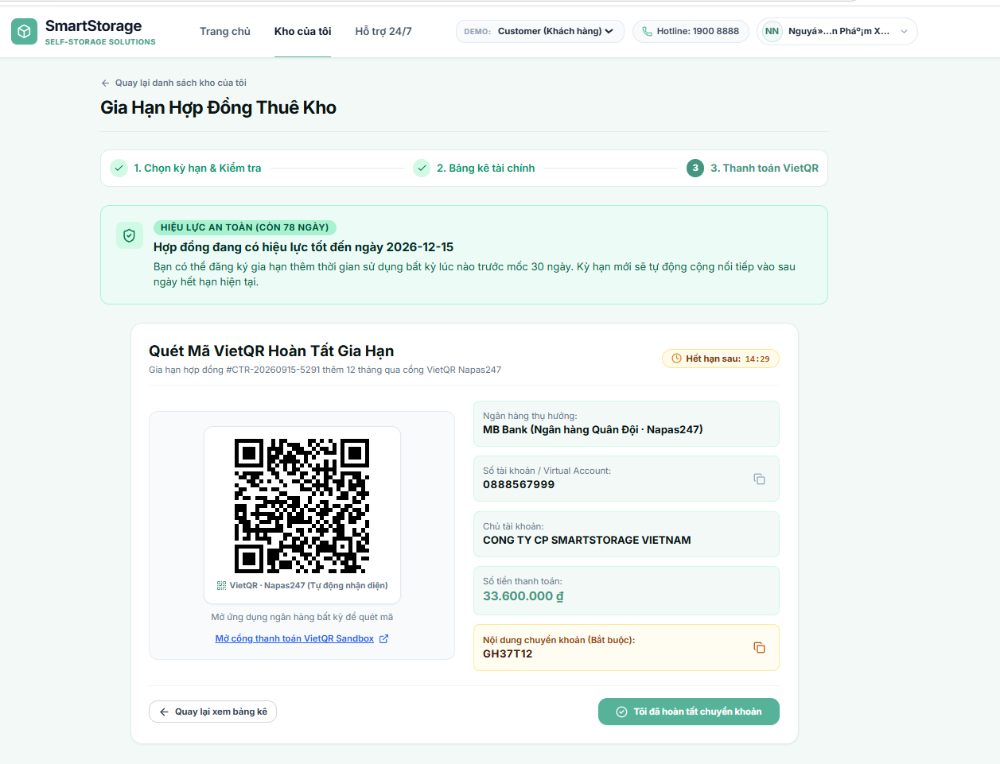
- **Ghi chú gốc từ Lead Dev:**  
  > *"Ngay tại chỗ nãy cần có sandbox vì không thể test được luồng tiếp theo :))"*  
  > *"Khóa thanh toán theo 48h chứ không phải 15p; chưa có cơ chế gọi là lưu lại lịch sử đã thiết lập nhanh toán, tracking thanh toán, nếu vậy cần cân nhắc chỗ này xử lý sao cho khéo ⇒ Đề xuất ở màn hình này sẽ thay chỗ “Quay lại xem thống kê” thành “Hủy thanh toán”; nếu đến màn hình này ở chỗ giao diện ô kho “Gia hạn hợp đồng trực tuyến” chuyển thành “Thanh toán” nếu ấn vào chuyển đến màn hình này"*  
  > *"Chắc cần đổi chỗ này BR-REN-10: Yêu cầu Renewal chưa thanh toán chỉ là báo giá tạm thời, không kéo dài Contract và không giữ capacity. Khi đến hạn mà chưa thanh toán thành công thì chuyển Overdue theo BR-OVD-01 ⇒ Nếu ấn thanh toán tạo mã thì sẽ được khóa"*
- **Mô tả kỹ thuật chuẩn hóa:**  
  * **Tên vấn đề:** Lỗi trên Màn hình Thanh toán Gia hạn Hợp đồng (VietQR - Renewal Payment Screen): Thiếu công cụ Sandbox giả lập kết quả giao dịch, sai thời gian đếm ngược giữ chỗ (đang để 15 phút thay vì 48 giờ), thiếu lưu vết đơn chờ xử lý (`PENDING_PAYMENT`), bất hợp lý ở các nút điều hướng và mâu thuẫn quy tắc giữ chỗ khi gia hạn (`BR-REN-10`).
  * **Hiện trạng ghi nhận trên UI (`image-06.png`):**  
    1. *Thiếu công cụ Sandbox:* Khi kiểm thử trên môi trường dev/staging, người kiểm thử không thể dùng tài khoản ngân hàng thực tế để chuyển khoản. Không có nút giả lập webhook thành công/thất bại, dẫn đến việc bị kẹt cứng tại màn hình này và không thể test tiếp các bước sau.  
    2. *Thời hạn giữ chỗ sai lệch:* Đồng hồ đếm ngược đang hiển thị: `Hết hạn sau: 14:29` (tức chỉ cho phép thanh toán trong 15 phút). Trong khi đó, theo quy tắc hệ thống đối với hình thức chuyển khoản ngân hàng thủ công, thời gian giữ chỗ thanh toán phải là **48 giờ** (`reservation.hold_hours = 48`).  
    3. *Thiếu trạng thái Tracking & Nút điều hướng bất hợp lý:* Nút chân trang bên trái ghi *"Quay lại xem bảng kê"* (hoặc quay lại trang trước) nhưng không có nút hủy lệnh thanh toán rõ ràng. Nếu người dùng rời khỏi màn hình này, hệ thống chưa lưu lại trạng thái đơn đang chờ thanh toán. Tại màn hình *Kho của tôi*, thẻ ô kho vẫn hiển thị nút *"Gia hạn hợp đồng trực tuyến"*, nếu khách bấm lại sẽ tạo ra thêm một mã thanh toán mới gây trùng lặp/rác dữ liệu.  
    4. *Xung đột quy tắc nghiệp vụ `BR-REN-10`:* Quy tắc cũ quy định đơn gia hạn chưa thanh toán không giữ capacity; tuy nhiên thực tế khi khách hàng đã bấm xác nhận tạo mã thanh toán VietQR thì hệ thống **buộc phải tạm khóa giữ chỗ ô kho trong 48 giờ** để đảm bảo trong thời gian khách chuyển khoản, ô kho không bị người khác thuê mất kỳ tiếp theo.
  * **Hành vi kỳ vọng (Expected Behavior):**  
    1. *Bổ sung Sandbox Test Bar:* Trên màn hình thanh toán ở chế độ Test/Dev, cung cấp sẵn 2 nút: `[Giả lập Thanh toán Thành công]` và `[Giả lập Thanh toán Thất bại/Hết hạn]` để lập tức kích hoạt webhook callback kiểm thử.  
    2. *Thời gian khóa giữ chỗ 48 giờ:* Cấu hình thời gian hết hạn của phiên thanh toán chuyển khoản là 48 giờ kể từ lúc sinh mã QR.  
    3. *Lưu vết và Điều hướng thông minh:* Đổi nút bên trái thành **"Hủy thanh toán"**: Cho phép người dùng chủ động hủy giao dịch này để trả lại trạng thái bình thường. Khi giao dịch thanh toán VietQR đã được tạo: Hệ thống lưu trạng thái hợp đồng/gia hạn là `PENDING_PAYMENT`. Tại màn hình *Kho của tôi*, nút *"Gia hạn hợp đồng trực tuyến"* tự động chuyển thành nút **"Tiếp tục thanh toán"** (dẫn thẳng lại màn hình QR đang chờ).  
    4. *Cập nhật `BR-REN-10`:* Ngay khi khách hàng bấm tạo lệnh thanh toán gia hạn, hệ thống tạm khóa capacity của ô kho đó trong vòng 48 giờ. Hết 48 giờ nếu chưa nhận được tiền thì lệnh tự hủy và giải phóng capacity.
  * **Hướng xử lý & File liên quan:**  
    - Frontend: `VietQRPaymentStep.tsx` (thêm Mock Dev Sandbox, sửa countdown 48h, đổi nút Hủy thanh toán), `MyRentalsPage.tsx` (đổi nhãn nút thành "Thanh toán" nếu đang pending payment).  
    - Backend: `PaymentService.java`, `RenewalService.java`, `VietQRWebhookController.java`.  
    - Tài liệu: Cập nhật điều chỉnh `BR-REN-10` trong `docs/BUSINESS-RULES.md`.

#### 7. Chuẩn hóa thời điểm tự động khóa mã mở cửa chính xác tại mốc D+7 theo Business Rules mới
- **Hình ảnh minh chứng:**  
  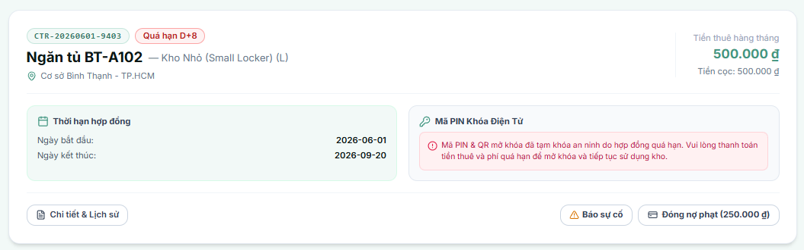
- **Ghi chú gốc từ Lead Dev:**  
  > *"Hiển thị khóa đang sai vì theo BR sau 10 ngày mới khóa ⇒ Chắc điều chỉnh là sau 7 ngày là sẽ khóa trong BR để đảm bảo khách hàng phải thanh toán phí và dọn dẹp ngay khi bị quá hạn hoặc là không khóa theo BR vì nó không thể bàn giao kho được vì nút báo trả kho không hiển thị khi bị nợ"*
- **Mô tả kỹ thuật chuẩn hóa (Ngắn gọn):**  
  * **Tên vấn đề:** Khóa quyền truy cập ô kho (Mã PIN / QR) khi quá hạn cần kích hoạt chuẩn xác vào lúc 00:00 ngày D+7 theo Business Rules mới (`overdue.lock_access_days = 7`).
  * **Hiện trạng & Đánh giá:** Giao diện hiển thị cảnh báo đỏ tạm khóa mã PIN tại mốc `Quá hạn D+8` như trong ảnh là **hoàn toàn đúng định hướng nghiệp vụ mới** (nhằm buộc khách hàng phải thanh toán nợ phạt và tiến hành dọn đồ trả kho). Cần đảm bảo hệ thống kích hoạt tự động việc khóa an ninh này chuẩn xác vào **00:00 ngày D+7** (sau 3 ngày ân hạn D+1 $\rightarrow$ D+3 và 3 ngày tính phạt D+4 $\rightarrow$ D+6 vẫn cho mở cửa dọn đồ). Khi đang nợ phạt, giao diện ẩn nút *"Báo trả kho"* và chỉ mở nút *"Đóng nợ phạt (250.000 đ)"*. Cần nêu rõ thông báo cho khách: Thanh toán nợ phạt xong sẽ mở lại quyền vào kho dọn đồ và mở lại nút "Báo trả kho".
  * **Hành vi kỳ vọng (Expected Behavior):**  
    - Backend Job chạy lúc 00:00 ngày D+7: Tự động chuyển trạng thái Access Code sang `SUSPENDED`.  
    - Khách thanh toán nợ phạt thành công $\rightarrow$ Mở khóa quyền truy cập tạm thời và mở lại nút "Báo trả kho" để khách hoàn tất thủ tục bàn giao.
  * **Hướng xử lý & File liên quan:**  
    - Backend: `OverdueScheduledJob.java` (trigger khóa PIN tại đúng D+7).  
    - Docs: Cập nhật tham số `overdue.lock_access_days = 7` trong `docs/BUSINESS-RULES.md`.

#### 8. Trạng thái ô kho chuyển sai về màu xanh "Đang hoạt động" sau khi khách nộp tiền phạt quá hạn
- **Hình ảnh minh chứng:**  
  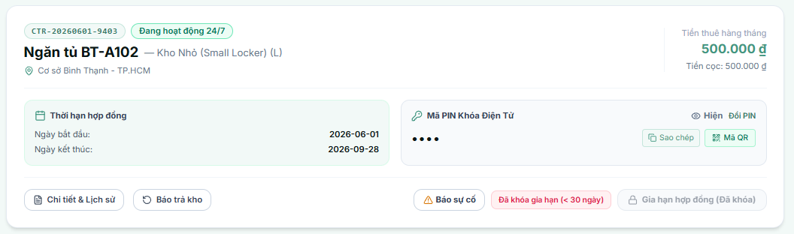
- **Ghi chú gốc từ Lead Dev:**  
  > *"Thanh toán nợ xong rồi thì kho này cũng thuộc dạng quá hạn phải báo quá hạn chứ sao để xanh thế này ? hoặc là thêm trạng thái đã quá hạn bao nhiêu ngày để cảnh báo dọn sớm"*
- **Mô tả kỹ thuật chuẩn hóa (Ngắn gọn):**  
  * **Tên vấn đề:** Sai lệch trạng thái hợp đồng sau khi đóng phạt: Hợp đồng quá hạn đã nộp phạt xong lại chuyển về badge màu xanh `Đang hoạt động 24/7` (Active), gây ngộ nhận cho khách hàng là hợp đồng đã được gia hạn bình thường.
  * **Hiện trạng & Đánh giá:** Khách hàng tại ảnh 7 bấm nộp phạt 250.000 đ thành công, hệ thống lại chuyển thẻ ô kho về màu xanh `Đang hoạt động 24/7`, trong khi hợp đồng đã hết hạn thuê từ trước và nút gia hạn đang bị khóa (`Đã khóa gia hạn < 30 ngày`). Khách mới chỉ nộp **tiền phạt cho các ngày quá hạn**, hoàn toàn **chưa đóng tiền thuê kỳ mới**. Việc hiển thị màu xanh an toàn khiến khách tưởng mình còn hạn thuê và không chịu dọn đồ, tiếp tục bị quá hạn ở các ngày sau.
  * **Hành vi kỳ vọng (Expected Behavior):**  
    - Tuyệt đối không đưa về trạng thái `ACTIVE` màu xanh.  
    - Phải hiển thị badge cảnh báo màu cam: `Đã nộp phạt — Chờ trả kho`, kèm banner nhắc nhở: *"Hợp đồng đã kết thúc thời hạn thuê. Bạn đã hoàn tất nộp phạt, vui lòng dọn đồ và bấm 'Báo trả kho' trước 00:00 ngày mai để tránh phát sinh nợ phạt mới."*  
    - Mở lại nút **"Báo trả kho"** để khách tiến hành thủ tục bàn giao.
  * **Hướng xử lý & File liên quan:**  
    - Backend: `ContractService.java`, `PaymentService.java` (chuyển sang trạng thái `OVERDUE_CLEARED` thay vì `ACTIVE`).  
    - Frontend: `RentalCard.tsx`, `RentalStatusBadge.tsx` (thêm màu badge và banner nhắc dọn đồ).

#### 9. Hợp đồng "Đang chờ nghiệm thu trả kho" vẫn mở nút "Gia hạn hợp đồng trực tuyến", gây lỗi chặn thanh toán
- **Hình ảnh minh chứng:**  
  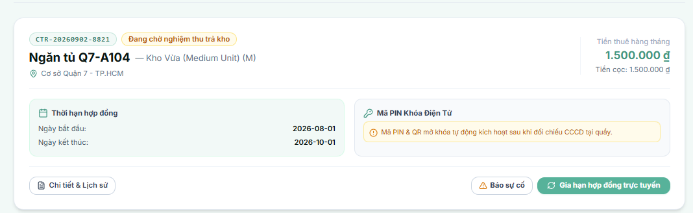
- **Ghi chú gốc từ Lead Dev:**  
  > *"Không thanh toán được trong trường hợp này"*
- **Mô tả kỹ thuật chuẩn hóa (Ngắn gọn):**  
  * **Tên vấn đề:** Xung đột trạng thái hợp đồng: Hợp đồng đang trong quy trình trả kho (`PENDING_RETURN`) nhưng giao diện vẫn mở nút "Gia hạn hợp đồng trực tuyến", khiến khách bấm thanh toán gia hạn thì bị Backend từ chối và báo lỗi.
  * **Hiện trạng & Đánh giá:** Hợp đồng `CTR-20260902-8821` đang có badge màu cam: `Đang chờ nghiệm thu trả kho` (khách đã đăng ký trả kho và đang chờ nhân viên kiểm tra hiện trạng). Tuy nhiên, góc phải chân thẻ vẫn sáng nút xanh: **"Gia hạn hợp đồng trực tuyến"**. Khi khách bấm gia hạn và thanh toán, Backend từ chối tạo đơn gia hạn cho hợp đồng đang thanh lý, dẫn đến lỗi chặn thanh toán không rõ nguyên nhân trên UI.
  * **Hành vi kỳ vọng (Expected Behavior):**  
    - Khi hợp đồng ở trạng thái `Đang chờ nghiệm thu trả kho`: Bắt buộc **ẨN / KHÓA** nút *"Gia hạn hợp đồng trực tuyến"*.  
    - Thay thế bằng nút **"Hủy yêu cầu trả kho"** (dành cho trường hợp khách đổi ý muốn thuê tiếp).  
    - Chỉ khi khách bấm "Hủy yêu cầu trả kho" và hợp đồng quay về `ACTIVE` bình thường thì nút Gia hạn mới được phép xuất hiện trở lại.
  * **Hướng xử lý & File liên quan:**  
    - Frontend: `RentalCard.tsx`, `RentalActionButtons.tsx` (ẩn nút Gia hạn khi `PENDING_RETURN`, bổ sung nút Hủy yêu cầu trả kho).  
    - Backend: `ContractService.java` (API hủy yêu cầu trả kho).

#### 10. Thiếu cảnh báo đếm ngược về mốc khóa quyền gia hạn (Khóa trước ngày hết hạn 30 ngày, buộc tạo hợp đồng mới)
- **Hình ảnh minh chứng:**  
  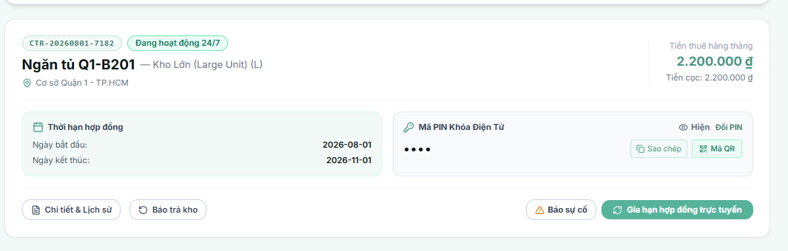
- **Ghi chú gốc từ Lead Dev:**  
  > *"Liệu có nên thêm thông tin trong ô kho này nữa là sắp hết thời gian có thể gia hạn không ?"*
- **Mô tả kỹ thuật chuẩn hóa (Ngắn gọn):**  
  * **Tên vấn đề:** Thẻ ô kho thiếu thông báo/badge đếm ngược cảnh báo mốc khóa tính năng gia hạn (trước ngày kết thúc 30 ngày theo quy định), khiến khách hàng không kịp trở tay khi nút gia hạn bị vô hiệu hóa (disabled).
  * **Hiện trạng & Đánh giá (`image-10.png`):** Hợp đồng `CTR-20260801-7182` có ngày kết thúc là `2026-11-01`. Hiện tại nút *"Gia hạn hợp đồng trực tuyến"* vẫn đang mở (màu xanh). Theo quy tắc nghiệp vụ: Khi thời hạn thuê chỉ còn **dưới 30 ngày**, hệ thống sẽ **khóa vĩnh viễn tính năng gia hạn (disable nút)**; khách hàng không thể gia hạn hợp đồng cũ nữa mà buộc phải tạo một hợp đồng mới từ đầu. Tuy nhiên, trên thẻ ô kho ở giai đoạn này lại hoàn toàn không có thông báo đếm ngược nào để cảnh báo khách hàng về mốc chặn này.
  * **Hành vi kỳ vọng (Expected Behavior):**  
    - Khi thời điểm hiện tại tiến gần đến mốc 30 ngày trước ngày hết hạn: Bắt buộc hiển thị badge đếm ngược cảnh báo màu cam nổi bật trên thẻ ô kho: `⚠️ Sắp hết hạn gia hạn: Còn N ngày nữa sẽ chạm mốc khóa gia hạn tự động (trước ngày hết hạn 30 ngày)`.  
    - Kèm dòng giải thích: *"Sau mốc này, nút Gia hạn sẽ bị khóa vĩnh viễn và bạn buộc phải tạo hợp đồng mới nếu muốn tiếp tục thuê ô kho này."*
  * **Hướng xử lý & File liên quan:**  
    - Frontend: `RentalCard.tsx` (tính số ngày đếm ngược đến mốc `endDate - 30 days`, hiển thị banner cảnh báo sớm).

#### 11. Lỗ hổng rò rỉ dữ liệu phiên nghiêm trọng: Tài khoản đăng ký mới tinh bị dính dữ liệu hợp đồng của tài khoản cũ (Session Bleed / Cache Leak)
- **Hình ảnh minh chứng:**  
  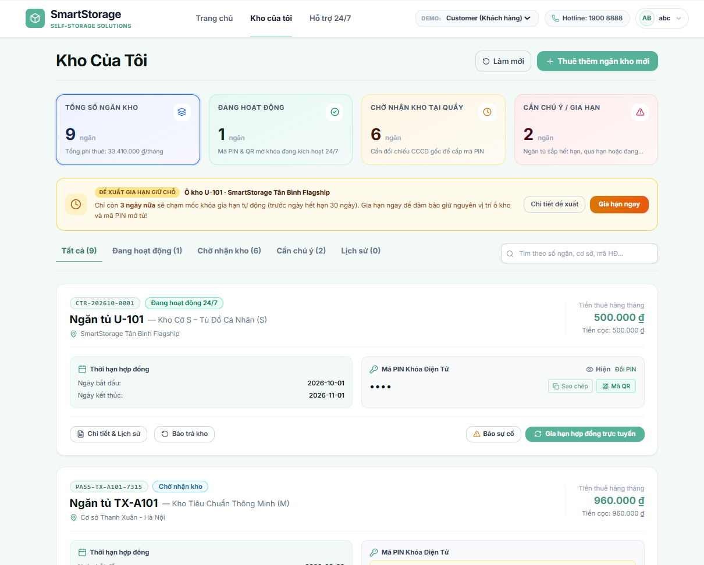
- **Ghi chú gốc từ Lead Dev:**  
  > *"Lỗi phân quyền nghiêm trọng tài khoản mới bị dính dữ liệu cũ"*
- **Mô tả kỹ thuật chuẩn hóa (Ngắn gọn):**  
  * **Tên vấn đề:** Lỗ hổng bảo mật và rò rỉ dữ liệu phiên (Session Bleed): Khi người dùng đăng ký một tài khoản mới tinh và đăng nhập, trang *Kho của tôi* lại tải dính toàn bộ 9 hợp đồng, mã PIN và ô kho của người dùng/tài khoản demo đăng nhập trước đó.
  * **Hiện trạng & Đánh giá (`image-11.png`):** Trên Header, tài khoản đang đăng nhập là tài khoản test mới tạo tên `AB abc` (avatar `AB`). Lẽ ra màn hình *Kho của tôi* phải ở trạng thái trống (`Empty State: Bạn chưa có ô kho nào`). Tuy nhiên, màn hình lại hiển thị đầy đủ thông tin của tài khoản cũ: *"Tổng số ô kho: 9, Đang hoạt động: 1, Chờ nhận kho: 6, Cần chú ý: 2"*, xem được cả mã hợp đồng `CTR-202610-0001`, mã PIN mở khóa và thao tác được trên tài sản của người khác.
  * **Nguyên nhân gốc (Root Cause):** Client State không được dọn dẹp khi đăng xuất/đăng nhập (Redux / Zustand / React Context / `localStorage` / `sessionStorage`). Backend API `/api/contracts/my-contracts` trả về dữ liệu mock cố định hoặc thiếu mệnh đề `WHERE c.customer_id = :currentUserId`.
  * **Hành vi kỳ vọng (Expected Behavior):**  
    - Khi thực hiện đăng xuất / đăng nhập tài khoản khác: Frontend bắt buộc kích hoạt `clearAuthSession()`, xóa toàn bộ cache và state cũ.  
    - Backend API bắt buộc trích xuất `userId` từ JWT token và chỉ trả về các hợp đồng của chính user đó (`customer_id == currentUserId`). Tài khoản mới tạo phải trả về mảng rỗng `[]` và hiển thị màn hình Empty State thân thiện.
  * **Hướng xử lý & File liên quan:**  
    - Frontend: `AuthContext.tsx`, `useAuthStore.ts`, `MyRentalsPage.tsx`.  
    - Backend: `ContractRepository.java`, `ContractService.java`.
  * **Trạng thái:** `[ĐÃ FIX]` — PR `#180` branch `fix/Tx-session-bleed-fix` đã xóa toàn bộ mock data và localStorage override

#### 12. Luồng đăng ký tài khoản bị tắc do không nhận được email OTP thực tế (Cần bổ sung mã OTP giả lập trên môi trường Dev/Test)
- **Hình ảnh minh chứng:**  
  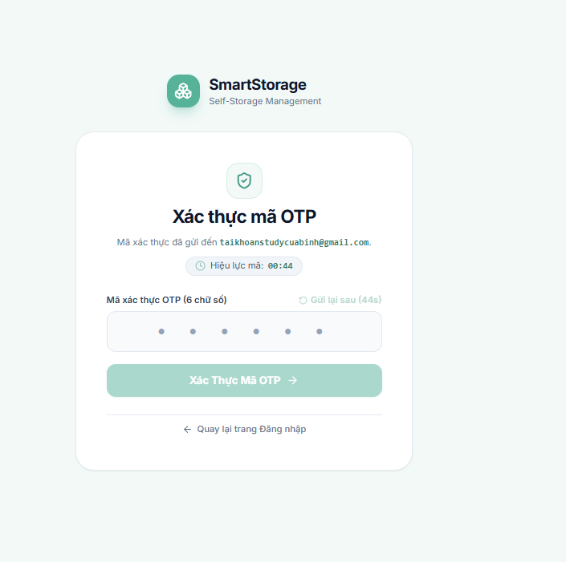
- **Ghi chú gốc từ Lead Dev:**  
  > *"Không có mã xác thực nào được gửi đến mail, nên để sẵn mã OTP giả lập"*
- **Mô tả kỹ thuật chuẩn hóa (Ngắn gọn):**  
  * **Tên vấn đề:** Thiếu cơ chế OTP giả lập (Mock OTP) trên môi trường kiểm thử: Màn hình xác thực đăng ký tài khoản yêu cầu nhập mã OTP gửi qua email nhưng hệ thống chưa có cấu hình SMTP thực tế, khiến người kiểm thử không nhận được mã và bị chặn luồng đăng ký.
  * **Hiện trạng & Đánh giá (`image-12.png`):** Màn hình *Xác thực mã OTP* thông báo: *"Mã xác thực đã gửi đến taikhoanstudycuabinh@gmail.com"*, kèm đồng hồ đếm ngược 60 giây và 6 ô nhập mã. Do môi trường phát triển chưa kết nối cổng gửi email thực qua SMTP, hòm thư hoàn toàn không có email nào được gửi về, khiến người kiểm thử không thể có mã OTP để hoàn tất đăng ký.
  * **Hành vi kỳ vọng (Expected Behavior):**  
    - Trên môi trường Dev / Testing: Hiển thị một khung gợi ý ngay dưới form: *"Mã OTP thử nghiệm: 123456"* (hoặc có nút bấm `[Tự động điền OTP Test]`). Backend cấu hình chấp nhận mã OTP mặc định (ví dụ `123456`) khi chạy ở profile `dev`/`local`, đồng thời in mã OTP thực sinh ra vào console log Spring Boot.  
    - Trên môi trường Production: Giữ nguyên quy trình gửi email bảo mật thực tế.
  * **Hướng xử lý & File liên quan:**  
    - Frontend: `OtpVerificationPage.tsx` (thêm Dev Mock OTP badge khi `import.meta.env.DEV === true`).  
    - Backend: `EmailService.java`, `OtpService.java` (log OTP ra terminal, cho phép bypass mã mặc định khi `spring.profiles.active=dev`).

---

### 2.2. Giao diện Quản trị viên (Admin)

#### 13. Lỗi mã hóa ký tự tiếng Việt (Mojibake) trong dữ liệu seed tài khoản & Menu điều hướng Admin bị thừa, phân mảnh chức năng (`SA-01`, `SA-02`, `SA-03`)
- **Hình ảnh minh chứng:**  
  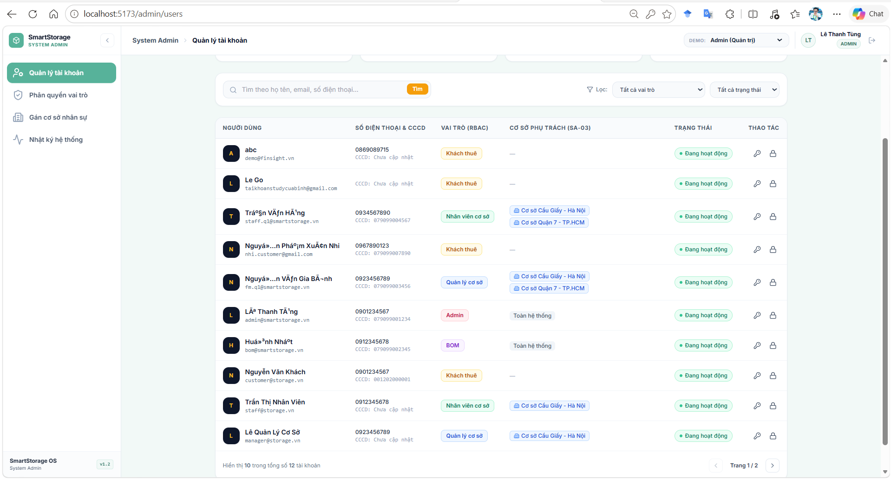
- **Ghi chú gốc từ Lead Dev:**  
  > *"Lỗi seed data tên; navigate “Phân quyền vai trò” và “Gán cơ sở nhân sự” cũng có tính năng tương tự như Quản lý tài khoản nên bỏ đi"*
- **Mô tả kỹ thuật chuẩn hóa:**  
  * **Tên vấn đề:** Dữ liệu mẫu (Seed Data) bị lỗi font / mã hóa UTF-8 ký tự tiếng Việt (Mojibake) và Sidebar menu của Admin xuất hiện 2 mục thừa *"Phân quyền vai trò"*, *"Gán cơ sở nhân sự"* vốn đã được tích hợp trọn vẹn trong màn hình *"Quản lý tài khoản"*.
  * **Hiện trạng ghi nhận trên UI (`image-13.png`):**  
    1. *Lỗi vỡ font / ký tự tiếng Việt:* Trong danh sách tài khoản, các tên có dấu tiếng Việt bị hiển thị thành chuỗi ký tự rác (Mojibake): `Trần Văn Hùng` (Trần Văn Hùng), `Nguyá»...n Phạm Xuân Nhi` (Nguyễn Phạm Xuân Nhi), `Nguyá»...n Văn Gia Bình` (Nguyễn Văn Gia Bình), `Lê Thanh Tùng` (Lê Thanh Tùng), `Huỳnh Nháºt` (Huỳnh Nhật).  
    2. *Menu Sidebar thừa & phân mảnh:* Menu bên trái hiển thị 4 mục: `Quản lý tài khoản`, `Phân quyền vai trò`, `Gán cơ sở nhân sự`, `Nhật ký hệ thống`. Tuy nhiên, ngay trên bảng `Quản lý tài khoản`, hệ thống đã có sẵn 2 cột trực quan: `VAI TRÒ (RBAC)` và `CƠ SỞ PHỤ TRÁCH (SA-03)`, kèm các icon thao tác đổi quyền/gán cơ sở trực tiếp. Hai mục menu con riêng biệt kia trở nên thừa thãi, gây trùng lặp và làm người dùng bối rối khi phải chuyển qua lại giữa nhiều trang để làm cùng một nghiệp vụ.
  * **Nguyên nhân gốc rễ (Root Cause):**  
    1. File SQL migration/seed data (`V...__seed_users.sql`) lưu bằng encoding Windows-1252/ANSI thay vì UTF-8 không BOM, hoặc trong câu lệnh `INSERT` vào SQL Server thiếu tiền tố `N'...'` cho kiểu dữ liệu `NVARCHAR` (ví dụ: `'Trần Văn Hùng'` thay vì `N'Trần Văn Hùng'`).  
    2. Thiết kế ban đầu tách rời route UI (`/admin/roles`, `/admin/facility-assignments`), sau đó gộp vào `/admin/users` nhưng chưa dọn dẹp Sidebar router.
  * **Hành vi kỳ vọng (Expected Behavior):**  
    1. *Sửa triệt để Seed Data:* Chuyển toàn bộ file seed script sang chuẩn `UTF-8 without BOM` và thêm tiền tố `N'...'` vào tất cả các trường họ tên, địa chỉ. Sau khi seed lại, bảng hiển thị đúng 100% tiếng Việt chuẩn: *Nguyễn Văn Gia Bình, Trần Văn Hùng, Lê Thanh Tùng...*  
    2. *Tinh gọn Sidebar Admin:* Xóa bỏ 2 mục menu con *"Phân quyền vai trò"* và *"Gán cơ sở nhân sự"* trên Sidebar. Chỉ giữ lại 2 menu chính gọn gàng:  
       - 👥 **Quản lý tài khoản** (Quản lý user, gán role RBAC, gán cơ sở phụ trách, khóa/mở khóa tài khoản).  
       - 📋 **Nhật ký hệ thống** (Audit Log hoạt động và lịch sử đăng nhập).
  * **Hướng xử lý & File liên quan:**  
    - Backend / DB: `V...__seed_users.sql` (thêm tiền tố `N`, encode UTF-8).  
    - Frontend: `AdminSidebar.tsx`, `adminRoutes.tsx`, `AdminUserManagementPage.tsx`.

#### 14. [ĐÃ FIX] Lỗi vỡ bố cục lớp phủ Modal (Modal Backdrop Clipping / UI Overlap) khi thực hiện thao tác Khóa tài khoản
- **Hình ảnh minh chứng:**  
  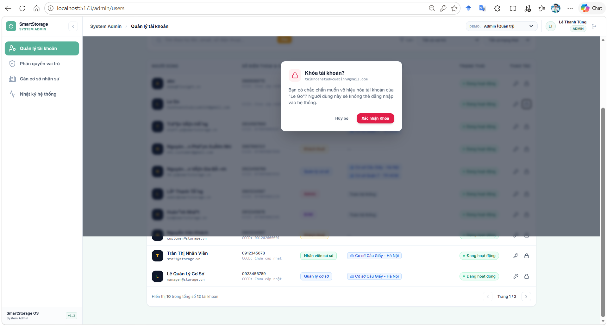
- **Ghi chú gốc từ Lead Dev:**  
  > *"UI/UX bị lỗi overlap"* — `[ĐÃ FIX]`
- **Kết quả đã xử lý (PR branch `fix/modal-backdrop-clipping`):**
  1. *Tạo shared Modal component với React Portal:* `frontend/src/components/ui/Modal.tsx` sử dụng `createPortal` để render trực tiếp vào `document.body`, đảm bảo backdrop che phủ 100% viewport.
  2. *Tạo reusable ConfirmDialog component:* `frontend/src/components/ui/ConfirmDialog.tsx` cho các thao tác confirm với variant (danger/success/info).
  3. *Lock body scroll khi modal mở:* Sử dụng `useEffect` để khóa `document.body.style.overflow = 'hidden'` khi modal active.
  4. *Hỗ trợ Escape key đóng modal:* Thêm event listener cho phím Escape.
  5. *Update các modal:* `AdminUsersPage.tsx`, `UserRoleModal.tsx`, `CreateUserModal.tsx` sử dụng portal-based modals.
- **Mô tả kỹ thuật chuẩn hóa:**  
  * **Tên vấn đề:** Lớp phủ mờ (Backdrop / Overlay) của Modal xác nhận *"Khóa tài khoản?"* bị giới hạn chiều cao (clipping) và không che phủ toàn màn hình, để lộ Header, Sidebar và 2 hàng cuối của Table vẫn sáng rõ và tương tác được.
  * **Hiện trạng ghi nhận trên UI (`image-14.png`):**  
    1. Khi Admin nhấn icon ổ khóa tại dòng người dùng `Le Go`, Modal *"Khóa tài khoản? taikhoanstudycuabinh@gmail.com"* xuất hiện ở giữa màn hình.  
    2. Lớp phủ đen bán trong suốt (backdrop) bị lỗi CSS nghiêm trọng:  
       - **Phía trên:** Không che phủ được thanh Header trên cùng (`System Admin > Quản lý tài khoản`, profile dropdown).  
       - **Bên trái:** Toàn bộ Sidebar menu xanh lá cây nằm nổi lên trên lớp backdrop.  
       - **Phía dưới:** Lớp phủ bị cắt ngang đột ngột ở hàng số 8. Hai hàng dữ liệu số 9 và 10 (`Trần Thị Nhân Viên`, `Lê Quản Lý Cơ Sở`) cùng thanh phân trang chân trang (`Hiển thị 10 trong tổng số 12 tài khoản`) hoàn toàn nằm ngoài backdrop, vẫn hiển thị sáng rõ và người dùng vẫn có thể nhấp chuột thao tác được phía sau modal đang mở.
  * **Nguyên nhân gốc rễ (Root Cause):**  
    Modal và Backdrop không được render ra ngoài thẻ `<body>` thông qua **React Portal** (`createPortal`), mà được đặt trực tiếp bên trong một thẻ `div` con có thuộc tính `position: relative` hoặc có `overflow: hidden / auto` và chiều cao cố định. Khi đó `position: fixed` hoặc `absolute` của backdrop chỉ ăn theo kích thước của thẻ cha hoặc bị stacking context / z-index thấp hơn Header và Sidebar.
  * **Hành vi kỳ vọng (Expected Behavior):**  
    1. Modal và Backdrop phải được render bằng **React Portal** gắn thẳng vào `document.body` (`id="modal-root"`).  
    2. Lớp Backdrop sử dụng `fixed inset-0 z-50 bg-black/50 backdrop-blur-sm`, đảm bảo che phủ 100% viewport của màn hình (trùm kín cả Header, Sidebar và toàn bộ Table chân trang).  
    3. Khóa cuộn trang (`body { overflow: hidden }`) khi modal đang mở và vô hiệu hóa toàn bộ tương tác bên dưới cho đến khi người dùng chọn *"Hủy bỏ"* hoặc *"Xác nhận Khóa"*.
  * **Hướng xử lý & File liên quan:**  
    - Frontend: `Modal.tsx` / `ConfirmDialog.tsx`, `LockUserModal.tsx`, `AdminUserManagementPage.tsx`.

#### 15. [ĐÃ FIX] Thiếu bản ghi Audit Log thời gian thực cho sự kiện Đăng ký / Đăng nhập mới và thiếu kịch bản kiểm thử Đăng nhập thất bại (`SA-04`, `US-SA-04.1`)
- **Hình ảnh minh chứng:**  
  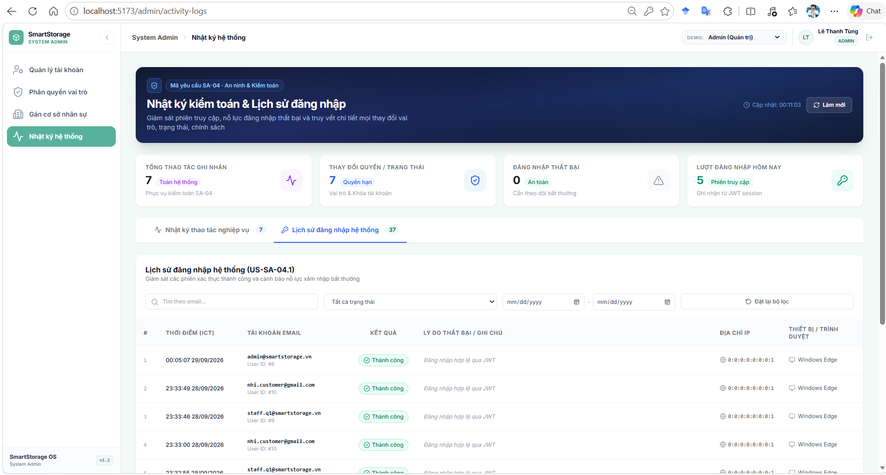
- **Ghi chú gốc từ Lead Dev:**  
  > *"Không thấy log tài khoản mới đăng ký đăng nhập/ chưa có demo thất bại (và xử lý thế nào ? có ghi lỗi thất bại không ?)"* — `[ĐÃ FIX]`
- **Kết quả đã xử lý (PR branch `fix/T3.15-admin--audit-log`):**
  1. *Ghi login khi đăng ký:* Thêm `auditLogService.recordLogin()` trong `AuthServiceImpl.register()` để ghi nhận khi tài khoản mới đăng ký thành công.
  2. *Seed data login history:* Tạo `V33__seed_login_history.sql` với dữ liệu demo bao gồm:
     - Lịch sử đăng nhập thành công cho admin, BOM, manager, staff, customer
     - Demo đăng nhập thất bại (sai mật khẩu) cho các tài khoản
     - Demo tấn công brute-force với email không tồn tại (hacker@evil.com, fake@scam.net)
- **Mô tả kỹ thuật chuẩn hóa:**  
  * **Tên vấn đề:** Màn hình Nhật ký hệ thống (`/admin/activity-logs`) không ghi nhận log thời gian thực khi có tài khoản mới đăng ký hoặc đăng nhập; đồng thời chỉ số *"Đăng nhập thất bại"* bằng 0 do thiếu cơ chế ghi nhận và kịch bản demo cảnh báo xâm nhập / đăng nhập sai mật khẩu.
  * **Hiện trạng ghi nhận trên UI (`image-15.png`):**  
    1. *Không có log tài khoản mới:* Ở các bước trước (Lỗi 11 & 12), tester đã tạo tài khoản mới `AB abc` / `taikhoanstudycuabinh@gmail.com` và đăng nhập vào hệ thống. Tuy nhiên trên bảng *Lịch sử đăng nhập hệ thống*, hoàn toàn không có bất kỳ dòng log nào ghi nhận phiên truy cập hay sự kiện đăng ký của tài khoản mới này. Bảng chỉ hiển thị các log mock tĩnh cũ của các tài khoản `admin@smartstorage.vn`, `nhi.customer@gmail.com`, `staff.q1@smartstorage.vn`.  
    2. *Chỉ số Đăng nhập thất bại luôn bằng 0:* Thẻ thống kê hiển thị: `ĐĂNG NHẬP THẤT BẠI: 0 (An toàn)`. Hệ thống chưa có cơ chế bắt sự kiện khi người dùng nhập sai mật khẩu hoặc cố tình đăng nhập vào tài khoản đã bị khóa, dẫn đến không có dữ liệu audit log để chứng minh tính năng an ninh kiểm toán (`SA-04`).
  * **Nguyên nhân gốc rễ (Root Cause):**  
    1. API Đăng ký (`/api/auth/register`) và Đăng nhập (`/api/auth/login`) chưa gắn Interceptor / Event Listener (hoặc `AuthenticationFailureListener`, `AuthenticationSuccessEvent`) để bất đồng bộ ghi bản ghi vào bảng `audit_log` / `login_history`.  
    2. Frontend trang `/admin/activity-logs` có thể đang hiển thị dữ liệu giả lập (mock data cứng) thay vì gọi API thực từ Backend.
  * **Hành vi kỳ vọng (Expected Behavior):**  
    1. *Ghi nhận thời gian thực:* Ngay khi bất kỳ tài khoản nào đăng ký thành công hoặc đăng nhập hợp lệ: Backend Spring Security Event Listener tự động ghi 1 bản ghi vào `login_history` với đầy đủ: Thời điểm (ICT), Email, Kết quả (`Thành công`), IP máy trạm, User-Agent.  
    2. *Kịch bản Đăng nhập thất bại & Cảnh báo an ninh:*  
       - Khi người dùng nhập sai mật khẩu hoặc tài khoản bị khóa: Hệ thống bắt buộc ghi bản ghi với Kết quả: `Thất bại`, Lý do: `Sai mật khẩu` hoặc `Tài khoản đang bị khóa tạm thời`.  
       - Tăng biến đếm thẻ `ĐĂNG NHẬP THẤT BẠI` (đổi màu badge cảnh báo nếu vượt ngưỡng cảnh báo xâm nhập, ví dụ 5 lần liên tiếp).  
       - Bổ sung tài khoản test có sẵn một số lượt đăng nhập thất bại trong seed data để phục vụ demo nghiệm thu tính năng `SA-04`.
  * **Hướng xử lý & File liên quan:**  
    - Backend: `CustomAuthenticationFailureHandler.java`, `AuthenticationSuccessListener.java`, `AuditLogService.java`, `AuditLogRepository.java`.  
    - Frontend: `ActivityLogsPage.tsx`, `LoginHistoryTab.tsx`.

---

### 2.3. Giao diện Ban Giám đốc (BOM - Board of Management)

#### 16. [Bỏ qua, và ưu tiên sửa các lỗi khác trước] Thiếu kiểm tra hợp lệ dữ liệu (Validation) định dạng và tính duy nhất của Mã cơ sở lưu trữ (`BM-01`)
- **Hình ảnh minh chứng:**  
  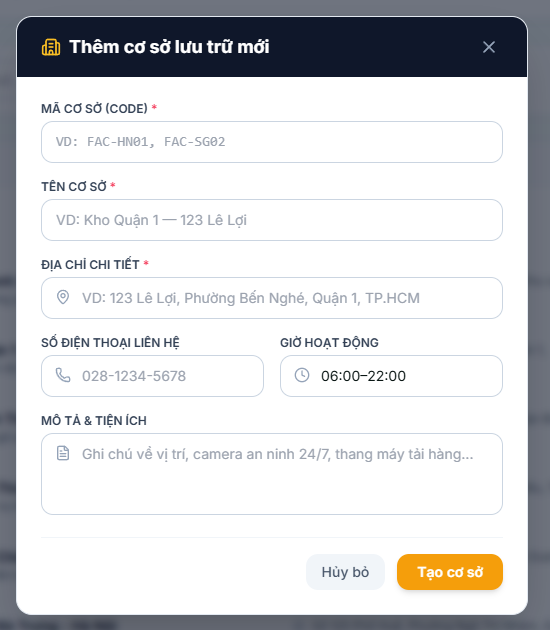
- **Ghi chú gốc từ Lead Dev:**  
  > *"Chưa validate mã cơ sở, đặt đại cũng được"*  
  > *(Ghi chú ưu tiên: Bỏ qua, và ưu tiên sửa các lỗi khác trước)*
- **Mô tả kỹ thuật chuẩn hóa:**  
  * **Tên vấn đề:** Trường `MÃ CƠ SỞ (CODE) *` trong modal *"Thêm cơ sở lưu trữ mới"* hoàn toàn thiếu validation định dạng chuẩn (Regex pattern) và kiểm tra tính duy nhất (Uniqueness) trên cả Frontend lẫn Backend, dẫn đến việc người dùng nhập tùy tiện bất kỳ ký tự nào cũng lưu thành công vào cơ sở dữ liệu.
  * **Hiện trạng ghi nhận trên UI (`image-16.png`):**  
    1. Form tạo cơ sở có gợi ý placeholder: `VD: FAC-HN01, FAC-SG02`. Tuy nhiên, khi nhập vào ô `MÃ CƠ SỞ (CODE)`, hệ thống không có bất kỳ ràng buộc nào: người dùng có thể nhập chữ thường (`fac-01`), chứa dấu cách, chứa ký tự đặc biệt rác (`@#$%`), hoặc mã chỉ có 1-2 ký tự tùy hứng mà form vẫn bật sáng nút *"Tạo cơ sở"* màu cam và cho phép submit bình thường.  
    2. Nếu nhập một mã cơ sở đã tồn tại trong hệ thống, giao diện không có thông báo trùng lặp tại chỗ mà đẩy lỗi 500 hoặc lưu đè dữ liệu.  
    3. Các trường phụ trợ như `SỐ ĐIỆN THOẠI LIÊN HỆ` và `GIỜ HOẠT ĐỘNG` cũng chưa có regex kiểm tra số điện thoại hợp lệ (10 số) và khung giờ làm việc (`HH:mm–HH:mm`).
  * **Nguyên nhân gốc rễ (Root Cause):**  
    - Frontend: Thiếu schema validation (Zod / Yup / React Hook Form regex rules) trên trường `facilityCode`.  
    - Backend: DTO `CreateFacilityRequest` thiếu annotation `@Pattern(regexp = "^FAC-[A-Z0-9]{2,6}$")` và thiếu logic kiểm tra `facilityRepository.existsByCode(code)`.
  * **Hành vi kỳ vọng (Expected Behavior):**  
    1. *Ràng buộc định dạng chuẩn:* Bắt buộc mã cơ sở phải tuân thủ chuẩn hệ thống: bắt đầu bằng tiền tố `FAC-`, tiếp theo là 2-6 ký tự chữ in hoa hoặc số (ví dụ: `FAC-HN01`, `FAC-SG02`). Frontend tự động chuyển ký tự nhập thành chữ hoa (uppercase) và chặn nhập khoảng trắng/ký tự đặc biệt.  
    2. *Validation tức thì (Real-time feedback):* Hiển thị dòng cảnh báo đỏ ngay dưới ô input nếu sai định dạng: *"Mã cơ sở phải có định dạng FAC-XXXX (chữ in hoa và số, từ 6-10 ký tự)"*.  
    3. *Chống trùng lặp (Unique Check):* Backend trả về HTTP `409 Conflict` nếu mã cơ sở đã tồn tại, Frontend hiển thị: *"Mã cơ sở này đã được sử dụng, vui lòng chọn mã khác"*.
  * **Hướng xử lý & File liên quan:**  
    - Frontend: `AddFacilityModal.tsx` (thêm regex validation, uppercase transform, thông báo lỗi field-level).  
    - Backend: `CreateFacilityRequest.java` (`@Pattern`, `@NotBlank`), `FacilityService.java` (kiểm tra `existsByCode`).

#### 17. [Bỏ qua, và ưu tiên sửa các lỗi khác trước] Tính năng "In ấn / PDF" báo cáo tài chính hoạt động sai bản chất (In nguyên xi popup modal thay vì xuất biểu mẫu báo cáo A4 hoàn chỉnh)
- **Hình ảnh minh chứng:**  
  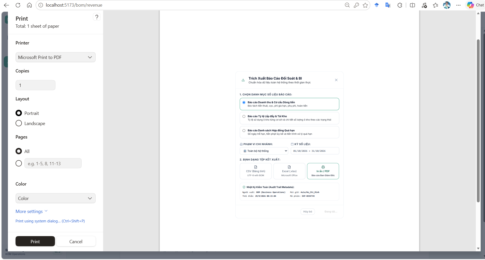
- **Ghi chú gốc từ Lead Dev:**  
  > *"In ấn còn sơ sài"*  
  > *(Ghi chú ưu tiên: Bỏ qua, và ưu tiên sửa các lỗi khác trước)*
- **Mô tả kỹ thuật chuẩn hóa:**  
  * **Tên vấn đề:** Tại màn hình Báo cáo Doanh thu (`/bom/revenue`), khi người dùng chọn định dạng xuất *"In ấn / PDF (Báo cáo Ban Giám Đốc)"*, hệ thống kích hoạt lệnh in mặc định của trình duyệt (`window.print()`) trực tiếp trên màn hình hiện tại mà không có CSS `@media print` hay template in riêng, dẫn đến việc hộp thoại in hiển thị nguyên xi cái **cửa sổ Modal cấu hình xuất tệp** trôi nổi giữa trang giấy trắng tinh thay vì xuất ra mẫu biểu báo cáo tài chính hoàn chỉnh.
  * **Hiện trạng ghi nhận trên UI (`image-17.png`):**  
    1. Hộp thoại in của hệ điều hành (`Microsoft Print to PDF`) hiển thị bản xem trước trang in: hoàn toàn không có bất kỳ số liệu doanh thu, biểu đồ hay bảng biểu nào; nội dung trang in chính là ảnh chụp của chiếc popup *"Trích Xuất Báo Cáo Đối Soát & BI"* với các nút radio chọn loại báo cáo và nút định dạng tệp.  
    2. Đây là lỗi về mặt hoàn thiện tính năng in ấn báo cáo quản trị: tính năng này chưa dùng được trong thực tế để trình ký hay lưu trữ hồ sơ tài chính doanh nghiệp.
  * **Nguyên nhân gốc rễ (Root Cause):**  
    Nút *"In ấn / PDF"* trong modal được gắn trực tiếp sự kiện `window.print()` khi modal vẫn đang mở, đồng thời hệ thống hoàn toàn thiếu file CSS quy định giao diện in (`@media print`) để ẩn các thành phần UI web (sidebar, header, modal overlay) và hiển thị bố cục trang in chuyên nghiệp.
  * **Hành vi kỳ vọng (Expected Behavior):**  
    1. *Mẫu biểu Báo cáo Quản trị chuyên nghiệp:* Khi nhấn *"In ấn / PDF"*, hệ thống phải kết xuất một mẫu biểu in A4 chuẩn mực dành riêng cho Ban Giám Đốc, bao gồm:  
       - Header công ty: Logo SmartStorage, Tên đơn vị, Ngày giờ lập báo cáo, Kỳ đối soát (`01/10/2026 -> 31/10/2026`), Phạm vi chi nhánh.  
       - Bảng tóm tắt chỉ số KPIs: Tổng doanh thu, Doanh thu tiền thuê kho thực tế, Tiền cọc đang giữ, Doanh thu phụ phí & phạt quá hạn, Khoản hoàn trả cọc.  
       - Bảng phân bổ chi tiết theo từng cơ sở (Cầu Giấy, Quận 7...).  
       - Phần chân trang pháp lý: Chữ ký người lập biểu và Giám đốc điều hành phê duyệt.  
    2. *Kỹ thuật in ấn:* Sử dụng CSS `@media print` che giấu modal/web chrome để in trực tiếp trang báo cáo đẹp mắt, hoặc Backend cung cấp API kết xuất ra file PDF chuẩn (qua thư viện JasperReports/iText/Puppeteer) để tải trực tiếp về máy.
  * **Hướng xử lý & File liên quan:**  
    - Frontend: `ExportReportModal.tsx`, `PrintableRevenueReport.tsx`, `print.css` (bổ sung CSS `@media print`).  
    - Backend: `ReportController.java`, `PdfExportService.java` (nếu xuất PDF trực tiếp từ server).

#### 18. [Bỏ qua, và ưu tiên sửa các lỗi khác trước] Nhầm lẫn tai hại trên giao diện: Đặt nhãn "Quy định trả kho: Báo trước 30 ngày" thay vì "Thời hạn khóa quyền gia hạn hợp đồng" (`BR-REN-02` vs Quy trình Trả kho)
- **Hình ảnh minh chứng:**  
  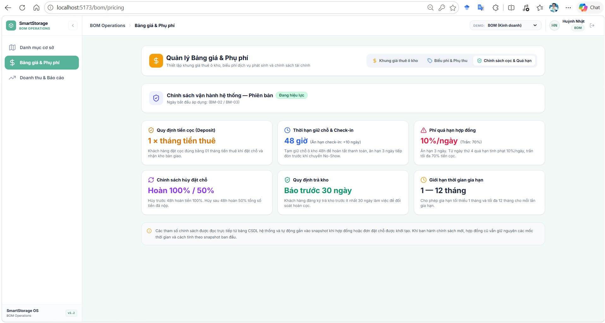
- **Ghi chú gốc từ Lead Dev:**  
  > *"Không có quy định báo trước trả kho mà là gia hạn trước 30 ngày mới đúng"*  
  > *(Ghi chú ưu tiên: Bỏ qua, và ưu tiên sửa các lỗi khác trước)*
- **Mô tả kỹ thuật chuẩn hóa:**  
  * **Tên vấn đề:** Thẻ chính sách số 5 trên màn hình Cấu hình Bảng giá & Phụ phí (`/bom/pricing`) hiển thị sai lệch bản chất nghiệp vụ: Ghi *"Quy định trả kho: Báo trước 30 ngày"* (Khách hàng đăng ký trả kho trước ít nhất 30 ngày làm việc để đối soát hoàn cọc), gây nhầm lẫn trầm trọng giữa quy trình Trả kho và quy tắc Khóa quyền gia hạn hợp đồng.
  * **Hiện trạng ghi nhận trên UI (`image-18.png`):**  
    1. Thẻ số 5 hiển thị dòng chữ to màu xanh lá: `Báo trước 30 ngày` dưới tiêu đề `Quy định trả kho`.  
    2. Theo toàn bộ tài liệu đặc tả nghiệp vụ (`TOPIC.md`, `BUSINESS-RULES.md` và các quy tắc đã chuẩn hóa tại Lỗi 8, 9, 10): **Hệ thống hoàn toàn KHÔNG CÓ quy định nào bắt khách hàng phải báo trước 30 ngày mới được trả kho**. Khách thuê có thể bấm nút *"Báo trả kho"* bất kỳ lúc nào trong thời hạn hợp đồng `ACTIVE`, sau đó nhân viên sẽ kiểm tra và hoàn cọc trong vòng 3 ngày làm việc.  
    3. Mốc **"Trước 30 ngày"** thực chất là **Thời hạn khóa quyền gia hạn hợp đồng (Renewal Cutoff Window)**: Nếu hợp đồng còn dưới 30 ngày là hết hạn (hoặc đã quá hạn), nút Gia hạn sẽ bị khóa cứng vĩnh viễn, khách không được gia hạn tiếp mà bắt buộc phải ký hợp đồng mới. Việc ghi tiêu đề "Quy định trả kho" là sự nhầm lẫn khái niệm tai hại, làm sai lệch nhận thức vận hành của Ban Giám Đốc và nhân viên.
  * **Hành vi kỳ vọng (Expected Behavior):**  
    1. *Điều chỉnh đúng thẻ chính sách:* Sửa đổi tiêu đề và nội dung thẻ số 5 thành:  
       - **Tiêu đề:** `Thời hạn khóa quyền gia hạn (Renewal Cutoff)`  
       - **Giá trị nổi bật:** `Trước 30 ngày`  
       - **Mô tả diễn giải:** *"Khách hàng chỉ được phép gia hạn khi thời hạn hợp đồng còn từ 30 ngày trở lên. Khi còn dưới 30 ngày hoặc quá hạn, tính năng gia hạn sẽ tự động bị khóa, khách buộc phải ký hợp đồng mới nếu muốn tiếp tục thuê ô kho."*  
    2. *(Tùy chọn) Bổ sung thẻ Quy định trả kho chuẩn:* Nếu cần hiển thị chính sách trả kho, ghi rõ: `Quy định trả kho: Linh hoạt 24/7` - *"Khách có thể tạo yêu cầu trả kho bất cứ lúc nào khi hợp đồng đang hoạt động; hoàn tất đối soát và hoàn cọc trong 3 ngày làm việc sau khi nghiệm thu kho."*
  * **Hướng xử lý & File liên quan:**  
    - Frontend: `PricingPolicyManagementPage.tsx`, `PolicySummaryCards.tsx` (sửa nhãn thẻ và mô tả).  
    - Tài liệu: Đối soát với bảng tham số trong `docs/BUSINESS-RULES.md` (`BR-REN-02`).

#### 19. Lỗi logic cập nhật bảng giá nghiêm trọng: Nghịch lý đơn giá theo m² vs giá thuê trọn gói, cho phép chọn ngày hiệu lực quá khứ, kẹt trạng thái "Chưa áp dụng" và thiếu Audit Trail (`BM-02`, `BM-03`, `BR-PRI-01`)
- **Hình ảnh minh chứng:**  
  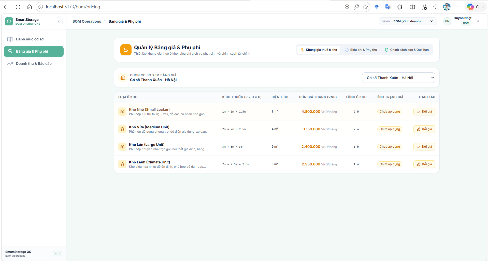
- **Ghi chú gốc từ Lead Dev:**  
  > *"Chọn cập nhật giá trước ngày hôm nay được (sai logic không thể cập nhật giá quá khứ); mà cập nhật giá vào ngày hôm nay thì tình trạng này vẫn không được thay đổi; không có chỗ để xem lịch sử cập nhật hoặc phiên bản các hợp đồng khác nhau; thiếu thông tin cập nhật các trường khác nữa như cập nhật mức phí phạt, số giờ khóa chờ thanh toán, gia hạn chưa bao nhiêu tháng, mà cập nhật giá theo unit nhưng mà là theo đơn vị giá / m2 chứ không phải giá tổng thuê bao nhiêu một tháng ( sai logic nặng )"*
- **Mô tả kỹ thuật chuẩn hóa:**  
  * **Tên vấn đề:** Màn hình Quản lý Bảng giá (`/bom/pricing`) mắc hàng loạt sai sót logic tài chính: Nghịch lý đơn giá (kho nhỏ 1 m² giá 4.800.000 đ/tháng cao gấp 4 lần kho vừa 4 m² giá 1.150.000 đ/tháng do nhầm lẫn giữa đơn giá/m² và tổng giá thuê); cho phép chọn ngày hiệu lực trong quá khứ; cập nhật giá ngày hiện tại nhưng trạng thái vẫn kẹt ở "Chưa áp dụng"; thiếu màn hình xem lịch sử phiên bản giá và thiếu form cấu hình các tham số vận hành.
  * **Hiện trạng ghi nhận trên UI (`image-19.png`):**  
    1. *Nghịch lý giá thuê phi lý:* Cột `ĐƠN GIÁ THÁNG (VND)` hiển thị:  
       - `Kho Nhỏ (1 m²)`: `4.800.000 VND/tháng`  
       - `Kho Vừa (4 m²)`: `1.150.000 VND/tháng`  
       - `Kho Lớn (9 m²)`: `2.400.000 VND/tháng`  
       Kho 1 m² đắt gấp đôi kho 9 m²! Nguyên nhân do hệ thống không thống nhất giữa **đơn vị giá / m²** và **giá thuê trọn gói của ô kho**. Theo chuẩn nghiệp vụ, BOM chỉ niêm yết đơn giá chuẩn theo mét vuông (`VNĐ/m²/tháng`) cho từng phân khúc cơ sở, sau đó giá thuê ô kho tự động tính bằng: $\text{Đơn giá/m²} \times \text{Diện tích}$.  
    2. *Cho phép chọn ngày hiệu lực ở quá khứ:* Modal "Đổi giá" không chặn lịch quá khứ, người dùng có thể chọn áp dụng giá từ những ngày trước (vi phạm nghiêm trọng nguyên tắc kế toán tài chính).  
    3. *Trạng thái kẹt "Chưa áp dụng":* Khi BOM cập nhật giá mới có hiệu lực từ chính ngày hôm nay, cột `TÌNH TRẠNG GIÁ` vẫn hiển thị badge cam `Chưa áp dụng` thay vì tự động chuyển sang `Đang áp dụng`.  
    4. *Thiếu Lịch sử phiên bản giá (Price Versioning / History):* Không có giao diện xem lịch sử điều chỉnh giá theo thời gian để kiểm toán ai đã đổi giá, đổi lúc nào và các mức giá cũ là bao nhiêu.  
    5. *Thiếu form cấu hình tham số chính sách vận hành:* Màn hình chỉ cho đổi giá thuê, không có giao diện cấu hình: tỷ lệ phạt quá hạn (%/ngày), số giờ giữ chỗ thanh toán (48h), thời gian gia hạn tối thiểu/tối đa (1-12 tháng).
  * **Nguyên nhân gốc rễ (Root Cause):**  
    - Dữ liệu seed và model tính giá gán nhầm giá trị tuyệt đối thay vì tính theo `unitPricePerM2 * area`.  
    - DatePicker thiếu ràng buộc `minDate = today`.  
    - Logic kích hoạt giá thiếu trigger kiểm tra: `effectiveDate <= currentDate -> status = ACTIVE`.
  * **Hành vi kỳ vọng (Expected Behavior):**  
    1. *Thống nhất đơn vị tính giá:* BOM cấu hình `Đơn giá (VNĐ/m²/tháng)`, bảng hiển thị rõ ràng 2 cột: `Đơn giá chuẩn (VNĐ/m²)` và `Giá thuê niêm yết/tháng (= Đơn giá x Diện tích)`. Seed lại giá chuẩn hợp lý (Kho nhỏ 1m² ~ 450.000 đ/tháng; Kho vừa 4m² ~ 1.200.000 đ/tháng; Kho lớn 9m² ~ 2.400.000 đ/tháng).  
    2. *Chặn chọn ngày quá khứ:* DatePicker khóa tất cả các ngày trước hôm nay. Nếu ngày hiệu lực là ngày hôm nay: trạng thái chuyển ngay sang `Đang áp dụng` màu xanh lá.  
    3. *Bổ sung Drawer/Modal xem Lịch sử đổi giá:* Hiển thị các phiên bản giá cũ, ngày áp dụng và người phê duyệt.  
    4. *Bổ sung form cấu hình tham số:* Mở chức năng cho phép BOM cập nhật các chỉ số chính sách tại tab *"Chính sách cọc & Quá hạn"*.
  * **Hướng xử lý & File liên quan:**  
    - Frontend: `PricingTable.tsx`, `UpdatePriceModal.tsx`, `PricingPolicyManagementPage.tsx`.  
    - Backend: `PriceService.java`, `UnitTypePriceHistory.java`, `PolicyConfigController.java`.

#### 20. Lỗi không tải được dữ liệu báo cáo vận hành & hiệu suất lấp đầy ô kho (Tất cả chỉ số KPIs hiển thị 0 và 0/0 ô kho) (`BM-04`, `US-BM-04.1`)
- **Hình ảnh minh chứng:**  
  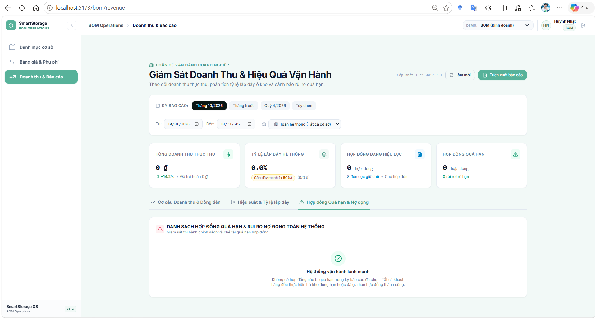
- **Ghi chú gốc từ Lead Dev:**  
  > *"Chưa load dữ liệu lên, lỗi “hiệu suất & tỷ lệ lấp đầy”"*
- **Mô tả kỹ thuật chuẩn hóa:**  
  * **Tên vấn đề:** Màn hình Giám sát Doanh thu & Hiệu quả Vận hành (`/bom/revenue`) không load được dữ liệu từ API hoặc bị sai lệch bộ lọc: Tất cả các thẻ chỉ số cốt lõi (`Tổng doanh thu`, `Tỷ lệ lấp đầy`, `Hợp đồng đang hiệu lực`) đều hiển thị bằng 0 (`0 đ`, `0.0%`, `0/0 ô`), khiến toàn bộ phân hệ báo cáo của Ban Giám Đốc bị tê liệt.
  * **Hiện trạng ghi nhận trên UI (`image-20.png`):**  
    1. Thẻ `TỔNG DOANH THU THỰC THU`: `0 đ`.  
    2. Thẻ `TỶ LỆ LẤP ĐẦY HỆ THỐNG`: `0.0% (0/0 ô)`. Trong khi hệ thống đã seed nhiều cơ sở và hàng chục ô kho vật lý (ví dụ cơ sở Cầu Giấy, Quận 7, Thanh Xuân), mẫu số tổng số ô kho lại hiển thị là `0`.  
    3. Thẻ `HỢP ĐỒNG ĐANG HIỆU LỰC`: `0 hợp đồng` (nhưng dòng bên dưới lại hiển thị mâu thuẫn "8 đơn cọc giữ chỗ").  
    4. Tab `Hiệu suất & Tỷ lệ lấp đầy`: Biểu đồ trống trơn, không có số liệu render.
  * **Nguyên nhân gốc rễ (Root Cause):**  
    1. *Lệch khoảng thời gian bộ lọc mặc định:* Bộ lọc ngày mặc định trên UI đang chọn `10/01/2026 -> 10/31/2026` (Tháng 10/2026), trong khi dữ liệu mock / seed hợp đồng trong database lại có mốc thời gian ở Tháng 08 và Tháng 09/2026, dẫn đến kết quả query trả về mảng rỗng `[]`.  
    2. API `/api/reports/occupancy` và `/api/reports/revenue` bị thiếu xử lý trường hợp khi người dùng chọn xem toàn bộ chi nhánh (`facilityId = all`).
  * **Hành vi kỳ vọng (Expected Behavior):**  
    1. *Đồng bộ bộ lọc mặc định:* Mặc định chọn mốc thời gian chứa dữ liệu thực tế đang có trong hệ thống (hoặc tự động lấy 30 ngày gần nhất tính đến thời điểm hiện tại).  
    2. *Sửa Backend API báo cáo:* Tính toán chính xác tổng capacity (tổng số ô kho vật lý hiện có trên toàn hệ thống), tỷ lệ ô đang thuê / ô trống, và tổng doanh thu thực thu từ bảng thanh toán.  
    3. *Hiển thị trực quan:* Thẻ `TỶ LỆ LẤP ĐẦY` phải hiển thị đúng phân số thực tế (ví dụ: `8/25 ô - 32%`), tab biểu đồ hiển thị trực quan tỷ trọng lấp đầy và biểu đồ doanh thu theo từng cơ sở.
  * **Hướng xử lý & File liên quan:**  
    - Frontend: `RevenueDashboardPage.tsx`, `OccupancyChartTab.tsx`, `ReportFilterBar.tsx`.  
    - Backend: `ReportService.java`, `ContractRepository.java`, `StorageUnitRepository.java`.

---

### 2.4. Giao diện Quản lý Cơ sở (FM - Facility Manager)

#### 21. [ĐÃ FIX] Bất cập UX điều hướng danh mục loại ô kho, không kích hoạt được trạng thái Loại ô kho và nút "Thêm ô kho vật lý" bị vô hiệu hóa (`FM-01`)
- **Hình ảnh minh chứng:**  
  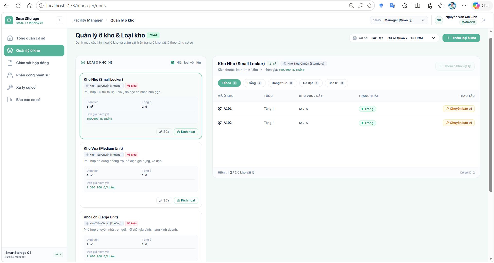
- **Ghi chú gốc từ Lead Dev:**  
  > *"Kéo thả trong khung loai ô kho chứ kéo lên khéo xuống rất khó chịu + Không kích hoạt được các trạng thái của loại ô kho + Không test được thêm ô kho vật lý"* — `[ĐÃ FIX]`
- **Kết quả đã xử lý (PR branch `fix/T3.21-fm--unit-management`):**
  1. *Sửa query UnitTypeRepository:* Đổi từ `JOIN FacilityUnitTypePrice` bắt buộc sang `LEFT JOIN` với điều kiện facilityId để hiển thị tất cả unit types có giá cho facility.
  2. *Sắp xếp active trước:* Query sắp xếp `isActive DESC` để các loại ô kho đang hoạt động hiển thị trước.
- **Mô tả kỹ thuật chuẩn hóa:**  
  * **Tên vấn đề:** Màn hình Quản lý ô kho của Facility Manager (`/manager/units`) gặp 3 vấn đề nghiêm trọng: Cột danh sách loại ô kho cuộn lồng trong khung hẹp gây giật lag và khó thao tác; nút *"Kích hoạt"* loại ô kho không hoạt động; và nút *"+ Thêm ô kho vật lý"* bị vô hiệu hóa (disabled) khiến FM không thể tạo mới ô kho vật lý.
  * **Hiện trạng ghi nhận trên UI (`image-21.png`):**  
    1. *UX cuộn danh sách loại ô kho bất tiện:* Khung bên trái `LOẠI Ô KHO (4)` có chiều cao cố định và thanh cuộn độc lập. Khi xem và kéo danh sách, trang web bị hiện tượng "scroll hijack" (cuộn lồng nhau), giật lag và phải cuộn lên xuống liên tục rất khó chịu.  
    2. *Không kích hoạt được trạng thái Loại ô kho:* Cả 3 loại ô kho (`Kho Nhỏ`, `Kho Vừa`, `Kho Lớn`) đều đang mang badge đỏ `Vô hiệu`. Khi FM bấm vào nút xanh `Kích hoạt`, không có phản hồi nào xảy ra hoặc API báo lỗi, trạng thái không chuyển sang `Hoạt động`.  
    3. *Nút "+ Thêm ô kho vật lý" bị khóa chết:* Nút `+ Thêm ô kho vật lý` ở góc phải bảng chi tiết bị làm mờ (disabled) và không thể nhấp vào. Điều này chặn hoàn toàn luồng nghiệp vụ tạo mới ô kho của Quản lý cơ sở.
  * **Nguyên nhân gốc rễ (Root Cause):**  
    1. Nút `+ Thêm ô kho vật lý` bị disabled do logic điều kiện Frontend: code đang kiểm tra `selectedUnitType.status !== 'ACTIVE'` thì disabled nút thêm ô kho. Nhưng vì Lỗi số 2 (không kích hoạt được loại ô kho), loại kho mãi ở trạng thái `Vô hiệu` $\rightarrow$ kéo theo nút thêm ô kho vật lý bị khóa vĩnh viễn!  
    2. Sự kiện `onClick` của nút *"Kích hoạt"* chưa được gắn API call `PUT /api/unit-types/{id}/status` hoặc Backend từ chối kích hoạt do thiếu dữ liệu liên kết.
  * **Hành vi kỳ vọng (Expected Behavior):**  
    1. *Cải tiến UX Layout:* Tối ưu cột bên trái với chiều cao linh hoạt, hỗ trợ cuộn mượt mà không bị xung đột cuộn trang chính.  
    2. *Sửa nút Kích hoạt:* Khi bấm *"Kích hoạt"*, gọi API chuyển trạng thái loại ô kho sang `ACTIVE`, đổi badge thành `Hoạt động` màu xanh lá.  
    3. *Mở khóa nút Thêm ô kho vật lý:* Khi loại kho đã ở trạng thái `Hoạt động`, nút `+ Thêm ô kho vật lý` sáng lên và khi bấm sẽ mở modal cho phép FM nhập mã ô kho (ví dụ `Q7-A103`), chọn tầng, chọn dãy và lưu vào hệ thống thành công.
  * **Hướng xử lý & File liên quan:**  
    - Frontend: `UnitManagementPage.tsx`, `UnitTypeList.tsx`, `AddStorageUnitModal.tsx`.  
    - Backend: `UnitTypeController.java`, `StorageUnitService.java`.

#### 22. Vi phạm nghiêm trọng phân quyền vai trò (RBAC) & Quy tắc nghiệp vụ `BR-GEN-01`: Màn hình Quản lý cơ sở của FM lại mở ô nhập "Đơn giá niêm yết" khi tạo loại ô kho mới
- **Hình ảnh minh chứng:**  
  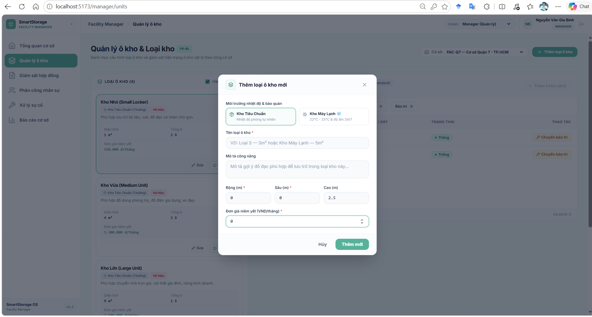
- **Ghi chú gốc từ Lead Dev:**  
  > *"FM không có quyền niêm yết giá trong này, sai logic BR"*
- **Mô tả kỹ thuật chuẩn hóa:**  
  * **Tên vấn đề:** Vi phạm ranh giới phân quyền vai trò (RBAC) giữa FM và BOM: Modal *"Thêm loại ô kho mới"* trên phân hệ của Facility Manager (`/manager/units`) xuất hiện trường nhập liệu `Đơn giá niêm yết (VND/tháng) *`, cho phép FM tự ý định giá kho trái thẩm quyền.
  * **Hiện trạng ghi nhận trên UI (`image-22.png`):**  
    1. Khi Facility Manager mở modal *"Thêm loại ô kho mới"*, bên dưới các trường thông số kỹ thuật (Kích thước Rộng, Sâu, Cao, Môi trường tiêu chuẩn/máy lạnh) lại có trường bắt buộc: `Đơn giá niêm yết (VND/tháng) *` (ô nhập số cho phép FM gõ bất kỳ giá tiền nào).  
    2. Theo chuẩn kiến trúc phân quyền và tài liệu nghiệp vụ (`TOPIC.md § 3`, `BR-GEN-01`): **Ban Giám Đốc (BOM) là vai trò duy nhất có thẩm quyền ban hành bảng giá và niêm yết giá thuê (`BM-02`, `BM-03`)**. FM chỉ có vai trò kỹ thuật vận hành (`FM-01`): khai báo quy cách ô kho, kích thước vật lý, tiện ích bảo quản và giám sát hiện trạng ô kho tại cơ sở mình phụ trách. Việc cho phép FM tự gõ giá niêm yết vi phạm nghiêm trọng tính toàn vẹn của mô hình tài chính.
  * **Nguyên nhân gốc rễ (Root Cause):**  
    Form tạo loại ô kho dùng chung giữa các vai trò hoặc component `AddUnitTypeModal.tsx` không phân nhánh điều kiện theo vai trò người dùng (User Role), để lộ trường `basePrice` / `rentalPrice` cho cả tài khoản FM.
  * **Hành vi kỳ vọng (Expected Behavior):**  
    1. *Ẩn hoàn toàn ô nhập giá trên giao diện FM:* Khi tài khoản FM tạo loại ô kho mới, trường `Đơn giá niêm yết (VND/tháng)` phải bị **LOẠI BỎ HOÀN TOÀN** khỏi form.  
    2. *Cơ chế định giá tự động hoặc Chờ duyệt:*  
       - **Khuyến nghị chuẩn:** Hệ thống tự động tính giá niêm yết dựa trên diện tích quy chuẩn ($R \times S$) nhân với Đơn giá chuẩn theo m² (`base_price_per_m2`) mà BOM đã ban hành cho cơ sở đó.  
       - Loại ô kho mới tạo sẽ hiển thị badge `Chờ BOM duyệt giá` nếu cơ sở chưa có khung giá cho diện tích này.  
    3. Backend API `POST /api/unit-types`: Nếu `currentUser.role == 'FACILITY_MANAGER'`, chặn việc nhận payload giá hoặc bỏ qua trường giá gửi lên từ client.
  * **Hướng xử lý & File liên quan:**  
    - Frontend: `AddUnitTypeModal.tsx` (ẩn field giá khi role là FM).  
    - Backend: `UnitTypeService.java`, `UnitTypeController.java` (bảo vệ quyền định giá độc quyền của BOM).

#### 23. Tính năng "Đổi ô kho ngoại lệ" xuất hiện tùy tiện trên hợp đồng đang thuê bình thường và thiếu liên kết với quy trình xử lý sự cố kỹ thuật (`FM-02`)
- **Hình ảnh minh chứng:**  
  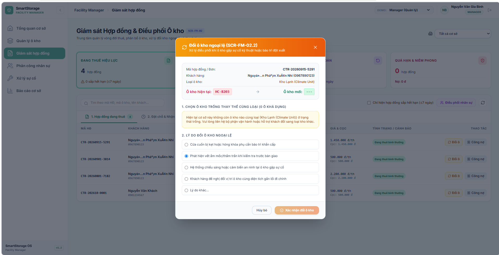
- **Ghi chú gốc từ Lead Dev:**  
  > *"Tự nhiên trong giao diện FM có đổi ô kho ? Cái này phải nằm ở khách hàng chứ và cái này cũng chưa quy định trong BR + hoặc là cái thông báo kia phải chỉnh lai cho FM / logic cần ràng buộc lại đang thuê bình thường nhưng phải có sự cố cần bảo trì mới cho đổi ô kho chứ không thể khơi khơi đổi là đổi được"*
- **Mô tả kỹ thuật chuẩn hóa:**  
  * **Tên vấn đề:** Nút thao tác *"Đổi ô"* xuất hiện đại trà trên tất cả các hợp đồng đang hoạt động bình thường (`ACTIVE`), tiềm ẩn rủi ro FM tự ý can thiệp đổi ô kho mà không có sự cố thực tế hay sự đồng thuận của khách hàng; thiếu cơ chế kiểm tra ô kho thay thế khả dụng và chưa liên kết với biên bản sự cố.
  * **Hiện trạng ghi nhận trên UI (`image-23.png`):**  
    1. Tại bảng danh sách hợp đồng đang thuê bình thường (`CTR-20260915-5291`), cột thao tác luôn hiển thị nút vàng cam: **`Đổi ô`**. Khi bấm vào, modal hiện tiêu đề: *"Đổi ô kho ngoại lệ (SCR-FM-02.2) - Xử lý điều phối khi ô kho gặp sự cố kỹ thuật hoặc bảo trì đột xuất"*.  
    2. *Bất hợp lý về logic:* Khi khách hàng đang thuê và cất đồ bình thường, quản lý cơ sở không có quyền tự tiện bấm đổi ô kho nếu không có yêu cầu từ khách hoặc không có sự cố hư hỏng vật lý nghiêm trọng. Việc để nút "Đổi ô" mở sẵn như một thao tác thông thường là sai bản chất quản lý tài sản của khách thuê.  
    3. *Bị tắc khi không có ô cùng loại:* Section 1 cảnh báo: *"Hiện tại cơ sở này không còn ô kho nào cùng loại (Kho Lạnh (Climate Unit)) ở trạng thái trống. Vui lòng liên hệ bộ phận vận hành hoặc hỗ trợ khách đổi sang loại kho khác."* Hệ thống không có phương án giải quyết linh hoạt (ví dụ đề xuất nâng cấp loại kho tương đương hoặc lập biên bản bồi thường sự cố).
  * **Nguyên nhân gốc rễ (Root Cause):**  
    Nút action `Đổi ô` được render vô điều kiện cho mọi dòng dữ liệu có trạng thái `ACTIVE`, thay vì chỉ kích hoạt khi hợp đồng / ô kho có liên kết với một phiếu báo cáo sự cố chưa xử lý (`INCIDENT_REPORTED`).
  * **Hành vi kỳ vọng (Expected Behavior):**  
    1. *Khóa quyền đổi ô tùy tiện:* Trên danh sách hợp đồng `ACTIVE` bình thường, **ẨN** nút *"Đổi ô"*.  
    2. *Chỉ mở khi có sự cố kỹ thuật xác nhận:* Tính năng "Đổi ô kho ngoại lệ" chỉ được kích hoạt trong 2 trường hợp hợp lệ:  
       - **Trường hợp 1 (Trước khi nhận kho):** Khi nhân viên kiểm tra trước check-in phát hiện ô kho lỗi ẩm mốc/hỏng khóa $\rightarrow$ Cho phép điều phối đổi sang ô kho trống khác cùng loại trước khi bàn giao cho khách.  
       - **Trường hợp 2 (Khi đang thuê phát sinh sự cố):** Ô kho phải có một phiếu sự cố (Incident Ticket) được xác nhận trạng thái `Cần di dời đồ khẩn cấp / Cần bảo trì`. Khi đó hệ thống mới mở luồng đổi ô kèm gửi thông báo xác nhận tự động (SMS / Email / App Notification) đến khách hàng.  
    3. Bổ sung trường hợp cơ sở hết kho cùng loại: Cho phép điều chuyển sang loại kho cao cấp hơn (Upgrade - miễn phụ phí theo chính sách đền bù) với sự phê duyệt của BOM.
  * **Hướng xử lý & File liên quan:**  
    - Frontend: `ContractManagementTable.tsx`, `RelocateUnitModal.tsx`.  
    - Backend: `ContractService.java`, `IncidentTicketService.java`.

#### 24. Nhầm lẫn phân định trách nhiệm vận hành: Nút "Bàn giao" đặt sai trên màn hình Quản lý của FM và tính sai số ngày ân hạn nhận kho (`FM-02` vs `FS-01`, `BR-CAN-04`)
- **Hình ảnh minh chứng:**  
  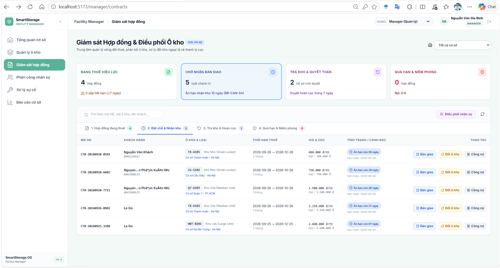
- **Ghi chú gốc từ Lead Dev:**  
  > *"WTF nút bàn giao bị lỗi rồi để đây là gì ? Bàn giao là tính năng của nhân viên đang bị lẫn với FM"*
- **Mô tả kỹ thuật chuẩn hóa:**  
  * **Tên vấn đề:** Phân hệ của Facility Manager (`/manager/contracts`) bị nhầm lẫn tính năng nghiệp vụ với Nhân viên trực quầy (Staff Desk): Xuất hiện nút *"Bàn giao"* trực tiếp trên từng đơn chờ nhận kho; đồng thời nhãn đếm ngược ân hạn tính sai lệch nghiêm trọng (hiển thị `Ân hạn còn 90 ngày` thay vì đếm ngược 10 ngày nhận kho theo `BR-CAN-04`).
  * **Hiện trạng ghi nhận trên UI (`image-24.png`):**  
    1. *Lẫn lộn vai trò FM vs Staff:* Tại tab `2. Đặt chỗ & Nhận kho (5)` của Facility Manager, mỗi đơn check-in đều có nút xanh: **`Bàn giao`**. Thao tác bàn giao ô kho (Check-in, kiểm tra CCCD, chụp ảnh hiện trạng, cấp thẻ từ / mã PIN vật lý cho khách tại chỗ) là trách nhiệm nghiệp vụ trực tiếp của **Nhân viên quầy (Facility Staff - `FS-01`, `FS-02`)**. FM chỉ có vai trò giám sát tiến độ tiếp đón, phân công nhân viên và xử lý ngoại lệ, không làm thay việc check-in trực tiếp của quầy lễ tân.  
    2. *Lỗi tính toán số ngày ân hạn nhận kho phi lý:* Thẻ thống kê phía trên ghi rõ: `Ân hạn nhận kho 10 ngày (BR-CAN-04)`. Tuy nhiên cột *Tình trạng / Cảnh báo* của bảng lại hiển thị các badge: `Ân hạn còn 90 ngày`, `Ân hạn còn 29 ngày`, `Ân hạn còn 87 ngày`... Hệ thống đã lấy thời hạn của toàn bộ hợp đồng (ví dụ 3 tháng = 90 ngày) gán vào ngày ân hạn nhận kho, thay vì đếm ngược số ngày còn lại trong thời hạn 10 ngày cho phép khách đến nhận kho!
  * **Nguyên nhân gốc rễ (Root Cause):**  
    1. Tái sử dụng chung bảng Component của Staff Desk mà không ẩn nút action `Bàn giao` khi người dùng là Quản lý cơ sở (`FM`).  
    2. Công thức tính `daysRemaining` trong badge cảnh báo bị nhầm biến: Code lấy `endDate - currentDate` (số ngày còn lại của hợp đồng thuê) thay vì lấy `checkInDeadline - currentDate` (với `checkInDeadline = startDate + 10 ngày` theo `BR-CAN-04`).
  * **Hành vi kỳ vọng (Expected Behavior):**  
    1. *Điều chỉnh đúng vai trò FM:* Trên giao diện FM, thay nút *"Bàn giao"* bằng nút **"Chi tiết đơn"** hoặc nút **"Điều phối nhân viên tiếp đón"**. Hành động bấm hoàn tất thủ tục bàn giao chỉ xuất hiện tại màn hình của Nhân viên trực quầy (`/staff/check-in`).  
    2. *Sửa công thức đếm ngược ân hạn:* Tính chuẩn xác theo `BR-CAN-04`:  
       $$\text{Số ngày ân hạn còn lại} = (\text{Ngày bắt đầu hợp đồng} + 10\text{ ngày}) - \text{Ngày hiện tại}$$  
       Badge phải hiển thị: `Ân hạn nhận kho còn N ngày` (tối đa 10 ngày). Nếu quá 10 ngày mà khách không đến nhận kho, tự động chuyển cảnh báo sang màu đỏ: `Quá hạn nhận kho (Chờ chuyển No-Show)`.
  * **Hướng xử lý & File liên quan:**  
    - Frontend: `CheckInContractsTab.tsx`, `ContractActionButtons.tsx` (ẩn nút Bàn giao ở role FM, sửa công thức countdown ân hạn 10 ngày).  
    - Backend: `ContractDto.java`, `CheckInService.java`.

#### 25. [ĐÃ FIX — commit `1d5bfff`, PR #175] Lỗ hổng phân quyền dữ liệu (Multi-tenancy / Data Leak): Facility Manager truy cập và điều phối toàn bộ cơ sở toàn quốc thay vì chỉ 2 cơ sở được phân công (`SA-03`, `FM-01`)
- **Hình ảnh minh chứng:**  
  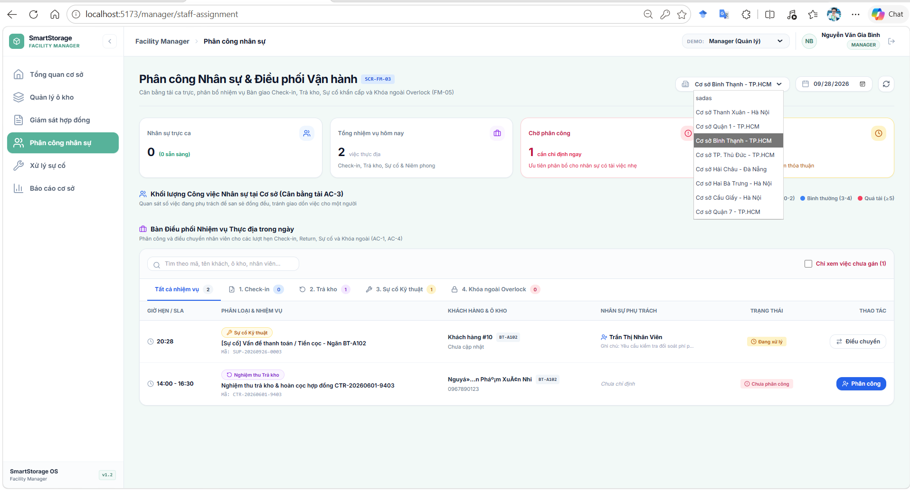
- **Ghi chú gốc từ Lead Dev:**  
  > *"Phân quyền cơ sở có 2 thôi mà bây giờ có thể truy cập full cơ sở luôn ?"*
- **Mô tả kỹ thuật chuẩn hóa:**  
  * **Tên vấn đề:** Dropdown chuyển đổi cơ sở trên phân hệ của Facility Manager (`/manager/staff-assignment`) hiển thị toàn bộ 9 cơ sở trên toàn quốc (kèm cả tên cơ sở rác `sadas`), vi phạm phân quyền dữ liệu cơ sở (`SA-03`) khi tài khoản FM chỉ được cấp quyền phụ trách 2 cơ sở cụ thể.
  * **Hiện trạng ghi nhận trên UI (`image-25.png`):**  
    1. Theo dữ liệu phân quyền Admin (đã thấy ở `image-13.png`), tài khoản FM `Nguyễn Văn Gia Bình` chỉ được System Admin gán quyền quản lý 2 cơ sở: `Cơ sở Cầu Giấy - Hà Nội` và `Cơ sở Quận 7 - TP.HCM`.  
    2. Tuy nhiên tại màn hình Phân công nhân sự, dropdown chọn cơ sở lại mở bung ra toàn bộ 9 cơ sở trên toàn hệ thống (bao gồm cả Bình Thạnh, Thủ Đức, Hải Châu, Hai Bà Trưng, Thanh Xuân và một cơ sở rác tên `sadas`).  
    3. FM này có thể tự ý chọn `Cơ sở Bình Thạnh - TP.HCM` và xem toàn bộ ca trực, can thiệp phân công công việc của nhân viên tại cơ sở khác mà mình hoàn toàn không có thẩm quyền quản lý.
  * **Nguyên nhân gốc rễ (Root Cause):**  
    Dropdown cơ sở gọi API lấy toàn bộ danh mục (`GET /api/facilities`) mà không lọc theo danh sách cơ sở được phân công của user hiện tại (`GET /api/facilities/my-assigned-facilities` hoặc `WHERE f.id IN (SELECT facility_id FROM user_facility_assignment WHERE user_id = :currentUserId)`).
  * **Hành vi kỳ vọng (Expected Behavior):**  
    1. *Lọc cơ sở theo phân quyền thực tế:* Dropdown cơ sở của FM chỉ được phép hiển thị đúng 2 cơ sở mà FM đó phụ trách (`Cầu Giấy` và `Quận 7`). Tuyệt đối không cho phép chọn hoặc chuyển sang cơ sở ngoài phạm vi ủy quyền.  
    2. *Dọn dẹp cơ sở rác:* Xóa bỏ cơ sở test rác `sadas` trong cơ sở dữ liệu.  
    3. *Bảo vệ Backend API:* Mọi API của FM (`/api/manager/*`) bắt buộc phải kiểm tra quyền: Nếu `facilityId` gửi lên không nằm trong danh sách cơ sở được phân công của FM đó, trả về HTTP `403 Forbidden`.
  * **Hướng xử lý & File liên quan:**  
    - Frontend: `FacilityContext.tsx`, `FacilitySelector.tsx`, `StaffAssignmentPage.tsx`.  
    - Backend: `FacilityService.java`, `FacilityRepository.java`, `SecurityUtils.java`.

#### 26. [ĐÃ FIX — commit `1d5bfff`, PR #175] Lỗi State Form điều chuyển nhân sự: Chọn "Khẩn cấp (SLA 2h)" tự động nhảy ngược về "Bình thường" và thiếu đồng hồ đếm ngược vi phạm cam kết SLA (`FM-05`, `BR-SUP-01`)
- **Hình ảnh minh chứng:**  
  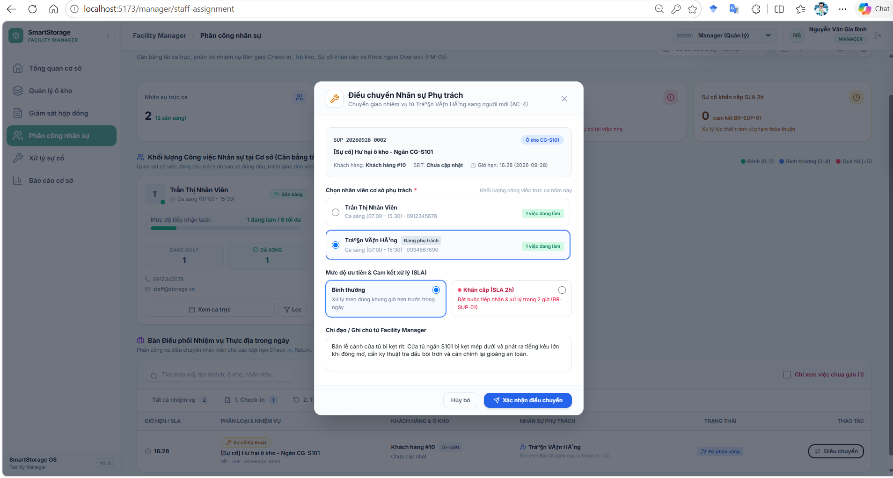
- **Ghi chú gốc từ Lead Dev:**  
  > *"Cơ chế khẩn cấp 2h được chọn tự động nhảy về bình thường + thiếu đồng hồ đếm h theo dõi thời gian phiếu xử lý đó"*
- **Mô tả kỹ thuật chuẩn hóa:**  
  * **Tên vấn đề:** Tại modal *"Điều chuyển Nhân sự Phụ trách"*, khi chọn mức độ ưu tiên `Khẩn cấp (SLA 2h)`, form bị lỗi state tự động nhảy ngược về `Bình thường`; đồng thời giao diện hoàn toàn thiếu đồng hồ đếm ngược theo dõi thời gian xử lý còn lại của cam kết SLA 2 giờ theo `BR-SUP-01`.
  * **Hiện trạng ghi nhận trên UI (`image-26.png`):**  
    1. *Lỗi nhảy radio button:* Trong section *"Mức độ ưu tiên & Cam kết xử lý (SLA)"*, khi người dùng bấm vào radio `Khẩn cấp (SLA 2h) - Bắt buộc tiếp nhận & xử lý trong 2 giờ (BR-SUP-01)`, lựa chọn không giữ được mà lập tức bị reset/nhảy ngược về `Bình thường`.  
    2. *Thiếu đồng hồ đếm ngược SLA (Countdown Timer):* Phiếu sự cố `SUP-20260928-0002` (hư hại bản lề kẹt cửa ô kho `CG-S101`) đã ghi nhận lúc `16:28`. Khi là sự cố khẩn cấp SLA 2 giờ, hệ thống bắt buộc phải có đồng hồ đếm ngược trực quan hiển thị số phút/giây còn lại (ví dụ: `Còn lại 01:14:32 trước khi vi phạm SLA`) để FM và nhân viên trực tiếp nhận biết mức độ cấp bách. Hiện tại chỉ có text tĩnh và thẻ thống kê góc trên hiển thị `0 cam kết BR-SUP-01`.  
    3. *Chuẩn hóa thuật ngữ:* Text trong modal ghi nhận sự cố vẫn còn dùng từ "ngăn S101" / "cánh cửa tủ" $\rightarrow$ cần chuẩn hóa thành "ô kho CG-S101".
  * **Nguyên nhân gốc rễ (Root Cause):**  
    - State của radio button bị conflict với state re-render hoặc `onChange` handler ghi đè lại giá trị default từ prop cũ (`defaultPriority = 'NORMAL'`).  
    - Frontend chưa cài đặt hook tính toán thời gian `useSlaCountdown(reportedAt, slaHours)`.
  * **Hành vi kỳ vọng (Expected Behavior):**  
    1. *Sửa dứt điểm radio button:* Khi chọn `Khẩn cấp (SLA 2h)`, state `priority` phải lưu giá trị `EMERGENCY_2H` vững chắc, viền radio đổi sang màu đỏ nổi bật.  
    2. *Tích hợp đồng hồ đếm ngược SLA:*  
       - Trên bảng danh sách nhiệm vụ và chi tiết phiếu sự cố: Hiển thị badge đồng hồ đếm ngược thời gian thực: `⏱ SLA: Còn 01:28:15` (màu vàng cam).  
       - Nếu còn dưới 30 phút: Đổi sang màu đỏ nhấp nháy.  
       - Nếu quá 2 giờ chưa hoàn tất: Chuyển sang trạng thái `⚠️ ĐÃ VI PHẠM SLA (+15 phút)`.
  * **Hướng xử lý & File liên quan:**  
    - Frontend: `ReassignStaffModal.tsx`, `SlaCountdownBadge.tsx`, `StaffAssignmentPage.tsx`.  
    - Backend: `SupportTicketDto.java` (trả về `slaDeadline`, `isEmergency`).

#### 27. [ĐÃ FIX — commit `1d5bfff`, PR #175] Thao tác "Phân công Nhân sự Cơ sở" bị lỗi API, không lưu được người phụ trách nhiệm vụ thực địa (`FM-05`, `US-FM-05.1 AC-1`)
- **Hình ảnh minh chứng:**  
  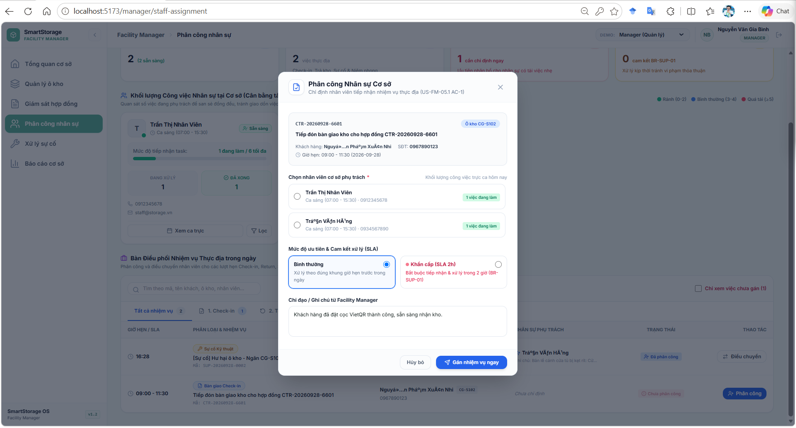
- **Ghi chú gốc từ Lead Dev:**  
  > *"Phân công nhân viên không được luôn và bị lỗi"*
- **Mô tả kỹ thuật chuẩn hóa:**  
  * **Tên vấn đề:** Modal *"Phân công Nhân sự Cơ sở"* (`US-FM-05.1 AC-1`) gặp lỗi khi nhấn nút *"Gán nhiệm vụ ngay"*: Hệ thống báo lỗi hoặc không có phản hồi, dữ liệu nhân viên phụ trách không được lưu vào cơ sở dữ liệu và nhiệm vụ vẫn bị kẹt ở trạng thái "Chưa phân công".
  * **Hiện trạng ghi nhận trên UI (`image-27.png`):**  
    1. Khi Facility Manager mở modal để phân công nhiệm vụ check-in cho hợp đồng `CTR-20260928-6601` (khách `Nguyễn Phạm Xuân Nhi`), danh sách có 2 nhân viên trực ca (`Trần Thị Nhân Viên`, `Trần Văn Hùng`).  
    2. Khi FM chọn nhân viên và bấm nút xanh: **`Gán nhiệm vụ ngay`**, thao tác bị thất bại:  
       - Modal không đóng, hoặc hiển thị lỗi không thể gán.  
       - Trên bảng điều phối phía sau, dòng nhiệm vụ vẫn mang badge đỏ: `Chưa phân công`, cột *Nhân sự phụ trách* vẫn để trống `Chưa chỉ định`.  
    3. Form cũng thiếu validation bắt buộc: Nếu FM chưa chọn nhân viên nào mà đã bấm "Gán nhiệm vụ ngay" thì form vẫn submit và gây ra lỗi `400 Bad Request` hoặc `NullPointerException` từ Backend.
  * **Nguyên nhân gốc rễ (Root Cause):**  
    - Lệch trường dữ liệu giữa Client và Server (DTO mismatch): Client gửi payload `{ taskId, staffId, note }`, nhưng Backend API `POST /api/staff-assignments` lại yêu cầu `{ contractId, assignedUserId, priority, instructions }`.  
    - Client thiếu validate: `selectedStaffId` có thể là `null` khi bấm submit.
  * **Hành vi kỳ vọng (Expected Behavior):**  
    1. *Validation chặt chẽ:* Nút *"Gán nhiệm vụ ngay"* chỉ cho phép bấm khi đã tích chọn 1 nhân viên trong danh sách. Nếu chưa chọn, hiển thị thông báo đỏ: *"Vui lòng chọn nhân viên phụ trách ca trực"*.  
    2. *Thực thi API thành công:* Sau khi bấm gán, Backend cập nhật trạng thái nhiệm vụ sang `ASSIGNED`, gán `assigned_user_id`, lưu ghi chú chỉ đạo. Frontend đóng modal, hiển thị Toast thông báo: *"Phân công nhiệm vụ thành công cho nhân viên [Tên]"*, và cập nhật tức thì trên bảng trạng thái: badge đổi thành `Đã phân công` màu xanh kèm tên nhân sự phụ trách.
  * **Hướng xử lý & File liên quan:**  
    - Frontend: `AssignStaffModal.tsx`, `StaffAssignmentPage.tsx`.  
    - Backend: `StaffAssignmentController.java`, `StaffAssignmentService.java`, `TaskAssignmentRequest.java`.

#### 28. [ĐÃ FIX — commit `1d5bfff`, PR #175] Sai lệch nghiêm trọng quy định xử lý nợ quá hạn: Phân loại tuổi nợ quá hạn "D+11 đến D+30" và "Trên D+30" hoàn toàn trái ngược với Business Rules (`BR-OVD-01`, `BR-OVD-02`, `BR-OVD-03`)
- **Hình ảnh minh chứng:**  
  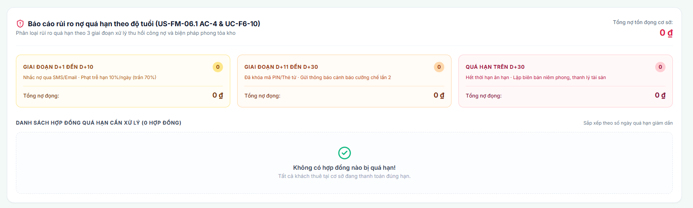
- **Ghi chú gốc từ Lead Dev:**  
  > *"Làm gì có vụ quá hạn trên 30 ngày ?"*
- **Mô tả kỹ thuật chuẩn hóa:**  
  * **Tên vấn đề:** Màn hình Báo cáo rủi ro nợ quá hạn theo độ tuổi (`/manager/overdue-reports`) chia 3 giai đoạn quản lý nợ quá hạn sai hoàn toàn quy tắc nghiệp vụ: Xuất hiện thẻ "Giai đoạn D+11 đến D+30" và "Quá hạn trên D+30", trong khi theo BR hệ thống bắt buộc phải chấm dứt hợp đồng đơn phương và niêm phong kho thanh lý tài sản ngay tại mốc **D+10**.
  * **Hiện trạng ghi nhận trên UI (`image-28.png`):**  
    1. Giao diện báo cáo phân loại rủi ro quá hạn thành 3 thẻ:  
       - `GIAI ĐOẠN D+1 ĐẾN D+10`: "Nhắc nợ qua SMS/Email · Phạt trễ hạn 10%/ngày (trần 70%)"  
       - `GIAI ĐOẠN D+11 ĐẾN D+30`: "Đã khóa mã PIN/Thẻ từ · Gửi thông báo cảnh báo cưỡng chế lần 2"  
       - `QUÁ HẠN TRÊN D+30`: "Hết thời hạn ân hạn · Lập biên bản niêm phong, thanh lý tài sản"  
    2. Lead Dev bức xúc ghi chú: *"Làm gì có vụ quá hạn trên 30 ngày ?"*.  
    3. Theo đúng Business Rules chuẩn đã thống nhất:  
       - Tại **00:00 ngày D+7**: Hệ thống đã tự động khóa quyền truy cập ô kho (Mã PIN / Thẻ từ) theo `overdue.lock_access_days = 7`.  
       - Tại **00:00 ngày D+10**: Tiền phạt chạm trần tối đa 70% tiền cọc (`BR-OVD-02`). Hệ thống bắt buộc tự động **CHẤM DỨT HỢP ĐỒNG ĐƠN PHƯƠNG (`TERMINATED_OVERDUE`)**, tự động tạo lệnh cưỡng chế khóa ngoài (Overlock), lập biên bản niêm phong và chuẩn bị bán đấu giá/thanh lý tài sản tồn kho (`BR-OVD-03`).  
       - **TUYỆT ĐỐI KHÔNG CÓ** trường hợp hợp đồng quá hạn để dây dưa sang ngày D+11 đến D+30 mới cảnh báo lần 2, hoặc để quá hạn trên 30 ngày mới niêm phong!
  * **Hành vi kỳ vọng (Expected Behavior):**  
    Tái cấu trúc 3 giai đoạn phân loại tuổi nợ chuẩn xác theo Business Rules:  
    - **Giai đoạn 1 (D+1 đến D+3):** *Ân hạn nhắc nợ* — Miễn phạt trễ hạn, gửi SMS/Email nhắc nhở thân thiện, khách vẫn được mở cửa dọn đồ.  
    - **Giai đoạn 2 (D+4 đến D+6):** *Tính phạt trễ hạn* — Tính phí phạt 10%/ngày (tối đa 30% cọc), cảnh báo sắp khóa mã PIN vào ngày D+7.  
    - **Giai đoạn 3 (D+7 đến D+10):** *Khóa an ninh & Cảnh báo cưỡng chế* — Đã khóa mã PIN/QR, phạt tiếp đến trần 70% cọc. Nếu không thanh toán nợ trước 23:59 ngày D+10 sẽ bị cưỡng chế niêm phong và tịch thu cọc.  
    - **Mốc D+10+:** Chuyển hẳn sang tab riêng *"Hồ sơ đã chấm dứt & Đang niêm phong thanh lý"*.
  * **Hướng xử lý & File liên quan:**  
    - Frontend: `OverdueRiskReportPage.tsx`, `OverdueAgingCards.tsx`.  
    - Backend: `OverdueScheduledJob.java`, `OverdueReportService.java`.  
    - Docs: `docs/BUSINESS-RULES.md` (`BR-OVD-01`, `BR-OVD-02`, `BR-OVD-03`).

---

### 2.5. Giao diện Nhân viên Vận hành (Staff)

#### 29. [ĐÃ FIX — commit `1d5bfff`, PR #175] Vỡ giao diện thẻ nhiệm vụ sự cố vận hành (thông tin hiển thị trống `---`) và sử dụng thuật ngữ phản cảm "Chờ khám" tại màn hình Tổng quan ca trực của Staff (`FS-01`, `FS-06`)
- **Hình ảnh minh chứng:**  
  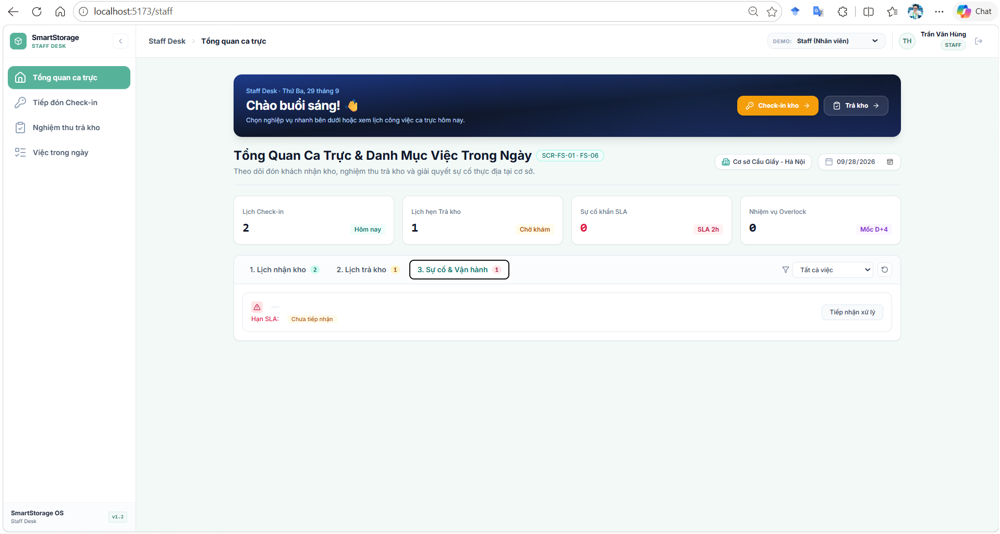
- **Ghi chú gốc từ Lead Dev:**  
  > *"Ghi nhận lỗi lịch hẹn trả kho và sự cố vận hành"*
- **Mô tả kỹ thuật chuẩn hóa:**  
  * **Tên vấn đề:** Màn hình Tổng quan Ca trực của Nhân viên (`/staff`) hiển thị thẻ thống kê lịch trả kho dùng từ ngữ sai ngữ cảnh chuyên môn (`Chờ khám`); đồng thời thẻ công việc trong tab *"3. Sự cố & Vận hành"* bị lỗi render dữ liệu, hiển thị dấu gạch ngang trống rỗng `---` và không có thông tin chi tiết của sự cố.
  * **Hiện trạng ghi nhận trên UI (`image-29.png`):**  
    1. Thẻ thống kê số 2 hiển thị: `Lịch hẹn Trả kho: 1 (Chờ khám)`. Thuật ngữ "Chờ khám" là của ngành y tế, hoàn toàn sai lệch ngữ cảnh vận hành kho bãi lưu trữ (chuẩn ngữ cảnh phải là: *Chờ kiểm tra hiện trạng* hoặc *Chờ nghiệm thu*).  
    2. Tại tab *"3. Sự cố & Vận hành (1)"*, thẻ nhiệm vụ bị vỡ dữ liệu: Icon cảnh báo đỏ kèm dấu gạch ngang rỗng: `[!] ---`, bên dưới ghi `Hạn SLA: Chưa tiếp nhận`. Toàn bộ thông tin cốt lõi (Mã sự cố `SUP-...`, tên ô kho, mô tả lỗi kỹ thuật, tên khách hàng) đều bị mất trắng, khiến nhân viên trực quầy không thể biết đây là sự cố gì để tiếp nhận xử lý.
  * **Nguyên nhân gốc rễ (Root Cause):**  
    Component `StaffTaskCard.tsx` map sai tên trường từ Backend API response (ví dụ đọc `task.title` trong khi DTO trả về `task.ticketSubject` hoặc `task.description`). Nhãn badge gán cứng chuỗi text không phù hợp.
  * **Hành vi kỳ vọng (Expected Behavior):**  
    1. Sửa nhãn thẻ thống kê: `Lịch hẹn Trả kho: 1 (Chờ nghiệm thu)`.  
    2. Sửa render thẻ sự cố: Hiển thị đầy đủ thông tin: Mã phiếu `SUP-20260928-0002`, Tiêu đề `Hư hại bản lề ô kho CG-S101`, Khách hàng `Nguyễn Phạm Xuân Nhi`, Hạn xử lý `SLA 2h: Còn 01:15:00`. Khi bấm nút *"Tiếp nhận xử lý"*, mở form cập nhật tiến độ xử lý sự cố.
  * **Hướng xử lý & File liên quan:**  
    - Frontend: `StaffShiftOverviewPage.tsx`, `StaffTaskCard.tsx`, `StaffTaskTabs.tsx`.  
    - Backend: `StaffTaskDto.java`, `StaffDashboardService.java`.

#### 30. [ĐÃ FIX — commit `6993425`, PR #179] Lỗ hổng phân quyền phạm vi cơ sở của Nhân viên trực quầy (Staff Scope Leak): Nhân viên xem và check-in được cho hàng đợi của toàn bộ cơ sở toàn quốc (`FS-01`, `FS-02`)
- **Hình ảnh minh chứng:**  
  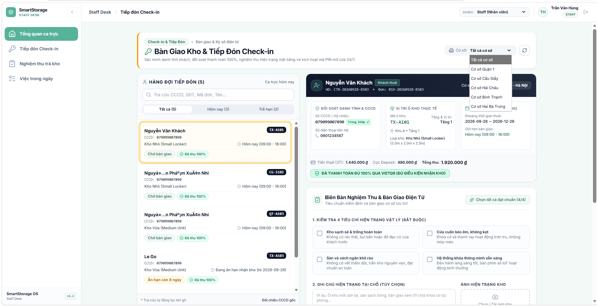
- **Ghi chú gốc từ Lead Dev:**  
  > *"Lỗi phân quyền nhân viên có thể truy cập toàn bộ các cơ sở khác"*
- **Mô tả kỹ thuật chuẩn hóa:**  
  * **Tên vấn đề:** Màn hình Bàn Giao Kho & Tiếp Đón Check-in (`/staff/check-in`) của nhân viên xuất hiện dropdown chọn `Cơ sở: Tất cả cơ sở`, cho phép nhân viên trực quầy xem và can thiệp thủ tục nhận kho của các cơ sở khác trên toàn quốc.
  * **Hiện trạng ghi nhận trên UI (`image-30.png`):**  
    1. Nhân viên quầy trực ca tại Cơ sở Cầu Giấy (hoặc Quận 7).  
    2. Tuy nhiên, góc phải màn hình lại có dropdown: `Cơ sở: Tất cả cơ sở`, và danh sách hiển thị các cơ sở khác (Quận 1, Hải Châu, Bình Thạnh, Hai Bà Trưng...).  
    3. Cột bên trái *"HÀNG ĐỢI TIẾP ĐÓN"* liệt kê lẫn lộn khách hàng của tất cả các cơ sở: `Nguyễn Văn Khách` (ô kho `TX-A101` - Thanh Xuân), `Xuân Nhi` (ô `CG-S102` - Cầu Giấy), `Xuân Nhi` (ô `Q7-A103` - Quận 7), `Le Go` (`TX-A103` - Thanh Xuân).  
    4. Nhân viên tại Cầu Giấy lại có thể ấn chọn khách ở Thanh Xuân và bấm hoàn tất bàn giao điện tử, kích hoạt mã PIN mở cửa cho một ô kho ở cơ sở khác mà mình không hề có mặt thực tế để kiểm tra!
  * **Nguyên nhân gốc rễ (Root Cause):**  
    Tái sử dụng chung hook `useFacility()` của Admin/BOM mà không khóa cứng theo cơ sở ca trực (`activeShift.facilityId`) của nhân viên. API `/api/staff/check-in/queue` không bắt buộc lọc theo `facility_id` của phiên đăng nhập.
  * **Hành vi kỳ vọng (Expected Behavior):**  
    1. *Khóa cứng cơ sở ca trực:* Trên toàn bộ giao diện Staff, **LOẠI BỎ HOÀN TOÀN** dropdown chọn "Tất cả cơ sở". Giao diện chỉ hiển thị cố định badge tên cơ sở duy nhất mà nhân viên đang trực ca hôm đó (ví dụ: `📍 Cơ sở Cầu Giấy - Hà Nội`).  
    2. *Cách ly dữ liệu hàng đợi:* Hàng đợi tiếp đón chỉ tải các đơn nhận kho của chính cơ sở đó (chỉ thấy ô kho `CG-S102`, tuyệt đối không thấy kho `TX-A101` hay `Q7-A103`).  
    3. *Bảo vệ Backend API:* Backend kiểm tra: Nếu nhân viên cố tình gọi check-in cho một hợp đồng thuộc cơ sở khác với ca trực hiện tại, từ chối với HTTP `403 Forbidden`.
  * **Hướng xử lý & File liên quan:**  
    - Frontend: `StaffCheckInPage.tsx`, `StaffQueueList.tsx`, `useStaffShift.ts`.  
    - Backend: `CheckInController.java`, `CheckInService.java`, `SecurityUtils.java`.

#### 31. [ĐÃ FIX — commit `1d5bfff`, PR #175] Màn hình Nghiệm thu trả kho của Staff bị tắc luồng: Màn hình trống rỗng (Empty State) và không cho phép nhân viên tự nhận việc khi khách đến quầy (`FS-03`, `FS-04`)
- **Hình ảnh minh chứng:**  
  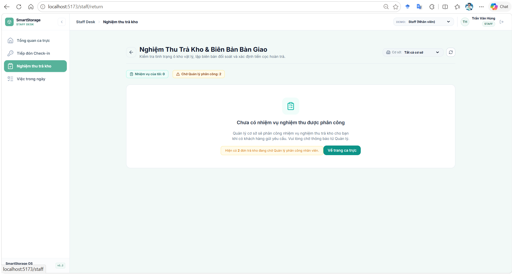
- **Ghi chú gốc từ Lead Dev:**  
  > *"Lỗi trả kho không hiển thị danh sách"*
- **Mô tả kỹ thuật chuẩn hóa:**  
  * **Tên vấn đề:** Tại màn hình Nghiệm thu trả kho (`/staff/return`), nhân viên bị kẹt ở trạng thái trống (*"Chưa có nhiệm vụ nghiệm thu được phân công"*) dù hệ thống có 2 đơn trả kho đang chờ; quy trình phụ thuộc cứng vào việc Quản lý cơ sở phải vào gán việc trước, khiến nhân viên trực quầy không thể tiếp đón khách đến trả kho trực tiếp tại chỗ.
  * **Hiện trạng ghi nhận trên UI (`image-31.png`):**  
    1. Màn hình hiển thị: `Nhiệm vụ của tôi: 0`, `Chờ Quản lý phân công: 2`. Khung chính là hình minh họa trống kèm thông báo: *"Chưa có nhiệm vụ nghiệm thu được phân công. Quản lý cơ sở sẽ phân công nhiệm vụ nghiệm thu trả kho cho bạn khi có khách hàng gửi yêu cầu. Vui lòng chờ thông báo từ Quản lý."*  
    2. Bất cập thực tế: Khi khách hàng đã dọn đồ xong và bước đến quầy lễ tân yêu cầu trả kho ngay lập tức, nếu Quản lý cơ sở đang bận họp hoặc chưa kịp mở máy tính để "gán việc" (nhất là khi tính năng phân công của FM đang bị lỗi API ở Lỗi 27), thì nhân viên trực quầy hoàn toàn bất lực, không thể mở biên bản nghiệm thu cho khách!  
    3. Giao diện thiếu nút để nhân viên bấm vào tab `Chờ Quản lý phân công: 2` và chọn **"Tự nhận việc này"** (Self-claim Task).
  * **Nguyên nhân gốc rễ (Root Cause):**  
    Thiết kế luồng nghiệp vụ bị cứng nhắc: Chỉ cho phép nhân viên xem danh sách task đã được gán trực tiếp (`assignedTo = currentUser.id`), thiếu cơ chế hàng đợi việc chung (Shared Pool) tại cơ sở.
  * **Hành vi kỳ vọng (Expected Behavior):**  
    1. Cho phép nhân viên bấm vào tab/badge `Chờ Quản lý phân công (2)`.  
    2. Hiển thị danh sách các đơn khách đang yêu cầu trả kho tại cơ sở này, kèm nút bấm: **`[Nhận nhiệm vụ này]`**.  
    3. Khi nhân viên bấm nhận việc: Hệ thống tự động gán task cho nhân viên đó, chuyển trạng thái sang `IN_PROGRESS` và mở thẳng biểu mẫu *Biên bản Nghiệm thu & Bàn giao Trả kho* để nhân viên cùng khách đi kiểm tra hiện trạng ô kho ngay lập tức.
  * **Hướng xử lý & File liên quan:**  
    - Frontend: `StaffReturnPage.tsx`, `PendingReturnQueue.tsx`.  
    - Backend: `ReturnInspectionService.java`, `ReturnInspectionController.java`.

#### 32. [ĐÃ FIX — commit `1d5bfff`, PR #175] Sai lệch dữ liệu thông số kỹ thuật ô kho trên biểu mẫu tiếp đón Check-in và thiếu thanh thao tác cố định (Sticky Action Bar) hoàn tất bàn giao (`FS-01`, `FS-02`)
- **Hình ảnh minh chứng:**  
  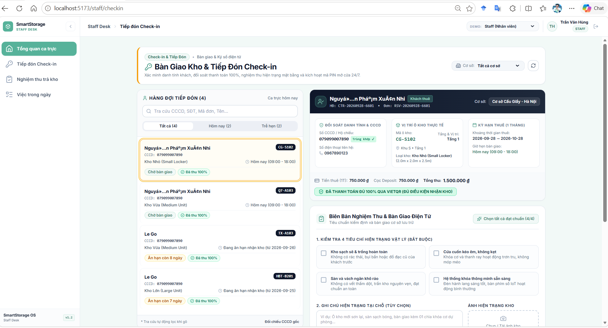
- **Ghi chú gốc từ Lead Dev:**  
  > *"Hiển thị sai giao diện"*
- **Mô tả kỹ thuật chuẩn hóa:**  
  * **Tên vấn đề:** Màn hình Tiếp đón Check-in (`/staff/checkin`) hiển thị mâu thuẫn thông số ô kho (Loại kho nhỏ 1m² nhưng lại hiển thị kích thước 2.0m x 2.0m x 2.5m = 4m²); đồng thời danh sách hàng đợi tiếp tục dính lỗi lẫn lộn nhiều cơ sở và biểu mẫu thiếu nút hoàn tất bàn giao ở vị trí thuận tiện.
  * **Hiện trạng ghi nhận trên UI (`image-32.png`):**  
    1. *Hiển thị sai lệch thông số kỹ thuật:* Ô thông tin `VỊ TRÍ Ô KHO THỰC TẾ` cho hợp đồng `CTR-20260928-6601` ghi:  
       - `Mã ô kho: CG-S102 - Tầng 1`  
       - `Loại kho: Kho Nhỏ (Small Locker)`  
       - Nhưng kích thước lại ghi: `(2.0m x 2.0m x 2.5m)`! Kích thước này có diện tích sàn $2 \times 2 = 4\text{ m}^2$, tương đương với Kho Vừa (Medium Unit) chứ không phải Kho Nhỏ ($1\text{ m}^2$). Dữ liệu kích thước hiển thị bị lấy nhầm từ loại kho khác trong database.  
    2. *Hàng đợi vẫn hiển thị lẫn lộn đa cơ sở:* Hàng đợi bên trái gồm 4 mục nhưng có tới 3 cơ sở khác nhau (`CG-S102` Cầu Giấy, `Q7-A103` Quận 7, `TX-A103` Thanh Xuân, `HBT-B201` Hai Bà Trưng), lặp lại lỗ hổng phân quyền đã nêu ở Lỗi 30.  
    3. *Thiếu nút hành động nổi bật:* Phần dưới cùng của màn hình chứa 4 tiêu chí kiểm tra hiện trạng, nhưng thiếu thanh thao tác dính chân trang (Sticky Action Bar) chứa nút **"Xác nhận Bàn giao & Kích hoạt Mã PIN"**, khiến nhân viên phải cuộn xuống tận đáy trang mới thấy nút thực hiện.
  * **Nguyên nhân gốc rễ (Root Cause):**  
    - Dữ liệu seed/API response trả về trường `dimensions` bị hardcode hoặc sai quan hệ giữa `storage_unit` và `unit_type`.  
    - Bố cục layout thiếu fixed bottom bar cho form tiếp đón.
  * **Hành vi kỳ vọng (Expected Behavior):**  
    1. *Hiển thị đúng thông số ô kho:* Ô kho `CG-S102` (Kho Nhỏ) phải hiển thị đúng kích thước: `1.0m x 1.0m x 1.5m (Diện tích: 1m²)`.  
    2. *Lọc hàng đợi chuẩn theo cơ sở trực ca:* Hàng đợi chỉ hiển thị các đơn check-in của đúng cơ sở mà nhân viên đang trực.  
    3. *Bổ sung Sticky Action Bar:* Cố định thanh công cụ ở chân màn hình bên phải: Khi tích đủ 4 tiêu chí hiện trạng $\rightarrow$ Sáng nút xanh: **`[Xác nhận Bàn giao & Kích hoạt Mã PIN]`** (hoặc gửi mã PIN tức thì qua SMS/Email cho khách).
  * **Hướng xử lý & File liên quan:**  
    - Frontend: `StaffCheckInPage.tsx`, `UnitPhysicalInfoCard.tsx`, `CheckInInspectionForm.tsx`.  
    - Backend: `StorageUnitDto.java`, `CheckInService.java`.

---

## 3. Những Thay Đổi Hệ Thống Buộc Phải Thực Hiện Khi Có BR Mới

Khi tài liệu [docs/BUSINESS-RULES.md](../docs/BUSINESS-RULES.md) được làm sạch và chốt chuẩn, toàn bộ hệ thống phải tiến hành tái cấu trúc đồng bộ trên cả 4 tầng kỹ thuật dưới đây:

### 3.1. Thay đổi tầng Cơ sở dữ liệu (Database Schema & Seed Data)

1. **Bổ sung tham số cấu hình hệ thống:**
   * Cập nhật bảng `system_policy` / bảng tham số nghiệp vụ:
     - `cancel.late_refund_rate = 0.0` (thay vì 0.5 cũ).
     - `overdue.lock_access_days = 7` (thay vì 10 cũ).
     - Thêm tham số mới: `rental.buffer_days = 15`.
2. **Chuẩn hóa cấu trúc bảng giá và diện tích:**
   * Đảm bảo bảng `unit_type` có lưu `area_m2` (diện tích sàn quy chuẩn $m^2$).
   * Bảng giá `pricing_plan` hoặc `unit_type_pricing` phải lưu đơn giá theo đơn vị **VNĐ / $m^2$ / tháng**, kèm ràng buộc kiểm tra `effective_from >= CAST(GETDATE() AS DATE)`.
3. **Làm sạch Dữ liệu Mẫu (Seed Data Fix):**
   * Xóa bỏ hoàn toàn cơ sở ảo `"Tân Bình Flagship"`, chuẩn hóa danh mục cơ sở chính thức.
   * Xóa các hợp đồng mẫu có trạng thái quá hạn trên 30 ngày (dữ liệu rác không đúng BR).
   * Chuẩn hóa lại tên hiển thị của nhân viên và người dùng demo.

### 3.2. Thay đổi tầng Backend (Spring Boot Services & Scheduled Jobs)

1. **PricingService & Billing:**
   * Sửa công thức tính giá:
     $$\text{Phí thuê 1 tháng} = \text{pricePerM2} \times \text{areaM2}$$
   * Validate ngày hiệu lực khi BOM tạo/cập nhật bảng giá: Bắt buộc `effectiveFrom` không được nằm ở quá khứ.
   * Cấm tuyệt đối API cập nhật bảng giá đối với tài khoản vai trò `FACILITY_MANAGER` (chỉ cho phép `BOM`).
2. **AvailabilityService & Sơ đồ mặt bằng:**
   * Bổ sung khoảng đệm an toàn `rental.buffer_days` (15 ngày) vào thuật toán tính toán ô kho khả dụng: Một ô kho chỉ cho phép đặt chỗ khi ngày bắt đầu hợp đồng mới $\ge \text{endDate cũ} + 15\text{ ngày}$.
   * Loại bỏ hoàn toàn logic "phân bổ ô kho sau thanh toán" trong code service; ô kho được gán cố định ngay khi tạo `Reservation`.
3. **CancellationService & Hoàn tiền:**
   * Sửa logic hủy muộn (`BR-CAN-02`): Nếu hủy trong vòng dưới 48 giờ trước ngày bắt đầu $\rightarrow$ `refundDeposit = 0`, `refundRental = 100%`.
4. **RenewalService & Chặn gia hạn khi Overdue:**
   * Khóa tính năng gia hạn nếu thời điểm hiện tại $\ge \text{endDate} - 30\text{ ngày}$.
   * **Cấm gia hạn khi hợp đồng đã chuyển sang Overdue (`BR-REN-06`):** Trả về mã lỗi `RENEWAL_NOT_ALLOWED` nếu hợp đồng có trạng thái `OVERDUE`.
5. **Overdue Scheduled Jobs:**
   * Cập nhật job chạy hằng ngày lúc 00:00:
     - **Tại D+7:** Tự động gọi `AccessCodeService.suspend(contractId)` để chuyển trạng thái mã PIN sang `SUSPENDED` (khóa quyền mở cửa).
     - **Tại D+10:** Tự động chuyển hợp đồng sang `TERMINATED_OVERDUE`, chốt trần nợ phạt 70% cọc, tạo task kiểm kê và niêm phong đồ cho Staff.
6. **SupportService & Cấp lại mã PIN:**
   * Tách biệt 2 cơ chế xử lý sự cố:
     - Cấp lại mã PIN: Tự động sinh mã ngẫu nhiên 6 số mới và kích hoạt ngay mà không qua phê duyệt thủ công.
     - Sự cố vật lý: Gán SLA 2 giờ, lưu timestamp tiếp nhận để tính thời gian hoàn thành.
7. **Bảo mật & Kiểm soát phạm vi dữ liệu (RBAC Scope Enforcement):**
   * Ràng buộc cứng `facility_id` trong mọi truy vấn của `FACILITY_MANAGER` và `FACILITY_STAFF` dựa theo `UserPrincipal.assignedFacilityIds`. Ngăn chặn hoàn toàn việc nhân viên cơ sở này xem dữ liệu của cơ sở khác.
   * Yêu cầu xác thực (Auth Guard) bắt buộc trên endpoint thanh toán và đặt giữ chỗ; cấm Anonymous User tạo hợp đồng.

### 3.3. Thay đổi tầng Frontend (React Vite UI/UX & Flow Controls)

1. **Xử lý Session & State Management:**
   * Dọn dẹp sạch sẽ `localStorage`, `sessionStorage` và React State khi người dùng đăng xuất hoặc chuyển đổi tài khoản, triệt tiêu lỗi Session Leak.
   * Bổ sung mã OTP giả lập hiển thị trực tiếp trên giao diện để thuận tiện kiểm thử.
2. **Màn hình Đặt kho & Sơ đồ mặt bằng (SC):**
   * Thêm Auth Guard: Nếu khách chưa đăng nhập bấm "Thanh toán" $\rightarrow$ Hiển thị modal đăng nhập trang nhã thay vì crash hoặc cho phép tiếp tục.
   * Đồng bộ sơ đồ mặt bằng phản ứng tức thì khi khách hàng thay đổi thời hạn thuê.
   * Sửa nhãn text hiển thị: Dùng chữ "Ngăn tủ" / "Ô kho", loại bỏ chữ "Kho bãi", "Phòng".
3. **Màn hình Chi tiết Ô kho của tôi (SC):**
   * **Nút "Báo trả kho"**: Luôn hiển thị khi hợp đồng đang ở trạng thái `ACTIVE`.
   * **Nút "Gia hạn"**: Ẩn hoàn toàn khi hợp đồng đã chuyển sang `OVERDUE` hoặc đã quá hạn gia hạn (sau mốc 1 tháng trước khi hết hạn).
   * **Khi hợp đồng Overdue**:
     - D+1 đến D+3: Mở nút "Báo trả kho", ẩn nút đóng nợ phạt.
     - D+4 đến D+7: Khóa nút "Báo trả kho", hiện nút **"Đóng nợ phạt quá hạn"**.
     - D+7: Hiển thị cảnh báo màu đỏ *"Access Code đã bị tạm khóa do quá hạn 7 ngày, vui lòng đóng nợ phạt để mở lại"*.
4. **Màn hình Quản trị BOM:**
   * Chỉnh sửa form cập nhật bảng giá: Validate trường ngày bắt đầu hiệu lực bắt buộc $\ge$ hôm nay.
   * Nhập giá theo đơn vị **VNĐ / $m^2$ / tháng**, hiển thị thành tiền tạm tính theo từng Unit Type.
5. **Màn hình Quản trị FM & Staff:**
   * Loại bỏ nút chỉnh sửa giá kho khỏi giao diện FM.
   * Loại bỏ nút "Bàn giao" khỏi giao diện FM (chỉ giữ trên giao diện Staff).
   * Ràng buộc bộ lọc cơ sở: Chỉ cho phép chọn các cơ sở nằm trong danh sách được phân công.
   * Thêm đồng hồ đếm ngược SLA 2 giờ trên thẻ sự cố vận hành.

### 3.4. Kế hoạch Kiểm thử & Đảm bảo Chất lượng (QA / TDD Matrix)

Mọi tác vụ khắc phục lỗi từ các issue trên bắt buộc phải có test suite kiểm chứng tương ứng:
* **Backend:** Bổ sung các unit test trong `backend/src/test/java/...`:
  - `CancellationServiceTest`: Test case hủy muộn trong 48h phạt 100% cọc.
  - `RenewalServiceTest`: Test case từ chối gia hạn khi trạng thái là `OVERDUE`.
  - `OverdueJobTest`: Test case kiểm tra tại D+7 mã PIN bị `SUSPENDED` và tại D+10 hợp đồng bị `TERMINATED`.
  - `PricingServiceTest`: Test case tính giá trọn gói từ đơn giá $m^2 \times \text{diện tích}$.
* **Frontend:** Kiểm thử hồi quy giao diện, đảm bảo build thành công `npm run build` không lỗi type check.

---

> **Ghi chú dành cho AI Agent tiếp nhận:** Khi bắt đầu thực hiện bất kỳ task nào sửa lỗi từ tài liệu này, vui lòng đối chiếu lại mã quy tắc tương ứng tại [docs/BUSINESS-RULES.md](../docs/BUSINESS-RULES.md) và ghi nhận kết quả vào sổ nhật ký [docs/DASHBOARD.md](../docs/DASHBOARD.md).
