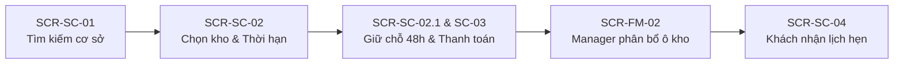
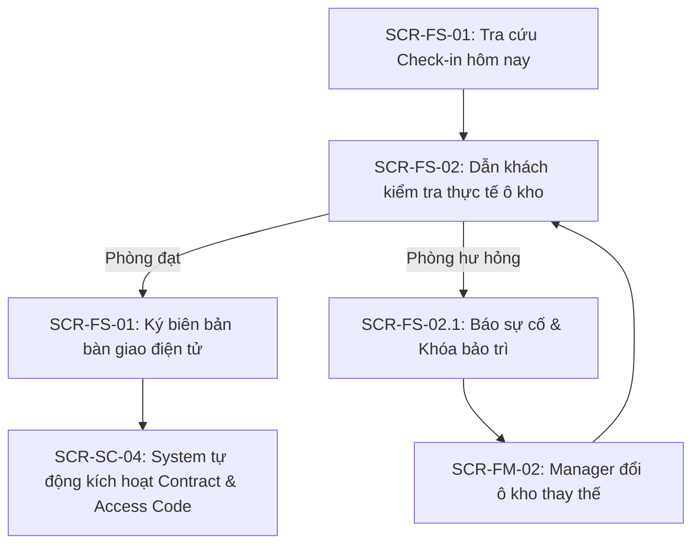
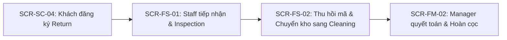

# Bảng Ánh Xạ Luồng Nghiệp Vụ và Giao Diện (UI Flow Mapping)

> **Self-Storage Facility Rental and Management System**
> Tài liệu ánh xạ trực quan giữa **Activity Diagram** và **Màn hình giao diện UI/UX** (Dự án Stitch `10748997868964560026` — *SmartStorage Unit Reservation Interface*).
> Phục vụ demo tiến độ Báo cáo #1 (Giai đoạn 1 — [PLAN.md](PLAN.md)).

---

## 1. Nguyên Tắc Thiết Kế & Bám Sát Nghiệp Vụ

Hệ thống giao diện được thiết kế bám sát chặt chẽ theo nguyên lý **Activity-Driven UI/UX**:
1. **Traceability 1:1**: Mọi màn hình đều mang mã định danh tương ứng với mã yêu cầu chức năng trong [TOPIC.md](TOPIC.md) (§ 3): `SCR-SC-*` (Customer), `SCR-FS-*` (Facility Staff), `SCR-FM-*` (Facility Manager), `SCR-BM-*` (Business Ops), `SCR-SA-*` (System Admin).
2. **Bao phủ cả Happy Path lẫn Exception Handling**: Không chỉ có màn hình đặt kho thông thường mà có sẵn các Modal xử lý sự cố thực địa (ví dụ: `SCR-FS-02.1` khóa bảo trì ô kho hư hỏng tại chỗ).
3. **Đồng bộ thời gian thực giữa các Portal**: Thao tác của Khách hàng $\rightarrow$ cập nhật tức thì trên Dashboard của Nhân viên và Quản lý cơ sở.

---

## 2. Kịch Bản Demo Flow 1 — Đặt Chỗ Ô Kho (Storage Unit Reservation)

*Sơ đồ hoạt động:* [activity-flow-1-booking.puml](diagrams/activity-flow-1-booking.puml)

### Chi tiết từng bước demo:

| Bước trên Activity Diagram Flow 1 | Màn hình Stitch | Mã màn hình & Link xem | Hành vi người dùng & Trực quan hóa |
| :--- | :--- | :--- | :--- |
| **Bước 1**: Khách hàng tìm kiếm cơ sở, xem Unit Type và giá thuê (`UC-F1-01`, `UC-F1-02`) | **Storage Facility Directory & Interactive Search** | `SCR-SC-01` [Mở màn hình Stitch](https://stitch.withgoogle.com/projects/10748997868964560026) | Khách lọc theo thành phố, quận, xem danh sách cơ sở kèm ảnh thực tế, tiện ích và giá khởi điểm. Bấm "View Units" tại cơ sở mong muốn. |
| **Bước 2**: Chọn Unit Type, ngày bắt đầu và thời hạn thuê N tháng (`UC-F1-04`, `BR-GEN-03`) | **Storage Unit Reservation & Duration Selection** | `SCR-SC-02` [Mở màn hình Stitch](https://stitch.withgoogle.com/projects/10748997868964560026) | Khách chọn kích thước kho (Small, Medium, Large), chọn ngày bắt đầu thuê và số tháng thuê. Hệ thống kiểm tra capacity trống (`BR-AVL-01`). |
| **Bước 3**: Xem ước tính chi phí, giữ chỗ 48h và thanh toán (`UC-F1-05`, `UC-F1-06`, `UC-F1-07`, `BR-DEP-03`, `BR-PAY-01`) | **Booking Checkout & Upfront Payment Gateway** | `SCR-SC-02.1` `SCR-SC-03` | • Hiển thị đồng hồ đếm ngược giữ chỗ **48 giờ** (`reservation.hold_hours`). • Bảng kê chi phí: Phí thuê N tháng + Tiền cọc Deposit (`BR-PAY-01`). • Cổng quét mã VietQR động / Thẻ ngân hàng. |
| **Bước 4**: Quản lý phân bổ ô kho vật lý cụ thể (`UC-F1-08`, `BR-AVL-04`) | **Facility Contracts, Allocations & Overdue Hub** | `SCR-FM-02.1` *(Khuyên dùng demo)* `SCR-FM-02` | Chuyển sang góc nhìn **Facility Manager**: Xem danh sách đơn tại Tab **"Reservations & Unit Allocation"** (đang có 12 đơn chờ), bấm chọn gán ô kho vật lý trống phù hợp tiêu chí (ví dụ: A-104). *(Lưu ý: Màn `SCR-FM-02` là trạng thái đang mở Modal D+60 Sealing của Tab Overdue, còn `SCR-FM-02.1` là chế độ xem bảng tiêu chuẩn không vướng popup).* |
| **Bước 5**: Nhận xác nhận đặt chỗ thành công & Lịch hẹn Check-in (`UC-F1-09`) | **Customer Storage & Contracts Hub (My Rentals)** | `SCR-SC-04` | Khách mở ứng dụng: Đơn chuyển sang hợp đồng trạng thái *Pending Check-in*, hiển thị mã ô kho được gán, mã QR truy cập và Lịch hẹn Check-in. |

---

## 3. Kịch Bản Demo Flow 2 — Check-in & Bàn Giao Ô Kho (Check-in & Handover)

*Sơ đồ hoạt động:* [activity-flow2-checkin-handover.puml](diagrams/activity-flow2-checkin-handover.puml)

### Chi tiết từng bước demo:

| Bước trên Activity Diagram Flow 2 | Màn hình Stitch | Mã màn hình & Link xem | Hành vi người dùng & Trực quan hóa |
| :--- | :--- | :--- | :--- |
| **Bước 1**: Staff tra cứu đơn đặt chỗ khi khách đến cơ sở (`UC-F2-01`, `UC-F2-02`, `BR-CHK-01`) | **Staff Daily Operations Desk** | `SCR-FS-01` | Nhân viên mở danh sách ca trực bàn giao trong ngày, tra cứu mã đơn/CCCD khách hàng, kiểm tra cọc và thanh toán đã xanh *Confirmed*. |
| **Bước 2**: Dẫn khách kiểm tra hiện trạng thực tế ô kho (`BR-CHK-02`) | **Facility Storage Units & Floor Status Board** | `SCR-FS-02` | Nhân viên dẫn khách đến vị trí ô kho trên sơ đồ mặt bằng thực tế để kiểm tra cửa cuốn, khóa, thiết bị và độ sạch sẽ. |
| **Bước 3 (Nhánh Ngoại Lệ Đắt Giá)**: Ô kho bị hư hại kết cấu, không đạt yêu cầu (`US-FS-02.1 AC-3`) | **Storage Unit Defect Reporting & Maintenance Lock** | `SCR-FS-02.1` *(Modal Active)* | Staff bật Modal báo cáo sự cố ngay tại chỗ $\rightarrow$ Hệ thống tự động chuyển ô kho sang **Maintenance** $\rightarrow$ Quản lý trên màn hình `SCR-FM-02` chỉ định ngay ô kho thay thế cùng loại. |
| **Bước 4**: Lập biên bản bàn giao kèm ảnh hiện trạng & Ký số (`UC-F2-03`, `BR-CHK-03`, `UC-F2-05`) | **Staff Daily Operations Desk** | `SCR-FS-01` | Nhân viên chụp ảnh hiện trạng ô kho tải lên hệ thống, khách hàng ký số điện tử trên tablet/ứng dụng để xác nhận nhận bàn giao. |
| **Bước 5**: Hệ thống tự động kích hoạt song song (`UC-F2-06`, `UC-F2-07`, `BR-ACC-02`) | **Customer Storage & Contracts Hub (My Rentals)** | `SCR-SC-04` | Sau khi ký biên bản, **Hệ thống tự động**: (1) Ô kho chuyển *Occupied*; (2) Hợp đồng chuyển *Active*; (3) Mã Access Code / QR mở cổng hiện xanh *Active*; (4) Tự gửi email kèm file PDF biên bản cho khách. |

---

## 4. Kịch Bản Demo Flow 3 — Quản Lý Ô Kho Đang Thuê & Trả Kho (Rented Unit & Return)

*Sơ đồ hoạt động:* [activity-flow-3.puml](diagrams/activity-flow-3.puml)

### Chi tiết từng bước demo:

| Bước trên Activity Diagram Flow 3 | Màn hình Stitch | Mã màn hình & Link xem | Hành vi người dùng & Trực quan hóa |
| :--- | :--- | :--- | :--- |
| **Bước 1**: Khách hàng giám sát ô kho, hợp đồng và mã mở cửa (`UC-F3-01` -> `UC-F3-04`) | **Customer Storage & Contracts Hub (My Rentals)** | `SCR-SC-04` | Khách xem danh sách ô kho đang thuê, trạng thái hợp đồng *Active*, lịch sử ra vào và mã PIN / mã QR mở cổng bảo mật. |
| **Bước 2**: Đăng ký trả kho — Return (`UC-F3-05`, `BR-RET-01`, `BR-RET-10`) | **Customer Storage & Contracts Hub (My Rentals)** | `SCR-SC-04` | Khách bấm nút "Request Return", chọn ngày giờ hẹn trước ít nhất 7 ngày (`return.notice_days`). Hợp đồng chuyển sang trạng thái *Pending Return*. |
| **Bước 3**: Nhân viên kiểm tra hiện trạng tại chỗ (`UC-F3-06`, `BR-RET-03`, `BR-RET-08`) | **Staff Daily Operations Desk** | `SCR-FS-01` | Staff tiếp nhận lịch hẹn, đến nghiệm thu hiện trạng cùng khách, ghi nhận tài sản không hư hại hoặc lập biên bản trừ phí đền bù. |
| **Bước 4**: Thu hồi quyền truy cập & Chuyển trạng thái kho (`UC-F3-07`, `UC-F3-09`, `BR-RET-09`) | **Facility Storage Units & Floor Status Board** | `SCR-FS-02` | Staff bấm "Thu hồi quyền truy cập", mã Access Code bị vô hiệu hóa tức thì; ô kho trên sơ đồ mặt bằng tự động chuyển sang màu vàng *Cleaning*. |
| **Bước 5**: Quyết toán hợp đồng & Hoàn tiền cọc (`UC-F3-08`, `BR-RET-04`, `BR-RET-05`) | **Facility Contracts, Allocations & Overdue Hub** | `SCR-FM-02` | Quản lý cơ sở đối chiếu biên bản, khấu trừ tiền bồi thường (nếu có), xuất lệnh hoàn tiền cọc Deposit về phương thức gốc trong 7 ngày làm việc. Hợp đồng chuyển *Closed*. |

---

## 5. Kịch Bản Demo Flow 4 & Flow 5 — Vận Hành Cơ Sở & Điều Hành Hệ Thống

| Luồng | Bước nghiệp vụ | Màn hình Stitch | Mã màn hình | Hành vi trực quan hóa |
| :--- | :--- | :--- | :--- | :--- |
| **Flow 4** (BM) | Cấu hình tham số nghiệp vụ toàn hệ thống (`UC-F4-02` -> `UC-F4-06`) | **Business Rules & Policy Parameter Engine** | `SCR-BM-02` | Business Ops Manager cấu hình: Tỷ lệ cọc Deposit, 48h giữ chỗ, 3 ngày grace check-in, các mốc Overdue D+1/D+10/D+30/D+60. |
| **Flow 4** (BM) | Thiết lập bảng giá & duyệt miễn giảm (`UC-F4-07`, `UC-F4-13`) | **Pricing Matrix, Surcharges & Fee Waiver** | `SCR-BM-03` | Quản lý khung giá thuê theo từng cơ sở và duyệt các đề xuất miễn giảm phí quá hạn theo vụ việc. |
| **Flow 4** (BM) | Giám sát doanh thu & xuất báo cáo BI (`UC-F4-10`, `UC-F4-12`) | **Enterprise BI & Cross-Facility Report** | `SCR-BM-04` | Xem biểu đồ doanh thu toàn quốc, tỷ lệ lấp đầy giữa các cơ sở và xuất file báo cáo Excel/PDF. |
| **Flow 5** (FM) | Quản lý danh mục ô kho & sơ đồ mặt bằng (`UC-F5-01`, `UC-F5-02`) | **Facility Storage Units & Layout Management** | `SCR-FM-01` | Facility Manager quản lý từng ô kho, kích thước, tầng, vị trí và trạng thái bảo trì/sẵn sàng. |
| **Flow 5** (FM) | Phân công ca trực cho nhân viên (`UC-F5-04`, `FM-05`) | **Staff Shift Scheduling & Task Dispatch Board** | `SCR-FM-03` | Quản lý phân công nhân viên phụ trách ca trực tiếp nhận Check-in và Return trong ngày. |
| **Flow 5** (FM) | Giám sát hiệu suất cơ sở (`UC-F5-06`, `FM-06`) | **Facility Performance & Occupancy Analytics** | `SCR-FM-04` | Theo dõi tỷ lệ lấp đầy Usage Rate tại cơ sở, doanh thu tháng và số hợp đồng quá hạn cần xử lý. |

---

## 6. Danh Mục Đầy Đủ 25 Màn Hình Dự Án Trên Stitch (Cross-Reference)

| STT | Nhóm Actor | Mã Màn hình | Tên Màn hình (Stitch Project `10748997868964560026`) | Vai trò trong hệ thống |
| :---: | :--- | :--- | :--- | :--- |
| 1 | **Customer** | `SCR-SC-01` | Storage Facility Directory & Interactive Search | Tra cứu và lọc cơ sở lưu trữ |
| 2 | | `SCR-SC-02` | Storage Unit Reservation & Duration Selection | Chọn loại kho, ngày bắt đầu và thời hạn thuê |
| 3 | | `SCR-SC-02.1`| Booking Checkout & Customer Information | Điền thông tin cá nhân và hóa đơn đặt cọc |
| 4 | | `SCR-SC-03` | Booking Checkout & Upfront Payment Gateway | Quét mã VietQR / Thẻ thanh toán giữ chỗ 48h |
| 5 | | `SCR-SC-04` | Customer Storage & Contracts Hub (My Rentals Dashboard) | Quản lý kho đang thuê, hợp đồng và mã PIN mở cửa |
| 6 | | `SCR-SC-05` | Customer Support Requests & Incident Resolution Hub | Gửi ticket hỗ trợ và xử lý sự cố tại cơ sở |
| 7 | **Staff** | `SCR-FS-01` | Staff Daily Operations Desk | Bàn giao ca trực, tiếp nhận Check-in / Return |
| 8 | | `SCR-FS-02` | Facility Storage Units & Floor Status Board | Sơ đồ mặt bằng kho và tình trạng vận hành |
| 9 | | `SCR-FS-02.1`| Storage Unit Defect Reporting & Maintenance Lock (Modal) | Modal báo cáo ô kho hư hỏng và khóa bảo trì |
| 10 | **Manager** | `SCR-FM-01` | Facility Storage Units & Layout Management | Thiết lập danh mục ô kho và sơ đồ cơ sở |
| 11 | | `SCR-FM-01.1`| Facility Storage Units & Layout Management (Default View) | Chế độ xem mặc định danh sách ô kho cơ sở |
| 12 | | `SCR-FM-02` | Facility Contracts, Allocations & Overdue Hub | Quản lý hợp đồng & phân bổ (Đang mở Modal D+60 Sealing Protocol) |
| 13 | | `SCR-FM-02.1`| Facility Contracts, Allocations & Overdue Hub (Default View) | Giao diện chuẩn 4 Tab: Active Contracts, Reservations Allocation, Return, Overdue |
| 14 | | `SCR-FM-03` | Staff Shift Scheduling & Task Dispatch Board | Phân công ca trực và nhiệm vụ bàn giao trong ngày |
| 15 | | `SCR-FM-04` | Facility Performance & Occupancy Analytics | Thống kê hiệu suất và tỷ lệ lấp đầy Usage Rate |
| 16 | | `SCR-FM-04.1`| Facility Performance & Occupancy Analytics (Default View) | Chế độ xem mặc định biểu đồ tỷ lệ lấp đầy cơ sở |
| 17 | **Business** | `SCR-BM-01` | Multi-Facility Network Management | Quản lý mạng lưới toàn bộ cơ sở toàn quốc |
| 18 | | `SCR-BM-01.1`| Multi-Facility Network Management (Default View) | Chế độ xem mặc định danh mục cơ sở toàn hệ thống |
| 19 | | `SCR-BM-02` | Business Rules & Policy Parameter Engine | Cấu hình tham số nghiệp vụ (Deposit, Overdue, Grace) |
| 20 | | `SCR-BM-03` | Pricing Matrix, Surcharges & Fee Waiver Approval | Quản lý khung giá thuê, phụ phí và duyệt miễn giảm |
| 21 | | `SCR-BM-04` | Enterprise BI & Cross-Facility Report Export Hub | Báo cáo doanh thu và trích xuất dữ liệu toàn hệ thống |
| 22 | **Admin** | `SCR-SA-01` | User Accounts, RBAC & Facility Scope Assignment Hub | Quản trị tài khoản và phân quyền theo cơ sở |
| 23 | | `SCR-SA-01.1`| Edit User Role & Facility Scope Assignment (Modal Active) | Modal gán vai trò và phạm vi cơ sở phụ trách |
| 24 | | `SCR-SA-02` | System Login & User Activity Audit Trail | Xem nhật ký hoạt động Activity Log toàn hệ thống |
| 25 | **Common** | `SCR-SYS-01`| Unified Authentication & Customer Registration | Màn hình đăng nhập / đăng ký tài khoản tập trung |
