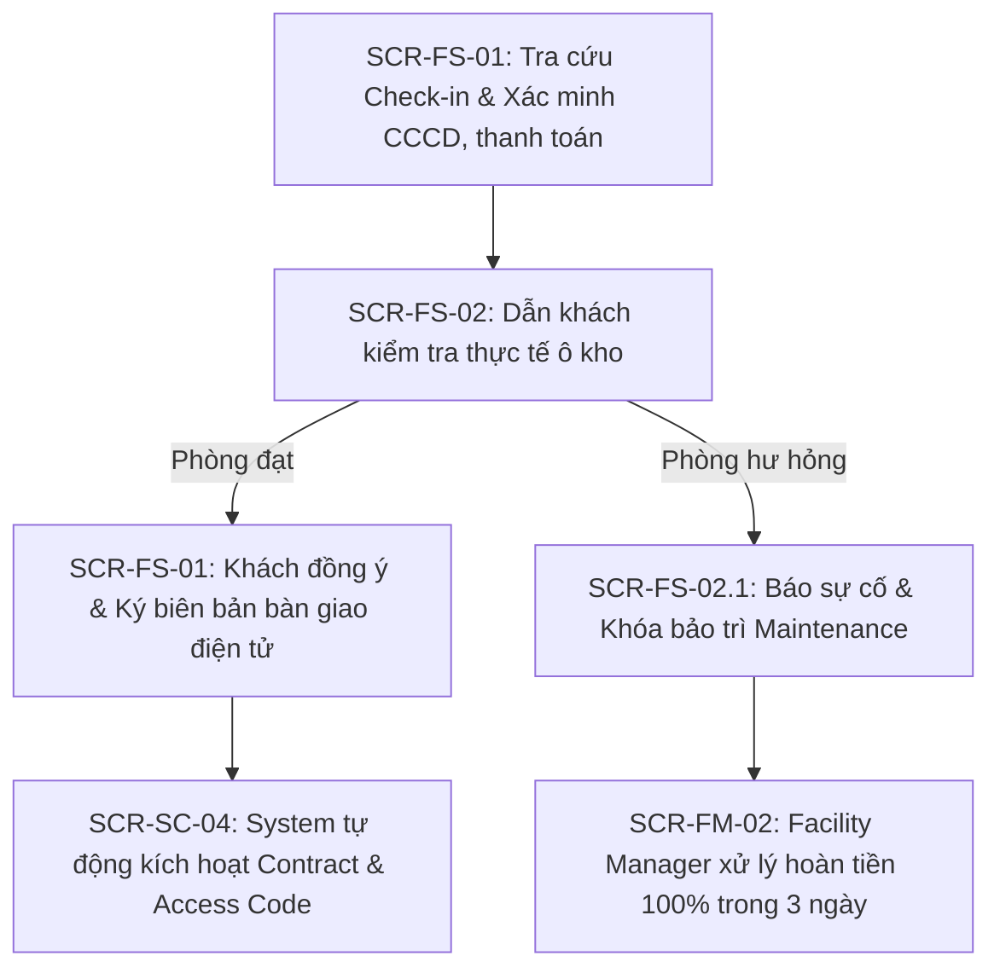
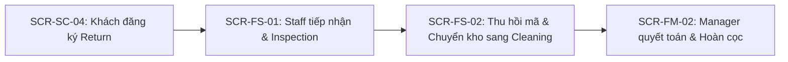

# Bảng Ánh Xạ Luồng Nghiệp Vụ và Giao Diện (UI Flow Mapping)

> **Self-Storage Facility Rental and Management System**
> Tài liệu ánh xạ trực quan giữa **Activity Diagram** và **Màn hình giao diện UI/UX** (Dự án Stitch `10748997868964560026` — *SmartStorage Unit Reservation Interface*).
> Phục vụ demo tiến độ Báo cáo #1 (Giai đoạn 1 — [PLAN.md](PLAN.md)).

---

## 1. Nguyên Tắc Thiết Kế & Bám Sát Nghiệp Vụ

Hệ thống giao diện được thiết kế bám sát chặt chẽ theo nguyên lý **Activity-Driven UI/UX**:
1. **Traceability 1:1**: Mọi màn hình đều mang mã định danh tương ứng với mã yêu cầu chức năng trong [TOPIC.md](TOPIC.md) (§ 3): `SCR-SC-*` (Customer), `SCR-FS-*` (Facility Staff), `SCR-FM-*` (Facility Manager), `SCR-BM-*` (Business Ops), `SCR-SA-*` (System Admin).
2. **Bao phủ cả Happy Path lẫn Exception Handling**: Không chỉ có màn hình đặt kho thông thường mà có sẵn các Modal xử lý sự cố thực địa (ví dụ: `SCR-FS-02.1` khóa bảo trì ô kho hư hỏng tại chỗ).
3. **Đồng bộ thời gian thực giữa các Portal**: Thao tác của Khách hàng $\rightarrow$ cập nhật tức thì trên Dashboard của Nhân viên và Quản lý cơ sở.

---

## 2. Kịch Bản Trình Chiếu Demo Main Flow Cốt Lõi (Core End-to-End Demo Script)

> **Mục tiêu thuyết trình:** Trình bày liền mạch trong **3 đến 5 phút** trước Giảng viên hướng dẫn, đi trọn vẹn vòng đời cốt lõi từ lúc Khách tìm kiếm, tự chọn ô kho trên sơ đồ, giữ chỗ, thanh toán trực tuyến $\rightarrow$ Nhận thẻ Check-in điện tử $\rightarrow$ Nhân viên trực đón tiếp, nghiệm thu $\rightarrow$ Hệ thống tự động kích hoạt Hợp đồng và cấp mã mở cửa thông minh (PIN/QR Code).
> 
> *Sơ đồ hoạt động chuẩn:* [activity-diagram-flow-1-storage-reservation.drawio](diagrams/activity-diagram-flow-1-storage-reservation.drawio)

### 2.1. Sơ đồ hành trình chuỗi 7 màn hình xuyên suốt

```mermaid
graph LR
    subgraph Storage Customer
        S1["Ảnh 1: SCR-SC-01<br>Tìm kiếm cơ sở"] --> S2["Ảnh 2: SCR-SC-02<br>Xem sơ đồ & Tự chọn ô kho Q7-M12"]
        S2 --> S3["Ảnh 3: SCR-SC-03<br>Giữ ô kho 48h & VietQR"]
        S3 -->|"Thanh toán thành công"| S4["Ảnh 4: SCR-SC-03.1<br>Thẻ Check-in & Hợp đồng Pending"]
    end
    subgraph Facility Staff
        S4 -->|"Đến ngày hẹn Check-in"| S5["Ảnh 5: SCR-FS-01<br>Đón khách & Tra cứu CCCD"]
        S5 --> S6["Ảnh 6: SCR-FS-02<br>Dẫn nghiệm thu mặt bằng"]
        S6 --> S5_sign["Ảnh 5 (Modal): SCR-FS-01<br>Ký biên bản điện tử"]
    end
    subgraph System Activation
        S5_sign --> S7["Ảnh 7: SCR-SC-04<br>Contract Active & Mã PIN/QR"]
    end
```

---

### 2.2. Kịch bản chi tiết từng bước & Lời thoại mẫu cho người thuyết trình

| Thứ tự | Màn hình Stitch & Mã định danh | Thao tác trên UI (Action) | Lời thoại thuyết trình mẫu (Presenter Speech) | Quy tắc nghiệp vụ liên quan |
| :---: | :--- | :--- | :--- | :--- |
| **Ảnh 1** | **SCR-SC-01** Storage Facility Directory & Search | Trỏ chuột vào thanh lọc khu vực (Quận 7), bấm chọn cơ sở **District 7 Flagship**, xem danh sách tiện ích (Máy lạnh 24/7, PCCC tự động, bảo vệ AI) và mức giá khởi điểm. | *"Thưa cô, luồng chính của hệ thống bắt đầu từ góc nhìn Khách hàng trên màn hình `SCR-SC-01`. Khách hàng tìm kiếm cơ sở theo khu vực mong muốn, xem đầy đủ tiện ích thực tế và mức giá niêm yết minh bạch trước khi bấm 'View Units' để chọn kho."* | `UC-F1-01` `UC-F1-02` |
| **Ảnh 2** | **SCR-SC-02** Storage Unit Reservation & Duration Selection | Mở sơ đồ mặt bằng kho, trỏ chuột chọn trực tiếp ô kho **Locker Q7-M12 (Tầng trệt — Dãy B, 6.0 m²)**, chọn ngày bắt đầu thuê (12/03/2026), chọn thời hạn thuê **3 tháng**. Hệ thống kiểm tra ô kho khả dụng. | *"Tại màn hình `SCR-SC-02`, khách hàng xem trực quan sơ đồ mặt bằng các ô kho của cơ sở và tự mình chọn đúng vị trí ô kho mong muốn — ở đây khách chọn ngay ô Locker Q7-M12 tại tầng trệt, dãy B. Sau đó khách chọn thời hạn thuê 3 tháng. Hệ thống tự động kiểm tra tính khả dụng của ô kho theo thời gian thực."* | `UC-F1-04` `BR-GEN-03` `BR-AVL-01` `BR-AVL-04` |
| **Ảnh 3** | **SCR-SC-02.1** & **SCR-SC-03** Booking Checkout & VietQR Gateway | Trỏ vào **Đồng hồ đếm ngược 48h**, bảng kê tài chính: Phí thuê 3 tháng (2.4M) + Tiền cọc Deposit 1 tháng (800k) = 3.2M VND. Hiển thị mã VietQR động để quét thanh toán. | *"Sau khi điền thông tin cá nhân, hệ thống chuyển sang cổng thanh toán `SCR-SC-03`. Theo Business Rule `BR-DEP-03`, hệ thống giữ chính ô kho Q7-M12 trong đúng 48 giờ. Khách hàng thanh toán toàn bộ tiền thuê N tháng cùng tiền cọc Deposit trong 1 giao dịch qua mã VietQR động."* | `UC-F1-06` `UC-F1-07` `BR-DEP-03` `BR-PAY-01` |
| **Ảnh 4** | **SCR-SC-03.1** Digital Move-in Pass & Confirmation | Hiển thị màn hình xác nhận thanh toán thành công: Hợp đồng chuyển sang **Pending Check-in**, mã ô kho đã chọn **Locker Q7-M12**, mã QR check-in tiếp đón tại quầy và Lịch hẹn Check-in. | *"Ngay khi thanh toán thành công, hệ thống tự động xác nhận đơn và cấp ngay Thẻ nhận kho điện tử trên màn hình `SCR-SC-03.1`. Khách hàng nhìn thấy rõ ràng mã ô kho mình đã tự chọn là Locker Q7-M12, kèm mã QR tiếp đón và lịch hẹn Check-in. Toàn bộ quy trình diễn ra tự động 100%, không cần chờ quản lý cơ sở phê duyệt hay gán kho thủ công."* | `UC-F1-08` `UC-F1-09` `BR-AVL-04` `BR-PAY-02` `BR-CHK-01` |
| **Ảnh 5** | **SCR-FS-01** Staff Daily Operations Desk | **[Chuyển Portal: Đến ngày hẹn $\rightarrow$ Nhân viên trực bàn giao]** Khách tới quầy. Nhân viên mở màn hình ca trực `SCR-FS-01`, tra cứu tên Nguyễn Hoàng Xuân / CCCD `079098001234`, thẻ trạng thái hiện xanh *Customer Arrived*, xác nhận đã thu đủ 100% tiền cọc và tiền thuê. | *"Đến ngày hẹn, khách hàng đến cơ sở thực tế. Nhân viên trực mở màn hình tác nghiệp `SCR-FS-01`. Hệ thống hiển thị danh sách ca trực hôm nay, nhân viên quét CCCD xác thực danh tính khách hàng và xác nhận tình trạng thanh toán đã hoàn tất."* | `UC-F2-01` `UC-F2-02` `BR-CHK-01` |
| **Ảnh 6** | **SCR-FS-02** Facility Units & Floor Status Board | Nhân viên mở sơ đồ mặt bằng `SCR-FS-02`, dẫn khách đến vị trí kho thực tế **Q7-M12 (Tầng trệt, Dãy B)**. Khách và nhân viên kiểm tra 4 tiêu chí: phòng trống sạch, cửa cuốn không kẹt, tường sàn không ẩm mốc, độ ẩm 54% RH. | *"Nhân viên dẫn khách đến vị trí ô kho thực tế trên sơ đồ mặt bằng `SCR-FS-02`. Tại đây, hai bên cùng đối soát hiện trạng ô kho: kiểm tra khóa số, cửa cuốn trơn tru và môi trường kho đạt chuẩn sạch sẽ trước khi bàn giao."* | `BR-CHK-02` |
| **Ảnh 7** | **SCR-FS-01** *(Modal Ký số)* $\rightarrow$ **SCR-SC-04** *(App Khách)* | • Trên `SCR-FS-01`: Nhân viên chụp ảnh hiện trạng phòng, hai bên ký chữ ký điện tử trên tablet. • **Hệ thống tự động kích hoạt tức thì**: Chuyển sang màn hình `SCR-SC-04` của khách: Hợp đồng chuyển **Active**, hiển thị **Mã PIN & Mã QR Code mở cổng bảo mật** màu xanh, tự động gửi email kèm file PDF biên bản. | *"Tại bước cuối cùng, nhân viên chụp ảnh hiện trạng và hai bên ký số biên bản bàn giao điện tử trên `SCR-FS-01`. Ngay khi bấm hoàn tất, HỆ THỐNG TỰ ĐỘNG 100%: kích hoạt hợp đồng sang Active, chuyển kho sang Occupied, và trên ứng dụng của khách `SCR-SC-04`, mã PIN và mã QR mở cửa bảo mật lập tức sáng xanh để khách bắt đầu cất đồ."* | `UC-F2-03` `UC-F2-06` `UC-F2-07` `BR-ACC-01` `BR-ACC-02` |

---

### 2.3. Cẩm Nang Xử Lý Câu Hỏi Phản Biện Của Giảng Viên (Defense Cheat Sheet)

Khi bạn trình bày xong 7 ảnh Main Flow, giảng viên thường sẽ đặt câu hỏi để kiểm tra xem nhóm có lường trước các trường hợp rủi ro thực tế hay không. Dưới đây là 3 kịch bản ứng phó chuẩn xác:

* **Câu hỏi 1 của cô:** *"Nếu nhân viên dẫn khách tới kiểm tra ô kho mà phát hiện kho bị dột hoặc hư cửa cuốn thì hệ thống xử lý thế nào?"*
  - **Câu trả lời chuẩn:** *"Dạ thưa cô, nhóm em đã thiết kế sẵn nhánh ngoại lệ này ở màn hình **`SCR-FS-02.1` (Modal Báo cáo sự cố & Khóa bảo trì)**. Nhân viên sẽ bấm báo hỏng ngay tại chỗ $\rightarrow$ Hệ thống lập tức khóa ô kho đó sang trạng thái `Maintenance` $\rightarrow$ Quản lý cơ sở trên màn hình `SCR-FM-02` sẽ nhận cảnh báo khẩn và bấm đổi ngay một ô kho trống khác cùng loại cho khách mà không phải làm lại thủ tục từ đầu (quy định tại `US-FS-02.1` và `BR-SUP-02`)."*
* **Câu hỏi 2 của cô:** *"Nếu khách hàng đến trễ so với ngày bắt đầu thuê thì hệ thống có hủy đơn không?"*
  - **Câu trả lời chuẩn:** *"Dạ theo Business Rule `BR-CHK-04`, hệ thống áp dụng chính sách **Grace Period 3 ngày** (được hiển thị trên thẻ Card 3 của màn hình `SCR-FS-01`). Trong 3 ngày này, khách đến trễ vẫn được nhận kho bình thường nhưng ngày hết hạn hợp đồng vẫn giữ nguyên. Sau 3 ngày nếu khách không đến, hệ thống mới tự động chuyển sang trạng thái `No-show` và xử lý cọc theo quy định hủy (`BR-CHK-05`)."*
* **Câu hỏi 3 của cô:** *"Sau khi hết hạn thuê, quy trình khách trả kho lấy lại cọc diễn ra thế nào?"*
  - **Câu trả lời chuẩn:** *"Dạ đó là **Flow 3 (Return Flow)**: Khách hàng bấm 'Request Return' trên app `SCR-SC-04` trước ít nhất 7 ngày (`BR-RET-01`). Nhân viên đến nghiệm thu hiện trạng (`SCR-FS-01`), thu hồi mã mở cửa chuyển kho sang `Cleaning` (`SCR-FS-02`). Quản lý cơ sở đối chiếu và phê duyệt lệnh hoàn trả 100% tiền cọc Deposit về phương thức thanh toán gốc trong 7 ngày làm việc theo đúng quy định `BR-RET-05` (minh họa tại màn hình `SCR-FM-02`)."*

---

## 3. Chi Tiết Nghiệp Vụ Từng Flow Riêng Biệt (Detailed Sub-flows)

### 3.1. Kịch Bản Demo Flow 1 — Đặt Chỗ Ô Kho (Storage Unit Reservation)
 
*Sơ đồ hoạt động chi tiết:* [activity-diagram-flow-1-storage-reservation.drawio](diagrams/activity-diagram-flow-1-storage-reservation.drawio) (lưu trữ cũ: [activity-flow-1-booking.puml](diagrams/_archive/activity-flow-1-booking.puml))
 
| Bước trên Activity Diagram Flow 1 | Màn hình Stitch | Mã màn hình & Link xem | Hành vi người dùng & Trực quan hóa |
| :--- | :--- | :--- | :--- |
| **Bước 1**: Khách hàng tìm kiếm cơ sở, xem Unit Type và giá thuê (`UC-F1-01`, `UC-F1-02`) | **Storage Facility Directory & Interactive Search** | `SCR-SC-01` [Mở màn hình Stitch](https://stitch.withgoogle.com/projects/10748997868964560026) | Khách lọc theo thành phố, quận, xem danh sách cơ sở kèm ảnh thực tế, tiện ích và giá khởi điểm. Bấm "View Units" tại cơ sở mong muốn. |
| **Bước 2**: Xem sơ đồ mặt bằng, tự chọn ô kho cụ thể, ngày bắt đầu và thời hạn thuê (`UC-F1-04`, `BR-GEN-03`, `BR-AVL-04`) | **Storage Unit Reservation & Duration Selection** | `SCR-SC-02` [Mở màn hình Stitch](https://stitch.withgoogle.com/projects/10748997868964560026) | Khách xem sơ đồ mặt bằng các ô kho, trực tiếp click chọn ô kho mong muốn (ví dụ: Q7-M12), chọn ngày bắt đầu thuê và số tháng thuê. Hệ thống kiểm tra ô kho khả dụng (`BR-AVL-01`). |
| **Bước 3**: Xem ước tính chi phí, giữ ô kho 48h và thanh toán (`UC-F1-05`, `UC-F1-06`, `UC-F1-07`, `BR-DEP-03`, `BR-PAY-01`) | **Booking Checkout & Upfront Payment Gateway** | `SCR-SC-02.1` `SCR-SC-03` | • Hiển thị đồng hồ đếm ngược giữ chỗ **48 giờ** (`reservation.hold_hours`). • Bảng kê chi phí: Phí thuê N tháng + Tiền cọc Deposit (`BR-PAY-01`). • Cổng quét mã VietQR động / Thẻ ngân hàng. |
| **Bước 4**: Tự động xác nhận, khóa ô kho Reserved & Nhận Thẻ Check-in (`UC-F1-08`, `UC-F1-09`, `BR-AVL-04`) | **Digital Move-in Pass & Customer Hub** | `SCR-SC-03.1` `SCR-SC-04` | Thanh toán thành công: Hệ thống tự động chuyển đơn sang *Confirmed*, ô kho sang *Reserved*, sinh hợp đồng *Pending Check-in* và cấp Thẻ nhận kho điện tử kèm mã QR đón tiếp tại quầy. |
 
---
 
### 3.2. Kịch Bản Demo Flow 2 — Check-in & Bàn Giao Ô Kho (Check-in & Handover)
 
*Sơ đồ hoạt động chi tiết:* [activity-diagram-flow-2-checkin-handover.drawio](diagrams/activity-diagram-flow-2-checkin-handover.drawio) (lưu trữ cũ: [activity-flow2-checkin-handover.puml](diagrams/_archive/activity-flow2-checkin-handover.puml))
 

 
### Chi tiết từng bước demo Flow 2:
 
| Bước trên Activity Diagram Flow 2 | Màn hình Stitch | Mã màn hình & Link xem | Hành vi người dùng & Trực quan hóa |
| :--- | :--- | :--- | :--- |
| **Bước 1**: Staff tra cứu đơn đặt chỗ & xác minh CCCD, thanh toán khi khách đến cơ sở (`UC-F2-01`, `UC-F2-02`, `BR-CHK-01`) | **Staff Daily Operations Desk** | `SCR-FS-01` | Nhân viên mở danh sách ca trực bàn giao trong ngày, tra cứu mã đơn/CCCD khách hàng, kiểm tra cọc và thanh toán đã xanh *Confirmed*. Nếu đơn đã quá ân hạn 10 ngày, hệ thống đã tự động No-show, nhân viên giải thích và hướng dẫn khách đặt mới. |
| **Bước 2**: Dẫn khách kiểm tra hiện trạng thực tế ô kho (`BR-CHK-02`) | **Facility Storage Units & Floor Status Board** | `SCR-FS-02` | Nhân viên dẫn khách đến vị trí ô kho trên sơ đồ mặt bằng thực tế để kiểm tra cửa cuốn, khóa, thiết bị và độ sạch sẽ. |
| **Bước 3 (Nhánh Ngoại Lệ)**: Ô kho bị hư hại kết cấu hoặc khách từ chối nhận (`US-FS-02.1 AC-3`, `BR-CHK-06`) | **Storage Unit Defect Reporting & Maintenance Lock** | `SCR-FS-02.1` *(Modal Active)* | Staff bật Modal báo cáo sự cố ngay tại chỗ $\rightarrow$ Hệ thống tự động chuyển ô kho sang **Maintenance** và hủy lượt Handover $\rightarrow$ Quản lý cơ sở tiếp nhận trên màn hình `SCR-FM-02` và xử lý lệnh hoàn tiền 100% cho khách trong 3 ngày làm việc. |
| **Bước 4**: Khách đồng ý nhận kho & Ký số biên bản bàn giao (`UC-F2-03`, `BR-CHK-03`, `UC-F2-05`) | **Staff Daily Operations Desk** | `SCR-FS-01` | Nhân viên chụp ảnh hiện trạng ô kho tải lên hệ thống, khách hàng kiểm tra và đồng ý ký số điện tử trên tablet/ứng dụng để xác nhận nhận bàn giao. |
| **Bước 5**: Hệ thống tự động kích hoạt song song (`UC-F2-06`, `UC-F2-07`, `BR-ACC-02`) | **Customer Storage & Contracts Hub (My Rentals)** | `SCR-SC-04` | Sau khi ký biên bản, **Hệ thống tự động**: (1) Ô kho chuyển *Occupied*; (2) Hợp đồng chuyển *Active*; (3) Mã Access Code / QR mở cổng hiện xanh *Active*; (4) Tự gửi email kèm file PDF biên bản cho khách. |
 
---
 
### 3.3. Kịch Bản Demo Flow 3 — Quản Lý Ô Kho Đang Thuê & Trả Kho (Rented Unit & Return)
 
*Sơ đồ hoạt động:* (lưu trữ: [diagrams/_archive/activity-flow-3.puml](diagrams/_archive/activity-flow-3.puml))

### Chi tiết từng bước demo:

| Bước trên Activity Diagram Flow 3 | Màn hình Stitch | Mã màn hình & Link xem | Hành vi người dùng & Trực quan hóa |
| :--- | :--- | :--- | :--- |
| **Bước 1**: Khách hàng giám sát ô kho, hợp đồng và mã mở cửa (`UC-F3-01` -> `UC-F3-04`) | **Customer Storage & Contracts Hub (My Rentals)** | `SCR-SC-04` | Khách xem danh sách ô kho đang thuê, trạng thái hợp đồng *Active*, lịch sử ra vào và mã PIN / mã QR mở cổng bảo mật. |
| **Bước 2**: Đăng ký trả kho — Return (`UC-F3-05`, `BR-RET-01`, `BR-RET-10`) | **Customer Storage & Contracts Hub (My Rentals)** | `SCR-SC-04` | Khách bấm nút "Request Return", chọn ngày giờ hẹn trước ít nhất 7 ngày (`return.notice_days`). Hợp đồng chuyển sang trạng thái *Pending Return*. |
| **Bước 3**: Nhân viên kiểm tra hiện trạng tại chỗ (`UC-F3-06`, `BR-RET-03`, `BR-RET-08`) | **Staff Daily Operations Desk** | `SCR-FS-01` | Staff tiếp nhận lịch hẹn, đến nghiệm thu hiện trạng cùng khách, ghi nhận tài sản không hư hại hoặc lập biên bản trừ phí đền bù. |
| **Bước 4**: Thu hồi quyền truy cập & Chuyển trạng thái kho (`UC-F3-07`, `UC-F3-09`, `BR-RET-09`) | **Facility Storage Units & Floor Status Board** | `SCR-FS-02` | Staff bấm "Thu hồi quyền truy cập", mã Access Code bị vô hiệu hóa tức thì; ô kho trên sơ đồ mặt bằng tự động chuyển sang màu vàng *Cleaning*. |
| **Bước 5**: Quyết toán hợp đồng & Hoàn tiền cọc (`UC-F3-08`, `BR-RET-04`, `BR-RET-05`) | **Facility Contracts, Allocations & Overdue Hub** | `SCR-FM-02` | Quản lý cơ sở đối chiếu biên bản, khấu trừ tiền bồi thường (nếu có), xuất lệnh hoàn tiền cọc Deposit về phương thức gốc trong 7 ngày làm việc. Hợp đồng chuyển *Closed*. |

---

### 3.4. Kịch Bản Demo Flow 4 & Flow 5 — Vận Hành Cơ Sở & Điều Hành Hệ Thống

| Luồng | Bước nghiệp vụ | Màn hình Stitch | Mã màn hình | Hành vi trực quan hóa |
| :--- | :--- | :--- | :--- | :--- |
| **Flow 4** (BM) | Cấu hình tham số nghiệp vụ toàn hệ thống (`UC-F4-02` -> `UC-F4-06`) | **Business Rules & Policy Parameter Engine** | `SCR-BM-02` | Business Ops Manager cấu hình: Tỷ lệ cọc Deposit, 48h giữ chỗ, 10 ngày grace check-in, các mốc Overdue D+1/D+4/D+10. |
| **Flow 4** (BM) | Thiết lập bảng giá & phụ phí (`UC-F4-07`, `UC-F4-08`) | **Pricing Matrix & Surcharges** | `SCR-BM-03` | Quản lý khung giá thuê theo từng cơ sở và cấu hình các khoản phụ phí. |
| **Flow 4** (BM) | Giám sát doanh thu & xuất báo cáo BI (`UC-F4-10`, `UC-F4-12`) | **Enterprise BI & Cross-Facility Report** | `SCR-BM-04` | Xem biểu đồ doanh thu toàn quốc, tỷ lệ lấp đầy giữa các cơ sở và xuất file báo cáo Excel/PDF. |
| **Flow 5** (FM) | Quản lý danh mục ô kho & sơ đồ mặt bằng (`UC-F5-01`, `UC-F5-02`) | **Facility Storage Units & Layout Management** | `SCR-FM-01` | Facility Manager quản lý từng ô kho, kích thước, tầng, vị trí và trạng thái bảo trì/sẵn sàng. |
| **Flow 5** (FM) | Phân công ca trực cho nhân viên (`UC-F5-04`, `FM-05`) | **Staff Shift Scheduling & Task Dispatch Board** | `SCR-FM-03` | Quản lý phân công nhân viên phụ trách ca trực tiếp nhận Check-in và Return trong ngày. |
| **Flow 5** (FM) | Giám sát hiệu suất cơ sở (`UC-F5-06`, `FM-06`) | **Facility Performance & Occupancy Analytics** | `SCR-FM-04` | Theo dõi tỷ lệ lấp đầy Usage Rate tại cơ sở, doanh thu tháng và số hợp đồng quá hạn cần xử lý. |

---

## 4. Danh Mục Đầy Đủ 26 Màn Hình Dự Án Trên Stitch (Cross-Reference)

| STT | Nhóm Actor | Mã Màn hình | Tên Màn hình (Stitch Project `10748997868964560026`) | Vai trò trong hệ thống |
| :---: | :--- | :--- | :--- | :--- |
| 1 | **Customer** | `SCR-SC-01` | Storage Facility Directory & Interactive Search | Tra cứu và lọc cơ sở lưu trữ |
| 2 | | `SCR-SC-02` | Storage Unit Reservation & Duration Selection | Chọn loại kho, ngày bắt đầu và thời hạn thuê |
| 3 | | `SCR-SC-02.1`| Booking Checkout & Customer Information | Điền thông tin cá nhân và hóa đơn đặt cọc |
| 4 | | `SCR-SC-03` | Booking Checkout & Upfront Payment Gateway | Quét mã VietQR / Thẻ thanh toán giữ chỗ 48h |
| 5 | | `SCR-SC-04` | Customer Storage & Contracts Hub (My Rentals Dashboard) | Quản lý kho đang thuê, hợp đồng và mã PIN mở cửa |
| 6 | | `SCR-SC-05` | Customer Support Requests & Incident Resolution Hub | Gửi ticket hỗ trợ và xử lý sự cố tại cơ sở |
| 7 | **Staff** | `SCR-FS-01` | Staff Daily Operations Desk | Bàn giao ca trực, tiếp nhận Check-in / Return |
| 8 | | `SCR-FS-02` | Facility Storage Units & Floor Status Board | Sơ đồ mặt bằng kho và tình trạng vận hành |
| 9 | | `SCR-FS-02.1`| Storage Unit Defect Reporting & Maintenance Lock (Modal) | Modal báo cáo ô kho hư hỏng và khóa bảo trì |
| 10 | **Manager** | `SCR-FM-01` | Facility Storage Units & Layout Management | Thiết lập danh mục ô kho và sơ đồ cơ sở |
| 11 | | `SCR-FM-01.1`| Facility Storage Units & Layout Management (Default View) | Chế độ xem mặc định danh sách ô kho cơ sở |
| 12 | | `SCR-FM-02` | Facility Contracts, Allocations & Overdue Hub | Quản lý hợp đồng & phân bổ (Đang mở Modal D+10 Sealing Protocol) |
| 13 | | `SCR-FM-02.1`| Facility Contracts, Allocations & Overdue Hub (Default View) | Giao diện chuẩn 4 Tab: Active Contracts, Reservations Allocation, Return, Overdue |
| 14 | | `SCR-FM-02.2`| Reassign Storage Unit Modal (Active Overlay on SCR-FM-02.1) | Modal hỗ trợ đổi ô kho ngoại lệ khi bảo trì hoặc phát sinh sự cố |
| 15 | | `SCR-FM-03` | Staff Shift Scheduling & Task Dispatch Board | Phân công ca trực và nhiệm vụ bàn giao trong ngày |
| 16 | | `SCR-FM-04` | Facility Performance & Occupancy Analytics | Thống kê hiệu suất và tỷ lệ lấp đầy Usage Rate |
| 17 | | `SCR-FM-04.1`| Facility Performance & Occupancy Analytics (Default View) | Chế độ xem mặc định biểu đồ tỷ lệ lấp đầy cơ sở |
| 18 | **Business** | `SCR-BM-01` | Multi-Facility Network Management | Quản lý mạng lưới toàn bộ cơ sở toàn quốc |
| 19 | | `SCR-BM-01.1`| Multi-Facility Network Management (Default View) | Chế độ xem mặc định danh mục cơ sở toàn hệ thống |
| 20 | | `SCR-BM-02` | Business Rules & Policy Parameter Engine | Cấu hình tham số nghiệp vụ (Deposit, Overdue, Grace) |
| 21 | | `SCR-BM-03` | Pricing Matrix & Surcharges Hub | Quản lý khung giá thuê và danh mục phụ phí |
| 22 | | `SCR-BM-04` | Enterprise BI & Cross-Facility Report Export Hub | Báo cáo doanh thu và trích xuất dữ liệu toàn hệ thống |
| 23 | **Admin** | `SCR-SA-01` | User Accounts, RBAC & Facility Scope Assignment Hub | Quản trị tài khoản và phân quyền theo cơ sở |
| 24 | | `SCR-SA-01.1`| Edit User Role & Facility Scope Assignment (Modal Active) | Modal gán vai trò và phạm vi cơ sở phụ trách |
| 25 | | `SCR-SA-02` | System Login & User Activity Audit Trail | Xem nhật ký hoạt động Activity Log toàn hệ thống |
| 26 | **Common** | `SCR-SYS-01`| Unified Authentication & Customer Registration | Màn hình đăng nhập / đăng ký tài khoản tập trung |
