# Phân rã Use Case

> **Self-Storage Facility Rental and Management System** — phân rã 7 luồng nghiệp vụ ở
> [TOPIC.md § 4–5](TOPIC.md#4-các-luồng-nghiệp-vụ-chính-flow-15) thành danh sách use case chi tiết.
>
> Nhiệm vụ **T1.1** và **T1.6** · Giai đoạn 1 · [PLAN.md](PLAN.md).
> Tài liệu liên quan: [USER-STORIES.md](USER-STORIES.md) · [BUSINESS-RULES.md](BUSINESS-RULES.md)

---

## Mục lục

1. [Quy ước mã use case](#1-quy-ước-mã-use-case)
2. [Flow 1 — Storage Unit Reservation](#2-flow-1--storage-unit-reservation)
3. [Flow 2 — Storage Check-in and Handover](#3-flow-2--storage-check-in-and-handover)
4. [Flow 3 — Rented Storage Unit Management](#4-flow-3--rented-storage-unit-management)
5. [Flow 4 — Business Rules, Fee Management and Revenue Monitoring](#5-flow-4--business-rules-fee-management-and-revenue-monitoring)
6. [Flow 5 — Facility Storage and Staff Management](#6-flow-5--facility-storage-and-staff-management)
7. [Flow 6 — Storage Renewal and Overdue Handling](#7-flow-6--storage-renewal-and-overdue-handling)
8. [Flow 7 — Support Request and Issue Handling](#8-flow-7--support-request-and-issue-handling)
9. [Use case nền tảng ngoài 7 luồng](#9-use-case-nền-tảng-ngoài-7-luồng)
10. [Bản đồ phủ mã yêu cầu](#10-bản-đồ-phủ-mã-yêu-cầu)
11. [Use Case Diagram tổng](#11-use-case-diagram-tổng)

---

## 1. Quy ước mã use case

Mã use case có dạng **`UC-F<số flow>-<số thứ tự>`** — ví dụ `UC-F1-04` là use case thứ tư của Flow 1.
Use case nền tảng không thuộc luồng nghiệp vụ nào dùng tiền tố **`UC-SYS-<số thứ tự>`**.

| Quy tắc                               | Nội dung                                                                                                                                                           |
| -------------------------------------- | ------------------------------------------------------------------------------------------------------------------------------------------------------------------- |
| **Định nghĩa một lần**      | Mỗi use case được mô tả đầy đủ tại flow mà nó thuộc về. Flow khác dùng lại thì tham chiếu mã, không định nghĩa lại                        |
| **Không đánh số lại**       | Mã đã cấp là cố định. Use case mới được**nối tiếp** vào cuối flow tương ứng                                                                |
| **Bắt buộc có mã yêu cầu** | Mọi use case phải trỏ về ít nhất một mã yêu cầu ở[TOPIC.md § 3](TOPIC.md#3-yêu-cầu-chức-năng-theo-tác-nhân), trừ các use case nền tảng ở § 9 |
| **Actor viết tiếng Anh**       | Storage Customer · Facility Staff · Facility Manager · Business Operations Manager · System Administrator                                                       |
| **`System`**                   | Chỉ tác vụ hệ thống tự chạy theo lịch, không do người dùng kích hoạt                                                                                  |

Tài liệu có **70 use case nghiệp vụ** (Flow 1–7) và **3 use case nền tảng**.

---

## 2. Flow 1 — Storage Unit Reservation

*Luồng đặt chỗ ô kho.* Tác nhân chính: **Storage Customer** · Liên quan: **Facility Manager**

| Mã UC       | Use case                                                                          | Actor chính     | Actor liên quan | Mã yêu cầu        |
| ------------ | --------------------------------------------------------------------------------- | ---------------- | ---------------- | -------------------- |
| `UC-F1-01` | Tìm kiếm và xem danh sách Facility                                            | Storage Customer | —               | `SC-01`            |
| `UC-F1-02` | Xem chi tiết Unit Type, kích thước và giá thuê                             | Storage Customer | —               | `SC-01`            |
| `UC-F1-03` | Kiểm tra ô kho còn trống theo ngày bắt đầu và thời hạn                 | Storage Customer | —               | `SC-01`            |
| `UC-F1-04` | Tạo Reservation — chọn Facility, Unit Type, ngày bắt đầu, thời hạn thuê | Storage Customer | Facility Manager | `SC-02`            |
| `UC-F1-05` | Ước tính chi phí thuê và tiền Deposit phải trả                           | Storage Customer | —               | `SC-02`, `BM-03` |
| `UC-F1-06` | Giữ chỗ ô kho tạm thời trong thời gian chờ thanh toán                     | System           | Facility Manager | `FM-02`            |
| `UC-F1-07` | Thanh toán Deposit và phí thuê kỳ đầu                                      | Storage Customer | —               | `SC-03`            |
| `UC-F1-08` | Phân bổ ô kho cụ thể cho Reservation đã thanh toán                        | Facility Manager | Storage Customer | `FM-02`            |
| `UC-F1-09` | Nhận lịch hẹn Check-in và xác nhận đặt chỗ thành công                  | Storage Customer | —               | `SC-02`            |
| `UC-F1-10` | Hủy Reservation trước ngày bắt đầu thuê                                   | Storage Customer | Facility Manager | `SC-02`, `BM-02` |
| `UC-F1-11` | Tự động hủy Reservation quá hạn thanh toán và giải phóng ô kho         | System           | —               | `FM-02`            |

---

## 3. Flow 2 — Storage Check-in and Handover

*Luồng check-in và bàn giao ô kho.* Tác nhân chính: **Facility Staff** · Liên quan: **Storage Customer**, **Facility Manager**

| Mã UC       | Use case                                                     | Actor chính     | Actor liên quan | Mã yêu cầu        |
| ------------ | ------------------------------------------------------------ | ---------------- | ---------------- | -------------------- |
| `UC-F2-01` | Tra cứu Reservation của khách khi khách đến cơ sở    | Facility Staff   | Storage Customer | `FS-01`            |
| `UC-F2-02` | Xác minh danh tính khách và tình trạng thanh toán     | Facility Staff   | Storage Customer | `FS-01`            |
| `UC-F2-03` | Bàn giao ô kho và lập biên bản bàn giao               | Facility Staff   | Storage Customer | `FS-02`            |
| `UC-F2-04` | Cấp Access Code hoặc Access Card cho khách                | Facility Staff   | Storage Customer | `FS-02`            |
| `UC-F2-05` | Khách xác nhận đã Check-in và nhận ô kho             | Storage Customer | Facility Staff   | `SC-04`            |
| `UC-F2-06` | Cập nhật trạng thái Storage Unit sang*đang sử dụng* | Facility Staff   | —               | `FS-03`            |
| `UC-F2-07` | Kích hoạt hợp đồng thuê sau khi bàn giao              | Facility Manager | Facility Staff   | `FM-02`            |
| `UC-F2-08` | Xử lý khách đến trễ hoặc không đến theo lịch hẹn | Facility Staff   | Facility Manager | `FS-01`, `FM-02` |
| `UC-F2-09` | Phân công Facility Staff trực bàn giao trong ngày       | Facility Manager | Facility Staff   | `FM-05`            |

---

## 4. Flow 3 — Rented Storage Unit Management

*Luồng quản lý ô kho đang thuê.* Tác nhân chính: **Storage Customer** · Liên quan: **Facility Manager**, **Facility Staff**

| Mã UC       | Use case                                                                    | Actor chính     | Actor liên quan | Mã yêu cầu        |
| ------------ | --------------------------------------------------------------------------- | ---------------- | ---------------- | -------------------- |
| `UC-F3-01` | Xem danh sách các ô kho đang thuê                                      | Storage Customer | —               | `SC-05`            |
| `UC-F3-02` | Xem chi tiết hợp đồng, thời hạn và lịch sử thanh toán             | Storage Customer | —               | `SC-05`            |
| `UC-F3-03` | Cập nhật thông tin liên hệ và người được ủy quyền truy cập    | Storage Customer | —               | `SC-05`            |
| `UC-F3-04` | Xem lịch sử ra vào và trạng thái Access Code                          | Storage Customer | —               | `SC-05`            |
| `UC-F3-05` | Đăng ký trả kho — Return                                               | Storage Customer | Facility Manager | `SC-05`, `FM-04` |
| `UC-F3-06` | Kiểm tra và xác nhận hiện trạng ô kho khi khách trả                | Facility Staff   | Storage Customer | `FS-04`            |
| `UC-F3-07` | Thu hồi Access Card và vô hiệu hóa Access Code                         | Facility Staff   | —               | `FS-03`            |
| `UC-F3-08` | Quyết toán hợp đồng và hoàn Deposit                                  | Facility Manager | Storage Customer | `FM-04`            |
| `UC-F3-09` | Cập nhật trạng thái ô kho sau khi trả — dọn dẹp rồi mở bán lại | Facility Staff   | —               | `FS-03`            |
| `UC-F3-10` | Theo dõi danh sách khách và hợp đồng đang hiệu lực                | Facility Manager | —               | `FM-03`            |
| `UC-F3-11` | Theo dõi tình trạng thanh toán của từng hợp đồng                   | Facility Manager | —               | `FM-03`            |
| `UC-F3-12` | Đánh dấu ô kho cần kiểm tra hoặc bảo trì                           | Facility Staff   | Facility Manager | `FS-03`            |

---

## 5. Flow 4 — Business Rules, Fee Management and Revenue Monitoring

*Luồng quy định nghiệp vụ, quản lý phí và giám sát doanh thu.* Tác nhân chính: **Business Operations Manager**

| Mã UC       | Use case                                                                    | Actor chính                | Actor liên quan | Mã yêu cầu |
| ------------ | --------------------------------------------------------------------------- | --------------------------- | ---------------- | ------------- |
| `UC-F4-01` | Quản lý danh sách Facility toàn hệ thống                              | Business Operations Manager | Facility Manager | `BM-01`     |
| `UC-F4-02` | Thiết lập chính sách Deposit                                            | Business Operations Manager | —               | `BM-02`     |
| `UC-F4-03` | Thiết lập chính sách Renewal và lịch nhắc hạn                       | Business Operations Manager | —               | `BM-02`     |
| `UC-F4-04` | Thiết lập chính sách Cancellation và tỷ lệ hoàn tiền               | Business Operations Manager | —               | `BM-02`     |
| `UC-F4-05` | Thiết lập chính sách Return và quyết toán                            | Business Operations Manager | —               | `BM-02`     |
| `UC-F4-06` | Thiết lập chính sách Overdue và các mốc xử lý                      | Business Operations Manager | —               | `BM-02`     |
| `UC-F4-07` | Quản lý khung giá thuê theo Unit Type và theo Facility                 | Business Operations Manager | —               | `BM-03`     |
| `UC-F4-08` | Quản lý phụ phí và phí quá hạn                                      | Business Operations Manager | —               | `BM-03`     |
| `UC-F4-09` | Quản lý chính sách giảm giá và miễn phí                            | Business Operations Manager | —               | `BM-03`     |
| `UC-F4-10` | Giám sát doanh thu theo cơ sở và toàn hệ thống                      | Business Operations Manager | —               | `BM-04`     |
| `UC-F4-11` | Giám sát Usage Rate và hiệu quả vận hành từng cơ sở               | Business Operations Manager | —               | `BM-04`     |
| `UC-F4-12` | Xem và xuất báo cáo toàn hệ thống theo cơ sở, Unit Type, doanh thu | Business Operations Manager | —               | `BM-05`     |

---

## 6. Flow 5 — Facility Storage and Staff Management

*Luồng quản lý kho và nhân sự tại cơ sở.* Tác nhân chính: **Facility Manager** · Liên quan: **Facility Staff**, **System Administrator**

| Mã UC       | Use case                                                                             | Actor chính         | Actor liên quan | Mã yêu cầu |
| ------------ | ------------------------------------------------------------------------------------ | -------------------- | ---------------- | ------------- |
| `UC-F5-01` | Quản lý danh mục Unit Type và kích thước ô kho                               | Facility Manager     | —               | `FM-01`     |
| `UC-F5-02` | Quản lý Storage Unit — mã, vị trí, giá thuê, trạng thái                    | Facility Manager     | —               | `FM-01`     |
| `UC-F5-03` | Cập nhật trạng thái ô kho theo vòng đời tại cơ sở                         | Facility Manager     | Facility Staff   | `FM-01`     |
| `UC-F5-04` | Phân công Facility Staff theo công việc trong ngày                              | Facility Manager     | Facility Staff   | `FM-05`     |
| `UC-F5-05` | Xem danh sách công việc hằng ngày được phân công                           | Facility Staff       | —               | `FS-06`     |
| `UC-F5-06` | Xem báo cáo cơ sở — ô kho trống, đã thuê, doanh thu, Usage Rate, quá hạn | Facility Manager     | —               | `FM-06`     |
| `UC-F5-07` | Gán vai trò cho người dùng trong hệ thống                                     | System Administrator | —               | `SA-02`     |
| `UC-F5-08` | Cấu hình quyền truy cập dữ liệu theo vai trò và theo cơ sở                 | System Administrator | —               | `SA-03`     |

---

## 7. Flow 6 — Storage Renewal and Overdue Handling

*Luồng gia hạn thuê và xử lý quá hạn.* Tác nhân chính: **Storage Customer**, **Facility Manager**

| Mã UC       | Use case                                                       | Actor chính     | Actor liên quan | Mã yêu cầu        |
| ------------ | -------------------------------------------------------------- | ---------------- | ---------------- | -------------------- |
| `UC-F6-01` | Nhận thông báo nhắc hạn hợp đồng sắp hết hạn        | Storage Customer | System           | `SC-05`, `BM-02` |
| `UC-F6-02` | Yêu cầu gia hạn hợp đồng thuê                           | Storage Customer | Facility Manager | `SC-05`            |
| `UC-F6-03` | Thanh toán phí gia hạn                                      | Storage Customer | —               | `SC-03`            |
| `UC-F6-04` | Duyệt và ghi nhận gia hạn hợp đồng                      | Facility Manager | Storage Customer | `FM-04`            |
| `UC-F6-05` | Phát hiện hợp đồng quá hạn theo lịch chạy tự động  | System           | Facility Manager | `FM-04`            |
| `UC-F6-06` | Tính và áp phí quá hạn theo chính sách                 | System           | Facility Manager | `FM-04`, `BM-03` |
| `UC-F6-07` | Khóa quyền truy cập ô kho quá hạn                        | Facility Manager | Facility Staff   | `FM-04`            |
| `UC-F6-08` | Gửi thông báo chấm dứt hợp đồng quá hạn              | Facility Manager | Storage Customer | `FM-04`            |
| `UC-F6-09` | Chấm dứt hợp đồng và xử lý tài sản tồn trong ô kho | Facility Manager | Facility Staff   | `FM-04`, `BM-02` |
| `UC-F6-10` | Theo dõi danh sách hợp đồng quá hạn tại cơ sở        | Facility Manager | —               | `FM-06`            |

---

## 8. Flow 7 — Support Request and Issue Handling

*Luồng yêu cầu hỗ trợ và xử lý sự cố.* Tác nhân chính: **Storage Customer**, **Facility Staff** · Liên quan: **Facility Manager**

| Mã UC       | Use case                                                                            | Actor chính     | Actor liên quan | Mã yêu cầu |
| ------------ | ----------------------------------------------------------------------------------- | ---------------- | ---------------- | ------------- |
| `UC-F7-01` | Gửi yêu cầu hỗ trợ về ô kho, khóa, Access Code, thanh toán hoặc tài sản | Storage Customer | —               | `SC-06`     |
| `UC-F7-02` | Theo dõi trạng thái và phản hồi của yêu cầu hỗ trợ                       | Storage Customer | —               | `SC-06`     |
| `UC-F7-03` | Tiếp nhận và phân loại yêu cầu hỗ trợ                                      | Facility Staff   | Facility Manager | `FS-05`     |
| `UC-F7-04` | Phân công Facility Staff xử lý sự cố                                          | Facility Manager | Facility Staff   | `FM-05`     |
| `UC-F7-05` | Xử lý sự cố mất chìa khóa hoặc lỗi Access Code                             | Facility Staff   | Storage Customer | `FS-05`     |
| `UC-F7-06` | Xử lý ô kho hư hỏng và yêu cầu bảo trì                                    | Facility Staff   | Facility Manager | `FS-05`     |
| `UC-F7-07` | Cập nhật trạng thái ô kho sau khi xử lý sự cố                              | Facility Staff   | —               | `FS-03`     |
| `UC-F7-08` | Đóng yêu cầu hỗ trợ và ghi nhận kết quả xử lý                           | Facility Staff   | Storage Customer | `FS-05`     |

---

## 9. Use case nền tảng ngoài 7 luồng

Hai mã yêu cầu `SA-01` và `SA-04` **không nằm trong "Phạm vi liên quan" của bất kỳ flow nào** ở
[TOPIC.md § 4–5](TOPIC.md#4-các-luồng-nghiệp-vụ-chính-flow-15) — đây là nghiệp vụ quản trị chạy song
song với cả 7 luồng. Trong [PLAN.md](PLAN.md) chúng đã được phân về Giai đoạn 2 (`SA-01`, task T2.4)
và Giai đoạn 5 (`SA-04`, task T5.4). Use case đăng nhập không có mã yêu cầu trong § 3 nhưng là điều
kiện cần của mọi use case còn lại, tương ứng task T2.3.

| Mã UC        | Use case                                                                  | Actor chính         | Mã yêu cầu | Nguồn       |
| ------------- | ------------------------------------------------------------------------- | -------------------- | ------------- | ------------ |
| `UC-SYS-01` | Đăng ký tài khoản, đăng nhập và đăng xuất                     | Tất cả actor       | —            | PLAN T2.3    |
| `UC-SYS-02` | Quản lý tài khoản người dùng trong hệ thống                      | System Administrator | `SA-01`     | TOPIC § 3.5 |
| `UC-SYS-03` | Theo dõi nhật ký đăng nhập và nhật ký hoạt động người dùng | System Administrator | `SA-04`     | TOPIC § 3.5 |

> **Cần thống nhất trong nhóm:** hoặc giữ ba use case này đứng ngoài 7 flow như trên, hoặc bổ sung
> `SA-01`, `SA-04` vào "Phạm vi liên quan" của Flow 5 trong `TOPIC.md § 4`. Tài liệu này đang theo
> phương án thứ nhất để không phải sửa `TOPIC.md`.

---

## 10. Bản đồ phủ mã yêu cầu

Toàn bộ **27 mã yêu cầu** ở [TOPIC.md § 3](TOPIC.md#3-yêu-cầu-chức-năng-theo-tác-nhân) đều có ít nhất
một use case tương ứng.

| Mã yêu cầu | Use case tương ứng                                                                                   | Số UC |
| ------------- | ------------------------------------------------------------------------------------------------------- | :----: |
| `SC-01`     | `UC-F1-01` `UC-F1-02` `UC-F1-03`                                                                  |   3   |
| `SC-02`     | `UC-F1-04` `UC-F1-05` `UC-F1-09` `UC-F1-10`                                                     |   4   |
| `SC-03`     | `UC-F1-07` `UC-F6-03`                                                                               |   2   |
| `SC-04`     | `UC-F2-05`                                                                                            |   1   |
| `SC-05`     | `UC-F3-01` `UC-F3-02` `UC-F3-03` `UC-F3-04` `UC-F3-05` `UC-F6-01` `UC-F6-02`              |   7   |
| `SC-06`     | `UC-F7-01` `UC-F7-02`                                                                               |   2   |
| `FS-01`     | `UC-F2-01` `UC-F2-02` `UC-F2-08`                                                                  |   3   |
| `FS-02`     | `UC-F2-03` `UC-F2-04`                                                                               |   2   |
| `FS-03`     | `UC-F2-06` `UC-F3-07` `UC-F3-09` `UC-F3-12` `UC-F7-07`                                        |   5   |
| `FS-04`     | `UC-F3-06`                                                                                            |   1   |
| `FS-05`     | `UC-F7-03` `UC-F7-05` `UC-F7-06` `UC-F7-08`                                                     |   4   |
| `FS-06`     | `UC-F5-05`                                                                                            |   1   |
| `FM-01`     | `UC-F5-01` `UC-F5-02` `UC-F5-03`                                                                  |   3   |
| `FM-02`     | `UC-F1-06` `UC-F1-08` `UC-F1-11` `UC-F2-07` `UC-F2-08`                                        |   5   |
| `FM-03`     | `UC-F3-10` `UC-F3-11`                                                                               |   2   |
| `FM-04`     | `UC-F3-05` `UC-F3-08` `UC-F6-04` `UC-F6-05` `UC-F6-06` `UC-F6-07` `UC-F6-08` `UC-F6-09` |   8   |
| `FM-05`     | `UC-F2-09` `UC-F5-04` `UC-F7-04`                                                                  |   3   |
| `FM-06`     | `UC-F5-06` `UC-F6-10`                                                                               |   2   |
| `BM-01`     | `UC-F4-01`                                                                                            |   1   |
| `BM-02`     | `UC-F1-10` `UC-F4-02` `UC-F4-03` `UC-F4-04` `UC-F4-05` `UC-F4-06` `UC-F6-01` `UC-F6-09` |   8   |
| `BM-03`     | `UC-F1-05` `UC-F4-07` `UC-F4-08` `UC-F4-09` `UC-F6-06`                                        |   5   |
| `BM-04`     | `UC-F4-10` `UC-F4-11`                                                                               |   2   |
| `BM-05`     | `UC-F4-12`                                                                                            |   1   |
| `SA-01`     | `UC-SYS-02`                                                                                           |   1   |
| `SA-02`     | `UC-F5-07`                                                                                            |   1   |
| `SA-03`     | `UC-F5-08`                                                                                            |   1   |
| `SA-04`     | `UC-SYS-03`                                                                                           |   1   |

---

## 11. Use Case Diagram tổng

Bản chuẩn UML đầy đủ 73 use case: **[diagrams/use-case-diagram.puml](diagrams/use-case-diagram.puml)**
— mở bằng extension *PlantUML* trong VS Code (`Alt+D` để xem trước; `Ctrl+Shift+P` → *PlantUML: Export
Current Diagram* để xuất PNG/SVG nộp báo cáo).

Bản rút gọn dưới đây gom use case theo nhóm chức năng để nắm nhanh quan hệ actor × luồng:

```mermaid
flowchart LR
    SC(["Storage Customer"])
    FS(["Facility Staff"])
    FM(["Facility Manager"])
    BM(["Business Ops Manager"])
    SA(["System Administrator"])

    subgraph SYS["Self-Storage Facility Rental and Management System"]
        direction TB
        subgraph G1["Flow 1 · Reservation"]
            U1["Tra cứu Facility<br/>và ô kho trống"]
            U2["Tạo Reservation"]
            U3["Thanh toán Deposit"]
            U4["Phân bổ ô kho"]
        end
        subgraph G2["Flow 2 · Check-in and Handover"]
            U5["Kiểm tra Reservation"]
            U6["Bàn giao ô kho<br/>và cấp Access Code"]
            U7["Xác nhận Check-in"]
        end
        subgraph G3["Flow 3 · Rented Unit Management"]
            U8["Quản lý ô kho đang thuê"]
            U9["Đăng ký Return"]
            U10["Xác nhận hiện trạng<br/>và hoàn Deposit"]
            U11["Theo dõi hợp đồng"]
        end
        subgraph G4["Flow 4 · Rules, Fees and Revenue"]
            U12["Thiết lập chính sách thuê"]
            U13["Quản lý giá và phí"]
            U14["Giám sát doanh thu<br/>và Usage Rate"]
            U15["Báo cáo toàn hệ thống"]
        end
        subgraph G5["Flow 5 · Facility and Staff"]
            U16["Quản lý Unit Type<br/>và Storage Unit"]
            U17["Phân công nhân viên"]
            U18["Công việc hằng ngày"]
            U19["Báo cáo cơ sở"]
            U20["Phân quyền vai trò<br/>và dữ liệu"]
        end
        subgraph G6["Flow 6 · Renewal and Overdue"]
            U21["Gia hạn hợp đồng"]
            U22["Áp phí quá hạn"]
            U23["Khóa truy cập và<br/>chấm dứt hợp đồng"]
        end
        subgraph G7["Flow 7 · Support and Issues"]
            U24["Gửi yêu cầu hỗ trợ"]
            U25["Xử lý sự cố tại chỗ"]
        end
        subgraph G0["Nền tảng"]
            U26["Đăng nhập"]
            U27["Quản lý tài khoản"]
            U28["Nhật ký hoạt động"]
        end
    end

    SC --- U1
    SC --- U2
    SC --- U3
    SC --- U7
    SC --- U8
    SC --- U9
    SC --- U21
    SC --- U24

    FS --- U5
    FS --- U6
    FS --- U10
    FS --- U18
    FS --- U25

    FM --- U4
    FM --- U11
    FM --- U16
    FM --- U17
    FM --- U19
    FM --- U22
    FM --- U23

    BM --- U12
    BM --- U13
    BM --- U14
    BM --- U15

    SA --- U20
    SA --- U27
    SA --- U28

    SC -.- U26
    FS -.- U26
    FM -.- U26
    BM -.- U26
    SA -.- U26
```

**Chú thích:** nét liền — actor thực hiện use case · nét đứt — quan hệ với use case nền tảng mà mọi
actor đều dùng.
