# Đặc tả Yêu cầu: User Stories & Phân rã Use Cases

> **Self-Storage Facility Rental and Management System**
> Tài liệu duy nhất tổng hợp toàn bộ **Quy chuẩn, User Stories & Acceptance Criteria** cho 5 nhóm tác nhân và **Phân rã Use Cases** cho 7 luồng nghiệp vụ cốt lõi kèm luồng nền tảng.

---

## Mục lục

1. [PHẦN 0: QUY TẮC VIẾT & CẬP NHẬT (QUY CHUẨN DÀNH CHO AI & NHÓM)](#phần-0-quy-tắc-viết--cập-nhật-quy-chuẩn-dành-cho-ai--nhóm)
2. [PHẦN 1: USER STORIES & ACCEPTANCE CRITERIA](#phần-1-user-stories--acceptance-criteria)
   - [1. Storage Customer (SC-01 → SC-06)](#1-storage-customer-sc-01--sc-06)
   - [2. Facility Staff & Facility Manager (FS-* & FM-*)](#2-facility-staff--facility-manager-fs---fm-)
   - [3. Business Operations Manager & System Administrator (BM-* & SA-*)](#3-business-operations-manager--system-administrator-bm---sa-)
   - [4. Bảng tổng hợp User Stories toàn hệ thống](#4-bảng-tổng-hợp-user-stories-toàn-hệ-thống)
3. [PHẦN 2: PHÂN RÃ USE CASES THEO LUỒNG NGHIỆP VỤ](#phần-2-phân-rã-use-cases-theo-luồng-nghiệp-vụ)
   - [Flow 1 — Storage Unit Reservation](#flow-1--storage-unit-reservation)
   - [Flow 2 — Storage Check-in and Handover](#flow-2--storage-check-in-and-handover)
   - [Flow 3 — Rented Storage Unit Management](#flow-3--rented-storage-unit-management)
   - [Flow 4 — Business Rules, Fee Management and Revenue Monitoring](#flow-4--business-rules-fee-management-and-revenue-monitoring)
   - [Flow 5 — Facility Storage and Staff Management](#flow-5--facility-storage-and-staff-management)
   - [Flow 6 — Storage Renewal and Overdue Handling](#flow-6--storage-renewal-and-overdue-handling)
   - [Flow 7 — Support Request and Issue Handling](#flow-7--support-request-and-issue-handling)
   - [Use case nền tảng ngoài 7 luồng (UC-SYS-*)](#use-case-nền-tảng-ngoài-7-luồng)
   - [Bản đồ phủ 27 mã yêu cầu](#bản-đồ-phủ-mã-yêu-cầu)
   - [Use Case Diagram tổng](#use-case-diagram-tổng)

---

## PHẦN 0: QUY TẮC VIẾT & CẬP NHẬT (QUY CHUẨN DÀNH CHO AI & NHÓM)

Để đảm bảo tính nhất quán tuyệt đối giữa mã nguồn, kiểm thử tự động và tài liệu nghiệp vụ, mọi thành viên và tác nhân AI bắt buộc tuân thủ 4 nguyên tắc sau khi đọc hoặc bổ sung yêu cầu:

### 1. Quy ước đặt mã định danh

* **Mã User Story:** `US-<mã yêu cầu>.<số thứ tự>`
  * Ví dụ: `US-SC-01.1` (story đầu tiên của chức năng SC-01), `US-FS-02.3` (story thứ 3 của FS-02).
  * **Quy tắc bất biến:** Không bao giờ đánh số lại các story cũ khi có yêu cầu mới. Story mới luôn được nối tiếp số thứ tự vào cuối nhóm chức năng tương ứng.
* **Mã Use Case:** `UC-F<số flow>-<số thứ tự>` hoặc `UC-SYS-<số thứ tự>`
  * Ví dụ: `UC-F1-01` (use case 1 thuộc Flow 1), `UC-SYS-01` (use case hệ thống nền tảng).
  * **Quy tắc định nghĩa một lần:** Mỗi use case chỉ được đặc tả chi tiết tại luồng nó sinh ra. Các luồng khác nếu tái sử dụng chỉ cần trích dẫn mã định danh.

### 2. Định dạng chuẩn của User Story

Mỗi User Story bắt buộc tuân theo mẫu 3 phần:

> **Là** `<Actor>`, **tôi muốn** `<hành động / mục tiêu nghiệp vụ>`, **để** `<giá trị nhận được>`.

Bảng thuộc tính đi kèm mỗi story:

| Thuộc tính                   | Quy chuẩn                                                                                                                        |
| :----------------------------- | :-------------------------------------------------------------------------------------------------------------------------------- |
| **Use case liên quan**  | Trỏ đúng mã`UC-F*-*` tương ứng ở Phần 2                                                                                |
| **Độ ưu tiên**       | Phân loại theo MoSCoW (`Must`, `Should`, `Could`)                                                                         |
| **Story point**          | Ước lượng theo chuỗi Fibonacci (`1`, `2`, `3`, `5`, `8`) đo độ phức tạp logic                                 |
| **Tham chiếu quy tắc** | Trỏ tới mã quy tắc`BR-*` trong `docs/BUSINESS-RULES.md` nếu có dính líu đến tiền, cọc, phí phạt hoặc hạn mức |

### 3. Tiêu chuẩn viết Acceptance Criteria (AC)

* Viết theo cấu trúc BDD: **Given** [tiền điều kiện] – **When** [hành động người dùng/hệ thống] – **Then** [kết quả mong đợi].
* **Ràng buộc bắt buộc (Negative Branch Rule):** Mỗi User Story bắt buộc phải có ít nhất một AC mô tả **nhánh thất bại / ngoại lệ** (ví dụ: dữ liệu không hợp lệ, kho hết chỗ, thanh toán thất bại, không có quyền truy cập, token hết hạn...).
* Acceptance Criteria chính là bản thiết kế để AI và lập trình viên viết Unit Test / Integration Test trước khi code (TDD).

### 4. Quy trình cập nhật khi có thay đổi nghiệp vụ

1. **Thảo luận & Thống nhất:** Khi phát sinh luồng nghiệp vụ mới hoặc thay đổi hành vi hiện tại, ghi nhận vào `docs/DASHBOARD.md` trước.
2. **Cập nhật tài liệu:** Bổ sung story mới vào cuối nhóm chức năng trong tài liệu này (hoặc bổ sung AC vào story hiện hữu nếu chỉ là nhánh rẽ).
3. **Cập nhật Test Code:** Viết test case tương ứng với AC mới, đảm bảo test chạy xanh trước khi merge.

---

## PHẦN 1: USER STORIES & ACCEPTANCE CRITERIA

### 1. Storage Customer (SC-01 → SC-06)

## 2. SC-01 — Xem thông tin dịch vụ

*Xem danh sách cơ sở lưu trữ, loại ô kho, kích thước, giá thuê và các ô kho còn trống.*

### `US-SC-01.1` — Tìm cơ sở lưu trữ phù hợp

> **Là** Storage Customer, **tôi muốn** tìm và lọc danh sách Facility theo khu vực, **để** chọn được
> cơ sở gần chỗ tôi ở nhất.

| Use case     | Ưu tiên | Story point | Giai đoạn |
| ------------ | --------- | :---------: | :---------: |
| `UC-F1-01` | Must      |      3      |     P2     |

**Acceptance Criteria**

- **AC-1** — *Given* tôi đang ở trang danh sách cơ sở, *when* trang tải xong, *then* tôi thấy danh
  sách Facility đang hoạt động kèm tên, địa chỉ, số ô kho còn trống và khoảng giá thuê từ – đến.
- **AC-2** — *Given* tôi nhập từ khóa vào ô tìm kiếm, *when* tôi tìm, *then* hệ thống trả về các
  Facility có tên hoặc địa chỉ khớp từ khóa, không phân biệt hoa thường và không phân biệt dấu.
- **AC-3** — *Given* tôi chọn bộ lọc tỉnh/thành hoặc quận/huyện, *when* áp dụng, *then* chỉ những
  Facility thuộc khu vực đó được hiển thị, và bộ lọc đang áp dụng được hiển thị rõ để gỡ bỏ.
- **AC-4** — *Given* không có Facility nào khớp điều kiện lọc, *when* danh sách trả về rỗng, *then*
  hệ thống hiển thị thông báo "Không tìm thấy cơ sở phù hợp" kèm nút xóa bộ lọc, **không** hiển thị
  trang trắng hay lỗi.
- **AC-5** — *Given* tôi **chưa đăng nhập**, *when* tôi mở trang danh sách cơ sở, *then* tôi vẫn xem
  được đầy đủ thông tin — đây là trang công khai.

---

### `US-SC-01.2` — Xem chi tiết loại ô kho và giá thuê

> **Là** Storage Customer, **tôi muốn** xem các Unit Type của một Facility kèm kích thước và giá,
> **để** chọn được kích thước vừa với lượng đồ cần gửi.

| Use case     | Ưu tiên | Story point | Giai đoạn |
| ------------ | --------- | :---------: | :---------: |
| `UC-F1-02` | Must      |      3      |     P2     |

**Acceptance Criteria**

- **AC-1** — *Given* tôi mở trang chi tiết một Facility, *when* trang tải xong, *then* tôi thấy danh
  sách Unit Type kèm kích thước (dài × rộng × cao), diện tích, giá thuê theo tháng và capacity hiện
  có của từng loại.
- **AC-2** — *Given* một Unit Type có capacity, *when* tôi xem, *then* nút "Đặt chỗ" ở trạng thái
  bật; *given* Unit Type không còn capacity, *then* nút bị vô hiệu hóa kèm nhãn "Tạm hết".
- **AC-3** — *Given* giá thuê được cấu hình theo `BM-03`, *when* trang hiển thị giá, *then* giá phải
  là giá hiện hành của **đúng cơ sở đó** — hai cơ sở khác nhau có thể có giá khác nhau cho cùng
  Unit Type.
- **AC-4** — *Given* tôi xem một Unit Type, *when* trang hiển thị, *then* hệ thống nêu rõ số tiền
  Deposit tương ứng theo `BR-DEP-01` (mặc định bằng một tháng tiền thuê).
- **AC-5** — *Given* Facility đang bị ngừng khai thác, *when* tôi truy cập đường dẫn cũ, *then* hệ
  thống trả về thông báo cơ sở không còn hoạt động thay vì hiển thị dữ liệu cũ.

---

### `US-SC-01.3` — Kiểm tra ô kho còn trống theo thời gian

> **Là** Storage Customer, **tôi muốn** kiểm tra ô kho còn trống theo ngày bắt đầu và thời hạn thuê
> dự kiến, **để** biết chắc có chỗ trước khi đặt.

| Use case     | Ưu tiên | Story point | Giai đoạn |
| ------------ | --------- | :---------: | :---------: |
| `UC-F1-03` | Must      |      5      |     P2     |

**Acceptance Criteria**

- **AC-1** — *Given* tôi chọn Facility, Unit Type, ngày bắt đầu và số tháng thuê, *when* tôi bấm
  kiểm tra, *then* hệ thống trả về số ô kho còn trống cho **đúng khoảng thời gian** đó.
- **AC-2** — *Given* tôi chọn ngày bắt đầu trong quá khứ, *when* tôi bấm kiểm tra, *then* hệ thống
  báo lỗi "Ngày bắt đầu phải từ hôm nay trở đi" và không gọi tra cứu.
- **AC-3** — *Given* thời hạn thuê tôi nhập nhỏ hơn 1 tháng hoặc không phải số tháng nguyên, *when*
  tôi gửi, *then* hệ thống báo lỗi theo `BR-GEN-03`.
- **AC-4** — *Given* có capacity slot đang được Reservation khác giữ cho khoảng thuê giao nhau,
  *when* hệ thống tính Availability, *then* slot đó chỉ bị trừ **một lần** theo `BR-AVL-01` và không
  được trả cho hai khách.
- **AC-5** — *Given* không còn ô kho trống của Unit Type đã chọn, *when* kết quả trả về, *then* hệ
  thống gợi ý các Unit Type khác còn trống tại cùng cơ sở, hoặc cùng Unit Type ở cơ sở lân cận.

---

## 3. SC-02 — Đặt chỗ ô kho

*Đặt chỗ bằng cách chọn cơ sở, loại ô kho, ngày bắt đầu và thời hạn thuê.*

### `US-SC-02.1` — Tạo đặt chỗ ô kho

> **Là** Storage Customer, **tôi muốn** tạo Reservation bằng cách xem sơ đồ cơ sở, chọn ô kho cụ thể, ngày bắt
> đầu và thời hạn thuê, **để** giữ được đúng ô kho phù hợp cho kỳ thuê của mình.

| Use case                   | Ưu tiên | Story point | Giai đoạn |
| -------------------------- | --------- | :---------: | :---------: |
| `UC-F1-04`, `UC-F1-06` | Must      |      8      |     P3     |

**Acceptance Criteria**

- **AC-1** — *Given* tôi đã đăng nhập và chọn đủ Facility, ô kho cụ thể trên sơ đồ/danh sách, ngày bắt đầu, số tháng thuê,
  *when* tôi xác nhận, *then* hệ thống tạo Reservation *Pending Payment* và tạm giữ chính Storage Unit đó
  cho đúng khoảng thuê theo `BR-RES-02`.
- **AC-2** — *Given* Reservation vừa tạo, *when* hệ thống giữ capacity, *then* slot được giữ đúng
  `reservation.hold_hours` (48 giờ) theo `BR-DEP-03`, và thời hạn còn lại được hiển thị dạng đếm
  ngược trên màn hình thanh toán.
- **AC-3** — *Given* tôi **chưa đăng nhập**, *when* tôi bấm "Đặt chỗ", *then* hệ thống chuyển tôi
  sang màn hình đăng nhập và **giữ nguyên** lựa chọn để quay lại đúng bước đang dở.
- **AC-4** — *Given* capacity slot cuối cùng vừa được yêu cầu đồng thời khác giữ trước, *when* tôi
  xác nhận, *then* hệ thống báo "Loại ô kho vừa hết chỗ, vui lòng chọn lại" và không overbook theo
  `BR-AVL-03`.
- **AC-5** — *Given* tôi đang có hợp đồng ở trạng thái *Overdue*, *when* tôi cố tạo Reservation mới,
  *then* hệ thống từ chối và nêu lý do theo `BR-OVD-09`.
- **AC-6** — *Given* tôi đã có một Reservation *Pending Payment* chưa thanh toán, *when* tôi tạo
  thêm Reservation mới, *then* hệ thống cho phép — mỗi Reservation giữ capacity và hết hạn độc lập
  theo `BR-RES-03`.

---

### `US-SC-02.2` — Xem ước tính chi phí trước khi xác nhận

> **Là** Storage Customer, **tôi muốn** thấy bảng chi tiết các khoản phải trả trước khi xác nhận,
> **để** không bị bất ngờ về số tiền.

| Use case     | Ưu tiên | Story point | Giai đoạn |
| ------------ | --------- | :---------: | :---------: |
| `UC-F1-05` | Must      |      3      |     P3     |

**Acceptance Criteria**

- **AC-1** — *Given* tôi đã chọn xong Unit Type và thời hạn, *when* màn hình xác nhận hiển thị,
  *then* tôi thấy tách bạch: đơn giá tháng, số tháng, tổng phí thuê, tiền Deposit, và tổng cộng.
- **AC-2** — *Given* bảng chi phí hiển thị, *when* tôi đọc, *then* mọi số tiền đã được làm tròn lên
  đến 1.000 đ theo `BR-GEN-04` và hiển thị đơn vị VND.
- **AC-3** — *Given* có chương trình giảm giá đang áp dụng theo `BM-03`, *when* bảng chi phí hiển
  thị, *then* khoản giảm được thể hiện thành một dòng riêng kèm tên chương trình.
- **AC-4** — *Given* tôi đổi số tháng thuê, *when* giá trị thay đổi, *then* bảng chi phí được tính
  lại ngay mà không phải tải lại trang.
- **AC-5** — *Given* tôi đang ở màn hình xác nhận, *when* tôi đọc điều khoản, *then* hệ thống hiển
  thị rõ quy tắc hoàn tiền khi hủy (`BR-CAN-01`, `BR-CAN-02`) và quy tắc **không hoàn tiền khi trả
  sớm** (`BR-RET-06`), và tôi phải tích xác nhận đã đọc mới đặt được.
- **AC-6** — *Given* bảng giá bị Business Operations Manager thay đổi trong lúc tôi còn đang ở màn
  hình xác nhận, *when* tôi bấm đặt chỗ, *then* hệ thống **từ chối** tạo Reservation theo mức giá cũ,
  hiển thị bảng chi phí đã cập nhật kèm cảnh báo giá vừa thay đổi, và yêu cầu tôi xác nhận lại — tôi
  không bao giờ bị tính một mức giá khác với mức vừa nhìn thấy.

---

### `US-SC-02.3` — Nhận xác nhận đặt chỗ và lịch hẹn check-in

> **Là** Storage Customer, **tôi muốn** nhận xác nhận đặt chỗ kèm lịch hẹn check-in, **để** biết khi
> nào và đến đâu để nhận ô kho.

| Use case     | Ưu tiên | Story point | Giai đoạn |
| ------------ | --------- | :---------: | :---------: |
| `UC-F1-09` | Must      |      3      |     P3     |

**Acceptance Criteria**

- **AC-1** — *Given* tôi vừa thanh toán thành công, *when* giao dịch được ghi nhận, *then*
  Reservation chuyển sang *Confirmed* và tôi thấy màn hình xác nhận kèm mã đặt chỗ.
- **AC-2** — *Given* Reservation đã *Confirmed*, *when* tôi xem chi tiết, *then* tôi thấy mã ô kho
  được phân bổ, vị trí ô kho trong cơ sở, địa chỉ cơ sở, ngày giờ hẹn check-in và giấy tờ cần mang.
- **AC-3** — *Given* Reservation chuyển sang *Confirmed*, *when* hệ thống xử lý xong, *then* tôi
  nhận được email xác nhận trong vòng 5 phút; email gửi lỗi thì hệ thống ghi log và thử lại, đồng
  thời thông tin vẫn xem được đầy đủ trong ứng dụng.
- **AC-4** — *Given* tôi mở lại ứng dụng sau đó, *when* tôi vào mục đặt chỗ của tôi, *then* tôi tra
  cứu lại được toàn bộ Reservation đang hiệu lực và đã kết thúc.

---

### `US-SC-02.4` — Hủy đặt chỗ trước khi nhận kho

> **Là** Storage Customer, **tôi muốn** hủy Reservation và biết trước số tiền được hoàn, **để** chủ
> động khi kế hoạch thay đổi.

| Use case     | Ưu tiên | Story point | Giai đoạn |
| ------------ | --------- | :---------: | :---------: |
| `UC-F1-10` | Must      |      5      |     P3     |

**Acceptance Criteria**

- **AC-1** — *Given* Reservation của tôi đang *Confirmed* và chưa Check-in, *when* tôi bấm hủy,
  *then* hệ thống hiển thị **trước** số tiền sẽ được hoàn, tính theo `BR-CAN-01`, `BR-CAN-02` hoặc
  `BR-CAN-08` tùy thời điểm hủy, và yêu cầu tôi xác nhận lần nữa.
- **AC-2** — *Given* tôi hủy sớm hơn 48 giờ so với ngày bắt đầu thuê, *when* tôi xác nhận, *then* số
  tiền hoàn bằng 100% phí thuê cộng 100% Deposit.
- **AC-3** — *Given* tôi hủy trong vòng 48 giờ trước ngày bắt đầu, *when* tôi xác nhận, *then* số
  tiền hoàn bằng 100% phí thuê cộng 50% Deposit theo `BR-CAN-02`.
- **AC-4** — *Given* tôi đã hủy Reservation, *when* việc hủy hoàn tất, *then* ô kho trở lại
  *Available* ngay và Reservation chuyển sang *Cancelled*; hoàn tiền được theo dõi riêng và lỗi hoàn
  tiền không khôi phục Reservation theo `BR-PAY-05`.
- **AC-5** — *Given* Reservation đã ở trạng thái *Cancelled*, *when* tôi cố hủy lần nữa hoặc khôi
  phục, *then* hệ thống từ chối theo `BR-CAN-07`.
- **AC-6** — *Given* tôi đã check-in nhận kho, *when* tôi mở Reservation đó, *then* **không** có nút
  hủy — trường hợp này phải đi theo quy trình trả kho ở `US-SC-05.4`.

---

## 4. SC-03 — Thanh toán

*Thanh toán tiền cọc, phí thuê, phí gia hạn hoặc các khoản phụ thu.*

### `US-SC-03.1` — Thanh toán Deposit và phí thuê N tháng

> **Là** Storage Customer, **tôi muốn** thanh toán Deposit và toàn bộ phí thuê N tháng trong một
> lần, **để** hoàn tất đặt chỗ.

| Use case     | Ưu tiên | Story point | Giai đoạn |
| ------------ | --------- | :---------: | :---------: |
| `UC-F1-07` | Must      |      8      |     P3     |

**Acceptance Criteria**

- **AC-1** — *Given* Reservation của tôi đang *Pending Payment*, *when* tôi mở màn hình thanh toán,
  *then* tôi thấy tách bạch toàn bộ phí thuê N tháng, Deposit, giảm giá và phụ phí trả trước; không
  chấp nhận thanh toán một phần theo `BR-PAY-01`.
- **AC-2** — *Given* tôi chọn phương thức thanh toán và xác nhận, *when* cổng thanh toán trả về
  thành công và unit được phân bổ, *then* hệ thống ghi nhận một giao dịch, chuyển Reservation sang
  *Confirmed*, tạo Contract *Pending Check-in* và gửi biên nhận theo `BR-PAY-02`.
- **AC-3** — *Given* Deposit và phí thuê được thu, *when* giao dịch được ghi nhận, *then* hai khoản
  được ghi **tách bạch** trong sổ giao dịch theo `BR-DEP-02`, vì Deposit sẽ được quyết toán riêng khi
  trả kho.
- **AC-4** — *Given* cổng thanh toán trả về thất bại, *when* tôi quay lại ứng dụng, *then*
  Reservation **vẫn** ở *Pending Payment*, capacity vẫn được giữ tới hết 48 giờ, và tôi thanh toán
  lại được theo `BR-PAY-03`.
- **AC-5** — *Given* tôi bấm thanh toán hai lần liên tiếp hoặc cổng gửi callback trùng, *when* hệ
  thống xử lý, *then* chỉ **một** giao dịch được ghi nhận và tôi không bị trừ tiền hai lần.
- **AC-6** — *Given* tôi thanh toán sau khi thời hạn giữ chỗ 48 giờ đã hết, *when* tôi gửi giao dịch,
  *then* hệ thống từ chối vì Reservation đã *Expired* theo `BR-DEP-03` và hướng dẫn tôi đặt lại.
- **AC-7** — *Given* giao dịch vừa thành công nhưng không thể phân bổ Storage Unit do thay đổi ngoài
  dự kiến, *when* hệ thống hoàn tất xử lý, *then* Reservation không được xác nhận và toàn bộ khoản
  vừa thu được hoàn về phương thức gốc theo `BR-AVL-05`.

---

### `US-SC-03.2` — Thanh toán phí gia hạn

> **Là** Storage Customer, **tôi muốn** thanh toán phí gia hạn, **để** tiếp tục sử dụng ô kho mà
> không bị gián đoạn.

| Use case     | Ưu tiên | Story point | Giai đoạn |
| ------------ | --------- | :---------: | :---------: |
| `UC-F6-03` | Must      |      5      |     P4     |

**Acceptance Criteria**

- **AC-1** — *Given* tôi chọn gia hạn N tháng, *when* màn hình thanh toán hiển thị, *then* số tiền
  được tính theo **bảng giá tại thời điểm gia hạn** theo `BR-REN-05`, và mức chênh so với giá cũ
  được nêu rõ nếu giá đã thay đổi.
- **AC-2** — *Given* thanh toán gia hạn thành công, *when* giao dịch được ghi nhận, *then* ngày kết
  thúc hợp đồng được dời thêm đúng N tháng, tính từ ngày kết thúc cũ chứ không phải ngày thanh toán,
  theo `BR-REN-04`, không chờ Facility Manager duyệt thủ công.
- **AC-3** — *Given* hợp đồng của tôi đang *Overdue*, *when* tôi gia hạn, *then* hệ thống gộp **phí
  quá hạn còn nợ + phí thuê kỳ mới** vào một giao dịch theo `BR-REN-06`, và không cho tôi thanh toán
  riêng phần phí thuê.
- **AC-4** — *Given* thanh toán gia hạn thất bại, *when* tôi quay lại, *then* Contract không bị dời
  hạn và không phát sinh khoản nợ mới; nếu hết hạn trước lần thanh toán thành công thì Contract
  chuyển *Overdue* theo `BR-REN-10`.
- **AC-5** — *Given* tôi gia hạn khi hợp đồng đang *Overdue* và bị khóa truy cập, *when* thanh toán
  thành công, *then* Access Code của tôi được mở lại trong vòng 1 giờ theo `BR-OVD-08`.

---

### `US-SC-03.3` — Thanh toán phụ phí và khoản nộp bổ sung

> **Là** Storage Customer, **tôi muốn** thanh toán các khoản phụ thu phát sinh, **để** tất toán hợp
> đồng dứt điểm.

| Use case     | Ưu tiên | Story point | Giai đoạn |
| ------------ | --------- | :---------: | :---------: |
| `UC-F3-13` | Should    |      3      |     P4     |

**Acceptance Criteria**

- **AC-1** — *Given* có khoản phụ thu được ghi nhận cho hợp đồng của tôi (chi phí khắc phục hư hỏng,
  cấp lại chìa khóa vật lý), *when* tôi mở hợp đồng, *then* khoản đó hiện trong mục "Cần thanh toán" kèm
  lý do và ngày phát sinh.
- **AC-2** — *Given* quyết toán trả kho cho kết quả âm theo `BR-RET-04`, *when* hợp đồng chuyển sang
  chờ tất toán, *then* hệ thống hiển thị đúng số tiền tôi phải nộp thêm và không cho đóng hợp đồng
  tới khi nộp đủ.
- **AC-3** — *Given* tôi thanh toán khoản phụ thu thành công, *when* giao dịch hoàn tất, *then* mục
  "Cần thanh toán" về 0 và trạng thái hợp đồng được cập nhật tương ứng.
- **AC-4** — *Given* khoản phụ thu do lập nhầm, *when* Facility Manager hủy khoản đó, *then* khoản
  biến mất khỏi mục cần thanh toán của tôi và lý do hủy được ghi nhật ký.

---

### `US-SC-03.4` — Xem lịch sử giao dịch và hóa đơn

> **Là** Storage Customer, **tôi muốn** xem lại toàn bộ giao dịch và tải hóa đơn, **để** đối chiếu
> chi tiêu và làm chứng từ.

| Use case     | Ưu tiên | Story point | Giai đoạn |
| ------------ | --------- | :---------: | :---------: |
| `UC-F3-02` | Should    |      3      |     P4     |

**Acceptance Criteria**

- **AC-1** — *Given* tôi mở mục lịch sử thanh toán, *when* trang tải xong, *then* tôi thấy danh sách
  giao dịch sắp xếp mới nhất trước, mỗi dòng gồm ngày, loại khoản (Deposit / phí thuê / phí gia hạn /
  phí quá hạn / phụ thu / hoàn tiền), số tiền và trạng thái.
- **AC-2** — *Given* tôi chọn một giao dịch thành công, *when* tôi bấm tải hóa đơn, *then* hệ thống
  xuất file PDF chứa thông tin cơ sở, ô kho, kỳ thuê và chi tiết các khoản.
- **AC-3** — *Given* tôi có nhiều hợp đồng, *when* tôi lọc theo hợp đồng hoặc theo khoảng thời gian,
  *then* danh sách chỉ hiển thị giao dịch khớp điều kiện lọc.
- **AC-4** — *Given* tôi chưa phát sinh giao dịch nào, *when* tôi mở mục này, *then* hệ thống hiển
  thị trạng thái rỗng có hướng dẫn, không phải bảng trắng.

---

## 5. SC-04 — Check-in nhận kho

*Đến nhận ô kho được cấp theo lịch hẹn đã đặt.*

### `US-SC-04.1` — Xem lịch hẹn check-in

> **Là** Storage Customer, **tôi muốn** xem lịch hẹn check-in và những thứ cần mang theo, **để** đến
> nhận kho đúng hẹn và không thiếu giấy tờ.

| Use case                   | Ưu tiên | Story point | Giai đoạn |
| -------------------------- | --------- | :---------: | :---------: |
| `UC-F1-09`, `UC-F2-05` | Must      |      2      |     P3     |

**Acceptance Criteria**

- **AC-1** — *Given* tôi có Reservation *Confirmed*, *when* tôi mở chi tiết, *then* tôi thấy ngày
  giờ hẹn, địa chỉ cơ sở, mã ô kho, vị trí ô kho và danh sách giấy tờ cần mang.
- **AC-2** — *Given* lịch hẹn của tôi là ngày mai, *when* hệ thống chạy tác vụ nhắc lịch, *then* tôi
  nhận được thông báo nhắc trước 1 ngày.
- **AC-3** — *Given* tôi mở chi tiết Reservation, *when* trang hiển thị, *then* có mã đặt chỗ dạng
  QR hoặc mã ngắn để Facility Staff tra cứu nhanh ở `UC-F2-01`.
- **AC-4** — *Given* tôi đã quá `checkin.grace_days` (10 ngày) mà chưa đến, *when* tôi mở Reservation,
  *then* hệ thống hiển thị cảnh báo nguy cơ bị đánh No-show và mất Deposit theo `BR-CAN-04`.

---

### `US-SC-04.2` — Xác nhận đã nhận ô kho

> **Là** Storage Customer, **tôi muốn** xác nhận đã nhận ô kho và nhận Access Code, **để** bắt đầu sử
> dụng và có bằng chứng bàn giao.

| Use case     | Ưu tiên | Story point | Giai đoạn |
| ------------ | --------- | :---------: | :---------: |
| `UC-F2-05` | Must      |      5      |     P3     |

**Acceptance Criteria**

- **AC-1** — *Given* Facility Staff đã lập biên bản bàn giao ở `UC-F2-03`, *when* tôi xác nhận trên
  ứng dụng, *then* Reservation chuyển sang *Fulfilled* và Contract chuyển từ *Pending Check-in*
  sang *Active*.
- **AC-2** — *Given* tôi đã xác nhận check-in, *when* hệ thống xử lý xong, *then* Access Code của tôi
  hiển thị trong ứng dụng và trạng thái ô kho chuyển sang *Occupied* theo `UC-F2-06`.
- **AC-3** — *Given* tôi đã xác nhận check-in, *when* tôi mở biên bản bàn giao, *then* tôi xem lại
  được hiện trạng ô kho lúc nhận, kèm ảnh chụp do Facility Staff đính kèm.
- **AC-4** — *Given* Facility Staff **chưa** lập biên bản bàn giao, *when* tôi cố xác nhận check-in,
  *then* hệ thống từ chối và nêu rõ đang chờ nhân viên bàn giao.
- **AC-5** — *Given* tôi không đồng ý với hiện trạng ô kho ghi trong biên bản, *when* tôi từ chối
  xác nhận, *then* hệ thống mở một Support Request theo Flow 7 và không chuyển hợp đồng sang *Active*.

---

### `US-SC-04.3` — Đổi lịch hẹn check-in

> **Là** Storage Customer, **tôi muốn** đổi ngày giờ hẹn check-in, **để** không mất chỗ khi bận đột
> xuất.

| Use case                   | Ưu tiên | Story point | Giai đoạn |
| -------------------------- | --------- | :---------: | :---------: |
| `UC-F1-09`, `UC-F2-08` | Could     |      3      |     P3     |

**Acceptance Criteria**

- **AC-1** — *Given* lịch hẹn của tôi chưa diễn ra, *when* tôi chọn khung giờ khác còn trống, *then*
  lịch hẹn được cập nhật và tôi nhận thông báo xác nhận.
- **AC-2** — *Given* tôi đổi lịch, *when* hệ thống cập nhật, *then* ngày bắt đầu thuê và ngày kết
  thúc hợp đồng **không** đổi — đổi lịch hẹn không kéo dài thời hạn thuê.
- **AC-3** — *Given* ngày tôi muốn đổi sang vượt quá `checkin.grace_days` kể từ ngày bắt đầu thuê,
  *when* tôi chọn, *then* hệ thống từ chối và giải thích theo `BR-CAN-04`.
- **AC-4** — *Given* lịch hẹn đã qua, *when* tôi mở màn hình đổi lịch, *then* chức năng bị vô hiệu và
  tôi được hướng dẫn liên hệ cơ sở.

---

## 6. SC-05 — Quản lý ô kho đã thuê

*Theo dõi và quản lý một hoặc nhiều ô kho đang thuê.*

### `US-SC-05.1` — Xem danh sách ô kho đang thuê

> **Là** Storage Customer thuê nhiều ô kho, **tôi muốn** xem tất cả ô kho của mình trong một màn
> hình, **để** nắm nhanh cái nào sắp hết hạn và cái nào cần xử lý.

| Use case     | Ưu tiên | Story point | Giai đoạn |
| ------------ | --------- | :---------: | :---------: |
| `UC-F3-01` | Must      |      5      |     P4     |

**Acceptance Criteria**

- **AC-1** — *Given* tôi đang thuê nhiều ô kho, *when* tôi mở trang quản lý, *then* mỗi ô kho là một
  thẻ riêng gồm mã ô kho, cơ sở, Unit Type, ngày kết thúc và trạng thái hợp đồng.
- **AC-2** — *Given* một hợp đồng còn dưới 7 ngày là hết hạn, *when* danh sách hiển thị, *then* thẻ
  đó có cảnh báo trực quan kèm nút "Gia hạn".
- **AC-3** — *Given* một hợp đồng đang *Overdue*, *when* danh sách hiển thị, *then* thẻ đó được đánh
  dấu nổi bật kèm số ngày quá hạn và số tiền đang nợ.
- **AC-4** — *Given* tôi có hợp đồng đã đóng, *when* tôi chuyển sang tab lịch sử, *then* tôi xem lại
  được các hợp đồng *Closed* và *Terminated* cùng kết quả quyết toán.
- **AC-5** — *Given* tôi chưa thuê ô kho nào, *when* tôi mở trang này, *then* hệ thống hiển thị
  trạng thái rỗng kèm nút dẫn tới trang đặt chỗ.

---

### `US-SC-05.2` — Xem chi tiết hợp đồng và lịch sử truy cập

> **Là** Storage Customer, **tôi muốn** xem chi tiết một hợp đồng và lịch sử ra vào ô kho, **để**
> kiểm soát được ai đã truy cập và khi nào.

| Use case                   | Ưu tiên | Story point | Giai đoạn |
| -------------------------- | --------- | :---------: | :---------: |
| `UC-F3-02`, `UC-F3-04` | Should    |      5      |     P4     |

**Acceptance Criteria**

- **AC-1** — *Given* tôi mở một hợp đồng, *when* trang tải xong, *then* tôi thấy kỳ thuê, đơn giá,
  Deposit đang giữ, các lần gia hạn đã thực hiện và tình trạng thanh toán.
- **AC-2** — *Given* hợp đồng đang *Active*, *when* tôi xem, *then* Access Code hiện hành được hiển
  thị kèm trạng thái hoạt động hoặc bị khóa.
- **AC-3** — *Given* đã có lượt ra vào được ghi nhận, *when* tôi mở tab lịch sử truy cập, *then* tôi
  thấy danh sách thời điểm ra vào kèm người truy cập, mới nhất trước.
- **AC-4** — *Given* hợp đồng không thuộc về tôi, *when* tôi truy cập bằng đường dẫn trực tiếp,
  *then* hệ thống trả về lỗi không có quyền, theo phân quyền dữ liệu ở `SA-03`.

---

### `US-SC-05.3` — Nhận nhắc hạn và gia hạn hợp đồng

> **Là** Storage Customer, **tôi muốn** được nhắc trước khi hợp đồng hết hạn và gia hạn ngay trong
> ứng dụng, **để** không bị khóa kho vì quên hạn.

| Use case                   | Ưu tiên | Story point | Giai đoạn |
| -------------------------- | --------- | :---------: | :---------: |
| `UC-F6-01`, `UC-F6-02` | Must      |      5      |     P4     |

**Acceptance Criteria**

- **AC-1** — *Given* hợp đồng của tôi còn 60 ngày (2 tháng) hoặc 7, 3, 1 ngày trước mốc khóa gia hạn (trước 1 tháng), *when* tác vụ nhắc gia hạn chạy,
  *then* tôi nhận thông báo nhắc gia hạn theo `BR-REN-01`; nếu trước 1 tháng tôi không gia hạn, hệ thống tự động khóa tính năng gia hạn và kích hoạt tiến trình chuẩn bị trả kho khi đến hạn.
- **AC-2** — *Given* tôi bấm gia hạn, *when* màn hình mở ra, *then* tôi chọn được số tháng gia hạn
  từ 1 tới 12 tháng theo `BR-REN-03` và `BR-REN-07`, và thấy ngay số tiền tương ứng.
- **AC-3** — *Given* tôi gia hạn thành công, *when* hệ thống xử lý xong, *then* ô kho của tôi
  **giữ nguyên**, không bị đổi sang ô khác, theo `BR-REN-08`.
- **AC-4** — *Given* tôi đang nợ phí quá hạn chưa thanh toán, *when* tôi mở màn hình gia hạn, *then*
  khoản nợ được gộp vào tổng phải trả theo `BR-REN-06`, hiển thị thành dòng riêng.
- **AC-5** — *Given* hợp đồng của tôi đã *Terminated*, *when* tôi cố gia hạn, *then* hệ thống từ chối
  theo `BR-REN-02` và hướng dẫn tôi đặt hợp đồng mới.
- **AC-6** — *Given* ô kho trong khoảng gia hạn đã có người khác đặt trước trong tương lai (xung đột capacity commitment), *when* tôi
  yêu cầu Renewal, *then* hệ thống từ chối trước khi thu tiền, không hủy commitment cũ và hướng dẫn
  tôi chuẩn bị trả kho hoặc tạo Reservation mới theo `BR-REN-09`.

---

### `US-SC-05.4` — Đăng ký trả kho

> **Là** Storage Customer, **tôi muốn** đăng ký trả kho và đặt lịch hẹn kiểm tra, **để** kết thúc hợp
> đồng và lấy lại tiền cọc.

| Use case     | Ưu tiên | Story point | Giai đoạn |
| ------------ | --------- | :---------: | :---------: |
| `UC-F3-05` | Must      |      5      |     P4     |

**Acceptance Criteria**

- **AC-1** — *Given* Contract của tôi đang *Active*, *when* tôi đăng ký Return, *then* hệ thống yêu
  cầu ngày hẹn cách hiện tại ít nhất `return.notice_days` (7 ngày); nếu ngày đó sau hạn Contract,
  hệ thống cảnh báo Contract sẽ vào *Overdue* theo `BR-RET-10`.
- **AC-2** — *Given* tôi chọn ngày trả hợp lệ hoặc bấm "Báo trả kho" sau khi dọn xong đồ, *when* tôi xác nhận, *then* hợp đồng chuyển *Pending Return* và yêu cầu được gửi đến Facility Manager để điều phối Facility Staff xuống trực tiếp nghiệm thu ô kho theo `FS-04`. Nếu ngày hẹn sau ngày kết thúc, Contract vẫn chuyển *Overdue* từ D+1 theo `BR-RET-10` dù đang *Pending Return*.
- **AC-3** — *Given* tôi đăng ký trả kho **sớm** hơn ngày kết thúc hợp đồng, *when* màn hình xác nhận
  hiển thị, *then* hệ thống nêu rõ phần phí thuê chưa dùng **không được hoàn** theo `BR-RET-06`, và
  tôi phải xác nhận đã đọc.
- **AC-4** — *Given* tôi đã đăng ký trả kho, *when* tôi xem hợp đồng, *then* tôi thấy số tiền Deposit
  dự kiến được hoàn, kèm ghi chú rằng con số cuối phụ thuộc kết quả kiểm tra hiện trạng theo
  `BR-RET-04`.
- **AC-5** — *Given* tôi đã đăng ký Return, Facility Staff chưa bắt đầu inspection và Contract chưa
  hết hạn, *when* tôi hủy yêu cầu, *then* Contract trở lại *Active* và lịch hẹn bị hủy; các trường
  hợp còn lại bị từ chối theo `BR-RET-12`.
- **AC-6** — *Given* tôi không có mặt vào ngày hẹn kiểm tra và hợp đồng đã qua ngày kết thúc, *when*
  tác vụ quá hạn chạy, *then* hợp đồng chuyển sang *Overdue* theo `BR-RET-07`.
- **AC-7** — *Given* Contract đang *Overdue* trong 3 ngày ân hạn (D+1..D+3), *when* tôi xem thẻ hợp đồng, *then* nút "Báo trả kho" vẫn hiển thị để tôi hẹn nghiệm thu dọn đồ lấy lại 100% cọc (`BR-OVD-02`); *given* Contract bước sang D+4..D+10, *when* tôi xem, *then* nút "Báo trả kho" bị khóa/ẩn và tôi phải bấm "Đóng nợ phạt quá hạn" để thanh toán hết nợ trước khi trả kho theo `BR-RET-11`.

---

### `US-SC-05.5` — Theo dõi tình trạng quá hạn và khoản nợ

> **Là** Storage Customer đang quá hạn, **tôi muốn** biết chính xác mình nợ bao nhiêu và điều gì sắp
> xảy ra, **để** kịp xử lý trước khi bị khóa kho hoặc mất tài sản.

| Use case                   | Ưu tiên | Story point | Giai đoạn |
| -------------------------- | --------- | :---------: | :---------: |
| `UC-F6-01`, `UC-F3-02` | Must      |      5      |     P4     |

**Acceptance Criteria**

- **AC-1** — *Given* hợp đồng của tôi vào *Overdue*, *when* tôi mở hợp đồng, *then* tôi thấy số ngày
  quá hạn cụ thể (D+n), phí quá hạn đã phát sinh và tổng số tiền cần thanh toán. Hệ thống tuyệt đối không hiển thị nút thuê ô kho mới theo `BR-OVD-09`.
- **AC-2** — *Given* tôi đang trong 3 ngày ân hạn (D+1..D+3), *when* tôi xem, *then* hệ thống nêu rõ chưa phát sinh phí (0 VND), ẩn nút đóng nợ phạt và hiển thị nút "Báo trả kho" để tôi hoàn tất dọn đồ trả kho nhận 100% tiền cọc Deposit theo `BR-OVD-02`.
- **AC-3** — *Given* phí quá hạn của tôi đã chạm trần 70% tiền cọc, *when* tôi xem, *then* hệ thống nêu rõ phí đã đạt mức tối đa và không tăng thêm, theo `BR-OVD-04`.
- **AC-4** — *Given* tôi quá hạn trong khoảng D+4 đến D+9, *when* hệ thống gửi thông báo nhắc nợ hằng ngày, *then* tôi nhận được thông báo nêu rõ số phí phát sinh (10% tiền cọc mỗi ngày), nút "Báo trả kho" bị ẩn và nút "Đóng nợ phạt quá hạn" hiển thị rõ ràng, kèm hạn chót D+10 sẽ bị chấm dứt hợp đồng theo `BR-OVD-03`, `BR-OVD-06`.
- **AC-5** — *Given* hợp đồng của tôi chạm mốc D+10, *when* hệ thống xử lý, *then* hợp đồng chuyển
  *Terminated*, mã truy cập bị thu hồi và Facility Manager lập danh sách thu dọn ô kho theo
  `BR-OVD-05`, `BR-OVD-07`, `BR-OVD-11`.
- **AC-6** — *Given* tôi thanh toán đủ khoản nợ trước D+10, *when* giao dịch thành công, *then* hệ
  thống cho phép tôi hoàn tất thủ tục trả kho hoặc kích hoạt lại hợp đồng theo `BR-OVD-08`.

---

## 7. SC-06 — Gửi yêu cầu hỗ trợ

*Báo sự cố liên quan tới ô kho, khóa, mã truy cập, thanh toán hoặc tài sản lưu trữ.*

### `US-SC-06.1` — Gửi yêu cầu hỗ trợ

> **Là** Storage Customer, **tôi muốn** gửi yêu cầu hỗ trợ kèm mô tả và ảnh, **để** sự cố của tôi
> được xử lý đúng người và đủ thông tin.

| Use case     | Ưu tiên | Story point | Giai đoạn |
| ------------ | --------- | :---------: | :---------: |
| `UC-F7-01` | Must      |      5      |     P4     |

**Acceptance Criteria**

- **AC-1** — *Given* tôi đang thuê ít nhất một ô kho, *when* tôi tạo yêu cầu hỗ trợ, *then* tôi chọn
  được loại sự cố: ô kho, khóa, Access Code, thanh toán, tài sản lưu trữ hoặc khác.
- **AC-2** — *Given* tôi chọn loại sự cố và nhập mô tả, *when* tôi gửi, *then* hệ thống tạo yêu cầu
  với mã theo dõi, trạng thái *Mới*, và gắn đúng ô kho cùng cơ sở liên quan.
- **AC-3** — *Given* tôi muốn minh họa sự cố, *when* tôi đính kèm ảnh, *then* hệ thống nhận tối đa 5
  ảnh, mỗi ảnh không quá 5 MB, và báo lỗi rõ ràng nếu vượt giới hạn.
- **AC-4** — *Given* tôi để trống mô tả hoặc không chọn loại sự cố, *when* tôi gửi, *then* hệ thống
  chặn và chỉ rõ trường còn thiếu.
- **AC-5** — *Given* yêu cầu được tạo, *when* hệ thống xử lý xong, *then* yêu cầu xuất hiện trong
  hàng đợi tiếp nhận của Facility Staff tại đúng cơ sở đó, theo `UC-F7-03`.

---

### `US-SC-06.2` — Theo dõi và trao đổi về yêu cầu hỗ trợ

> **Là** Storage Customer, **tôi muốn** theo dõi tiến độ và trao đổi thêm với nhân viên, **để** biết
> sự cố của mình đang được xử lý tới đâu.

| Use case     | Ưu tiên | Story point | Giai đoạn |
| ------------ | --------- | :---------: | :---------: |
| `UC-F7-02` | Must      |      3      |     P4     |

**Acceptance Criteria**

- **AC-1** — *Given* tôi đã gửi yêu cầu, *when* tôi mở danh sách yêu cầu của mình, *then* tôi thấy
  mã, loại sự cố, ngày gửi và trạng thái hiện tại của từng yêu cầu.
- **AC-2** — *Given* trạng thái yêu cầu thay đổi, *when* nhân viên cập nhật, *then* tôi nhận thông
  báo và mốc thời gian thay đổi được ghi vào dòng thời gian của yêu cầu.
- **AC-3** — *Given* yêu cầu chưa đóng, *when* tôi gửi thêm bình luận hoặc ảnh, *then* nội dung được
  thêm vào yêu cầu và nhân viên phụ trách nhận được thông báo.
- **AC-4** — *Given* yêu cầu đã đóng, *when* tôi mở lại, *then* tôi chỉ xem được lịch sử, không gửi
  thêm bình luận, và có nút mở yêu cầu mới tham chiếu tới yêu cầu cũ.

---

### `US-SC-06.3` — Xác nhận kết quả xử lý

> **Là** Storage Customer, **tôi muốn** xác nhận sự cố đã được xử lý xong, **để** yêu cầu chỉ đóng
> khi vấn đề thực sự được giải quyết.

| Use case     | Ưu tiên | Story point | Giai đoạn |
| ------------ | --------- | :---------: | :---------: |
| `UC-F7-08` | Should    |      3      |     P4     |

**Acceptance Criteria**

- **AC-1** — *Given* Facility Staff đánh dấu đã xử lý xong, *when* tôi mở yêu cầu, *then* tôi thấy
  mô tả kết quả xử lý và hai lựa chọn: xác nhận hài lòng hoặc báo chưa giải quyết được.
- **AC-2** — *Given* tôi xác nhận hài lòng, *when* tôi gửi, *then* yêu cầu chuyển sang *Đã đóng* và
  không thể chỉnh sửa nữa.
- **AC-3** — *Given* tôi báo chưa giải quyết được kèm lý do, *when* tôi gửi, *then* yêu cầu quay lại
  trạng thái *Đang xử lý* và được đẩy lên Facility Manager theo `UC-F7-04`.
- **AC-4** — *Given* tôi không phản hồi trong 7 ngày kể từ khi nhân viên báo xử lý xong, *when* tác
  vụ nền chạy, *then* yêu cầu tự động đóng và tôi nhận thông báo về việc đóng tự động.

---

---

### 2. Facility Staff & Facility Manager (FS-* & FM-*)

## 2. FS-01 — Kiểm tra đặt chỗ

*Kiểm tra thông tin đặt chỗ của khách khi khách đến nhận ô kho.*

### `US-FS-01.1` — Tra cứu và xác minh thông tin đặt chỗ của khách

> **Là** Facility Staff, **tôi muốn** tra cứu đơn đặt chỗ bằng mã Reservation, số điện thoại hoặc CCCD của khách, **để** xác minh khách hàng đến đúng lịch hẹn và đủ điều kiện nhận kho.

| Use case                   | Ưu tiên | Story point | Giai đoạn |
| -------------------------- | --------- | :---------: | :---------: |
| `UC-F2-01`, `UC-F2-02` | Must      |      5      |     P3     |

**Acceptance Criteria**

- **AC-1** — *Given* tôi đã đăng nhập với vai trò Facility Staff tại Facility phụ trách, *when* tôi nhập mã Reservation, số điện thoại hoặc số CCCD vào ô tìm kiếm, *then* hệ thống hiển thị họ tên khách, Unit Type, ngày hẹn, toàn bộ phí thuê N tháng và Deposit đã thu, cùng Storage Unit đã phân bổ sau Payment.
- **AC-2** — *Given* khách xuất trình giấy tờ tùy thân, *when* tôi đối chiếu thông tin trên hệ thống, *then* tên và số giấy tờ phải trùng khớp với thông tin đăng ký trên đơn đặt chỗ theo `BR-CHK-01` và `UC-F2-02`.
- **AC-3** — *Given* khách chưa thanh toán đủ toàn bộ phí thuê N tháng và Deposit theo `BR-PAY-01` và `BR-CHK-02`, *when* xem chi tiết, *then* hệ thống hiển thị cảnh báo "Chưa hoàn tất Payment" và vô hiệu thao tác Handover.
- **AC-4** — *Given* đơn đặt chỗ thuộc một Facility khác, *when* tôi tra cứu, *then* hệ thống thông báo "Đơn đặt chỗ thuộc cơ sở khác" và nêu rõ tên cơ sở đúng để hướng dẫn khách.
- **AC-5** — *Given* mã Reservation không tồn tại hoặc đã bị hủy, *when* tôi tìm kiếm, *then* hệ thống thông báo "Không tìm thấy thông tin đặt chỗ hợp lệ".

---

### `US-FS-01.2` — Xử lý khách đến trễ hoặc lỡ hẹn check-in

> **Là** Facility Staff, **tôi muốn** theo dõi khách đến trễ hoặc lỡ hẹn Check-in, **để** hỗ trợ khách trong thời gian grace period và biết kết quả No-show do hệ thống xử lý.

| Use case     | Ưu tiên | Story point | Giai đoạn |
| ------------ | --------- | :---------: | :---------: |
| `UC-F2-08` | Should    |      3      |     P3     |

**Acceptance Criteria**

- **AC-1** — *Given* khách đến sau khung giờ hẹn trong ngày nhưng trước giờ đóng cửa cơ sở, *when* tôi mở đơn đặt chỗ, *then* hệ thống cho phép tiếp tục quy trình bàn giao bình thường và ghi nhận mốc thời gian thực tế.
- **AC-2** — *Given* hết ngày hẹn mà khách chưa đến, *when* tôi rà soát danh sách, *then* hệ thống hiển thị số ngày còn lại trong `checkin.grace_days` (tối đa 10 ngày); Facility Staff không tự chuyển Reservation thành *No-show*.
- **AC-3** — *Given* hết `checkin.grace_days` (10 ngày) mà khách chưa hoàn tất Check-in, *when* scheduled job chạy lúc 00:00 ngày tiếp theo, *then* hệ thống tự động chuyển Reservation sang *No-show*, Storage Unit đã phân bổ trở lại *Available* và tiền được quyết toán theo `BR-CAN-04`, `BR-CHK-05`.
- **AC-4** — *Given* khách đến khi đơn đặt chỗ đã quá hạn 10 ngày và bị hệ thống tự động đánh dấu No-show, *when* tôi tra cứu, *then* hệ thống hiển thị lý do No-show tự động và tôi hướng dẫn khách thực hiện đặt chỗ mới.

---

## 3. FS-02 — Hỗ trợ check-in và bàn giao

*Hỗ trợ check-in và bàn giao ô kho, khóa, thẻ truy cập hoặc mã truy cập.*

### `US-FS-02.1` — Bàn giao ô kho và lập biên bản bàn giao tại chỗ

> **Là** Facility Staff, **tôi muốn** cùng khách kiểm tra ô kho thực tế và xác nhận biên bản bàn giao trên hệ thống, **để** chính thức giao quyền sử dụng ô kho cho khách hàng.

| Use case     | Ưu tiên | Story point | Giai đoạn |
| ------------ | --------- | :---------: | :---------: |
| `UC-F2-03` | Must      |      5      |     P3     |

**Acceptance Criteria**

- **AC-1** — *Given* đơn đặt chỗ đã hợp lệ và khách đã đến tận nơi, *when* tôi dẫn khách kiểm tra ô kho, *then* tôi và khách kiểm tra hiện trạng cửa, khóa, sàn kho và thiết bị đi kèm.
- **AC-2** — *Given* ô kho sạch sẽ và nguyên vẹn theo `BR-CHK-02` và `UC-F2-03`, *when* tôi tạo biên bản bàn giao, *then* hệ thống ghi nhận mã biên bản, mã ô kho, thời gian bàn giao, tên nhân viên thực hiện và họ tên khách theo `BR-CHK-03`.
- **AC-3** — *Given* Storage Unit phát sinh lỗi vật lý hoặc khách không đồng ý nhận kho, *when* tôi báo cáo tại màn hình Handover, *then* hệ thống hủy lượt Handover này, chuyển unit sang *Maintenance* và chuyển lệnh cho Facility Manager xử lý hoàn tiền 100% trong 3 ngày làm việc theo `BR-CHK-06`.
- **AC-4** — *Given* ô kho đạt yêu cầu và khách đồng ý nhận kho, *when* khách xác nhận ký số biên bản bàn giao điện tử, *then* biên bản được lưu trữ vĩnh viễn và gửi bản sao PDF về email của khách.

---

### `US-FS-02.2` — Cấp phương tiện truy cập ô kho

> **Là** Facility Staff, **tôi muốn** cấp chìa khóa vật lý hoặc kích hoạt mã Access Code cho khách, **để** khách có phương tiện ra vào ô kho thuận tiện và an toàn.

| Use case     | Ưu tiên | Story point | Giai đoạn |
| ------------ | --------- | :---------: | :---------: |
| `UC-F2-04` | Must      |      5      |     P3     |

**Acceptance Criteria**

- **AC-1** — *Given* ô kho sử dụng khóa điện tử, *when* tôi bấm "Kích hoạt Access Code", *then* hệ thống sinh mã PIN cá nhân 6 số duy nhất theo `BR-ACC-01` hoặc kích hoạt mã QR mở khóa và hiển thị trên ứng dụng của khách theo `UC-F2-04`.
- **AC-2** — *Given* ô kho sử dụng khóa cơ vật lý, *when* tôi bàn giao chìa khóa cho khách, *then* tôi ghi nhận mã định danh chìa khóa vật lý vào biên bản bàn giao của hợp đồng thuê.
- **AC-3** — *Given* hệ thống loại bỏ hoàn toàn thẻ từ RFID, *when* cấp phát phương tiện truy cập, *then* giao diện chỉ cho phép kích hoạt mã PIN/QR điện tử hoặc ghi nhận chìa khóa cơ, không có tùy chọn nhập thẻ từ.
- **AC-4** — *Given* hệ thống cấp mã truy cập thành công, *when* kiểm tra quyền truy cập, *then* mã chỉ có hiệu lực mở đúng ô kho đã phân bổ và cửa cổng chung của đúng cơ sở đó trong thời hạn hợp đồng theo `BR-ACC-02`.

---

## 4. FS-03 — Cập nhật trạng thái ô kho

*Cập nhật trạng thái ô kho sau bàn giao, trong quá trình sử dụng, sau khi trả kho, hoặc khi cần kiểm tra / bảo trì.*

### `US-FS-03.1` — Cập nhật trạng thái ô kho sau bàn giao

> **Là** Facility Staff, **tôi muốn** trạng thái ô kho tự động chuyển sang "Đang sử dụng" ngay sau khi hoàn tất bàn giao, **để** sơ đồ kho cập nhật chính xác và tránh bàn giao nhầm cho người khác.

| Use case     | Ưu tiên | Story point | Giai đoạn |
| ------------ | --------- | :---------: | :---------: |
| `UC-F2-06` | Must      |      3      |     P3     |

**Acceptance Criteria**

- **AC-1** — *Given* biên bản bàn giao `US-FS-02.1` vừa được ký duyệt, *when* giao dịch lưu thành công, *then* trạng thái của Storage Unit tương ứng lập tức chuyển từ *Reserved* sang *Occupied* theo `BR-CHK-04` và `UC-F2-06`.
- **AC-2** — *Given* ô kho đã chuyển sang *Occupied*, *when* người khác xem sơ đồ cơ sở, *then* ô kho đó hiển thị màu xanh đậm/trạng thái đã thuê và không thể gán cho bất kỳ đơn đặt chỗ nào khác.
- **AC-3** — *Given* quá trình lưu biên bản bàn giao thất bại do lỗi mạng, *when* hệ thống phục hồi, *then* giao dịch được rollback và trạng thái ô kho không bị đổi sai lệch.

---

### `US-FS-03.2` — Cập nhật trạng thái sau khi thu hồi kho

> **Là** Facility Staff, **tôi muốn** vô hiệu hóa mã truy cập và chuyển trạng thái ô kho sang chờ vệ sinh sau khi khách trả kho, **để** ngăn chặn việc ra vào trái phép và chuẩn bị ô kho cho lượt thuê mới.

| Use case                   | Ưu tiên | Story point | Giai đoạn |
| -------------------------- | --------- | :---------: | :---------: |
| `UC-F3-07`, `UC-F3-09` | Must      |      3      |     P4     |

**Acceptance Criteria**

- **AC-1** — *Given* Facility Staff đã xác nhận inspection theo `BR-RET-02`, *when* tôi bấm "Thu hồi quyền truy cập", *then* Access Code / PIN bị vô hiệu ngay theo `BR-ACC-03` và `BR-RET-09`.
- **AC-2** — *Given* khách dùng thẻ từ hoặc chìa khóa cơ, *when* khách bàn giao lại thẻ/chìa, *then* tôi xác nhận đã thu hồi vật phẩm trên hệ thống.
- **AC-3** — *Given* quyền truy cập đã thu hồi, *when* biên bản Return được xác nhận, *then* Storage Unit tự động chuyển từ *Occupied* sang *Cleaning* theo `BR-RET-09`.
- **AC-4** — *Given* ô kho đã dọn xong, *when* tôi bấm "Sẵn sàng khai thác", *then* unit chuyển *Reserved* nếu còn Reservation *Confirmed* chưa Check-in (future claim); không thì *Available* theo `BR-RET-09`.

---

### `US-FS-03.3` — Đánh dấu ô kho cần bảo trì hoặc hoàn tất sửa chữa

> **Là** Facility Staff, **tôi muốn** chuyển trạng thái ô kho sang bảo trì khi phát hiện hư hại hoặc chuyển lại trạng thái trống sau khi sửa chữa xong, **để** phản ánh đúng tình trạng khai thác của cơ sở.

| Use case                   | Ưu tiên | Story point | Giai đoạn |
| -------------------------- | --------- | :---------: | :---------: |
| `UC-F3-12`, `UC-F7-07` | Should    |      3      |     P4     |

**Acceptance Criteria**

- **AC-1** — *Given* Storage Unit đang *Available* bị phát sinh sự cố (thấm dột, kẹt cửa, hỏng đèn), *when* tôi báo cáo bảo trì, *then* trạng thái chuyển sang *Maintenance* kèm ghi chú nguyên nhân.
- **AC-2** — *Given* Storage Unit đang *Maintenance*, *when* hệ thống tính Availability hoặc tìm unit để phân bổ, *then* loại trừ unit này theo `BR-AVL-01`.
- **AC-3** — *Given* công tác sửa chữa bảo dưỡng đã hoàn tất, *when* tôi nghiệm thu và cập nhật "Hoàn tất bảo trì", *then* trạng thái ô kho trở lại *Available*.
- **AC-4** — *Given* ô kho đang có khách thuê (*Occupied*), *when* tôi muốn chuyển sang bảo trì, *then* hệ thống từ chối thao tác trực tiếp và yêu cầu xử lý qua quy trình Support Ticket hoặc chuyển kho.

---

## 5. FS-04 — Xác nhận tình trạng khi trả kho

*Kiểm tra và xác nhận tình trạng ô kho khi khách trả kho.*

### `US-FS-04.1` — Kiểm tra hiện trạng ô kho và lập biên bản nghiệm thu trả kho

> **Là** Facility Staff, **tôi muốn** cùng khách kiểm tra thực tế ô kho lúc trả kho và nhập kết quả nghiệm thu vào hệ thống, **để** làm căn cứ hoàn trả tiền cọc hoặc tính phí bồi thường hư hại.

| Use case     | Ưu tiên | Story point | Giai đoạn |
| ------------ | --------- | :---------: | :---------: |
| `UC-F3-06` | Must      |      5      |     P4     |

**Acceptance Criteria**

- **AC-1** — *Given* khách hàng làm thủ tục trả kho, *when* tôi mở yêu cầu trả kho của hợp đồng tương ứng, *then* hệ thống hiển thị danh mục kiểm tra (Checklist): Toàn bộ tài sản đã dọn sạch, Sàn và tường nguyên vẹn, Ổ khóa và bản lề không biến dạng.
- **AC-2** — *Given* ô kho nguyên vẹn và sạch sẽ theo `BR-RET-02`, *when* tôi tích chọn đạt tất cả tiêu chí và lưu, *then* hệ thống ghi nhận kết quả "Đạt tiêu chuẩn trả kho - Đề xuất hoàn 100% Deposit".
- **AC-3** — *Given* ô kho bị hư hại hoặc còn rác bẩn chưa dọn, *when* tôi ghi nhận, *then* hệ thống bắt buộc tôi nhập mô tả hư hại, tải lên ít nhất 1 ảnh chụp hiện trường và chọn loại phụ phí khấu trừ theo `BR-RET-04` và `BR-RET-08`.
- **AC-4** — *Given* biên bản kiểm tra được tạo xong, *when* tôi và khách xác nhận, *then* biên bản nghiệm thu được gửi lên Facility Manager để thực hiện quyết toán hợp đồng theo `UC-F3-08`.
- **AC-5** — *Given* khách gửi yêu cầu trả kho sau khi đã dọn sạch ô kho, *when* Facility Manager điều phối nhân viên hoặc nhân viên ca trực chủ động tiếp nhận, *then* nhiệm vụ nghiệm thu xuất hiện trên tab "Nhiệm vụ của tôi" tại trang Nghiệm thu trả kho (`SCR-FS-04`) để nhân viên tiến hành đối soát ngay.

---

## 6. FS-05 — Xử lý sự cố tại chỗ

*Tiếp nhận và xử lý on-site problems như mất chìa khóa, lỗi mã truy cập, ô kho hư hỏng, hoặc yêu cầu hỗ trợ của khách.*

### `US-FS-05.1` — Xử lý sự cố mất chìa khóa hoặc lỗi mã truy cập

> **Là** Facility Staff, **tôi muốn** xác minh danh tính khách tại quầy và cấp lại mã truy cập hoặc hỗ trợ cắt khóa/thay khóa cơ, **để** khách hàng lấy lại quyền vào ô kho kịp thời khi gặp sự cố.

| Use case                   | Ưu tiên | Story point | Giai đoạn |
| -------------------------- | --------- | :---------: | :---------: |
| `UC-F7-03`, `UC-F7-05` | Must      |      5      |     P4     |

**Acceptance Criteria**

- **AC-1** — *Given* khách báo quên hoặc hỏng mã PIN/QR, *when* tôi đối chiếu đúng CCCD của chủ hợp đồng, *then* hệ thống cho phép tôi bấm "Cấp lại Access Code", sinh mã mới và thu hồi mã cũ theo `BR-ACC-03` và `UC-F7-05`, đảm bảo SLA tại chỗ theo `BR-SUP-01`.
- **AC-2** — *Given* khách báo mất chìa khóa cơ, *when* xác minh danh tính thành công, *then* tôi hỗ trợ cắt khóa cơ cũ, cấp ổ khóa mới và thu phí cấp lại khóa theo quy định phụ phí tại `BM-03`.
- **AC-3** — *Given* người đến yêu cầu mở khóa không phải chủ hợp đồng và không có tên trong danh sách người được ủy quyền (`UC-F3-03`), *when* tôi kiểm tra, *then* hệ thống từ chối cấp quyền và tôi không được phép mở kho.
- **AC-4** — *Given* sự cố được xử lý xong, *when* tôi cập nhật yêu cầu, *then* thời gian xử lý và hình thức hỗ trợ được ghi vào nhật ký lịch sử của ô kho.

---

### `US-FS-05.2` — Khắc phục hư hỏng vật lý của ô kho và đóng yêu cầu hỗ trợ

> **Là** Facility Staff, **tôi muốn** xử lý các sự cố cơ sở vật chất (kẹt cửa cuốn, ẩm mốc, đèn hỏng) và ghi nhận kết quả, **để** đảm bảo an toàn cho tài sản của khách hàng.

| Use case                   | Ưu tiên | Story point | Giai đoạn |
| -------------------------- | --------- | :---------: | :---------: |
| `UC-F7-06`, `UC-F7-08` | Must      |      5      |     P4     |

**Acceptance Criteria**

- **AC-1** — *Given* tôi được phân công một ticket sự cố hư hỏng ô kho, *when* tôi đến hiện trường kiểm tra, *then* tôi chuyển trạng thái ticket sang *In Progress*.
- **AC-2** — *Given* sự cố được khắc phục tại chỗ (tra dầu bản lề, thay bóng đèn, gia cố vách), *when* hoàn thành, *then* tôi chụp ảnh hiện trạng sau sửa chữa và tải lên hệ thống; nếu do hư hỏng kỹ thuật từ phía cơ sở thì khách được miễn phí sửa chữa theo `BR-SUP-02`.
- **AC-3** — *Given* sự cố nghiêm trọng không thể khắc phục ngay (dột trần lớn gây ướt đồ), *when* tôi ghi nhận, *then* hệ thống cho phép đẩy cờ khẩn cấp lên Facility Manager để kích hoạt phương án di dời đồ sang ô kho dự phòng.
- **AC-4** — *Given* việc sửa chữa hoàn tất, *when* tôi bấm "Đã xử lý", *then* hệ thống gửi thông báo cho khách hàng xác nhận nghiệm thu theo `US-SC-06.3` và thực hiện quy trình đóng ticket theo `BR-SUP-03`.

---

## 7. FS-06 — Theo dõi công việc hằng ngày

*Theo dõi danh sách khách hàng cần nhận kho, trả kho hoặc cần hỗ trợ trong ngày.*

### `US-FS-06.1` — Theo dõi danh sách công việc bàn giao, trả kho và sự cố trong ngày

> **Là** Facility Staff, **tôi muốn** xem danh sách tổng hợp các lượt khách hẹn check-in, hẹn trả kho và các sự cố cần xử lý trong ca trực của mình, **để** chủ động sắp xếp thời gian tiếp đón và không bỏ sót công việc.

| Use case     | Ưu tiên | Story point | Giai đoạn |
| ------------ | --------- | :---------: | :---------: |
| `UC-F5-05` | Must      |      3      |     P4     |

**Acceptance Criteria**

- **AC-1** — *Given* tôi mở màn hình ca trực hằng ngày, *when* trang tải xong, *then* tôi thấy 3 tab công việc rõ ràng: (1) Lịch hẹn nhận kho trong ngày, (2) Lịch hẹn trả kho trong ngày, (3) Danh sách sự cố và nhiệm vụ vận hành (bao gồm nhiệm vụ gắn/tháo khóa ngoài Overlock được hệ thống tự động giao theo `US-FM-04.3`).
- **AC-2** — *Given* danh sách lịch hẹn nhận kho, *when* tôi xem chi tiết, *then* hiển thị giờ hẹn, tên khách, số điện thoại, mã ô kho được gán và trạng thái (Chưa đến / Đã đến / Đã bàn giao).
- **AC-3** — *Given* có một khách hàng mới đặt lịch hẹn check-in gấp trong ngày, *when* cơ sở dữ liệu cập nhật, *then* danh sách tự động làm mới và hiển thị huy hiệu thông báo việc mới.
- **AC-4** — *Given* tôi lọc công việc theo trạng thái "Chưa xử lý", *when* áp dụng, *then* chỉ hiển thị các lượt hẹn và sự cố còn tồn đọng trong ca trực.

---

## 8. FM-01 — Quản lý ô kho tại cơ sở

*Quản lý ô kho tại cơ sở phụ trách, bao gồm loại ô kho, kích thước, vị trí, giá thuê và trạng thái ô kho.*

### `US-FM-01.1` — Quản lý danh mục loại ô kho tại cơ sở

> **Là** Facility Manager, **tôi muốn** cấu hình danh mục Unit Type và kích thước tiêu chuẩn cho cơ sở của mình, **để** chuẩn hóa không gian cho thuê theo đúng thiết kế mặt bằng.

| Use case     | Ưu tiên | Story point | Giai đoạn |
| ------------ | --------- | :---------: | :---------: |
| `UC-F5-01` | Must      |      5      |     P2     |

**Acceptance Criteria**

- **AC-1** — *Given* tôi mở trang danh mục Unit Type tại cơ sở, *when* trang hiển thị, *then* liệt kê các loại ô kho hiện có kèm kích thước (dài × rộng × cao), thể tích m³, diện tích m² và tiện ích đi kèm (máy lạnh, ổ cắm điện).
- **AC-2** — *Given* tôi thêm một Unit Type mới, *when* tôi nhập tên loại kho và kích thước hợp lệ, *then* hệ thống lưu thông tin và cho phép gán loại này cho các ô kho vật lý.
- **AC-3** — *Given* một Unit Type đang có ô kho được thuê hoặc đặt chỗ, *when* tôi muốn xóa loại này, *then* hệ thống từ chối xóa và hiển thị thông báo "Đang có ô kho thuộc loại này được sử dụng".
- **AC-4** — *Given* kích thước nhập vào có số âm hoặc bằng 0, *when* bấm lưu, *then* hệ thống báo lỗi validation.

---

### `US-FM-01.2` — Quản lý danh sách ô kho vật lý, vị trí và trạng thái

> **Là** Facility Manager, **tôi muốn** tạo mới, chỉnh sửa thông tin mã số, tầng, dãy và cập nhật trạng thái ô kho, **để** sơ đồ kho của cơ sở luôn phản ánh chính xác thực tế khai thác.

| Use case                   | Ưu tiên | Story point | Giai đoạn |
| -------------------------- | --------- | :---------: | :---------: |
| `UC-F5-02`, `UC-F5-03` | Must      |      5      |     P2     |

**Acceptance Criteria**

- **AC-1** — *Given* tôi mở danh sách Storage Unit của Facility, *when* trang tải xong, *then* hiển thị mã, vị trí, Unit Type, giá niêm yết và một trong các trạng thái *Available*, *Reserved*, *Occupied*, *Cleaning*, *Maintenance*, *Out of service*; Access *Suspended* được hiển thị riêng.
- **AC-2** — *Given* tôi thêm danh sách ô kho hàng loạt theo mẫu (vd: Dãy B, Tầng 2, từ B-201 đến B-220), *when* tôi xác nhận, *then* hệ thống sinh đúng 20 bản ghi ô kho ở trạng thái *Available*.
- **AC-3** — *Given* mã ô kho bị trùng lặp trong cùng một Facility, *when* lưu dữ liệu, *then* hệ thống chặn lại và báo lỗi trùng mã định danh.
- **AC-4** — *Given* ô kho đang ở trạng thái *Occupied*, *when* tôi muốn đổi mã số hoặc xóa ô kho, *then* hệ thống không cho phép thực hiện để bảo toàn tính toàn vẹn của hợp đồng đang chạy.

---

## 9. FM-02 — Phân bổ ô kho cho khách

*Phân bổ ô kho phù hợp cho khách hàng dựa trên loại ô kho, thời hạn thuê và tình trạng còn trống.*

### `US-FM-02.1` — Giám sát đơn đặt chỗ và ô kho khách chọn cho Reservation

> **Là** Facility Manager, **tôi muốn** giám sát các đơn đặt chỗ và ô kho khách đã tự chọn sau Payment, **để** xử lý ngoại lệ mà không tạo Contract thiếu unit.

| Use case     | Ưu tiên | Story point | Giai đoạn |
| ------------ | --------- | :---------: | :---------: |
| `UC-F1-08` | Must      |      5      |     P3     |

**Acceptance Criteria**

- **AC-1** — *Given* Payment gồm toàn bộ phí thuê N tháng và Deposit thành công (`UC-F1-07`), *when* giao dịch được xác nhận, *then* hệ thống nguyên tử khóa Storage Unit khách đã chọn theo `BR-AVL-04`; Reservation chuyển *Confirmed*.
- **AC-2** — *Given* unit khách chọn đang *Available*, *when* thanh toán thành công, *then* unit chuyển *Reserved*. *Given* unit đang *Occupied* và kỳ Occupied kết thúc trước ngày bắt đầu kỳ mới, *when* thanh toán thành công, *then* unit **vẫn** *Occupied* (future claim) và màn hình giám sát nêu rõ claim; tôi không phải duyệt thủ công.
- **AC-3** — *Given* khóa ô kho thất bại do sự cố ngoài dự kiến, *when* tôi xem hàng đợi ngoại lệ, *then* không có Contract thiếu unit, Reservation không được xác nhận và khoản vừa thu được hoàn theo `BR-AVL-05`.
- **AC-4** — *Given* đặt chỗ thành công, *when* hệ thống lưu dữ liệu, *then* thông báo kèm mã Storage Unit tự động gửi cho khách; nhiệm vụ Handover chỉ xuất hiện khi ngày bắt đầu đã tới và unit đã *Reserved*.

---

### `US-FM-02.2` — Giám sát kích hoạt hợp đồng thuê sau bàn giao

> **Là** Facility Manager, **tôi muốn** theo dõi việc kích hoạt hợp đồng thuê ngay sau khi nhân viên bàn giao xong, **để** ghi nhận chính xác thời điểm bắt đầu tính tiền thuê và trách nhiệm pháp lý.

| Use case                   | Ưu tiên | Story point | Giai đoạn |
| -------------------------- | --------- | :---------: | :---------: |
| `UC-F1-11`, `UC-F2-07` | Must      |      5      |     P3     |

**Acceptance Criteria**

- **AC-1** — *Given* Facility Staff hoàn tất biên bản bàn giao và khách đã nhận kho (`US-FS-02.1`), *when* giao dịch hoàn tất, *then* hợp đồng thuê chuyển sang trạng thái *Active* và ngày bắt đầu thuê được chốt chính thức.
- **AC-2** — *Given* Reservation *Pending Payment* hết 48 giờ theo `BR-DEP-03`, *when* scheduled job chạy (`UC-F1-11`), *then* Reservation chuyển *Expired* và capacity được giải phóng; không có Contract hoặc Storage Unit cụ thể phải hủy.
- **AC-3** — *Given* hợp đồng vừa kích hoạt, *when* tôi tra cứu danh mục hợp đồng cơ sở, *then* hợp đồng mới hiển thị đầy đủ thông tin: Mã HĐ, Tên khách, Mã ô kho, Ngày hết hạn dự kiến và Số tiền cọc đang giữ.

---

## 10. FM-03 — Theo dõi khách và hợp đồng

*Theo dõi khách hàng đang thuê, hợp đồng thuê, thời hạn thuê và tình trạng thanh toán.*

### `US-FM-03.1` — Giám sát danh sách khách hàng và hợp đồng thuê đang hiệu lực

> **Là** Facility Manager, **tôi muốn** theo dõi toàn bộ danh sách hợp đồng thuê đang hoạt động tại cơ sở, **để** nắm rõ ai đang sử dụng ô kho nào và ngày hết hạn của từng người.

| Use case     | Ưu tiên | Story point | Giai đoạn |
| ------------ | --------- | :---------: | :---------: |
| `UC-F3-10` | Must      |      5      |     P4     |

**Acceptance Criteria**

- **AC-1** — *Given* tôi mở danh mục Contract của Facility, *when* trang hiển thị, *then* danh sách có các trạng thái thật *Active* và *Overdue*; nhãn tính toán "Near Expiration" hiển thị riêng cho Contract còn tối đa 7 ngày.
- **AC-2** — *Given* tôi lọc theo trạng thái "Sắp hết hạn", *when* áp dụng, *then* hiển thị danh sách các hợp đồng có ngày kết thúc trong vòng 7 ngày tới để quản lý chủ động theo dõi gia hạn.
- **AC-3** — *Given* tôi nhấp vào một hợp đồng, *when* xem chi tiết, *then* hiển thị thông tin khách hàng, số điện thoại khẩn cấp, danh sách người được ủy quyền ra vào và biên bản bàn giao ban đầu.
- **AC-4** — *Given* tôi tìm kiếm theo tên khách hoặc mã ô kho, *when* nhập từ khóa, *then* hệ thống trả về đúng các hợp đồng khớp điều kiện tìm kiếm.

---

### `US-FM-03.2` — Theo dõi tình trạng thanh toán và công nợ của từng hợp đồng

> **Là** Facility Manager, **tôi muốn** theo dõi lịch sử thanh toán, kỳ đóng tiền tiếp theo và các khoản nợ của từng khách hàng, **để** kiểm soát dòng tiền và phát hiện sớm các trường hợp chậm thanh toán.

| Use case     | Ưu tiên | Story point | Giai đoạn |
| ------------ | --------- | :---------: | :---------: |
| `UC-F3-11` | Must      |      5      |     P4     |

**Acceptance Criteria**

- **AC-1** — *Given* một Contract đang thuê, *when* tôi xem chi tiết tài chính, *then* hiển thị Deposit, toàn bộ phí thuê N tháng đã thanh toán, ngày kết thúc hiện tại, báo giá Renewal nếu có và tổng nợ tồn đọng.
- **AC-2** — *Given* khách hàng có phát sinh khoản phụ phí (phí cấp lại khóa, phí vệ sinh), *when* khoản phí được tạo, *then* hệ thống cập nhật vào bảng kê công nợ của hợp đồng kèm trạng thái (Chưa thu / Đã thu).
- **AC-3** — *Given* Contract đã qua ngày kết thúc hơn `overdue.grace_days`, *when* tôi mở danh sách nợ, *then* Contract được cảnh báo kèm số ngày Overdue và phí tạm tính theo `BR-OVD-03`.
- **AC-4** — *Given* tôi xuất danh sách công nợ cơ sở, *when* file tạo xong, *then* báo cáo định dạng Excel chứa đầy đủ danh sách các khoản phải thu của cơ sở phụ trách.

---

## 11. FM-04 — Quản lý quy trình vận hành thuê

*Quản lý quy trình bàn giao ô kho, trả kho, gia hạn hợp đồng và xử lý quá hạn tại cơ sở.*

### `US-FM-04.1` — Phê duyệt quyết toán hợp đồng và hoàn trả tiền cọc khi trả kho

> **Là** Facility Manager, **tôi muốn** xem xét biên bản nghiệm thu của nhân viên để phê duyệt quyết toán và hoàn trả tiền cọc cho khách, **để** kết thúc hợp đồng thuê minh bạch và đúng quy định.

| Use case                   | Ưu tiên | Story point | Giai đoạn |
| -------------------------- | --------- | :---------: | :---------: |
| `UC-F3-05`, `UC-F3-08` | Must      |      5      |     P4     |

**Acceptance Criteria**

- **AC-1** — *Given* nhân viên đã nộp biên bản nghiệm thu ô kho đạt chuẩn (`US-FS-04.1`), *when* tôi mở yêu cầu duyệt trả kho, *then* hệ thống hiển thị số tiền cọc ban đầu và gợi ý hoàn trả 100% cọc theo `BR-RET-04` và `BR-DEP-04`.
- **AC-2** — *Given* biên bản nghiệm thu có ghi nhận hư hại và đề xuất trừ cọc theo `BR-RET-04` và `BR-RET-08`, *when* tôi xem xét ảnh chụp và báo giá sửa chữa, *then* tôi có thể điều chỉnh số tiền khấu trừ trước khi phê duyệt.
- **AC-3** — *Given* tôi bấm "Phê duyệt quyết toán", *when* hệ thống xác nhận, *then* lệnh hoàn Deposit được chuyển sang cổng Payment, Contract chuyển *Closed* và hóa đơn quyết toán được gửi cho khách.
- **AC-4** — *Given* khách hàng vẫn còn nợ tiền thuê hoặc phụ phí chưa thanh toán, *when* thực hiện quyết toán, *then* hệ thống tự động cấn trừ công nợ vào tiền cọc trước khi hoàn trả phần dư.

---

### `US-FM-04.2` — Giám sát gia hạn Contract tự động

> **Là** Facility Manager, **tôi muốn** giám sát Renewal được hệ thống ghi nhận sau Payment, **để** xử lý ngoại lệ mà không làm chậm quyền sử dụng của khách.

| Use case     | Ưu tiên | Story point | Giai đoạn |
| ------------ | --------- | :---------: | :---------: |
| `UC-F6-04` | Must      |      5      |     P4     |

**Acceptance Criteria**

- **AC-1** — *Given* khách thanh toán Renewal thành công (`UC-F6-03`), *when* hệ thống nhận giao dịch, *then* Contract tự động dời ngày kết thúc theo `BR-REN-03`, `BR-REN-04`, không chờ Facility Manager duyệt.
- **AC-2** — *Given* capacity commitment tạo trước giao với khoảng Renewal, *when* khách xác nhận gia hạn, *then* hệ thống từ chối trước khi thu tiền và màn hình của tôi hiển thị lý do theo `BR-REN-09`.
- **AC-3** — *Given* Contract đang *Overdue*, *when* khách chọn Renewal, *then* hệ thống chỉ kích hoạt lại Contract và Access sau khi giao dịch gồm toàn bộ nợ cùng phí kỳ mới thành công theo `BR-REN-06`.

---

### `US-FM-04.3` — Xử lý hợp đồng quá hạn, khóa quyền truy cập và xử lý tài sản tồn đọng

> **Là** Facility Manager, **tôi muốn** giám sát quy trình tự động xử lý hợp đồng quá hạn từ D+4 đến D+10 và phân công dọn dẹp kho sau D+10, **để** thu hồi công nợ và giải phóng ô kho nhanh chóng.

| Use case                                                                           | Ưu tiên | Story point | Giai đoạn |
| ---------------------------------------------------------------------------------- | --------- | :---------: | :---------: |
| `UC-F6-05`, `UC-F6-06`, `UC-F6-07`, `UC-F6-08`, `UC-F6-09`, `UC-F6-11` | Must      |      8      |     P4     |

**Acceptance Criteria**

- **AC-1** — *Given* ngày kết thúc đã qua, chưa Renewal và chưa hoàn tất Return, *when* scheduled job D+1 chạy (`UC-F6-05`), *then* Contract chuyển *Overdue* theo `BR-OVD-01`.
- **AC-2** — *Given* tôi mở màn hình Contracts Hub tab "Quá hạn & Niêm phong", *when* danh sách hiển thị, *then* hệ thống thể hiện rõ ràng số ngày quá hạn cụ thể (`Quá hạn D+n ngày`) kèm phân loại 3 mốc: Mốc ân hạn (D+1..D+3, chưa tính phạt), Mốc phạt cộng dồn (D+4..D+9, phạt 10%/ngày), và Mốc vi phạm D+10 (đã khóa PIN, kích hoạt Sealing niêm phong).
- **AC-3** — *Given* Contract trong khoảng D+1 đến D+3 (ân hạn), *when* khách hoàn tất dọn kho trả phòng, *then* được hoàn 100% Deposit (`BR-OVD-02`); *given* bước sang D+4 đến D+10, *when* hệ thống chạy hằng ngày, *then* phí phạt 10% tiền cọc/ngày được cộng dồn và thông báo nhắc dọn đồ được gửi tự động mỗi ngày theo `BR-OVD-03` và `BR-OVD-06`.
- **AC-4** — *Given* Contract chạm mốc D+10 mà khách chưa xử lý xong, *when* scheduled job chạy (`UC-F6-07`, `UC-F6-11`), *then* mã Access Code tự động chuyển *Suspended*, Contract chuyển *Terminated* và chốt công nợ cấn trừ tiền cọc theo mức trần 70% tiền cọc theo `BR-OVD-04`, `BR-OVD-05`.
- **AC-5** — *Given* Contract bị chấm dứt tại D+10, *when* giao dịch lưu thành công, *then* ô kho chuyển sang trạng thái *Cleaning* hoặc *Maintaining* và tự động tạo nhiệm vụ dọn dẹp cho Facility Staff theo `BR-OVD-07`.
- **AC-6** — *Given* nhiệm vụ dọn dẹp được tạo tại D+10, *when* nhân viên thực hiện (`UC-F6-09`), *then* đồ đạc tồn đọng của khách được kiểm kê, niêm phong và chuyển về kho tổng để tôi tự xử lý ngoại tuyến (offline) theo `BR-OVD-11`.
- **AC-7** — *Given* khách thanh toán nợ trước D+10, *when* giao dịch thành công, *then* hợp đồng và quyền truy cập được kích hoạt lại; khi đã quá D+10, hợp đồng đã bị chấm dứt vĩnh viễn và khách muốn thuê phải tạo hợp đồng mới theo `BR-OVD-08`.
- **AC-8** — *Given* khách hàng đang có hợp đồng quá hạn, *when* khách cố gắng tạo đơn đặt chỗ mới trên hệ thống, *then* hệ thống từ chối và cảnh báo yêu cầu tất toán hợp đồng quá hạn theo `BR-OVD-09`.

---

## 12. FM-05 — Phân công nhân viên

*Phân công Facility Staff hỗ trợ bàn giao, kiểm tra ô kho hoặc xử lý sự cố.*

### `US-FM-05.1` — Phân công công việc bàn giao, nghiệm thu và sự cố cho nhân viên cơ sở

> **Là** Facility Manager, **tôi muốn** phân công cụ thể từng ca trực hoặc từng nhiệm vụ (bàn giao, trả kho, sửa chữa) cho nhân viên dưới quyền, **để** công việc tại cơ sở được vận hành trơn tru và rõ ràng trách nhiệm.

| Use case                                 | Ưu tiên | Story point | Giai đoạn |
| ---------------------------------------- | --------- | :---------: | :---------: |
| `UC-F2-09`, `UC-F5-04`, `UC-F7-04` | Must      |      5      |     P3     |

**Acceptance Criteria**

- **AC-1** — *Given* danh sách các lượt hẹn check-in và yêu cầu trả kho (`PENDING_RETURN`) trong ngày, *when* tôi chọn nhiệm vụ và chọn nhân viên trực từ danh sách Staff của cơ sở, *then* hệ thống cập nhật nhân viên phụ trách qua API `PATCH /contracts/{id}/assign-return` và nhiệm vụ xuất hiện ngay trên màn hình ca trực của nhân viên được gán (`US-FS-06.1`, `US-FS-04.1`).
- **AC-2** — *Given* có một sự cố hỏng hóc khẩn cấp do khách báo về (`US-SC-06.1`), *when* tôi tiếp nhận, *then* tôi có thể gán nhân viên phụ trách kèm mức độ ưu tiên "Khẩn cấp (High)" và hạn xử lý theo SLA `BR-SUP-01` và `UC-F7-04`.
- **AC-3** — *Given* một nhân viên đang có quá nhiều nhiệm vụ tồn đọng hoặc báo nghỉ phép, *when* tôi mở danh sách phân công, *then* hệ thống hiển thị số lượng task đang gán của từng nhân viên để tôi phân bổ đồng đều.
- **AC-4** — *Given* tôi muốn điều chuyển nhiệm vụ từ nhân viên A sang nhân viên B, *when* tôi cập nhật người phụ trách, *then* hệ thống gửi thông báo thay đổi phân công đến cả hai nhân viên.

---

## 13. FM-06 — Xem báo cáo cơ sở

*Xem báo cáo cơ sở về ô kho trống, ô kho đã thuê, doanh thu, tỷ lệ sử dụng (Usage Rate) và các trường hợp quá hạn.*

### `US-FM-06.1` — Xem báo cáo thống kê hoạt động cơ sở, tỷ lệ lấp đầy, doanh thu và nợ quá hạn

> **Là** Facility Manager, **tôi muốn** xem báo cáo tổng hợp tình hình vận hành cơ sở theo thời gian thực, **để** đánh giá hiệu quả khai thác mặt bằng và báo cáo lên cấp quản lý.

| Use case                   | Ưu tiên | Story point | Giai đoạn |
| -------------------------- | --------- | :---------: | :---------: |
| `UC-F5-06`, `UC-F6-10` | Must      |      8      |     P5     |

**Acceptance Criteria**

- **AC-1** — *Given* tôi mở Dashboard báo cáo cơ sở, *when* trang tải xong, *then* hiển thị 4 thẻ chỉ số chính: Tổng số ô kho, Số ô kho đang thuê (*Occupied*), Số ô kho trống (*Available*), Số ô kho bảo trì (*Maintenance*).
- **AC-2** — *Given* các số liệu Storage Unit, *when* hệ thống tính toán, *then* hiển thị Usage Rate = số unit *Occupied* / tổng unit không *Out of service*; Contract *Overdue* vẫn dùng unit *Occupied* nên không bị cộng hai lần.
- **AC-3** — *Given* tôi chọn khoảng thời gian (tháng này, quý này), *when* xem báo cáo tài chính, *then* hiển thị tổng doanh thu thu được từ phí thuê, phí cọc và các khoản phụ thu tại cơ sở phụ trách.
- **AC-4** — *Given* danh sách nợ quá hạn, *when* xem báo cáo rủi ro, *then* hiển thị bảng chi tiết các hợp đồng quá hạn kèm tổng số tiền nợ đọng phân theo độ tuổi nợ (D+1 đến D+10, D+11 đến D+30, trên D+30).
- **AC-5** — *Given* tôi là Facility Manager của Cơ sở A, *when* tôi mở báo cáo, *then* hệ thống **chỉ hiển thị dữ liệu của Cơ sở A**, tuyệt đối không xem được doanh thu hay ô kho của Cơ sở B theo đúng phân quyền `SA-03`.

---

---

### 3. Business Operations Manager & System Administrator (BM-* & SA-*)

## 2. BM-01 — Quản lý danh sách cơ sở

*Quản lý toàn bộ cơ sở lưu trữ trong hệ thống.*

### `US-BM-01.1` — Thêm và chỉnh sửa Facility

> **Là** Business Operations Manager, **tôi muốn** tạo mới và sửa thông tin Facility, **để** hệ thống
> có đúng danh sách cơ sở đang kinh doanh.

| Use case     | Ưu tiên | Story point | Giai đoạn |
| ------------ | --------- | :---------: | :---------: |
| `UC-F4-01` | Must      |      5      |     P2     |

**Acceptance Criteria**

- **AC-1** — *Given* tôi đã đăng nhập với vai trò Business Operations Manager, *when* tôi mở danh
  sách cơ sở, *then* tôi thấy mọi Facility trong hệ thống kèm mã, tên, địa chỉ, trạng thái
  (*Active* / *Inactive*) và số Storage Unit.
- **AC-2** — *Given* tôi nhập đủ mã cơ sở, tên, địa chỉ, *when* tôi lưu Facility mới, *then* hệ thống
  tạo bản ghi ở trạng thái *Active* và Facility xuất hiện trên trang công khai của Storage Customer
  theo `UC-F1-01`.
- **AC-3** — *Given* tôi sửa tên hoặc địa chỉ một Facility *Active*, *when* tôi lưu, *then* thay đổi
  có hiệu lực ngay với các Reservation và hợp đồng mới; hợp đồng đã ký giữ nguyên địa chỉ đã ghi trên
  hợp đồng.
- **AC-4** — *Given* mã cơ sở tôi nhập đã tồn tại, *when* tôi lưu, *then* hệ thống từ chối và hiển
  thị "Mã cơ sở đã được dùng", không tạo bản ghi trùng.
- **AC-5** — *Given* tôi bỏ trống tên hoặc địa chỉ, *when* tôi lưu, *then* hệ thống từ chối và nêu
  từng trường bắt buộc còn thiếu, không ghi một phần dữ liệu.

---

### `US-BM-01.2` — Ngừng khai thác Facility

> **Là** Business Operations Manager, **tôi muốn** ngừng khai thác một Facility, **để** không nhận
> đặt chỗ mới khi cơ sở đóng hoặc không còn vận hành.

| Use case     | Ưu tiên | Story point | Giai đoạn |
| ------------ | --------- | :---------: | :---------: |
| `UC-F4-01` | Must      |      5      |     P2     |

**Acceptance Criteria**

- **AC-1** — *Given* Facility không còn hợp đồng *Active* hoặc *Overdue* và không còn Reservation
  *Pending Payment* hoặc *Confirmed*, *when* tôi chuyển trạng thái sang *Inactive*, *then* Facility
  biến mất khỏi trang công khai và không tạo Reservation mới được.
- **AC-2** — *Given* Facility còn hợp đồng *Active* hoặc *Overdue*, *when* tôi bấm ngừng khai thác,
  *then* hệ thống từ chối và liệt kê số hợp đồng còn hiệu lực — tôi không đóng cơ sở khi khách vẫn
  đang thuê.
- **AC-3** — *Given* Facility còn Reservation *Confirmed* chưa check-in, *when* tôi vẫn cần đóng cơ
  sở vì lý do nhà cung cấp, *then* tôi phải hủy từng Reservation theo `UC-F1-12` và `BR-CAN-05`
  (hoàn 100% mọi khoản) trước khi Facility chuyển *Inactive*.
- **AC-4** — *Given* Facility đã *Inactive*, *when* Storage Customer mở đường dẫn cũ, *then* hệ thống
  báo cơ sở không còn hoạt động, đúng hành vi đã mô tả ở `US-SC-01.2`.
- **AC-5** — *Given* Facility đang *Inactive*, *when* tôi kích hoạt lại, *then* trạng thái về *Active*
  và Facility xuất hiện lại trên trang công khai; các ô kho vẫn giữ trạng thái hiện tại, không tự mở
  bán ô đang *Occupied* hay *Cleaning*.

---

## 3. BM-02 — Thiết lập chính sách thuê

*Chính sách chung về đặt cọc, gia hạn, hủy, trả kho và xử lý quá hạn.*

Mọi thay đổi đều tạo **phiên bản chính sách mới** theo `BR-GEN-02`. Giá trị mặc định khi khởi tạo
hệ thống lấy từ [BUSINESS-RULES.md § 2](BUSINESS-RULES.md#2-bảng-tham-số-cấu-hình).

### `US-BM-02.1` — Thiết lập chính sách Deposit

> **Là** Business Operations Manager, **tôi muốn** sửa hệ số Deposit và thời gian giữ chỗ, **để**
> thu cọc và giữ capacity đúng chính sách đang áp dụng.

| Use case     | Ưu tiên | Story point | Giai đoạn |
| ------------ | --------- | :---------: | :---------: |
| `UC-F4-02` | Must      |      5      |     P4     |

**Acceptance Criteria**

- **AC-1** — *Given* tôi mở chính sách Deposit, *when* trang tải xong, *then* tôi thấy
  `deposit.multiplier` và `reservation.hold_hours` đang hiệu lực, kèm ngày ban hành phiên bản.
- **AC-2** — *Given* tôi nhập `deposit.multiplier` = `1.0` và `reservation.hold_hours` = `48`, *when*
  tôi ban hành phiên bản mới, *then* Reservation tạo **sau** thời điểm ban hành tính Deposit theo
  `BR-DEP-01` và giữ capacity theo `BR-RES-02`, `BR-DEP-03`.
- **AC-3** — *Given* đã có Reservation *Pending Payment* hoặc hợp đồng đang hiệu lực, *when* tôi ban
  hành phiên bản Deposit mới, *then* các bản ghi cũ **không** bị đổi số tiền cọc hay thời hạn giữ chỗ
  theo `BR-GEN-02`.
- **AC-4** — *Given* tôi nhập `deposit.multiplier` nhỏ hơn hoặc bằng 0, hoặc
  `reservation.hold_hours` không phải số nguyên dương, *when* tôi lưu, *then* hệ thống từ chối và
  nêu trường sai, không ban hành phiên bản.
- **AC-5** — *Given* tôi chưa xác nhận "Ban hành", *when* tôi rời màn hình, *then* bản nháp không
  thay thế phiên bản đang hiệu lực.

---

### `US-BM-02.2` — Thiết lập chính sách Renewal

> **Là** Business Operations Manager, **tôi muốn** cấu hình mốc nhắc hạn và thời hạn gia hạn tối
> thiểu, **để** khách được nhắc và gia hạn đúng quy tắc.

| Use case     | Ưu tiên | Story point | Giai đoạn |
| ------------ | --------- | :---------: | :---------: |
| `UC-F4-03` | Must      |      5      |     P4     |

**Acceptance Criteria**

- **AC-1** — *Given* tôi mở chính sách Renewal, *when* trang tải xong, *then* tôi thấy
  `renewal.reminder_days` (mặc định gồm mốc trước 2 tháng và 7, 3, 1 ngày trước mốc khóa gia hạn), `renewal.min_months` (mặc định `1`) và
  `renewal.max_months` (mặc định `12`) theo `BR-REN-01`, `BR-REN-03`, `BR-REN-07`.
- **AC-2** — *Given* tôi ban hành phiên bản mới, *when* scheduled job chạy, *then* chỉ hợp đồng chưa
  hết hạn nhận nhắc theo danh sách ngày mới; hợp đồng đã gửi nhắc theo phiên bản cũ không bị gửi trùng
  trong cùng một mốc.
- **AC-3** — *Given* tôi nhập giới hạn tháng không phải số nguyên dương, min lớn hơn max, hoặc một
  mốc trong `renewal.reminder_days` nhỏ hơn hoặc bằng 0, *when* tôi lưu, *then* hệ thống từ chối.
- **AC-4** — *Given* tôi nhập hai mốc nhắc trùng nhau, *when* tôi lưu, *then* hệ thống từ chối và
  yêu cầu các mốc phân biệt.
- **AC-5** — *Given* tôi đổi `renewal.max_months`, *when* ban hành phiên bản mới, *then* giới hạn mới
  chỉ áp cho lần Renewal dùng phiên bản đó; các kỳ đã thanh toán không bị thay đổi.

---

### `US-BM-02.3` — Thiết lập chính sách Cancellation

> **Là** Business Operations Manager, **tôi muốn** đặt mốc hoàn 100% và tỷ lệ hoàn khi hủy muộn hoặc
> no-show, **để** hoàn tiền thống nhất trên toàn hệ thống.

| Use case     | Ưu tiên | Story point | Giai đoạn |
| ------------ | --------- | :---------: | :---------: |
| `UC-F4-04` | Must      |      5      |     P4     |

**Acceptance Criteria**

- **AC-1** — *Given* tôi mở chính sách Cancellation, *when* trang tải xong, *then* tôi thấy
  `cancel.full_refund_hours`, `cancel.late_refund_rate`, `cancel.no_show_refund_rate` và
  `checkin.grace_days` đang hiệu lực.
- **AC-2** — *Given* tôi ban hành phiên bản mới, *when* Storage Customer hủy Reservation tạo **sau**
  thời điểm ban hành, *then* số tiền hoàn tính theo `BR-CAN-01` hoặc `BR-CAN-02` của phiên bản đó.
- **AC-3** — *Given* Reservation được tạo trước khi ban hành, dù còn *Pending Payment* hay đã
  *Confirmed*, *when* khách hủy, *then* hệ thống vẫn tính theo snapshot gắn với Reservation đó.
- **AC-4** — *Given* tôi nhập tỷ lệ hoàn nhỏ hơn 0% hoặc lớn hơn 100%, hoặc
  `cancel.full_refund_hours` / `checkin.grace_days` không phải số không âm, *when* tôi lưu, *then*
  hệ thống từ chối.
- **AC-5** — *Given* `BR-CAN-05` (cơ sở hủy thì hoàn 100%), *when* tôi xem màn hình, *then* quy tắc
  này được nêu là bắt buộc, không có ô nhập tỷ lệ phạt cho trường hợp nhà cung cấp hủy.

---

### `US-BM-02.4` — Thiết lập chính sách Return

> **Là** Business Operations Manager, **tôi muốn** đặt số ngày báo trả, thời hạn hoàn Deposit và tỷ
> lệ hoàn khi trả sớm, **để** quyết toán trả kho thống nhất.

| Use case     | Ưu tiên | Story point | Giai đoạn |
| ------------ | --------- | :---------: | :---------: |
| `UC-F4-05` | Must      |      5      |     P4     |

**Acceptance Criteria**

- **AC-1** — *Given* tôi mở chính sách Return, *when* trang tải xong, *then* tôi thấy
  `return.notice_days`, `return.refund_working_days` và `return.early_refund_rate` đang hiệu lực.
- **AC-2** — *Given* tôi ban hành phiên bản mới, *when* khách đăng ký Return trên Contract kế thừa
  từ Reservation tạo **sau** thời điểm ban hành, *then* hệ thống áp `BR-RET-01`, `BR-RET-05` và
  `BR-RET-06` của phiên bản đó.
- **AC-3** — *Given* `return.early_refund_rate` đang là `0%`, *when* phiên bản được ban hành, *then*
  màn hình đặt chỗ của Storage Customer phải hiển thị quy tắc không hoàn phần thuê chưa dùng, đúng
  `BR-RET-06`.
- **AC-4** — *Given* tôi nhập `return.notice_days` hoặc `return.refund_working_days` không phải số
  nguyên không âm, hoặc tỷ lệ hoàn ngoài đoạn 0–100%, *when* tôi lưu, *then* hệ thống từ chối.
- **AC-5** — *Given* công thức quyết toán `BR-RET-04` (Deposit trừ hư hỏng, phí quá hạn, phụ phí),
  *when* tôi xem màn hình, *then* công thức được nêu để đối chiếu, không phải tham số tôi xóa được.

---

### `US-BM-02.5` — Thiết lập chính sách Overdue

> **Là** Business Operations Manager, **tôi muốn** đặt ân hạn, phí ngày, trần phí và các mốc khóa /
> thông báo / chấm dứt, **để** xử lý quá hạn đúng một bộ mốc trên toàn hệ thống.

| Use case     | Ưu tiên | Story point | Giai đoạn |
| ------------ | --------- | :---------: | :---------: |
| `UC-F4-06` | Must      |      5      |     P4     |

**Acceptance Criteria**

- **AC-1** — *Given* tôi mở chính sách Overdue, *when* trang tải xong, *then* tôi thấy
  `overdue.grace_days` (3), `overdue.daily_rate` (10%), `overdue.cap_rate` (70%),
  `overdue.notice_days` (4), `overdue.lock_access_days` (10) và `overdue.termination_days` (10)
  đang hiệu lực theo `BR-OVD-01..05`.
- **AC-2** — *Given* các mốc thỏa `grace_days` (D+3) < `notice_days` (D+4) <= `termination_days` (D+10),
  *when* tôi ban hành, *then* scheduled job của `UC-F6-05` đến `UC-F6-08` và `UC-F6-11` dùng đúng
  snapshot cho Reservation được tạo **sau** thời điểm ban hành. `UC-F6-09` là thao tác Facility
  Manager sau khi job chấm dứt, không thuộc chuỗi job.
- **AC-3** — *Given* tôi nhập mốc lệch thứ tự (ví dụ ân hạn lớn hơn mốc chấm dứt), *when* tôi lưu,
  *then* hệ thống từ chối và nêu "Các mốc quá hạn phải theo thứ tự: ân hạn (D+3) → bắt đầu tính phí
  (D+4) → khóa truy cập và chấm dứt (D+10)".
- **AC-4** — *Given* tôi nhập `overdue.daily_rate` hoặc `overdue.cap_rate` nhỏ hơn hoặc bằng 0% hoặc
  lớn hơn 100%, *when* tôi lưu, *then* hệ thống từ chối.
- **AC-5** — *Given* hợp đồng đã *Overdue* trước khi ban hành, *when* phiên bản mới có hiệu lực,
  *then* các mốc D+n của hợp đồng đó **không** bị dịch theo `BR-GEN-02`.
- **AC-6** — *Given* `BR-OVD-09` (khách Overdue không đặt chỗ mới), *when* tôi xem màn hình, *then*
  quy tắc này được nêu là bắt buộc, không có công tắc tắt trên màn chính sách này.

---

## 4. BM-03 — Quản lý giá và phí

*Khung giá thuê, phụ phí, phí quá hạn, chính sách giảm giá / miễn phí.*

### `US-BM-03.1` — Quản lý khung giá thuê theo Unit Type và Facility

> **Là** Business Operations Manager, **tôi muốn** đặt giá thuê tháng cho từng cặp Unit Type ×
> Facility, **để** khách thấy đúng giá của cơ sở họ chọn.

| Use case     | Ưu tiên | Story point | Giai đoạn |
| ------------ | --------- | :---------: | :---------: |
| `UC-F4-07` | Must      |      5      |     P2     |

**Acceptance Criteria**

- **AC-1** — *Given* tôi chọn một Facility, *when* bảng giá tải xong, *then* mỗi Unit Type đang bán
  tại cơ sở đó có một đơn giá tháng (VND), làm tròn theo `BR-GEN-04`.
- **AC-2** — *Given* tôi lưu giá mới cho một cặp Unit Type × Facility, *when* Storage Customer mở
  `UC-F1-02`, *then* giá hiển thị là giá vừa lưu; cơ sở khác với cùng Unit Type không bị đổi giá.
- **AC-3** — *Given* đã có Reservation *Pending Payment*, *Confirmed* hoặc Contract kế thừa snapshot
  theo `BR-GEN-02`, `BR-GEN-05`, *when* tôi đổi bảng giá, *then* các bản ghi đó giữ nguyên đơn giá.
- **AC-4** — *Given* tôi nhập giá nhỏ hơn hoặc bằng 0, hoặc không phải số nguyên nghìn đồng, *when*
  tôi lưu, *then* hệ thống từ chối.
- **AC-5** — *Given* một Unit Type chưa có giá tại Facility đang chọn, *when* Storage Customer xem
  loại đó, *then* hệ thống không cho đặt chỗ và hiển thị "Chưa niêm yết giá" — tôi phải nhập giá trước
  khi loại đó mở bán.

---

### `US-BM-03.2` — Quản lý phụ phí và phí quá hạn

> **Là** Business Operations Manager, **tôi muốn** cấu hình phí quá hạn và các khoản phụ phí, **để**
> hệ thống tính đúng khi khách trả chậm hoặc phát sinh dịch vụ.

| Use case     | Ưu tiên | Story point | Giai đoạn |
| ------------ | --------- | :---------: | :---------: |
| `UC-F4-08` | Must      |      5      |     P2     |

**Acceptance Criteria**

- **AC-1** — *Given* tôi mở bảng phí, *when* trang tải xong, *then* tôi thấy `overdue.daily_rate` và
  `overdue.cap_rate` dùng cho `BR-OVD-03` và `BR-OVD-04`, cùng danh sách phụ phí có mã, tên, số tiền
  hoặc cách tính (ví dụ cấp lại Access Card).
- **AC-2** — *Given* tôi thêm phụ phí "Cấp lại Access Card" với số tiền cố định, *when* tôi lưu,
  *then* Facility Staff chọn được khoản này khi ghi nhận phụ thu cho hợp đồng, và khách thấy khoản đó
  ở `UC-F3-13`.
- **AC-3** — *Given* tôi sửa `overdue.daily_rate`, *when* phiên bản có hiệu lực, *then* chỉ Contract
  kế thừa từ Reservation tạo **sau** thời điểm đó dùng mức mới; Contract cũ giữ cách tính của
  snapshot đã gắn, kể cả chưa chuyển *Overdue*.
- **AC-4** — *Given* tôi nhập số tiền phụ phí nhỏ hơn 0, hoặc trùng mã phụ phí đã có, *when* tôi lưu,
  *then* hệ thống từ chối.
- **AC-5** — *Given* phụ phí đang được gán cho ít nhất một hợp đồng chưa tất toán, *when* tôi xóa
  phụ phí đó khỏi danh mục, *then* hệ thống từ chối và yêu cầu ngừng sử dụng (vô hiệu) thay vì xóa.

---

### `US-BM-03.3` — Quản lý chính sách giảm giá và miễn phí

> **Là** Business Operations Manager, **tôi muốn** ban hành chương trình giảm giá hoặc khung miễn
> phí, **để** áp dụng thống nhất khi ước tính chi phí và thu tiền.

| Use case     | Ưu tiên | Story point | Giai đoạn |
| ------------ | --------- | :---------: | :---------: |
| `UC-F4-09` | Should    |      3      |     P2     |

**Acceptance Criteria**

- **AC-1** — *Given* tôi tạo chương trình giảm giá với tên, mức giảm (số tiền hoặc %), thời gian hiệu
  lực và phạm vi (toàn hệ thống hoặc một Facility / Unit Type), *when* tôi ban hành, *then* màn ước
  tính `UC-F1-05` hiện khoản giảm thành một dòng riêng như `US-SC-02.2`.
- **AC-2** — *Given* hôm nay nằm ngoài khoảng hiệu lực của chương trình, *when* khách đặt chỗ,
  *then* hệ thống **không** cộng dòng giảm giá.
- **AC-3** — *Given* tôi nhập mức giảm lớn hơn 100% hoặc thời gian kết thúc trước thời gian bắt đầu,
  *when* tôi lưu, *then* hệ thống từ chối.
- **AC-4** — *Given* story này chỉ cấu hình **chính sách / chương trình**, *when* xem xét các khoản nợ quá hạn, *then* hệ thống áp dụng thống nhất theo bảng phí quy định và không hỗ trợ tính năng duyệt miễn giảm phí theo vụ trên phần mềm theo `BR-OVD-10`.

---

## 5. BM-04 — Giám sát hiệu quả vận hành

*Theo dõi doanh thu, tỷ lệ lấp đầy kho và hiệu quả hoạt động của từng cơ sở.*

### `US-BM-04.1` — Giám sát doanh thu theo cơ sở và toàn hệ thống

> **Là** Business Operations Manager, **tôi muốn** xem doanh thu đã ghi nhận theo cơ sở và theo kỳ,
> **để** biết cơ sở nào đang mang tiền về.

| Use case     | Ưu tiên | Story point | Giai đoạn |
| ------------ | --------- | :---------: | :---------: |
| `UC-F4-10` | Must      |      5      |     P5     |

**Acceptance Criteria**

- **AC-1** — *Given* tôi chọn khoảng ngày và (tuỳ chọn) một Facility, *when* dashboard tải xong,
  *then* tôi thấy tổng doanh thu đã thu thành công, tách Deposit, phí thuê, phí gia hạn, phí quá hạn
  và phụ phí — đơn vị VND, làm tròn `BR-GEN-04`.
- **AC-2** — *Given* tôi xem toàn hệ thống, *when* bảng theo cơ sở hiển thị, *then* tổng từng dòng
  cộng lại đúng bằng tổng hệ thống của cùng kỳ, không lệch do làm tròn hai lần.
- **AC-3** — *Given* một giao dịch hoàn tiền, *when* tôi xem kỳ chứa ngày hoàn, *then* khoản hoàn
  được ghi âm hoặc cột hoàn riêng, không bị tính vào doanh thu đã thu.
- **AC-4** — *Given* tôi chọn ngày kết thúc trước ngày bắt đầu, *when* tôi áp dụng bộ lọc, *then*
  hệ thống từ chối và giữ nguyên kỳ đang xem.
- **AC-5** — *Given* kỳ tôi chọn chưa có giao dịch nào, *when* dashboard tải xong, *then* hệ thống
  hiện trạng thái rỗng "Chưa có giao dịch trong kỳ" với các tổng bằng 0, không báo lỗi.

---

### `US-BM-04.2` — Giám sát Usage Rate và hiệu quả vận hành

> **Là** Business Operations Manager, **tôi muốn** xem Usage Rate từng Facility, **để** so hiệu quả
> lấp đầy giữa các cơ sở.

| Use case     | Ưu tiên | Story point | Giai đoạn |
| ------------ | --------- | :---------: | :---------: |
| `UC-F4-11` | Must      |      5      |     P5     |

**Acceptance Criteria**

- **AC-1** — *Given* tôi mở dashboard vận hành, *when* dữ liệu tải xong, *then* mỗi Facility có
  Usage Rate = số Storage Unit *Occupied* / tổng Storage Unit không *Out of service*, tính tại thời
  điểm xem; Contract *Overdue* vẫn dùng unit *Occupied* nên không bị cộng hai lần.
- **AC-2** — *Given* một Facility, *when* tôi xem chi tiết, *then* tôi thấy số unit *Available*,
  *Reserved*, *Occupied*, *Cleaning*, *Maintenance*, *Out of service* và số Contract *Overdue*;
  Access *Suspended* được báo riêng, không phải trạng thái Storage Unit.
- **AC-3** — *Given* hai Facility, *when* tôi sắp xếp theo Usage Rate, *then* thứ tự giảm dần hoặc
  tăng dần đúng với số đã tính, không làm tròn trước khi so.
- **AC-4** — *Given* Facility chưa có Storage Unit nào, *when* Usage Rate được tính, *then* hệ thống
  hiển thị "Không xác định" chứ không chia cho 0.
- **AC-5** — *Given* tôi không có vai trò Business Operations Manager, *when* tôi gọi đúng đường dẫn
  dashboard, *then* hệ thống từ chối với lỗi không đủ quyền.

---

## 6. BM-05 — Báo cáo toàn hệ thống

*Xem và xuất báo cáo theo cơ sở, loại ô kho, doanh thu và tình trạng thuê.*

### `US-BM-05.1` — Xem và xuất báo cáo theo cơ sở, Unit Type, doanh thu và tình trạng thuê

> **Là** Business Operations Manager, **tôi muốn** xem và xuất báo cáo hệ thống, **để** nộp số liệu
> theo kỳ mà không phải chép tay.

| Use case     | Ưu tiên | Story point | Giai đoạn |
| ------------ | --------- | :---------: | :---------: |
| `UC-F4-12` | Must      |      8      |     P5     |

**Acceptance Criteria**

- **AC-1** — *Given* tôi chọn kỳ, một hoặc mọi Facility, *when* tôi xem báo cáo, *then* tôi thấy các
  lát cắt: theo Facility, theo Unit Type, theo doanh thu (các loại khoản như `US-BM-04.1`) và theo
  tình trạng thuê (số hợp đồng *Active* / *Overdue* / *Terminated*, số Reservation *Confirmed*).
- **AC-2** — *Given* báo cáo đang hiển thị, *when* tôi xuất, *then* hệ thống tạo file CSV hoặc PDF
  chứa cùng số liệu trên màn hình, kèm kỳ, người xuất và thời điểm xuất (`Asia/Ho_Chi_Minh`).
- **AC-3** — *Given* xuất thành công, *when* tôi mở file, *then* tổng doanh thu và số hợp đồng khớp
  từng ô với màn hình tại cùng bộ lọc.
- **AC-4** — *Given* không có dữ liệu trong kỳ, *when* tôi xuất, *then* file vẫn được tạo với hàng
  tiêu đề và ghi chú "Không có dữ liệu", không báo lỗi hệ thống.
- **AC-5** — *Given* tôi bấm xuất hai lần liên tiếp, *when* hệ thống xử lý, *then* mỗi lần tạo một
  file độc lập; lần thứ hai không ghi đè nhật ký lần thứ nhất.

---

## 7. SA-01 — Quản lý tài khoản người dùng

*Quản lý tài khoản người dùng trong hệ thống.*

### `US-SA-01.1` — Tạo và cập nhật tài khoản

> **Là** System Administrator, **tôi muốn** tạo tài khoản nhân sự và sửa thông tin liên hệ, **để**
> Facility Staff, Facility Manager và Business Operations Manager đăng nhập được.

| Use case      | Ưu tiên | Story point | Giai đoạn |
| ------------- | --------- | :---------: | :---------: |
| `UC-SYS-02` | Must      |      5      |     P2     |

**Acceptance Criteria**

- **AC-1** — *Given* tôi nhập email, họ tên và vai trò ban đầu, *when* tôi tạo tài khoản, *then* hệ
  thống gửi hướng dẫn đặt mật khẩu tới email đó và tài khoản ở trạng thái *Active*.
- **AC-2** — *Given* Storage Customer tự đăng ký theo `UC-SYS-01`, *when* tôi mở danh sách người
  dùng, *then* tôi thấy tài khoản đó và sửa được họ tên, số điện thoại; tôi **không** đổi email đã
  dùng để đăng nhập.
- **AC-3** — *Given* email tôi nhập đã tồn tại, *when* tôi tạo tài khoản, *then* hệ thống từ chối
  với "Email đã được dùng", không tạo bản ghi thứ hai.
- **AC-4** — *Given* email không đúng định dạng, *when* tôi lưu, *then* hệ thống từ chối trước khi
  gửi thư.
- **AC-5** — *Given* tôi không phải System Administrator, *when* tôi gọi API tạo tài khoản nhân sự,
  *then* hệ thống trả về lỗi không đủ quyền.

---

### `US-SA-01.2` — Khóa, mở khóa và vô hiệu hóa tài khoản

> **Là** System Administrator, **tôi muốn** khóa hoặc vô hiệu hóa tài khoản, **để** người không còn
> được phép không đăng nhập được.

| Use case      | Ưu tiên | Story point | Giai đoạn |
| ------------- | --------- | :---------: | :---------: |
| `UC-SYS-02` | Must      |      3      |     P2     |

**Acceptance Criteria**

- **AC-1** — *Given* tài khoản đang *Active*, *when* tôi khóa, *then* phiên đăng nhập hiện tại bị
  thu hồi và lần đăng nhập kế tiếp bị từ chối với "Tài khoản đang bị khóa".
- **AC-2** — *Given* tài khoản đang bị khóa, *when* tôi mở khóa, *then* người dùng đăng nhập được
  lại bằng mật khẩu hiện tại, không cần tạo tài khoản mới.
- **AC-3** — *Given* tôi vô hiệu hóa tài khoản, *when* thao tác xong, *then* tài khoản không xuất
  hiện trong bộ lọc mặc định "Đang hoạt động", không đăng nhập được, và **không** thể tạo tài khoản
  mới trùng email đó.
- **AC-4** — *Given* đây là tài khoản System Administrator *Active* cuối cùng, *when* tôi khóa hoặc
  vô hiệu hóa chính nó, *then* hệ thống từ chối — hệ thống luôn còn ít nhất một SA đăng nhập được.
- **AC-5** — *Given* tôi thao tác trên chính tài khoản đang đăng nhập và vẫn còn SA khác *Active*,
  *when* tôi vô hiệu hóa chính mình, *then* tôi bị đăng xuất ngay sau khi lưu.

---

## 8. SA-02 — Phân quyền vai trò

*Gán vai trò Storage Customer, Facility Staff, Facility Manager, Business Operations Manager.*

### `US-SA-02.1` — Gán vai trò cho người dùng

> **Là** System Administrator, **tôi muốn** gán đúng một vai trò cho từng tài khoản, **để** người
> dùng chỉ thấy đúng portal của họ.

| Use case     | Ưu tiên | Story point | Giai đoạn |
| ------------ | --------- | :---------: | :---------: |
| `UC-F5-07` | Must      |      5      |     P2     |

**Acceptance Criteria**

- **AC-1** — *Given* tài khoản chưa có vai trò nghiệp vụ, *when* tôi gán một trong bốn vai trò
  Storage Customer, Facility Staff, Facility Manager, Business Operations Manager, *then* lần đăng
  nhập kế tiếp mở đúng portal của vai trò đó.
- **AC-2** — *Given* tài khoản đang là Facility Staff, *when* tôi đổi sang Facility Manager, *then*
  phiên cũ bị thu hồi; quyền Staff hết hiệu lực ngay, quyền Manager chỉ có sau khi tôi gán Facility
  ở `US-SA-03.1`.
- **AC-3** — *Given* tôi để trống vai trò hoặc chọn giá trị không thuộc bốn vai trò trên, *when* tôi
  lưu, *then* hệ thống từ chối.
- **AC-4** — *Given* tài khoản là System Administrator, *when* tôi đổi sang một vai trò nghiệp vụ,
  *then* hệ thống chỉ cho phép nếu vẫn còn ít nhất một SA *Active* khác — cùng ràng buộc với
  `US-SA-01.2`.
- **AC-5** — *Given* đề bài không liệt kê System Administrator trong bốn vai trò gán được, *when*
  tôi mở danh sách vai trò trên màn gán, *then* không có lựa chọn "tự phong SA" cho tài khoản thường;
  tài khoản SA chỉ được tạo theo quy trình bàn giao ban đầu của hệ thống.

---

## 9. SA-03 — Cấu hình quyền truy cập dữ liệu

*Phân quyền dữ liệu theo vai trò người dùng và theo cơ sở được gán.*

### `US-SA-03.1` — Gán quyền dữ liệu theo vai trò và theo Facility

> **Là** System Administrator, **tôi muốn** gán Facility cho Facility Staff và Facility Manager,
> **để** họ chỉ xem và sửa dữ liệu của cơ sở mình phụ trách.

| Use case     | Ưu tiên | Story point | Giai đoạn |
| ------------ | --------- | :---------: | :---------: |
| `UC-F5-08` | Must      |      8      |     P2     |

**Acceptance Criteria**

- **AC-1** — *Given* người dùng là Facility Manager, *when* tôi gán một hoặc nhiều Facility, *then*
  người đó chỉ gọi được API và chỉ thấy trên giao diện các ô kho, hợp đồng, Reservation của đúng các
  Facility đó.
- **AC-2** — *Given* người dùng là Facility Staff, *when* tôi gán Facility, *then* danh sách công
  việc hằng ngày `UC-F5-05` chỉ gồm khách của cơ sở được gán.
- **AC-3** — *Given* người dùng là Business Operations Manager hoặc System Administrator, *when* tôi
  mở cấu hình Facility, *then* không bắt buộc gán cơ sở — hai vai trò này xem dữ liệu toàn hệ thống.
- **AC-4** — *Given* Facility Manager chưa được gán Facility nào, *when* người đó đăng nhập, *then*
  hệ thống cho vào portal nhưng mọi danh sách nghiệp vụ rỗng và thao tác ghi bị từ chối với "Chưa
  được gán cơ sở".
- **AC-5** — *Given* tôi gán Facility *Inactive*, *when* tôi lưu, *then* hệ thống từ chối — chỉ gán
  Facility *Active*.
- **AC-6** — *Given* Facility Staff đang xem dữ liệu cơ sở A, *when* tôi gỡ A khỏi tài khoản đó,
  *then* phiên bị thu hồi hoặc lần tải trang kế tiếp không còn dữ liệu cơ sở A.

---

## 10. SA-04 — Theo dõi nhật ký

*Theo dõi lịch sử đăng nhập và nhật ký hoạt động của người dùng.*

### `US-SA-04.1` — Xem lịch sử đăng nhập

> **Là** System Administrator, **tôi muốn** xem lịch sử đăng nhập, **để** biết tài khoản nào vào hệ
> thống lúc nào.

| Use case      | Ưu tiên | Story point | Giai đoạn |
| ------------- | --------- | :---------: | :---------: |
| `UC-SYS-03` | Must      |      3      |     P5     |

**Acceptance Criteria**

- **AC-1** — *Given* tôi mở nhật ký đăng nhập, *when* trang tải xong, *then* mỗi dòng gồm thời điểm
  (`Asia/Ho_Chi_Minh`), email, kết quả (*Thành công* / *Thất bại*), lý do thất bại nếu có.
- **AC-2** — *Given* tôi lọc theo email hoặc khoảng ngày, *when* áp dụng, *then* chỉ còn bản ghi
  khớp bộ lọc.
- **AC-3** — *Given* không có bản ghi khớp, *when* kết quả trả về, *then* hệ thống hiện trạng thái
  rỗng, không báo lỗi.
- **AC-4** — *Given* tôi không phải System Administrator, *when* tôi gọi API nhật ký đăng nhập,
  *then* hệ thống từ chối.

---

### `US-SA-04.2` — Xem nhật ký hoạt động người dùng

> **Là** System Administrator, **tôi muốn** xem nhật ký thao tác nghiệp vụ, **để** lần được ai đã
> đổi chính sách, giá, vai trò hoặc trạng thái tài khoản.

| Use case      | Ưu tiên | Story point | Giai đoạn |
| ------------- | --------- | :---------: | :---------: |
| `UC-SYS-03` | Must      |      5      |     P5     |

**Acceptance Criteria**

- **AC-1** — *Given* Business Operations Manager vừa ban hành chính sách hoặc System Administrator
  vừa đổi vai trò, *when* tôi mở nhật ký hoạt động, *then* có bản ghi gồm thời điểm, người thực hiện,
  hành động, đối tượng (mã chính sách, mã tài khoản, mã Facility) và giá trị trước / sau khi đổi.
- **AC-2** — *Given* tôi lọc theo loại hành động hoặc theo người dùng, *when* áp dụng, *then* danh
  sách chỉ còn bản ghi khớp.
- **AC-3** — *Given* tôi xuất nhật ký, *when* file tạo xong, *then* CSV chứa đúng các cột đang xem
  và không chứa mật khẩu hay Access Code.
- **AC-4** — *Given* không có hoạt động trong khoảng lọc, *when* tôi xem, *then* hệ thống hiện trạng
  thái rỗng.
- **AC-5** — *Given* tôi không phải System Administrator, *when* tôi gọi API nhật ký hoạt động,
  *then* hệ thống từ chối.

---

---

### 4. Bảng tổng hợp User Stories toàn hệ thống

#### 4.1. Bảng tổng hợp Storage Customer

## 8. Bảng tổng hợp

| Mã story      | Tên                                                | Mã yêu cầu | Ưu tiên | Point | Giai đoạn | Số AC |
| -------------- | --------------------------------------------------- | ------------- | --------- | :---: | :---------: | :----: |
| `US-SC-01.1` | Tìm cơ sở lưu trữ phù hợp                    | `SC-01`     | Must      |   3   |     P2     |   5   |
| `US-SC-01.2` | Xem chi tiết loại ô kho và giá thuê           | `SC-01`     | Must      |   3   |     P2     |   5   |
| `US-SC-01.3` | Kiểm tra ô kho còn trống theo thời gian        | `SC-01`     | Must      |   5   |     P2     |   5   |
| `US-SC-02.1` | Tạo đặt chỗ ô kho                              | `SC-02`     | Must      |   8   |     P3     |   6   |
| `US-SC-02.2` | Xem ước tính chi phí trước khi xác nhận     | `SC-02`     | Must      |   3   |     P3     |   6   |
| `US-SC-02.3` | Nhận xác nhận đặt chỗ và lịch hẹn check-in | `SC-02`     | Must      |   3   |     P3     |   4   |
| `US-SC-02.4` | Hủy đặt chỗ trước khi nhận kho               | `SC-02`     | Must      |   5   |     P3     |   6   |
| `US-SC-03.1` | Thanh toán Deposit và phí thuê N tháng         | `SC-03`     | Must      |   8   |     P3     |   7   |
| `US-SC-03.2` | Thanh toán phí gia hạn                           | `SC-03`     | Must      |   5   |     P4     |   5   |
| `US-SC-03.3` | Thanh toán phụ phí và khoản nộp bổ sung      | `SC-03`     | Should    |   3   |     P4     |   4   |
| `US-SC-03.4` | Xem lịch sử giao dịch và hóa đơn             | `SC-03`     | Should    |   3   |     P4     |   4   |
| `US-SC-04.1` | Xem lịch hẹn check-in                             | `SC-04`     | Must      |   2   |     P3     |   4   |
| `US-SC-04.2` | Xác nhận đã nhận ô kho                        | `SC-04`     | Must      |   5   |     P3     |   5   |
| `US-SC-04.3` | Đổi lịch hẹn check-in                           | `SC-04`     | Could     |   3   |     P3     |   4   |
| `US-SC-05.1` | Xem danh sách ô kho đang thuê                   | `SC-05`     | Must      |   5   |     P4     |   5   |
| `US-SC-05.2` | Xem chi tiết hợp đồng và lịch sử truy cập   | `SC-05`     | Should    |   5   |     P4     |   4   |
| `US-SC-05.3` | Nhận nhắc hạn và gia hạn hợp đồng           | `SC-05`     | Must      |   5   |     P4     |   6   |
| `US-SC-05.4` | Đăng ký trả kho                                 | `SC-05`     | Must      |   5   |     P4     |   7   |
| `US-SC-05.5` | Theo dõi tình trạng quá hạn và khoản nợ     | `SC-05`     | Must      |   5   |     P4     |   6   |
| `US-SC-06.1` | Gửi yêu cầu hỗ trợ                             | `SC-06`     | Must      |   5   |     P4     |   5   |
| `US-SC-06.2` | Theo dõi và trao đổi về yêu cầu hỗ trợ     | `SC-06`     | Must      |   3   |     P4     |   4   |
| `US-SC-06.3` | Xác nhận kết quả xử lý                        | `SC-06`     | Should    |   3   |     P4     |   4   |

**Theo giai đoạn:** P2 — 3 story / 11 point · P3 — 8 story / 37 point · P4 — 11 story / 47 point.
**Theo ưu tiên:** Must — 17 story / 78 point · Should — 4 story / 14 point · Could — 1 story / 3 point.
**Tổng:** 22 story · 95 story point · 111 acceptance criteria.

#### 4.2. Bảng tổng hợp Facility Staff & Facility Manager

## 14. Bảng tổng hợp

| Mã story      | Tên                                                                                           | Mã yêu cầu | Ưu tiên | Point | Giai đoạn | Số AC |
| -------------- | ---------------------------------------------------------------------------------------------- | ------------- | --------- | :---: | :---------: | :----: |
| `US-FS-01.1` | Tra cứu và xác minh thông tin đặt chỗ của khách                                       | `FS-01`     | Must      |   5   |     P3     |   5   |
| `US-FS-01.2` | Xử lý khách đến trễ hoặc lỡ hẹn check-in                                              | `FS-01`     | Should    |   3   |     P3     |   4   |
| `US-FS-02.1` | Bàn giao ô kho và lập biên bản bàn giao tại chỗ                                       | `FS-02`     | Must      |   5   |     P3     |   4   |
| `US-FS-02.2` | Cấp phương tiện truy cập ô kho                                                           | `FS-02`     | Must      |   5   |     P3     |   4   |
| `US-FS-03.1` | Cập nhật trạng thái ô kho sau bàn giao                                                   | `FS-03`     | Must      |   3   |     P3     |   3   |
| `US-FS-03.2` | Cập nhật trạng thái sau khi thu hồi kho                                                   | `FS-03`     | Must      |   3   |     P4     |   4   |
| `US-FS-03.3` | Đánh dấu ô kho cần bảo trì hoặc hoàn tất sửa chữa                                  | `FS-03`     | Should    |   3   |     P4     |   4   |
| `US-FS-04.1` | Kiểm tra hiện trạng ô kho và lập biên bản nghiệm thu trả kho                         | `FS-04`     | Must      |   5   |     P4     |   5   |
| `US-FS-05.1` | Xử lý sự cố mất chìa khóa hoặc lỗi mã truy cập                                      | `FS-05`     | Must      |   5   |     P4     |   4   |
| `US-FS-05.2` | Khắc phục hư hỏng vật lý của ô kho và đóng yêu cầu hỗ trợ                       | `FS-05`     | Must      |   5   |     P4     |   4   |
| `US-FS-06.1` | Theo dõi danh sách công việc bàn giao, trả kho và sự cố trong ngày                   | `FS-06`     | Must      |   3   |     P4     |   4   |
| `US-FM-01.1` | Quản lý danh mục loại ô kho tại cơ sở                                                  | `FM-01`     | Must      |   5   |     P2     |   4   |
| `US-FM-01.2` | Quản lý danh sách ô kho vật lý, vị trí và trạng thái                                | `FM-01`     | Must      |   5   |     P2     |   4   |
| `US-FM-02.1` | Giám sát đơn đặt chỗ và ô kho khách chọn cho Reservation                            | `FM-02`     | Must      |   5   |     P3     |   4   |
| `US-FM-02.2` | Giám sát kích hoạt hợp đồng thuê sau bàn giao                                         | `FM-02`     | Must      |   5   |     P3     |   3   |
| `US-FM-03.1` | Giám sát danh sách khách hàng và hợp đồng thuê đang hiệu lực                      | `FM-03`     | Must      |   5   |     P4     |   4   |
| `US-FM-03.2` | Theo dõi tình trạng thanh toán và công nợ của từng hợp đồng                        | `FM-03`     | Must      |   5   |     P4     |   4   |
| `US-FM-04.1` | Phê duyệt quyết toán hợp đồng và hoàn trả tiền cọc khi trả kho                    | `FM-04`     | Must      |   5   |     P4     |   4   |
| `US-FM-04.2` | Giám sát gia hạn Contract tự động                                                        | `FM-04`     | Must      |   5   |     P4     |   3   |
| `US-FM-04.3` | Xử lý hợp đồng quá hạn, khóa quyền truy cập và xử lý tài sản tồn đọng        | `FM-04`     | Must      |   8   |     P4     |   8   |
| `US-FM-05.1` | Phân công công việc bàn giao, nghiệm thu và sự cố cho nhân viên cơ sở             | `FM-05`     | Must      |   5   |     P3     |   4   |
| `US-FM-06.1` | Xem báo cáo thống kê hoạt động cơ sở, tỷ lệ lấp đầy, doanh thu và nợ quá hạn | `FM-06`     | Must      |   8   |     P5     |   5   |

**Theo giai đoạn:** P2 — 2 story / 10 point · P3 — 7 story / 31 point · P4 — 11 story / 53 point · P5 — 2 story / 12 point.
**Theo ưu tiên:** Must — 20 story / 100 point · Should — 2 story / 6 point · Could — 0 story.
**Theo actor:** Facility Staff — 11 story / 45 point · Facility Manager — 11 story / 61 point.
**Tổng:** 22 story · 106 story point · 92 acceptance criteria.

#### 4.3. Bảng tổng hợp BOM & System Administrator

## 11. Bảng tổng hợp

| Mã story      | Tên                                                                              | Mã yêu cầu | Ưu tiên | Point | Giai đoạn | Số AC |
| -------------- | --------------------------------------------------------------------------------- | ------------- | --------- | :---: | :---------: | :----: |
| `US-BM-01.1` | Thêm và chỉnh sửa Facility                                                    | `BM-01`     | Must      |   5   |     P2     |   5   |
| `US-BM-01.2` | Ngừng khai thác Facility                                                        | `BM-01`     | Must      |   5   |     P2     |   5   |
| `US-BM-02.1` | Thiết lập chính sách Deposit                                                  | `BM-02`     | Must      |   5   |     P4     |   5   |
| `US-BM-02.2` | Thiết lập chính sách Renewal                                                  | `BM-02`     | Must      |   5   |     P4     |   5   |
| `US-BM-02.3` | Thiết lập chính sách Cancellation                                             | `BM-02`     | Must      |   5   |     P4     |   5   |
| `US-BM-02.4` | Thiết lập chính sách Return                                                   | `BM-02`     | Must      |   5   |     P4     |   5   |
| `US-BM-02.5` | Thiết lập chính sách Overdue                                                  | `BM-02`     | Must      |   5   |     P4     |   6   |
| `US-BM-03.1` | Quản lý khung giá thuê theo Unit Type và Facility                            | `BM-03`     | Must      |   5   |     P2     |   5   |
| `US-BM-03.2` | Quản lý phụ phí và phí quá hạn                                            | `BM-03`     | Must      |   5   |     P2     |   5   |
| `US-BM-03.3` | Quản lý chính sách giảm giá và miễn phí                                  | `BM-03`     | Should    |   3   |     P2     |   4   |
| `US-BM-04.1` | Giám sát doanh thu theo cơ sở và toàn hệ thống                            | `BM-04`     | Must      |   5   |     P5     |   5   |
| `US-BM-04.2` | Giám sát Usage Rate và hiệu quả vận hành                                   | `BM-04`     | Must      |   5   |     P5     |   5   |
| `US-BM-05.1` | Xem và xuất báo cáo theo cơ sở, Unit Type, doanh thu và tình trạng thuê | `BM-05`     | Must      |   8   |     P5     |   5   |
| `US-SA-01.1` | Tạo và cập nhật tài khoản                                                   | `SA-01`     | Must      |   5   |     P2     |   5   |
| `US-SA-01.2` | Khóa, mở khóa và vô hiệu hóa tài khoản                                   | `SA-01`     | Must      |   3   |     P2     |   5   |
| `US-SA-02.1` | Gán vai trò cho người dùng                                                   | `SA-02`     | Must      |   5   |     P2     |   5   |
| `US-SA-03.1` | Gán quyền dữ liệu theo vai trò và theo Facility                             | `SA-03`     | Must      |   8   |     P2     |   6   |
| `US-SA-04.1` | Xem lịch sử đăng nhập                                                        | `SA-04`     | Must      |   3   |     P5     |   4   |
| `US-SA-04.2` | Xem nhật ký hoạt động người dùng                                          | `SA-04`     | Must      |   5   |     P5     |   5   |

**Theo giai đoạn:** P2 — 9 story / 44 point · P4 — 5 story / 25 point · P5 — 5 story / 26 point.
**Theo ưu tiên:** Must — 18 story / 92 point · Should — 1 story / 3 point · Could — 0 story.
**Theo actor:** Business Operations Manager — 13 story / 66 point · System Administrator — 6 story / 29 point.
**Tổng:** 19 story · 95 story point · 95 acceptance criteria.

---

## PHẦN 2: PHÂN RÃ USE CASES THEO LUỒNG NGHIỆP VỤ

## 2. Flow 1 — Storage Unit Reservation

*Luồng đặt chỗ ô kho.* Tác nhân chính: **Storage Customer**, **System** · Liên quan: **Facility Manager** (giám sát)

| Mã UC       | Use case                                                                                               | Actor chính     | Actor liên quan                   | Mã yêu cầu                   |
| ------------ | ------------------------------------------------------------------------------------------------------ | ---------------- | ---------------------------------- | ------------------------------- |
| `UC-F1-01` | Tìm kiếm và xem danh sách Facility                                                                 | Storage Customer | —                                 | `SC-01`                       |
| `UC-F1-02` | Xem chi tiết Unit Type, danh sách ô kho và sơ đồ vị trí                                       | Storage Customer | —                                 | `SC-01`                       |
| `UC-F1-03` | Kiểm tra capacity còn trống theo Unit Type và khoảng thuê                                        | Storage Customer | —                                 | `SC-01`                       |
| `UC-F1-04` | Tạo Reservation — chọn Facility, ô kho cụ thể trên sơ đồ, ngày bắt đầu, thời hạn thuê | Storage Customer | —                                 | `SC-02`                       |
| `UC-F1-05` | Ước tính chi phí thuê và tiền Deposit phải trả                                                | Storage Customer | —                                 | `SC-02`, `BM-03`            |
| `UC-F1-06` | Giữ ô kho cụ thể đã chọn trong 48h khi chờ thanh toán                                         | System           | —                                 | `FM-02`                       |
| `UC-F1-07` | Thanh toán Deposit và toàn bộ phí thuê N tháng                                                  | Storage Customer | —                                 | `SC-03`                       |
| `UC-F1-08` | Khóa chính thức Storage Unit khách đã chọn sau khi thanh toán thành công                     | System           | Storage Customer, Facility Manager | `FM-02`                       |
| `UC-F1-09` | Nhận lịch hẹn Check-in và xác nhận đặt chỗ thành công                                       | Storage Customer | —                                 | `SC-02`                       |
| `UC-F1-10` | Hủy Reservation trước ngày bắt đầu thuê                                                        | Storage Customer | Facility Manager                   | `SC-02`, `BM-02`            |
| `UC-F1-11` | Tự động cho Reservation hết hạn và giải phóng capacity                                         | System           | —                                 | `FM-02`                       |
| `UC-F1-12` | Hủy Reservation phía cơ sở — ô kho hư hỏng hoặc Facility đóng cửa                          | Facility Manager | Storage Customer                   | `SC-02`, `FM-02`, `BM-02` |

---

## 3. Flow 2 — Storage Check-in and Handover

*Luồng check-in và bàn giao ô kho.* Tác nhân chính: **Facility Staff** · Liên quan: **Storage Customer**, **Facility Manager**

Activity Diagram: [activity-diagram-flow-2-checkin-handover.drawio](diagrams/activity-diagram-flow-2-checkin-handover.drawio) (lưu trữ cũ: [diagrams/_archive/activity-flow2-checkin-handover.puml](diagrams/_archive/activity-flow2-checkin-handover.puml)) — quy trình đón tiếp (`UC-F2-01`–`02`), kiểm tra ô kho & ký số biên bản (`UC-F2-03`, `UC-F2-05`), kích hoạt tự động (`UC-F2-04`, `UC-F2-06`–`07`), xử lý No-show tự động quá 10 ngày hoặc ô kho hư hỏng hoàn tiền (`UC-F2-08`), phân công ca trực (`UC-F2-09`).

| Mã UC       | Use case                                                            | Actor chính     | Actor liên quan | Mã yêu cầu        |
| ------------ | ------------------------------------------------------------------- | ---------------- | ---------------- | -------------------- |
| `UC-F2-01` | Tra cứu Reservation của khách khi khách đến cơ sở           | Facility Staff   | Storage Customer | `FS-01`            |
| `UC-F2-02` | Xác minh danh tính khách và tình trạng thanh toán            | Facility Staff   | Storage Customer | `FS-01`            |
| `UC-F2-03` | Bàn giao ô kho và lập biên bản bàn giao điện tử           | Facility Staff   | Storage Customer | `FS-02`            |
| `UC-F2-04` | Cấp mã Access Code / PIN và chìa khóa vật lý (nếu có)      | Facility Staff   | Storage Customer | `FS-02`            |
| `UC-F2-05` | Khách xác nhận Check-in, nhận ô kho và hoàn tất Reservation | Storage Customer | Facility Staff   | `SC-04`            |
| `UC-F2-06` | Cập nhật trạng thái Storage Unit sang*Occupied*               | Facility Staff   | —               | `FS-03`            |
| `UC-F2-07` | Kích hoạt Contract từ*Pending Check-in* sau bàn giao          | Facility Manager | Facility Staff   | `FM-02`            |
| `UC-F2-08` | Xử lý khách đến trễ hoặc không đến theo lịch hẹn        | Facility Staff   | Facility Manager | `FS-01`, `FM-02` |
| `UC-F2-09` | Phân công Facility Staff trực bàn giao trong ngày              | Facility Manager | Facility Staff   | `FM-05`            |

---

## 4. Flow 3 — Rented Storage Unit Management

*Luồng quản lý ô kho đang thuê.* Tác nhân chính: **Storage Customer** · Liên quan: **Facility Manager**, **Facility Staff**

Activity Diagram: (lưu trữ: [diagrams/_archive/activity-flow-3.puml](diagrams/_archive/activity-flow-3.puml)) — giám sát (`UC-F3-01`–`04`, `UC-F3-10`–`12`) và quy trình Return (`UC-F3-05`–`09`, `UC-F3-13`).

| Mã UC       | Use case                                                                    | Actor chính     | Actor liên quan | Mã yêu cầu        |
| ------------ | --------------------------------------------------------------------------- | ---------------- | ---------------- | -------------------- |
| `UC-F3-01` | Xem danh sách các ô kho đang thuê                                      | Storage Customer | —               | `SC-05`            |
| `UC-F3-02` | Xem chi tiết hợp đồng, thời hạn và lịch sử thanh toán             | Storage Customer | —               | `SC-05`            |
| `UC-F3-03` | Cập nhật thông tin liên hệ và người được ủy quyền truy cập    | Storage Customer | —               | `SC-05`            |
| `UC-F3-04` | Xem lịch sử ra vào và trạng thái Access Code                          | Storage Customer | —               | `SC-05`            |
| `UC-F3-05` | Tự động ghi nhận trả kho hoặc khách đăng ký trả kho              | Storage Customer | Facility Manager | `SC-05`, `FM-04` |
| `UC-F3-06` | Kiểm tra và xác nhận hiện trạng ô kho khi khách trả                | Facility Staff   | Storage Customer | `FS-04`            |
| `UC-F3-07` | Thu hồi chìa khóa cơ (nếu có) và vô hiệu hóa Access Code          | Facility Staff   | —               | `FS-03`            |
| `UC-F3-08` | Quyết toán hợp đồng và hoàn Deposit                                  | Facility Manager | Storage Customer | `FM-04`            |
| `UC-F3-09` | Cập nhật trạng thái ô kho sau khi trả — dọn dẹp rồi mở bán lại | Facility Staff   | —               | `FS-03`            |
| `UC-F3-10` | Theo dõi danh sách khách và hợp đồng đang hiệu lực                | Facility Manager | —               | `FM-03`            |
| `UC-F3-11` | Theo dõi tình trạng thanh toán của từng hợp đồng                   | Facility Manager | —               | `FM-03`            |
| `UC-F3-12` | Đánh dấu ô kho cần kiểm tra hoặc bảo trì                           | Facility Staff   | Facility Manager | `FS-03`            |
| `UC-F3-13` | Thanh toán phụ phí và khoản nộp bổ sung                              | Storage Customer | Facility Manager | `SC-03`            |

---

## 5. Flow 4 — Business Rules, Fee Management and Revenue Monitoring

*Luồng quy định nghiệp vụ, quản lý phí và giám sát doanh thu.* Tác nhân chính: **Business Operations Manager**

Activity Diagram: [activity-diagram-flow-4-business-operations.drawio](diagrams/activity-diagram-flow-4-business-operations.drawio) (lưu trữ cũ: [diagrams/_archive/activity-flow-4.puml](diagrams/_archive/activity-flow-4.puml)) — các nhánh cấu hình độc lập: chính sách nghiệp vụ (`UC-F4-02`–`06`), khung giá và phụ phí (`UC-F4-07`–`09`), danh mục Facility (`UC-F4-01`), giám sát và báo cáo (`UC-F4-10`–`12`).

| Mã UC       | Use case                                                                    | Actor chính                | Actor liên quan | Mã yêu cầu |
| ------------ | --------------------------------------------------------------------------- | --------------------------- | ---------------- | ------------- |
| `UC-F4-01` | Quản lý danh sách Facility toàn hệ thống                              | Business Operations Manager | Facility Manager | `BM-01`     |
| `UC-F4-02` | Thiết lập chính sách Deposit                                            | Business Operations Manager | —               | `BM-02`     |
| `UC-F4-03` | Thiết lập chính sách Renewal và lịch nhắc hạn                       | Business Operations Manager | —               | `BM-02`     |
| `UC-F4-04` | Thiết lập chính sách Cancellation và tỷ lệ hoàn tiền               | Business Operations Manager | —               | `BM-02`     |
| `UC-F4-05` | Thiết lập chính sách Return và quyết toán                            | Business Operations Manager | —               | `BM-02`     |
| `UC-F4-06` | Thiết lập chính sách Overdue và các mốc xử lý                      | Business Operations Manager | —               | `BM-02`     |
| `UC-F4-07` | Quản lý khung giá thuê theo Unit Type và theo Facility                 | Business Operations Manager | —               | `BM-03`     |
| `UC-F4-08` | Quản lý phụ phí và phí quá hạn                                      | Business Operations Manager | —               | `BM-03`     |
| `UC-F4-09` | Quản lý chính sách giảm giá và miễn phí                            | Business Operations Manager | —               | `BM-03`     |
| `UC-F4-10` | Giám sát doanh thu theo cơ sở và toàn hệ thống                      | Business Operations Manager | —               | `BM-04`     |
| `UC-F4-11` | Giám sát Usage Rate và hiệu quả vận hành từng cơ sở               | Business Operations Manager | —               | `BM-04`     |
| `UC-F4-12` | Xem và xuất báo cáo toàn hệ thống theo cơ sở, Unit Type, doanh thu | Business Operations Manager | —               | `BM-05`     |

---

## 6. Flow 5 — Facility Storage and Staff Management

*Luồng quản lý kho và nhân sự tại cơ sở.* Tác nhân chính: **Facility Manager** · Liên quan: **Facility Staff**, **System Administrator**

Activity Diagram: [activity-diagram-flow-5-facility-staff-management.drawio](diagrams/activity-diagram-flow-5-facility-staff-management.drawio) (lưu trữ cũ: [diagrams/_archive/activity-flow-5.puml](diagrams/_archive/activity-flow-5.puml)) — các nhánh độc lập: danh mục ô kho và vòng đời trạng thái (`UC-F5-01`–`03`), phân công nhân sự (`UC-F5-04`–`05`), báo cáo cơ sở (`UC-F5-06`), phân quyền theo vai trò và cơ sở (`UC-F5-07`–`08`).

| Mã UC       | Use case                                                                             | Actor chính         | Actor liên quan | Mã yêu cầu |
| ------------ | ------------------------------------------------------------------------------------ | -------------------- | ---------------- | ------------- |
| `UC-F5-01` | Quản lý danh mục Unit Type và kích thước ô kho                               | Facility Manager     | —               | `FM-01`     |
| `UC-F5-02` | Quản lý Storage Unit — mã, vị trí, giá thuê, trạng thái                    | Facility Manager     | —               | `FM-01`     |
| `UC-F5-03` | Cập nhật trạng thái ô kho theo vòng đời tại cơ sở                         | Facility Manager     | Facility Staff   | `FM-01`     |
| `UC-F5-04` | Phân công Facility Staff theo công việc trong ngày                              | Facility Manager     | Facility Staff   | `FM-05`     |
| `UC-F5-05` | Xem danh sách công việc hằng ngày được phân công                           | Facility Staff       | —               | `FS-06`     |
| `UC-F5-06` | Xem báo cáo cơ sở — ô kho trống, đã thuê, doanh thu, Usage Rate, quá hạn | Facility Manager     | —               | `FM-06`     |
| `UC-F5-07` | Gán vai trò cho người dùng trong hệ thống                                     | System Administrator | —               | `SA-02`     |
| `UC-F5-08` | Cấu hình quyền truy cập dữ liệu theo vai trò và theo cơ sở                 | System Administrator | —               | `SA-03`     |

---

## 7. Flow 6 — Storage Renewal and Overdue Handling

*Luồng gia hạn thuê và xử lý quá hạn.* Tác nhân chính: **Storage Customer**, **Facility Manager**

Activity Diagram: [activity-diagram-flow-6-1-storage-renewal.drawio](diagrams/activity-diagram-flow-6-1-storage-renewal.drawio) và [activity-diagram-flow-6-2-overdue-handling.drawio](diagrams/activity-diagram-flow-6-2-overdue-handling.drawio) (lưu trữ cũ: [diagrams/_archive/activity-flow-6.puml](diagrams/_archive/activity-flow-6.puml)) — Sub-flow 6.1 nhắc hạn và Renewal (`UC-F6-01`–`04`); Sub-flow 6.2 Overdue D+4 đến D+10 (`UC-F6-05`–`11`).

| Mã UC       | Use case                                                                                               | Actor chính     | Actor liên quan | Mã yêu cầu        |
| ------------ | ------------------------------------------------------------------------------------------------------ | ---------------- | ---------------- | -------------------- |
| `UC-F6-01` | Nhận thông báo nhắc gia hạn (từ trước 2 tháng, và 7, 3, 1 ngày trước mốc khóa gia hạn) | Storage Customer | System           | `SC-05`, `BM-02` |
| `UC-F6-02` | Yêu cầu gia hạn hợp đồng thuê trước mốc 1 tháng (kiểm tra không bị đặt trước)        | Storage Customer | Facility Manager | `SC-05`            |
| `UC-F6-03` | Thanh toán phí gia hạn N tháng qua cổng thanh toán trực tuyến                                  | Storage Customer | —               | `SC-03`            |
| `UC-F6-04` | Tự động dời ngày kết thúc Contract sau Payment thành công (giữ nguyên ô kho)               | System           | Facility Manager | `FM-04`            |
| `UC-F6-05` | Phát hiện hợp đồng quá hạn theo lịch chạy tự động                                          | System           | Facility Manager | `FM-04`            |
| `UC-F6-06` | Tính và áp phí quá hạn theo ngày từ D+4 đến D+10                                             | System           | Facility Manager | `FM-04`, `BM-03` |
| `UC-F6-07` | Tự động khóa Access Credential tại D+10                                                           | System           | Facility Manager | `FM-04`            |
| `UC-F6-08` | Gửi thông báo nhắc dọn đồ hàng ngày trong 10 ngày quá hạn                                  | System           | Storage Customer | `FM-04`            |
| `UC-F6-09` | Staff dọn kho, niêm phong đồ tồn về kho tổng offline sau D+10                                   | Facility Staff   | Facility Manager | `FM-04`, `BM-02` |
| `UC-F6-10` | Theo dõi danh sách hợp đồng quá hạn tại cơ sở                                                | Facility Manager | —               | `FM-06`            |
| `UC-F6-11` | Tự động chấm dứt Contract và chuyển kho Cleaning tại D+10                                      | System           | Facility Manager | `FM-04`            |

---

## 8. Flow 7 — Support Request and Issue Handling

*Luồng yêu cầu hỗ trợ và xử lý sự cố.* Tác nhân chính: **Storage Customer**, **Facility Staff** · Liên quan: **Facility Manager**

Activity Diagram: [activity-diagram-flow-7-support-incident-handling.drawio](diagrams/activity-diagram-flow-7-support-incident-handling.drawio) (lưu trữ cũ: [diagrams/_archive/activity-flow-7.puml](diagrams/_archive/activity-flow-7.puml)) — gửi và phân loại (`UC-F7-01`, `UC-F7-03`), phân công theo SLA (`UC-F7-04`), nhánh xử lý theo loại sự cố (`UC-F7-05`, `UC-F7-06`), cập nhật ô kho và nghiệm thu / tự đóng (`UC-F7-07`, `UC-F7-08`); khách theo dõi song song (`UC-F7-02`).

| Mã UC       | Use case                                                                            | Actor chính     | Actor liên quan | Mã yêu cầu |
| ------------ | ----------------------------------------------------------------------------------- | ---------------- | ---------------- | ------------- |
| `UC-F7-01` | Gửi yêu cầu hỗ trợ về ô kho, khóa, Access Code, thanh toán hoặc tài sản | Storage Customer | —               | `SC-06`     |
| `UC-F7-02` | Theo dõi trạng thái và phản hồi của yêu cầu hỗ trợ                       | Storage Customer | —               | `SC-06`     |
| `UC-F7-03` | Tiếp nhận và phân loại yêu cầu hỗ trợ sự cố                              | Facility Manager | Facility Staff   | `FM-05`     |
| `UC-F7-04` | Phân công Facility Staff xử lý sự cố                                          | Facility Manager | Facility Staff   | `FM-05`     |
| `UC-F7-05` | Xử lý sự cố mất chìa khóa hoặc lỗi Access Code                             | Facility Staff   | Storage Customer | `FS-05`     |
| `UC-F7-06` | Xử lý ô kho hư hỏng và yêu cầu bảo trì                                    | Facility Staff   | Facility Manager | `FS-05`     |
| `UC-F7-07` | Cập nhật trạng thái ô kho sau khi xử lý sự cố                              | Facility Staff   | —               | `FS-03`     |
| `UC-F7-08` | Đóng yêu cầu hỗ trợ và ghi nhận kết quả xử lý                           | Facility Staff   | Storage Customer | `FS-05`     |

---

## 9. Use case nền tảng ngoài 7 luồng

Hai mã yêu cầu `SA-01` và `SA-04` **không nằm trong "Phạm vi liên quan" của bất kỳ flow nào** ở
[TOPIC.md § 4–5](TOPIC.md#4-các-luồng-nghiệp-vụ-chính-flow-15) — đây là nghiệp vụ quản trị chạy song
song với cả 7 luồng. Trong [PLAN.md](PLAN.md) chúng đã được phân về Giai đoạn 2 (`SA-01`, task T2.4)
và Giai đoạn 5 (`SA-04`, task T5.4). Use case đăng nhập không có mã yêu cầu trong § 3 nhưng là điều
kiện cần của mọi use case còn lại, tương ứng task T2.3.

| Mã UC        | Use case                                                                  | Actor chính         | Mã yêu cầu | Nguồn       |
| ------------- | ------------------------------------------------------------------------- | -------------------- | ------------- | ------------ |
| `UC-SYS-01` | Đăng ký tài khoản, đăng nhập và đăng xuất                     | Tất cả actor       | —            | PLAN T2.3    |
| `UC-SYS-02` | Quản lý tài khoản người dùng trong hệ thống                      | System Administrator | `SA-01`     | TOPIC § 3.5 |
| `UC-SYS-03` | Theo dõi nhật ký đăng nhập và nhật ký hoạt động người dùng | System Administrator | `SA-04`     | TOPIC § 3.5 |

> **Cần thống nhất trong nhóm:** hoặc giữ ba use case này đứng ngoài 7 flow như trên, hoặc bổ sung
> `SA-01`, `SA-04` vào "Phạm vi liên quan" của Flow 5 trong `TOPIC.md § 4`. Tài liệu này đang theo
> phương án thứ nhất để không phải sửa `TOPIC.md`. Quyết định còn lại thuộc [ISS-02](OPEN-ISSUES.md);
> actor `System` và ba UC cập nhật trạng thái giữ nguyên theo [ISS-03](OPEN-ISSUES.md) và
> [ISS-04](OPEN-ISSUES.md); chiều `include` trên diagram giữ nguyên theo [ISS-05](OPEN-ISSUES.md).

---

## 10. Bản đồ phủ mã yêu cầu

Toàn bộ **27 mã yêu cầu** ở [TOPIC.md § 3](TOPIC.md#3-yêu-cầu-chức-năng-theo-tác-nhân) đều có ít nhất
một use case tương ứng.

| Mã yêu cầu | Use case tương ứng                                                                                                | Số UC |
| ------------- | -------------------------------------------------------------------------------------------------------------------- | :----: |
| `SC-01`     | `UC-F1-01` `UC-F1-02` `UC-F1-03`                                                                               |   3   |
| `SC-02`     | `UC-F1-04` `UC-F1-05` `UC-F1-09` `UC-F1-10` `UC-F1-12`                                                     |   5   |
| `SC-03`     | `UC-F1-07` `UC-F6-03` `UC-F3-13`                                                                               |   3   |
| `SC-04`     | `UC-F2-05`                                                                                                         |   1   |
| `SC-05`     | `UC-F3-01` `UC-F3-02` `UC-F3-03` `UC-F3-04` `UC-F3-05` `UC-F6-01` `UC-F6-02`                           |   7   |
| `SC-06`     | `UC-F7-01` `UC-F7-02`                                                                                            |   2   |
| `FS-01`     | `UC-F2-01` `UC-F2-02` `UC-F2-08`                                                                               |   3   |
| `FS-02`     | `UC-F2-03` `UC-F2-04`                                                                                            |   2   |
| `FS-03`     | `UC-F2-06` `UC-F3-07` `UC-F3-09` `UC-F3-12` `UC-F7-07`                                                     |   5   |
| `FS-04`     | `UC-F3-06`                                                                                                         |   1   |
| `FS-05`     | `UC-F7-03` `UC-F7-05` `UC-F7-06` `UC-F7-08`                                                                  |   4   |
| `FS-06`     | `UC-F5-05`                                                                                                         |   1   |
| `FM-01`     | `UC-F5-01` `UC-F5-02` `UC-F5-03`                                                                               |   3   |
| `FM-02`     | `UC-F1-06` `UC-F1-08` `UC-F1-11` `UC-F1-12` `UC-F2-07` `UC-F2-08`                                        |   6   |
| `FM-03`     | `UC-F3-10` `UC-F3-11`                                                                                            |   2   |
| `FM-04`     | `UC-F3-05` `UC-F3-08` `UC-F6-04` `UC-F6-05` `UC-F6-06` `UC-F6-07` `UC-F6-08` `UC-F6-09` `UC-F6-11` |   9   |
| `FM-05`     | `UC-F2-09` `UC-F5-04` `UC-F7-04`                                                                               |   3   |
| `FM-06`     | `UC-F5-06` `UC-F6-10`                                                                                            |   2   |
| `BM-01`     | `UC-F4-01`                                                                                                         |   1   |
| `BM-02`     | `UC-F1-10` `UC-F1-12` `UC-F4-02` `UC-F4-03` `UC-F4-04` `UC-F4-05` `UC-F4-06` `UC-F6-01` `UC-F6-09` |   9   |
| `BM-03`     | `UC-F1-05` `UC-F4-07` `UC-F4-08` `UC-F4-09` `UC-F6-06`                                                     |   5   |
| `BM-04`     | `UC-F4-10` `UC-F4-11`                                                                                            |   2   |
| `BM-05`     | `UC-F4-12`                                                                                                         |   1   |
| `SA-01`     | `UC-SYS-02`                                                                                                        |   1   |
| `SA-02`     | `UC-F5-07`                                                                                                         |   1   |
| `SA-03`     | `UC-F5-08`                                                                                                         |   1   |
| `SA-04`     | `UC-SYS-03`                                                                                                        |   1   |

---

## 11. Use Case Diagram tổng

Bản chuẩn UML lưu trữ: **[diagrams/_archive/use-case-diagram.puml](diagrams/_archive/use-case-diagram.puml)**
— sơ đồ chính thức hiện được biểu diễn và theo dõi qua các sơ đồ hoạt động Draw.io (`.drawio`) trong `docs/diagrams/`.

Activity Diagram đủ 7 flow: Flow 1 [activity-diagram-flow-1-storage-reservation.drawio](diagrams/activity-diagram-flow-1-storage-reservation.drawio) (lưu trữ cũ: [activity-flow-1-booking.puml](diagrams/_archive/activity-flow-1-booking.puml)) ·
Flow 2 [activity-diagram-flow-2-checkin-handover.drawio](diagrams/activity-diagram-flow-2-checkin-handover.drawio) (lưu trữ cũ: [activity-flow2-checkin-handover.puml](diagrams/_archive/activity-flow2-checkin-handover.puml)) ·
Flow 3 (lưu trữ: [activity-flow-3.puml](diagrams/_archive/activity-flow-3.puml)) ·
Flow 6 [activity-diagram-flow-6-1-storage-renewal.drawio](diagrams/activity-diagram-flow-6-1-storage-renewal.drawio) (Sub-flow 6.1 Renewal), [activity-diagram-flow-6-2-overdue-handling.drawio](diagrams/activity-diagram-flow-6-2-overdue-handling.drawio) (Sub-flow 6.2 Overdue, lưu trữ cũ: [activity-flow-6.puml](diagrams/_archive/activity-flow-6.puml)) ·
Flow 4 [activity-diagram-flow-4-business-operations.drawio](diagrams/activity-diagram-flow-4-business-operations.drawio) (lưu trữ cũ: [activity-flow-4.puml](diagrams/_archive/activity-flow-4.puml)) ·
Flow 5 [activity-diagram-flow-5-facility-staff-management.drawio](diagrams/activity-diagram-flow-5-facility-staff-management.drawio) (lưu trữ cũ: [activity-flow-5.puml](diagrams/_archive/activity-flow-5.puml)) ·
Flow 7 [activity-diagram-flow-7-support-incident-handling.drawio](diagrams/activity-diagram-flow-7-support-incident-handling.drawio) (lưu trữ cũ: [activity-flow-7.puml](diagrams/_archive/activity-flow-7.puml)).

Bản rút gọn dưới đây gom use case theo nhóm chức năng để nắm nhanh quan hệ actor × luồng:

```mermaid
flowchart LR
    SC(["Storage Customer"])
    FS(["Facility Staff"])
    FM(["Facility Manager"])
    BM(["Business Ops Manager"])
    SA(["System Administrator"])
    Job(["System"])

    subgraph App["Self-Storage Facility Rental and Management System"]
        direction TB
        subgraph G1["Flow 1 · Reservation"]
            U1["Tra cứu Facility<br/>và capacity theo kỳ thuê"]
            U2["Tạo Reservation"]
            U3["Trả phí N tháng<br/>và Deposit"]
            U4["Khóa chính thức Storage Unit<br/>sau thanh toán"]
            U4b["Hủy Reservation<br/>phía cơ sở"]
        end
        subgraph G2["Flow 2 · Check-in and Handover"]
            U5["Kiểm tra Reservation"]
            U6["Bàn giao ô kho<br/>và cấp Access Code"]
            U7["Xác nhận Check-in"]
        end
        subgraph G3["Flow 3 · Rented Unit Management"]
            U8["Quản lý ô kho đang thuê"]
            U9["Đăng ký Return"]
            U10["Xác nhận hiện trạng<br/>và hoàn Deposit"]
            U10b["Thanh toán phụ phí"]
            U11["Theo dõi hợp đồng"]
        end
        subgraph G4["Flow 4 · Rules, Fees and Revenue"]
            U12["Thiết lập chính sách thuê"]
            U13["Quản lý giá và phí"]
            U14["Giám sát doanh thu<br/>và Usage Rate"]
            U15["Báo cáo toàn hệ thống"]
        end
        subgraph G5["Flow 5 · Facility and Staff"]
            U16["Quản lý Unit Type<br/>và Storage Unit"]
            U17["Phân công nhân viên"]
            U18["Công việc hằng ngày"]
            U19["Báo cáo cơ sở"]
            U20["Phân quyền vai trò<br/>và dữ liệu"]
        end
        subgraph G6["Flow 6 · Renewal and Overdue"]
            U21["Gia hạn hợp đồng"]
            U22["Job Overdue<br/>D+1 đến D+10"]
            U23["Thu dọn kho sau D+10"]
            U23b["Đề xuất miễn giảm phí"]
        end
        subgraph G7["Flow 7 · Support and Issues"]
            U24["Gửi yêu cầu hỗ trợ"]
            U25["Xử lý sự cố tại chỗ"]
        end
        subgraph G0["Nền tảng"]
            U26["Đăng nhập"]
            U27["Quản lý tài khoản"]
            U28["Nhật ký hoạt động"]
        end
    end

    SC --- U1
    SC --- U2
    SC --- U3
    SC --- U7
    SC --- U8
    SC --- U9
    SC --- U10b
    SC --- U21
    SC --- U24

    FS --- U5
    FS --- U6
    FS --- U10
    FS --- U18
    FS --- U25

    FM --- U4b
    FM --- U11
    FM --- U16
    FM --- U17
    FM --- U19
    FM --- U23
    FM --- U23b

    Job --- U4
    Job --- U22

    BM --- U12
    BM --- U13
    BM --- U14
    BM --- U15

    SA --- U20
    SA --- U27
    SA --- U28

    SC -.- U26
    FS -.- U26
    FM -.- U26
    BM -.- U26
    SA -.- U26
```

**Chú thích:** nét liền — actor thực hiện use case · nét đứt — quan hệ với use case nền tảng mà mọi
actor đều dùng.
