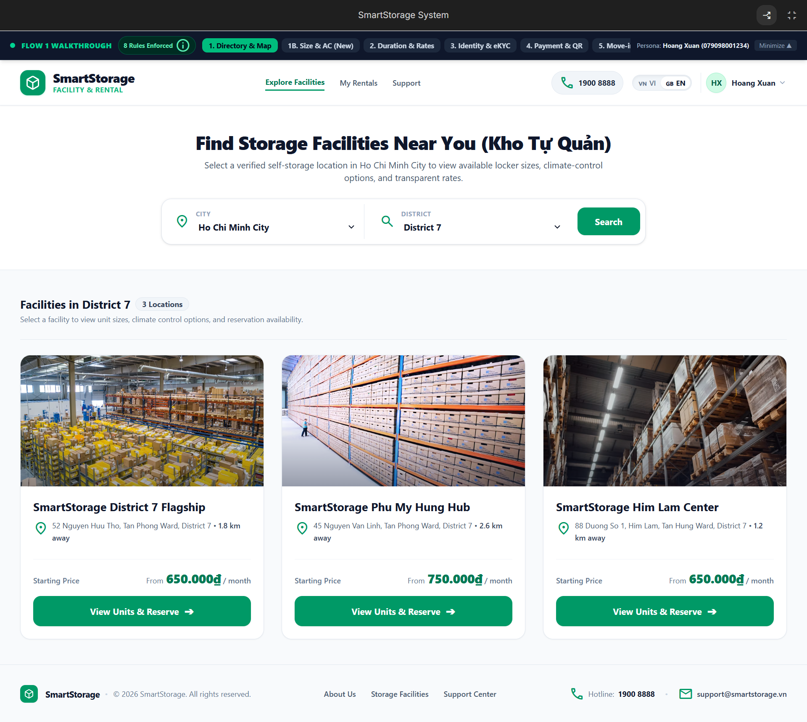
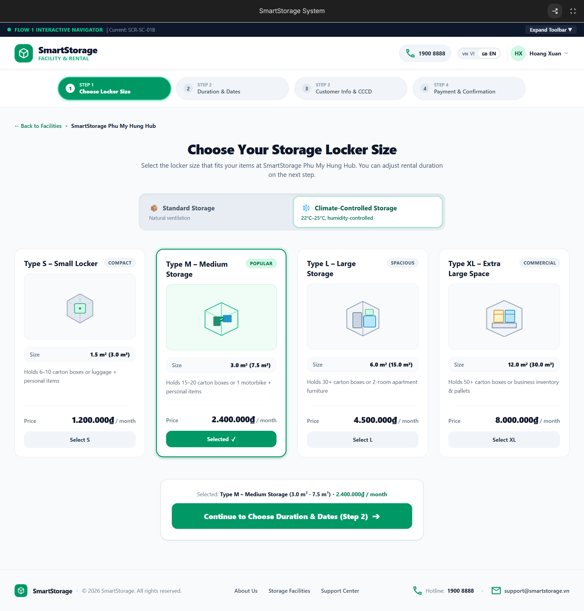
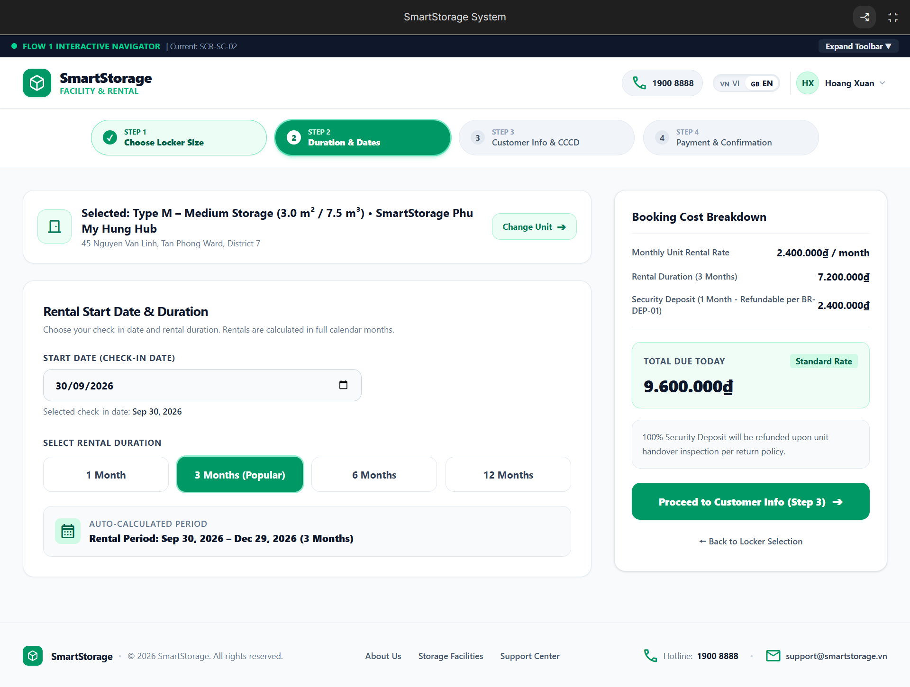
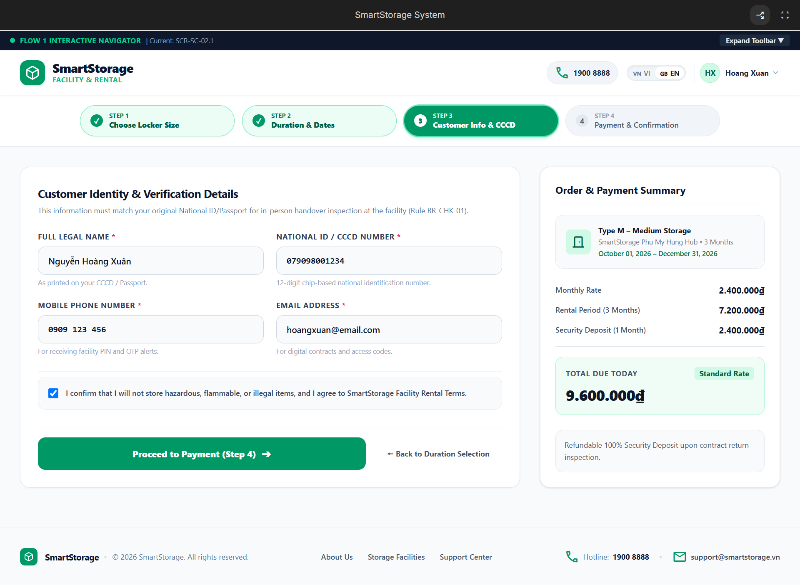
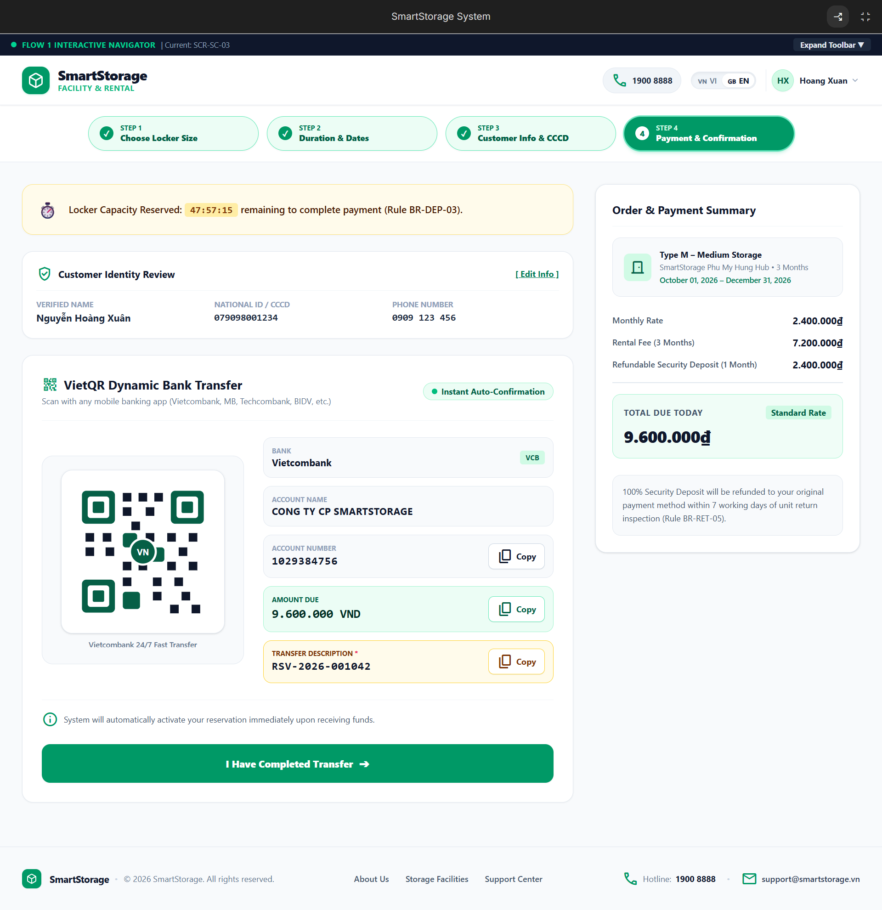
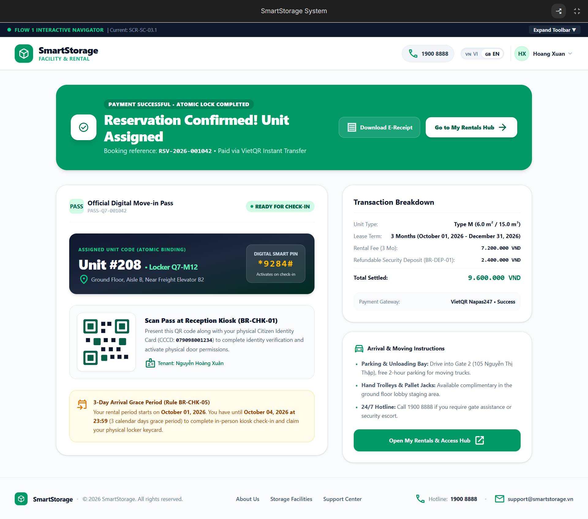
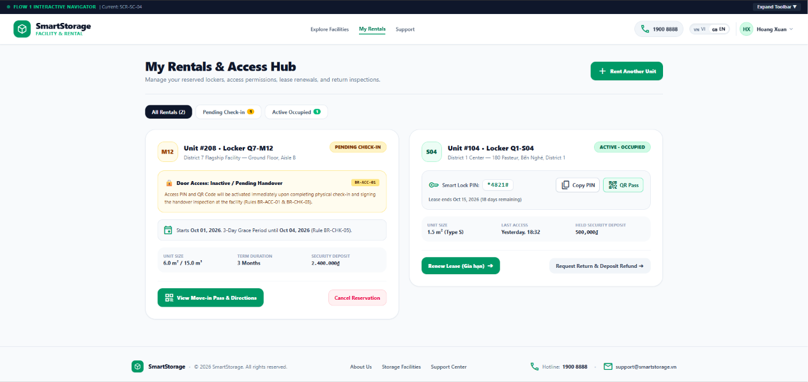
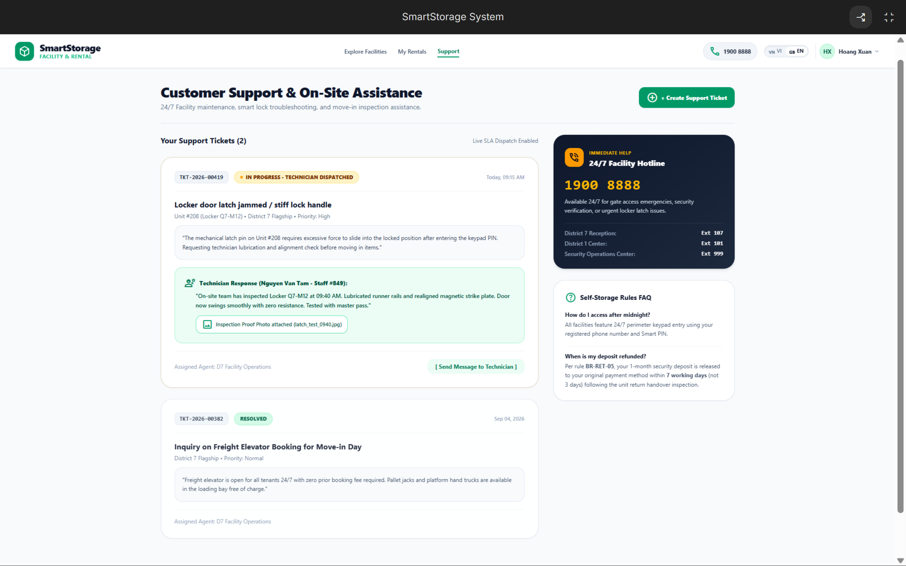

# Wireframe & UI Mockup — Storage Customer Portal

> **Mã nhiệm vụ:** T1.13 · Giai đoạn 1 · [PLAN.md](PLAN.md)  
> **Người thực hiện:** Nguyễn Phạm Xuân Nhi (Frontend Developer)  
> **Phạm vi yêu cầu chức năng:** `SC-01` → `SC-06` ([TOPIC.md](TOPIC.md) § 3)  
> **Tài liệu tham chiếu:** [USER-STORIES-SC.md](USER-STORIES-SC.md) · [UI-FLOW-MAPPING.md](UI-FLOW-MAPPING.md) · [BUSINESS-RULES.md](BUSINESS-RULES.md)  
> **Công cụ thiết kế & Prototype trực tuyến:** [Google AI Studio / SmartStorage System](https://ai.studio/apps/d69a21fa-0daa-45a4-93d1-ee025b589b3f)

---

## 1. Danh mục màn hình chuẩn hóa

| STT | Mã màn hình | Tên màn hình | Nghiệp vụ liên quan | File ảnh |
| :---: | :--- | :--- | :--- | :--- |
| 1 | **`SCR-SC-01`** | Storage Facility Directory & Search | `UC-F1-01`, `UC-F1-02` | [`01_SCR-SC-01-facilities.png`](wireframes/customer/01_SCR-SC-01-facilities.png) |
| 2 | **`SCR-SC-01B`** | Locker Size & Type Selection (Step 1) | `UC-F1-03`, `BR-AVL-01` | [`02_SCR-SC-01B-locker-size.png`](wireframes/customer/02_SCR-SC-01B-locker-size.png) |
| 3 | **`SCR-SC-02`** | Duration & Start Date Selection (Step 2) | `UC-F1-04`, `BR-GEN-03` | [`03_SCR-SC-02-duration.png`](wireframes/customer/03_SCR-SC-02-duration.png) |
| 4 | **`SCR-SC-02B`** | Customer Identity & Verification (Step 3) | `UC-F1-05`, `BR-CHK-01` | [`04_SCR-SC-02B-customer-info.png`](wireframes/customer/04_SCR-SC-02B-customer-info.png) |
| 5 | **`SCR-SC-03`** | Payment Gateway & VietQR Transfer (Step 4)| `UC-F1-06`, `UC-F1-07`, `BR-DEP-03`, `BR-PAY-01` | [`05_SCR-SC-03-payment-vietqr.png`](wireframes/customer/05_SCR-SC-03-payment-vietqr.png) |
| 6 | **`SCR-SC-03.1`**| Digital Move-in Pass & Confirmation | `UC-F1-09`, `BR-CHK-01`, `BR-CHK-05` | [`06_SCR-SC-03.1-move-in-pass.png`](wireframes/customer/06_SCR-SC-03.1-move-in-pass.png) |
| 7 | **`SCR-SC-04`** | My Rentals & Digital Access Hub | `UC-F2-06`, `BR-ACC-01`, `BR-ACC-02` | [`07_SCR-SC-04-my-rentals-hub.png`](wireframes/customer/07_SCR-SC-04-my-rentals-hub.png) |
| 8 | **`SCR-SC-06`** | Customer Support & On-Site Assistance | `UC-F7-01`, `BR-RET-05` | [`08_SCR-SC-06-customer-support.png`](wireframes/customer/08_SCR-SC-06-customer-support.png) |

---

## 2. Chi tiết giao diện trực quan

### 1. `SCR-SC-01` — Khám phá & Tìm kiếm cơ sở lưu trữ
- Khách hàng lọc theo Thành phố và Quận, xem danh sách cơ sở dạng Grid hiện đại, hình ảnh mặt tiền thực tế và giá khởi điểm.
- *Quy tắc:* Bỏ đánh giá sao và map chia cột để giao diện thoáng đãng, đồng bộ Header/Footer.

---

### 2. `SCR-SC-01B` — Chọn kích thước & Loại ô kho (Bước 1)
- Lựa chọn kích thước ô kho (Type S, M, L, XL) và chuyển đổi linh hoạt giữa Kho tiêu chuẩn (Standard) và Kho máy lạnh (Climate-Controlled).
- *Quy tắc:* Hiển thị Stepper Bước 1 (Active), loại bỏ các tiện ích lặp lại và bỏ thanh sticky dính đáy.

---

### 3. `SCR-SC-02` — Chọn ngày bắt đầu & Thời hạn thuê (Bước 2)
- Khách hàng chọn ngày bắt đầu thuê và số tháng thuê (1, 3, 6, 12 tháng). Hệ thống tự động tính ngày kết thúc và bảng kê chi phí minh bạch.
- *Quy tắc:* Bỏ nhãn "slot locked" khi chưa thanh toán; công thức tính tiền chuẩn không có discount: Phí thuê N tháng + Tiền cọc Deposit 1 tháng (`BR-PAY-01`, `BR-DEP-01`).

---

### 4. `SCR-SC-02B` — Thông tin người thuê & Xác minh CCCD (Bước 3)
- Thu thập họ tên, số điện thoại, email và số CCCD/Hộ chiếu để phục vụ đối chiếu thực địa khi nhận kho theo `BR-CHK-01`.
- *Quy tắc:* Bỏ trường Category không có trong thiết kế; bỏ tag xác minh danh tính sớm.

---

### 5. `SCR-SC-03` — Cổng thanh toán VietQR động & Giữ slot 48h (Bước 4)
- Tích hợp cổng VietQR động tự động điền số tài khoản, số tiền và mã giao dịch. Đồng hồ đếm ngược giữ chỗ 48 giờ theo `BR-DEP-03`.
- *Quy tắc:* Bỏ thuật ngữ "Escrow", hiển thị đầy đủ nút sao chép tiện lợi.

---

### 6. `SCR-SC-03.1` — Thẻ nhận kho điện tử / Vé Check-in tại quầy
- Màn hình xác nhận ngay sau khi thanh toán thành công: Hiển thị mã QR check-in tiếp đón tại quầy (`BR-CHK-01`), mã ô kho được phân bổ, lịch hẹn check-in và hướng dẫn di chuyển.

---

### 7. `SCR-SC-04` — Quản lý kho của tôi & Quyền mở cửa (My Rentals Hub)
- Quản lý các hợp đồng đang thuê (`Occupied - Active`) và các đơn đã thanh toán chờ đến cơ sở (`Pending Check-in`).
- *Quy tắc bảo mật nghiêm ngặt (`BR-ACC-01`, `BR-ACC-02`):* Đơn *Pending Check-in* tuyệt đối KHÔNG cấp mã PIN/QR trước khi hoàn tất nghiệm thu bàn giao tại quầy. Ô kho đang Active hỗ trợ Gia hạn (`Flow 6`) và Yêu cầu trả kho hoàn cọc trong 7 ngày làm việc (`Flow 3`, `BR-RET-05`).

---

### 8. `SCR-SC-06` — Trung tâm hỗ trợ & Gửi ticket sự cố (Support)
- Gửi yêu cầu bảo trì, kẹt khóa, báo sự cố kỹ thuật. Khách hàng theo dõi phản hồi thực tế của nhân viên kèm ảnh biên bản kiểm tra tại chỗ.
- *Quy tắc:* Thẻ FAQ xác nhận đúng thời hạn hoàn cọc 7 ngày làm việc (`BR-RET-05`).

