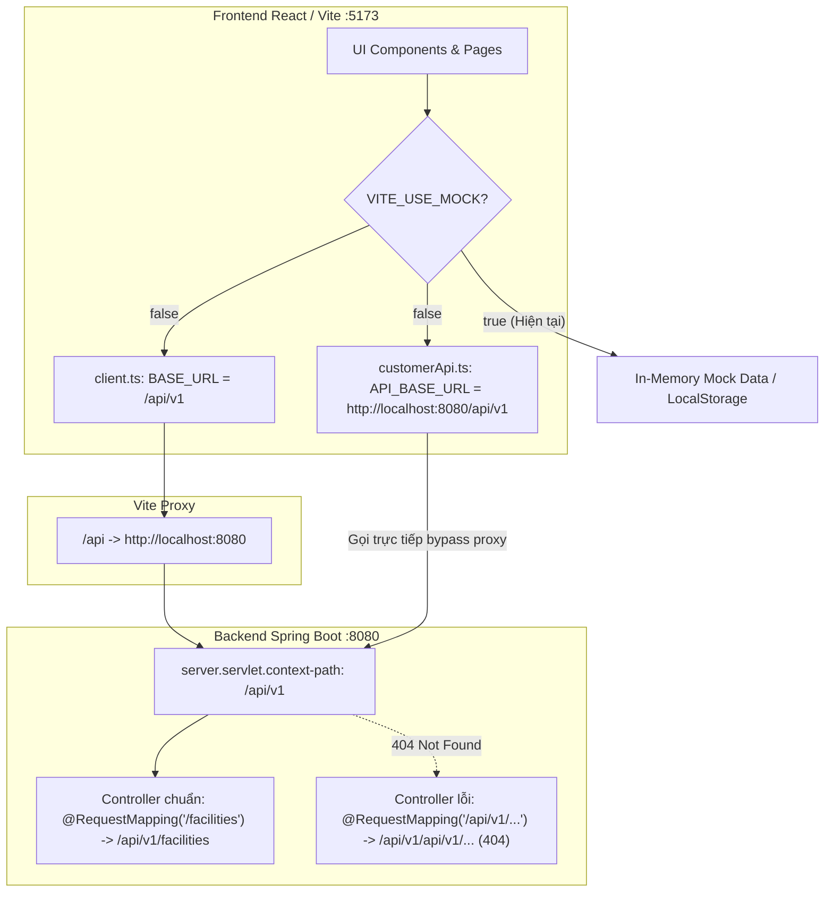
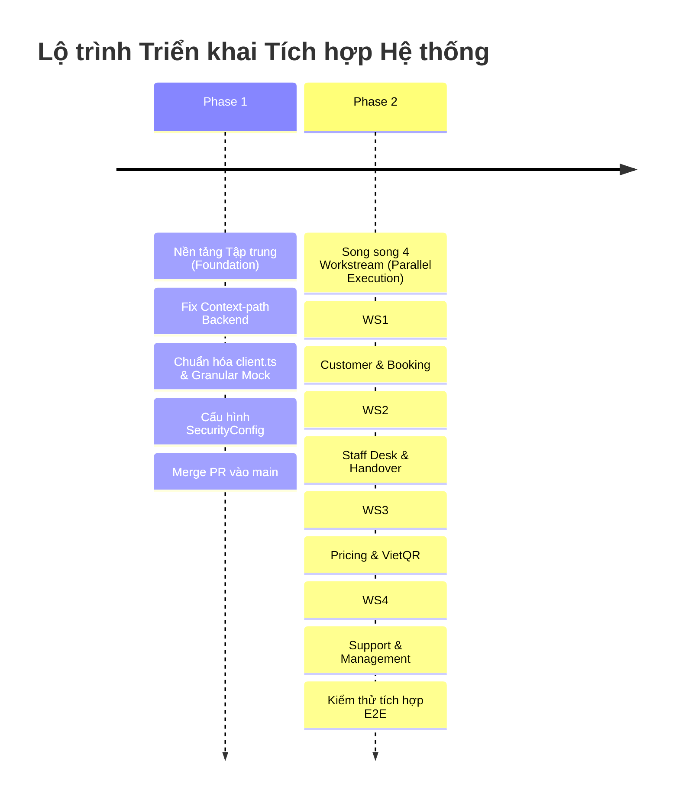
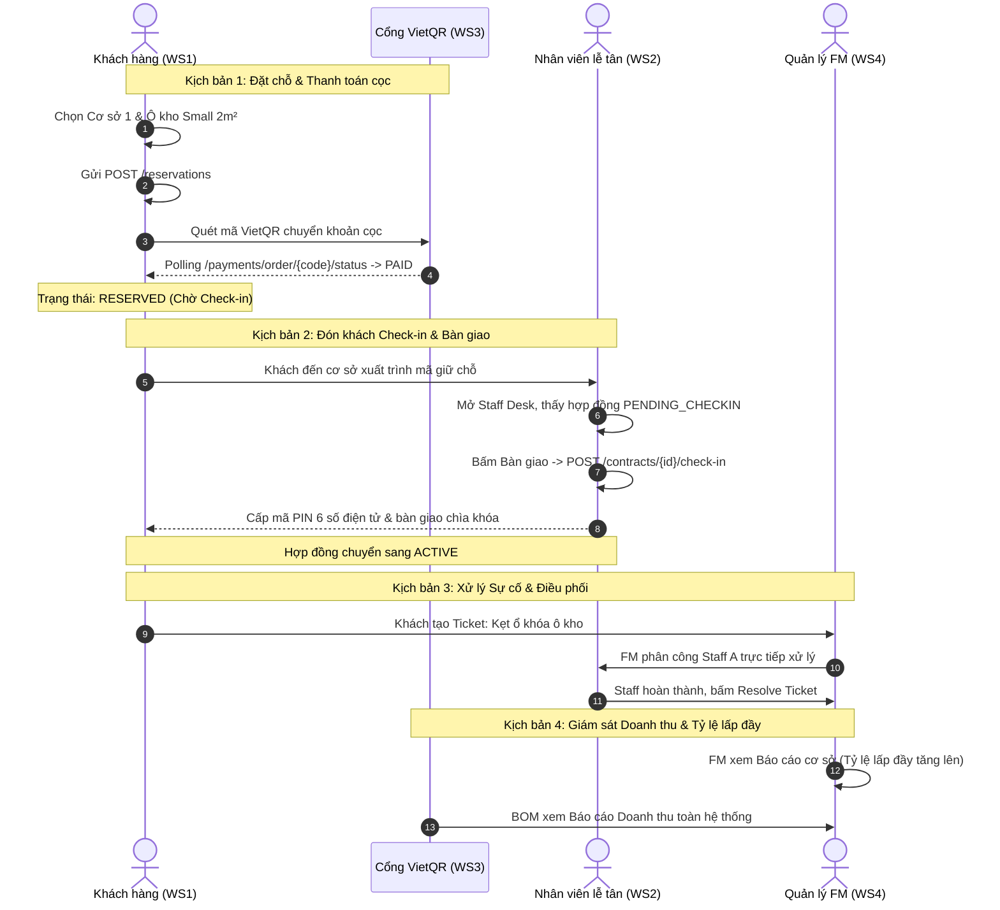

# Kế hoạch & Kiến trúc Tích hợp Hệ thống Backend — Frontend (Full-Stack Systematic Integration Specification)

> **Dự án:** Self-Storage Facility Rental and Management System (SWP391)
> **Phiên bản:** 1.0.0 · **Ngày ban hành:** 2026-09-25
> **Mục tiêu:** Chuẩn hóa toàn bộ tầng kết nối nền tảng (Context-path, Security Config, Granular Mock Switch, Base API Client) và thiết lập ma trận phân công 4 Workstream độc lập, đảm bảo triệt tiêu xung đột (Zero-Conflict) và hoàn thành kết nối 100% API giữa Frontend và Backend.

---

## 1. Bối cảnh & Chẩn đoán Sự cố Toàn diện (Root-Cause Diagnosis)

Hệ thống hiện tại gồm 5 Portal Frontend (React 18 + TypeScript + Vite) và hệ thống RESTful API Backend (Spring Boot 3 + SQL Server 2022). Qua rà soát kỹ thuật, hệ thống chưa kết nối thông suốt do 2 nhóm nguyên nhân: **Rào cản nền tảng toàn cục** và **Lệch pha Contract cục bộ theo từng Workstream**.



### 1.1. Hai rào cản nền tảng toàn cục

1. **Lỗi nhân đôi Context-Path (`/api/v1/api/v1/...`):**
   - File cấu hình `application.yml` đã khai báo: `server.servlet.context-path: /api/v1`.
   - Một số Controller (thuộc WS1 và WS4) lại định nghĩa `@RequestMapping("/api/v1/...")` hoặc `@GetMapping("/api/v1/...")`, khiến endpoint thực tế trở thành `/api/v1/api/v1/...`. Khi Frontend gọi `/api/v1/...`, Spring Boot lập tức trả về `HTTP 404 Not Found`.
2. **Cơ chế Mock Mode cứng toàn cục:**
   - Trong `frontend/.env` đang đặt `VITE_USE_MOCK=true`. Hầu hết các file API Frontend đều kiểm tra `const USE_MOCK = import.meta.env.VITE_USE_MOCK !== 'false';`.
   - Nếu tắt `VITE_USE_MOCK=false`, các trang chưa kịp nối backend hoặc bị lỗi 404 sẽ văng ngoại lệ làm crash giao diện.

### 1.2. Bảng tổng hợp hiện trạng kết nối theo 4 Workstream

| Workstream                                   | Thành viên phụ trách | Backend Packages sở hữu                   | Điểm nghẽn chính cần khắc phục                                                                                                                                                                                                                                                                                   |
| :------------------------------------------- | :----------------------- | :------------------------------------------ | :---------------------------------------------------------------------------------------------------------------------------------------------------------------------------------------------------------------------------------------------------------------------------------------------------------------------- |
| **WS1: Khách hàng & Đặt chỗ**     | Nguyễn Phạm Xuân Nhi  | `reservation`                             | •`customerApi.ts` tự tạo `fetch` với `API_BASE_URL` cứng, thiếu Header JWT `Authorization`.• Lệch URL: `/public/facilities` $\rightarrow$ `/facilities`, `/customer/contracts` $\rightarrow$ `/customers/me/rentals`.• Tính nhẩm giá gia hạn ở client thay vì gọi endpoint quote.   |
| **WS2: Cơ sở, Kho & Vận hành**     | Nguyễn Văn Gia Bình   | `facility`, `unit`, `contract`        | •`contract.ts` parse nhầm `res.data` thành mảng trong khi Backend trả về `ApiResponse<PageResponse<T>>` (`res.data.content`).• Cờ `USE_MOCK` đang chặn luồng Check-in (`FS-01..03`) và Return Inspection (`FS-04`).• Hardcode `staffId = 8` tại trang Staff Dashboard.                    |
| **WS3: Tài chính & Tự động hóa** | Huỳnh Nhật             | `payment`, `policy`                     | • Lệch HTTP Method/Endpoint:`PATCH /facilities/{id}/unit-types/{id}/price` $\rightarrow$ `PUT /facilities/{id}/prices/{id}`.• `verifyPayment()` gọi `POST /payments/{id}/verify` (không tồn tại) thay vì polling trạng thái PayOS `orderCode`.• Hardcode danh sách cơ sở trong Dashboard BOM. |
| **WS4: Quản trị & Điều phối**     | Lê Thanh Tùng          | `auth`, `user`, `support`, `report` | • Nhân đôi Context-path ở`CustomerSupportController`, `StaffSupportController`, `StaffDailyTaskController`, `SystemReportController`, `FacilityReportController`.• Frontend `staffAssignmentApi.ts`, `facilityReportApi.ts`, `auditApi.ts` bị chặn bởi cờ mock.                               |

---

## 2. Chiến lược Triển khai 2 Pha (Two-Phase Integration Strategy)

Nhằm đảm bảo **Zero-Conflict** và không làm gián đoạn mã nguồn của nhau, dự án áp dụng chiến lược 2 pha:



* **Phase 1: Nền tảng Tập trung (Foundation Fix):** Do 1 thành viên đại diện thực hiện (WS2 / Lead Bình), mở 1 PR duy nhất để làm sạch tầng hạ tầng Backend và chuẩn hóa cơ chế Mock Frontend.
* **Phase 2: Thực thi Song song theo 4 Workstream:** Cả 4 thành viên kéo `main` sạch về, mở 4 nhánh tính năng riêng biệt, tiến hành sửa mã nguồn trong ranh giới Bounded Context của mình và kiểm thử trước khi tạo PR.

---

## 3. Đặc tả Kỹ thuật Phase 1: Nền tảng Tập trung (Foundation Fix)

### 3.1. Chuẩn hóa Backend URL (Loại bỏ nhân đôi Context-Path)

**Quy tắc bất biến:** `application.yml` giữ nguyên `server.servlet.context-path: /api/v1`. Tất cả Controller tuyệt đối **KHÔNG** chứa tiền tố `/api/v1` trong `@RequestMapping` hoặc `@*Mapping`.

#### Danh sách tệp tin cần chuẩn hóa:

1. `com.swp391.selfstorage.reservation.CustomerRentalController`:
   ```java
   // CŨ: @RequestMapping("/api/v1/customers/me/rentals")
   // MỚI:
   @RequestMapping("/customers/me/rentals")
   ```
2. `com.swp391.selfstorage.support.CustomerSupportController`:
   ```java
   // CŨ: @RequestMapping("/api/v1/support-requests")
   // MỚI:
   @RequestMapping("/support-requests")
   ```
3. `com.swp391.selfstorage.support.StaffSupportController`:
   - `@PatchMapping("/api/v1/support-requests/{id}/assign")` $\rightarrow$ `@PatchMapping("/support-requests/{id}/assign")`
   - `@PatchMapping("/api/v1/support-requests/{id}/in-progress")` $\rightarrow$ `@PatchMapping("/support-requests/{id}/in-progress")`
   - `@PatchMapping("/api/v1/support-requests/{id}/resolve")` $\rightarrow$ `@PatchMapping("/support-requests/{id}/resolve")`
   - `@GetMapping("/api/v1/support-requests/staff-workload")` $\rightarrow$ `@GetMapping("/support-requests/staff-workload")`
   - `@GetMapping("/api/v1/management/support-requests")` $\rightarrow$ `@GetMapping("/management/support-requests")`
   - `@GetMapping("/api/v1/management/support-requests/{id}")` $\rightarrow$ `@GetMapping("/management/support-requests/{id}")`
4. `com.swp391.selfstorage.support.StaffDailyTaskController`:
   - `@GetMapping("/api/v1/staff/daily-tasks")` $\rightarrow$ `@GetMapping("/staff/daily-tasks")`
   - `@GetMapping("/api/v1/staff/{staffId}/daily-tasks")` $\rightarrow$ `@GetMapping("/staff/{staffId}/daily-tasks")`
   - `@GetMapping("/api/v1/reports/staff/{staffId}/daily-tasks")` $\rightarrow$ `@GetMapping("/reports/staff/{staffId}/daily-tasks")`
5. `com.swp391.selfstorage.report.controller.SystemReportController`:
   ```java
   // CŨ: @RequestMapping("/api/v1/reports/system")
   // MỚI:
   @RequestMapping("/reports/system")
   ```
6. `com.swp391.selfstorage.report.controller.FacilityReportController`:
   ```java
   // CŨ: @RequestMapping("/api/v1/reports/facility/{facilityId}")
   // MỚI:
   @RequestMapping("/reports/facility/{facilityId}")
   ```

### 3.2. Chuẩn hóa SecurityConfig URL Matchers

Trong Spring Security 6, `requestMatchers` khớp với đường dẫn tương đối sau servlet context path. Cập nhật `SecurityConfig.java`:

```java
.requestMatchers(
        "/auth/**",
        "/public/**",
        "/facilities/**",
        "/payments/webhook/**"
).permitAll()
```

*(Loại bỏ các dòng dư thừa có tiền tố `/api/v1/...` trong `requestMatchers` để tránh nhầm lẫn).*

### 3.3. Cơ chế Granular Mock Switch (Bật/Tắt Mock theo từng Workstream)

Để từng thành viên có thể kiểm thử độc lập mà không làm crash các màn hình của thành viên khác chưa kịp nối API, hệ thống hỗ trợ cấu hình Mock phân tán qua file `frontend/.env`:

```env
# Cấu hình API Base URL và Proxy
VITE_API_BASE_URL=/api/v1

# Cờ tổng: Nếu false, hệ thống chuyển sang chế độ gọi Backend thật
VITE_USE_MOCK=false

# Cờ kiểm soát Mock riêng cho từng Workstream (true: dùng Mock, false: gọi Backend thật)
VITE_MOCK_WS1=false  # Khách hàng & Đặt chỗ
VITE_MOCK_WS2=false  # Cơ sở, Kho & Vận hành
VITE_MOCK_WS3=false  # Tài chính & Bảng giá
VITE_MOCK_WS4=false  # Quản trị, Support & Báo cáo
```

Cập nhật helper trong `frontend/src/api/client.ts`:

```typescript
export type WorkstreamKey = 'WS1' | 'WS2' | 'WS3' | 'WS4';

export function isMockEnabled(ws?: WorkstreamKey): boolean {
  // Nếu cờ tổng là true -> ép buộc toàn bộ dùng Mock
  if (import.meta.env.VITE_USE_MOCK === 'true') {
    return true;
  }
  // Nếu có truyền cờ theo từng workstream
  if (ws) {
    const wsFlag = import.meta.env[`VITE_MOCK_${ws}`];
    if (wsFlag !== undefined) {
      return wsFlag === 'true';
    }
  }
  return false;
}
```

---

## 4. Đặc tả Kỹ thuật Phase 2: Ma trận Phân công 4 Workstream

### 4.1. Workstream 1: Khách hàng & Đặt chỗ (Nguyễn Phạm Xuân Nhi)

* **Nhánh làm việc:** `feature/Tx-ws1-customer-booking-api`
* **Mục tiêu:** Nối toàn bộ hành trình khách hàng từ tra cứu cơ sở, đặt chỗ, thanh toán, đến quản lý ô kho và gia hạn.

#### Danh mục công việc chi tiết:

1. **Chuẩn hóa `customerApi.ts`:**
   - Thay thế toàn bộ lệnh `fetch` và hằng số `API_BASE_URL` bằng `apiClient` từ `@/api/client`.
   - Đảm bảo mọi request đều tự động mang Header `Authorization: Bearer <token>`.
2. **Sửa đổi Endpoint URL tra cứu cơ sở (`SC-01`):**
   - Lấy danh sách cơ sở: Đổi từ `GET /public/facilities` $\rightarrow$ `GET /facilities` (nhận `PageResponse<FacilityResponse>` hoặc `FacilityResponse[]`).
   - Lấy loại kho theo cơ sở: Đổi từ `GET /public/unit-types` $\rightarrow$ `GET /facilities/{id}/unit-types`.
   - Lấy danh sách ô kho: Đổi từ `GET /public/facilities/{id}/units` $\rightarrow$ `GET /facilities/{id}/storage-units`.
3. **Nối API Đặt chỗ (`SC-02`):**
   - Đảm bảo `createReservation` gửi đúng DTO `CreateReservationRequest` tới `POST /reservations`.
4. **Nối API Quản lý kho thuê & Gia hạn (`SC-05`, `Flow 6`):**
   - Sửa hàm `getCustomerContracts()` trong `customerRentals.ts`: Đổi endpoint từ `/customer/contracts` $\rightarrow$ `GET /customers/me/rentals`.
   - Đăng ký trả kho: Đổi từ `POST /customer/contracts/{id}/return` $\rightarrow$ `POST /contracts/{id}/return-notices`.
   - Tính báo giá gia hạn: Bỏ hàm tính nhẩm ở client, gọi `POST /contracts/{id}/renewals/quote`.
   - Thực hiện gia hạn: Đổi từ `POST /customer/contracts/{id}/renew` $\rightarrow$ `POST /contracts/{id}/renewals`.
5. **Xử lý tính năng Đổi PIN & Nhật ký ra vào:**
   - Backend tạm thời chưa có bảng `access_logs`: Duy trì fallback Mock an toàn cho 2 hàm `changePin` và `getAccessLogs` có log cảnh báo rõ ràng.

---

### 4.2. Workstream 2: Cơ sở, Kho & Vận hành (Nguyễn Văn Gia Bình)

* **Nhánh làm việc:** `feature/Tx-ws2-staff-handover-api`
* **Mục tiêu:** Nối hoàn chỉnh Staff Desk cho nhân viên cơ sở thực hiện đón khách check-in, nghiệm thu trả kho, và xem danh sách công việc.

#### Danh mục công việc chi tiết:

1. **Sửa hàm bóc tách dữ liệu phân trang trong `contract.ts`:**
   - Backend `GET /contracts` trả về `ApiResponse<PageResponse<ContractSummaryResponse>>`.
   - Cập nhật hàm gọi API trong `frontend/src/api/contract.ts`:
     ```typescript
     export async function getContracts(params?: ContractQueryParams): Promise<PageResponse<ContractSummaryResponse>> {
       if (isMockEnabled('WS2')) return mockContractsPage;
       const res = await apiClient<ApiResponse<PageResponse<ContractSummaryResponse>>>(`/contracts?${qs}`);
       return res.data;
     }
     ```
   - Trong `StaffCheckInPage.tsx`: Đọc mảng hợp đồng qua `response.content` (hoặc `res.data.content`).
2. **Kích hoạt gọi Backend thật cho Check-in (`FS-01..03`):**
   - Gửi yêu cầu check-in qua `POST /contracts/{contractId}/check-in` kèm `StaffCheckInRequest`.
   - Nhận về `ContractCheckInResponse` chứa mã PIN 6 số và mã hợp đồng cập nhật sang `ACTIVE`.
3. **Kích hoạt gọi Backend thật cho Nghiệm thu trả kho (`FS-04`):**
   - Lấy danh sách hợp đồng chờ trả: `GET /contracts?status=RETURN_PENDING`.
   - Xem trước quyết toán bồi thường: `GET /contracts/{contractId}/settlement-preview`.
   - Nộp biên bản nghiệm thu: `POST /contracts/{contractId}/inspections`.
4. **Loại bỏ Hardcode `staffId = 8` trong `StaffDashboardPage.tsx`:**
   - Đọc ID của nhân viên từ context đăng nhập (`useAuthStore` hoặc giải mã JWT payload) để truyền vào `GET /staff/{staffId}/daily-tasks`.

---

### 4.3. Workstream 3: Tài chính & Tự động hóa (Huỳnh Nhật)

* **Nhánh làm việc:** `feature/Tx-ws3-pricing-payment-api`
* **Mục tiêu:** Hoàn thiện luồng thanh toán VietQR / PayOS thật và chức năng cấu hình biểu giá cho BOM.

#### Danh mục công việc chi tiết:

1. **Sửa Endpoint Cập nhật giá ô kho theo cơ sở (`BM-03`):**
   - File: `frontend/src/api/pricing.ts` và `BomPricingManagementPage.tsx`.
   - Đổi từ: `PATCH /facilities/{facilityId}/unit-types/{unitTypeId}/price`$\rightarrow$ `PUT /facilities/{facilityId}/prices/{unitTypeId}`.
   - Truyền Request Body đúng chuẩn `UpdatePriceRequest { monthlyPrice: number }`.
2. **Chuẩn hóa Cơ chế Đối soát Thanh toán VietQR / PayOS (`SC-03`):**
   - File: `frontend/src/api/payment.ts` và `VietQRPaymentModal.tsx`.
   - Backend không hỗ trợ endpoint giả `POST /payments/{id}/verify`.
   - Chuyển sang cơ chế **Polling kiểm tra trạng thái giao dịch**:
     - Gọi `GET /payments/order/{orderCode}/status` theo chu kỳ 3 giây/lần.
     - Khi Backend nhận webhook từ PayOS và cập nhật `PAID`, modal hiển thị thông báo thành công và chuyển bước nhận kho.
3. **Nối API Báo cáo Doanh thu BOM Dashboard (`BM-04`, `BM-05`):**
   - File: `frontend/src/api/report.ts` và `BomDashboardPage.tsx`.
   - Bỏ mảng cơ sở hardcode tĩnh tại `BomDashboardPage.tsx#L31`. Gọi `GET /facilities` để nạp danh sách cơ sở thực tế.
   - Nối API `GET /reports/system/revenue` và `GET /reports/system/occupancy`.

---

### 4.4. Workstream 4: Quản trị, Hỗ trợ & Điều phối (Lê Thanh Tùng)

* **Nhánh làm việc:** `feature/Tx-ws4-admin-support-api`
* **Mục tiêu:** Kích hoạt hệ thống gửi/xử lý ticket sự cố, phân công nhân viên và dashboard quản trị cơ sở.

#### Danh mục công việc chi tiết:

1. **Nối API Khách hàng gửi & xem yêu cầu hỗ trợ (`SC-06`):**
   - File: `frontend/src/features/customer/pages/SupportPage.tsx`.
   - Bỏ mảng biến nhớ tạm `cachedTickets`.
   - Gọi `POST /support-requests` khi khách tạo ticket mới.
   - Gọi `GET /support-requests/my` hoặc `GET /support-requests` để tải lịch sử ticket của người dùng.
2. **Nối API Phân công & Tiến độ xử lý sự cố (FM/Staff) (`FM-05`, `FS-05`):**
   - File: `frontend/src/features/manager/api/staffAssignmentApi.ts`.
   - Nối API tải khối lượng công việc nhân viên: `GET /support-requests/staff-workload`.
   - Nối API phân công ticket: `PATCH /support-requests/{id}/assign` với `AssignStaffRequest`.
   - Nối API giải quyết ticket: `PATCH /support-requests/{id}/resolve` với `ResolveSupportRequest`.
3. **Nối API Báo cáo cấp Cơ sở cho Facility Manager (`FM-06`):**
   - File: `frontend/src/features/manager/api/facilityReportApi.ts` và `FacilityReportPage.tsx`.
   - Tắt cờ Mock, gọi `GET /reports/facility/{facilityId}/overview` và `GET /reports/facility/{facilityId}/overdue-debt`.
4. **Kiểm tra thông luồng Quản trị User & Audit Log (`SA-01..04`):**
   - Tắt cờ Mock trong `auditApi.ts` và `user.ts`.
   - Xác nhận `GET /audit/activities` và `GET /audit/logins` hiển thị đúng nhật ký thao tác và lịch sử đăng nhập.

---

## 5. Kịch bản Kiểm thử Tích hợp Toàn diện (Integration Verification Scenarios)

Sau khi cả 4 Workstream hoàn thành Phase 2, thực hiện kiểm thử E2E liên thông 4 luồng chính:



---

## 6. Quy tắc Phối hợp & Kiểm soát Xung đột (Zero-Conflict Git Protocol)

1. **Tuân thủ ranh giới gói (Package Boundary):**
   - Thành viên workstream nào chỉ chỉnh sửa controller/service/api thuộc workstream đó.
   - Các file dùng chung (`client.ts`, `SecurityConfig.java`, `application.yml`) chỉ được chỉnh sửa trong Phase 1.
2. **Quy trình Git chuẩn theo `CONTRIBUTING.md`:**
   - Tạo nhánh mới từ `main` mới nhất: `git checkout main; git pull origin main; git checkout -b feature/<mã-task>-<mô-tả>`.
   - Trước khi push, luôn rebase đỉnh `main`: `git fetch origin main; git rebase origin/main`.
   - Không được dùng `git push --force` đè nhánh chung.
3. **Tiêu chí Hoàn thành (Definition of Done - DoD):**
   - Backend: Toàn bộ Unit Test và Integration Test xanh (`mvn clean test` pass 100%).
   - Frontend: `npm run build` không có lỗi TypeScript lint hoặc build failure.
   - Giao diện: Chạy với `VITE_USE_MOCK=false`, hiển thị đúng dữ liệu thật từ SQL Server, không văng lỗi console 404/500.
